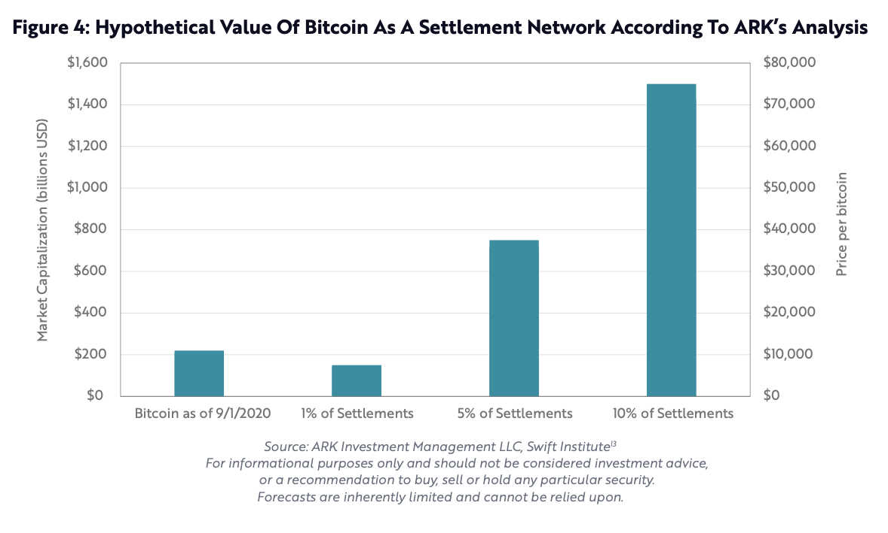
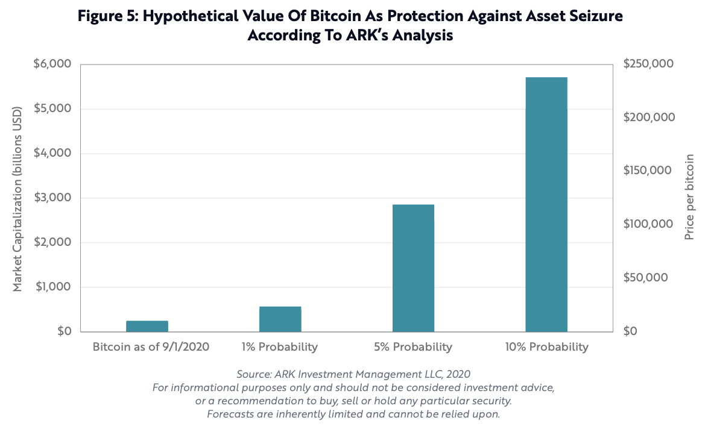
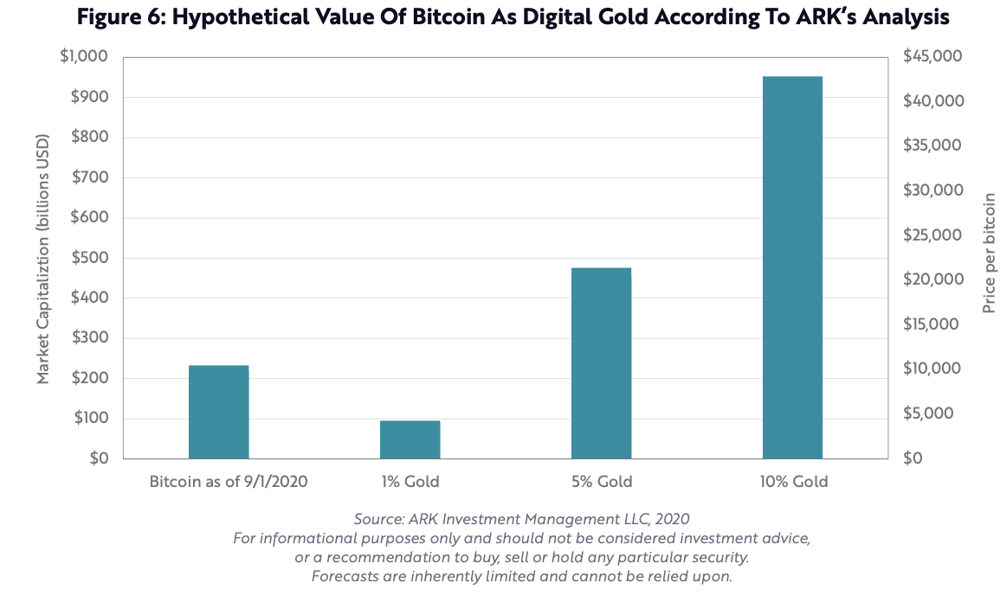
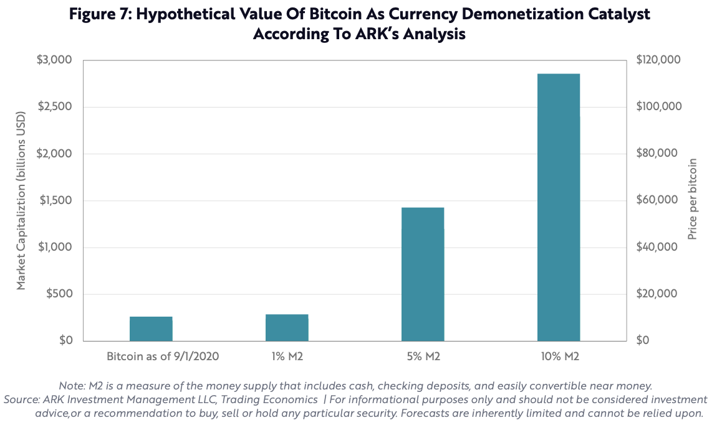
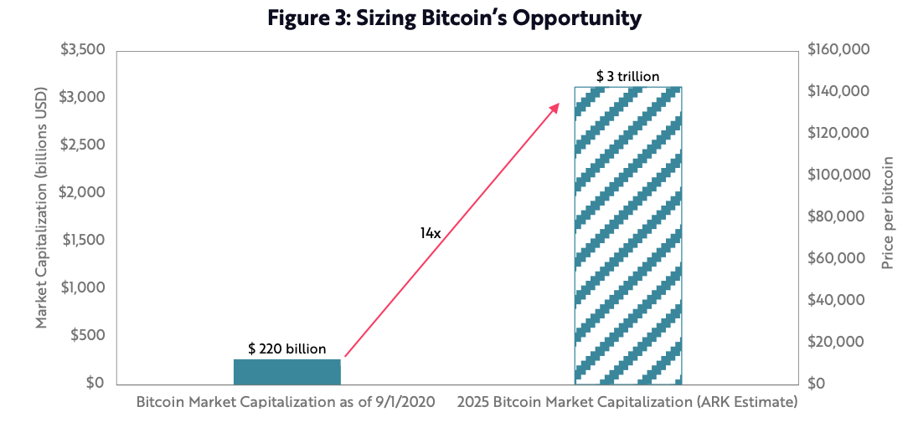

# ARK调研报告：比特币——新经济工具

方舟投资（ARK Invest）是一家新兴的投资公司，其专注于破坏性创新（Disrutpive Innovation）公司的投资，旗舰基金是ARKK。ARKK自创建以来，五年年化收益高达39%。ARK公司CEO凯西·伍德（Cathie Wood）在业界有女版巴菲特的称号。伍德女士喜欢在各大媒体上分享公司的研究报告和投资策略，她对于科技企业的投资经常有独到的见解。随着很多预测也逐步被市场所验证，她在业界的影响力也不断增加。

伍德是Tesla的铁杆粉，ARKK中的Tesla仓位占到10%，她曾预测Tesla的五年后（2024年底）的股价到$7000，2020年Tesla的股价大涨后已达到$2000（折合到拆分前的价格）。伍德认为有五大破坏性创新的技术平台。

1. DNA测序（DNA sequencing）
2. 能量存储（Energy storage）
3. 机器人（Robotics）
4. 人工智能（Artificial intelligence）
5. 区块链（Blockchain）

这五大技术平台可比改变人类史蒸汽机、火车、电话、汽车和电力革命性技术的，而且五大技术还同时存并且互相融合 （converging），我们面对的是一个历史性的投资机会。

ARK按这个思路创建了多只基金，专注于一个或多个领域，旗舰基金ARKK则覆盖所有五个领域。ARK旗下的基金从创建至今取得傲人的成绩，符合年化都在25%以上。但我们也看到，ARK旗下基金最久的也只有五年多的历史，其长期表现还有待时间的检验。

这五大趋势中区块链是唯一一个ARK基金没有大比例投资的，这可能也是因为区块链投资还没有被大部分人接受也不方便投资所致，但伍德却对于区块链尤其是比特币的前景乐观。最近ARK发布比特币白皮书，系统的阐明ARK对于比特币的看法。

> We believe that bitcoin is the most compelling monetary asset to emerge since gold
>
> Our analysis suggests it should scale from roughly $200 billion today to $1-5 trillion network capitalization during the next five to ten years

ARK认为比特币是自黄金之后最引人注目的货币资产，未来五到十年里比特币的市值将会从现在的2000亿增加到1到5万亿的规模

## 信任模式与面临的危机

现代社会的货币体系已经早就脱离了物物交换和与黄金挂钩，货币就是一张钞票甚至就是银行中的数字，它的价值在于人们对于金融体系的信任——可以用货币换取想要的物品或服务，换句话说现代的金融体系是建立在信任之上的。作为一个完善的信任体系，它需要具备四大条件：

1. 价值可以自由的、全球性的交换
2. 财富完全拥有而且受到保护
3. 规则实施可靠且可预测
4. 系统的完整性可以得到验证

然而，各国由中央政府保护的金融体系在这四个方面都表现出了一定缺陷。各国政府可以限制货币的自由兑换和流动，可以借各种名义冻结个人财产，规则受各种短期因素影响严重，而且体系不透明，外部很难验证。具体的例子很多，本文不在一一列举，重点是报告认为比特币可以满足所有四个条件，是一个极佳的金融工具。

比特币可以在全球网络中自由的交换，没有国界的限制。只要所有者妥善的保管好私钥，那拥有的比特币就很安全。比特币的规则是公开的，所有交易公开在网络中，可以追溯可查询，可以说比特币就是一个天然的全球化的金融工具。 比特币诞生十年多来，价格波动剧烈，被宣布死亡上百次，比特币非但没有消失还发展为一个市值2000亿的金融品种。

## 比特币的机遇

比特币因其优异的属性有着四大方面的机遇。

### 1. 全球结算网络

美元是全球结算货币，美联储也相当于世界央行。美元虽然也不可避免的会贬值，但其信用还算良好。自疫情以来，美联储也开始天量放水，割世界人民韭菜。截止2020年8月底，美国的公共外债20.83万亿，还有接近7万亿的外国政府债务，而2019年美国的GDP为21.43万亿，公债水平已相当于当年的GDP了。这就凸显出将一个国家的主权货币作为世界结算货币的根本性问题——一个被部分人民（美国人民）掌握的货币是很难为世界人民负起责任的，平时可能还好说，一旦有事就自然会以本国利益为重。

比特币对于小额交易来说费用高时间长，但对大额交易确是很便宜和方便的，再加之其他的天然优势，它非常适合替代美元来进行国际结算，充当世界央行的角色。如果10%的国际间结算由比特币进行，那比特币的市值就会从200亿到1.5万亿。

### 2. 财富保护工具

在一些私有资产不能得到很好保护的国家里，人们可以用比特币来保护自己的财富。只要妥善的保存好密钥，比特币就是一个财富保护工具。如果仅有5%的财富选择比特币保值，那比特币的市值就会增长十倍到2.5万亿。

### 3. 数字黄金

因比特币可以进行保值，又因为它与其他资产的关联性比较低，比特币也被称为“数字黄金”。如果仅有5%的资产配置选择比特币，那市值也是5倍左右的增长。

### 4. 新兴国家去货币化的工具

在等一些国家通胀率很高的国家里，人们甚至可以用比特币来替代本国货币。这是一种抵御通胀的手段，也兼有保值和财富保护的功能。如果比特币替代除主流货币外5%的份额，那市值也会增加6倍左右到1万亿。

上面提到的每个机遇的10%左右的份额就意味着万亿级别的市场，况且比特币可以同时应用于这四大机遇。综合分析，ARK给出了到2025年比特币的市值增长14倍到3万亿市值的预测。

## 比特币的风险

虽然比特币有着四大机遇，可比特币也具有不小的风险：

1. 保存风险。比特币的安全全在私钥上，私钥丢失就意味着比特的丢失或被盗。比特币没有像银行账户一样的实名和挂失机制，人们也不太可能把私钥记在脑中，这带来很很大的风险和使用难度。
2. 法规风险。在大部分地区，比特币处在法律的灰色地带，既没有法律明确的支持，也没有禁止，但这也就给未来带来了不确定的法规风险。
3. 过度机构化。比特币被大机构所垄断，这也不是比特币设计的初衷，也会影响比特币网络的安全性。

## 总结

ARK的报告分析了比特币的优势和所面临的四大机遇，比特币的价格在未来的五年里有可能上涨十倍以上。不管是机构还是个人，都应该认真考虑在资产配置中忽视比特币资产的机会成本。

## 附录

* Part 1&2 : Bitcoin: A Novel Economic Institution，Author: Yassine Elmandjra, Analyst at ARK Invest

