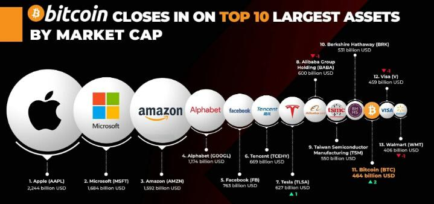

# 为什么要配置比特币资产？

相信你一定听说过特币，也多少对它有些了解，但我猜负面的居多，因为媒体喜欢报道负面新闻，那更博人眼球。比特币比特币静悄悄的已经站稳在2万5千美元之上了，市值接近5000亿美金，已经是一个不可忽视的投资标的，更为重要的是，比特币还远未承担起其终极使命，可以说未来的路还很长，现在上车好像还不晚。在这里给你几个特别的角度供你思考。

### 理由1: 认知水平极高的牛人已经重度投资了比特币和区块链资产

不是说投资比特币的都是牛人，但的确是有很多牛人投资了比特币。行动是认知的结果，这些牛人敢在比特币或者区块链上押上多年积攒的财富，一定是有不一般的理由在背后支撑。你可以没有他们的思考广度和深度，但一定要重视他们的行动。举两个牛人的例子——李笑来和赛勒 (Michael Saylor) ，他们俩一个中国做教育和投资，一个美国上市公司CEO，生活和经历基本上没什么交集，对比特币看法角度也不同，但在比特币的行动是一致的。

李笑来在《定投改变命运》的前言中写到——错过这本书的成本无限大。要我看来，这句话可以用到他的很多本书上，《把时间当作朋友》，《七年就是一辈子》，《财富自由之路》等等。李笑来的书直指底层核心概念，重塑你的大脑操作系统。他的所有书你最好都去找到读一遍，越早读越好，越早实践助益越大。有人说李笑来是鸡汤大师，他的鸡汤确实好喝，不光好喝里面还有肉。李笑来2017年在“财富自由之路”里面公开推荐的GAFATA组合复合年化收益接近30%，四年里收益2.5倍以上；李笑来组建的BOX定投践行群500多天里投资基准收益接近100%...。李笑来2011年开始投资比特币，据公开的数据，身价已经亿万以上。要知道2011年甚至更早买比特币的人很多，到现在成为亿万富翁的屈指可数。

赛勒是美国一家上市公司微策略(MicroStrategy)的CEO，这家公司今年市值翻了两倍，倒不是公司的经营有什么重大增长，而是公司投资了比特币，其背后的主导者就是赛勒。赛勒个人手上有1万7千多个比特币，微策略名下有7万多个，而且全部是今年买入，目前占公司一半市值。赛勒的投资眼光独到，很早以前微策略就买入了hope.com, speaker.com, alarm.com, voice.com, angel.com这些顶级域名，voice.com后来以3千万美金的高价卖出。赛勒抓住了投资科技大公司黄金时期，大概用了八九年的时间，把自己手里的五千万变成了五个亿。 赛勒写过一本书《移动化大潮 (Mobile Wave)》，这本书是八年前所写，现在读起就好像发生在身边的纪录片一样。

### 理由2：比特币每一个可能的用途都价值万亿

投资美股的一定会听说过方舟投资 (ARK Invest)，如果没听说过那赶紧去做功课。这是专注于破坏性创新 (Disrutpive Innovation)公司的投资，旗舰基金是ARKK。ARKK自创建以来，五年年化收益高达39%。ARK公司CEO凯西·伍德 (Cathie Wood)在业界有女版巴菲特的称号。

方舟今年发布了一份白皮书“Bitcoin: A Novel Economic Institution”分两册，这份报告在公司网站上可以下载。白皮书里给出了从专业机构角度看比特币未来可能的用途和市值测算：

1. 全球结算网络 (A settlement network)。全球10%的结算使用比特币，币值就可达7万美金
2. 财富保护工具 (Protection against asset seizure)。全球10%的财富使用比特币，币值可达20万美金
3. 数字黄金 (Digital Gold)。全球10%黄金资产转向配置比特币，币值可到4万美金以上
4. 新兴国家去货币化 (Currency Demonetization Catalyst)。新兴国家中10%的M2使用比特币，币值可达10万美金以上

每一个用途仅仅10%的份额就意味着万亿的市值，而比特币可以同时满足这些所有用途，份额增大后更是不可想象。

### 理由3：比特币是过去十年里的最佳投资标的

说比特币是最佳投资标的，原因有两个，其一是它的增长率，其二是它的市值。在过去十年里，其复合年化收益率高达206.4%，累计收益更是接近7万倍

比特币目前市值接近5000亿，如果把它看成一只股票的话，已经名列世界前十大资产了。仔细看下图中的股票，那一个不是投资者热捧的对象？

一个资产达到千亿规模后可以说是个非常安全的投资标的。巴菲特在2017年苹果市值接近5千亿时才开始买入苹果股票，这一买就买成了伯克希尔哈撒的第一重仓股，占比40%以上。后面苹果也没让老爷子失望，巴菲特在苹果这一只股票上赚到了可能是有生以来最多的钱。

### 理由4: 比特币与其他资产的相关度最低

张潇雨在得到的个人投资课中用一句话来概括马科维茨的经典现代投资组合理论——分散化投资时投资领域里的唯一免费午餐。如果我们能找到相关性比较低的资产，进行多元配置，那么就可以在降低波动的同时还提高收益，简直就是免费午餐。瑞·达里奥的全天候基金就是一个多元配置的典型，投资组合涉及美国大小盘股票，其他发达国家股票，新兴国家股票，债券，大宗商品，黄金等等，为的就是建立一个在各种经济环境中都能表现良好的投资组合。

ARK的研究报告显示，比特币与传统资产的相关度最低，其实也就是说它是理想的多元投资标的之一。达里奥一直对比特币持批评态度，可最近态度也有所软化，认为比特币可以部分作为黄金的替代资产。

> "I think that bitcoin (and some other digital currencies) have over the last ten years established themselves as interesting gold-like asset alternatives, with similarities and differences to gold and other limited-supply, mobile (unlike real estate) storeholds of wealth" - Ray Dalio

### 理由5: 机构投资者正在蜂拥而入

这轮上涨与2017年的那次牛市有着明显的不同。2017年的牛市主要由个人投资者的疯狂推着，机构投资在一旁嘲笑。这一次机构投资者纷纷投资比特币，甚至表现出FOMO (Fear Of Missing Opportunity，害怕错失机会) 情绪。数据来说话，这些都是主流媒体报道的。

1. MicroStrategy在12月又买入29,646个比特币，价值6亿5千万美元，均价约为$21,925，加之今年第三季度买入的4亿多美金比特币，MicroStrategy总计持有7万多个比特币。其背后的主导者，公司CEO Michael Saylor个人今年个人就买入1万7千多个比特币，均价不到1万美金，半年时间资产翻番。

2. Grayscale (GBTC) 在11月份大概持有50多万个比特币，过去的六个月是Grayscale就买入了21万个比特币，而此间比特币的产量约为18万5千个，也就是说仅Grayscale一家就可以吃掉所有新挖出的比特币。GBTC类似一个比特币的ETF，投资的GBTC大概比直接买入比特币要多花30%，但因为目前只此一家，很多机构投资者是通过GBTC来持有比特币，比如ARK基金旗下ARKW就持有GBTC。

3. Square今年10月份宣布投资5千万美金购入了4,709个比特币

4. 英国投资公司Ruffer旗下管理着270亿的资产，在11月份透露其购入5亿5千万英镑（约7亿4千万美元）价值的比特币，约为4万5千个。

   > The investment was "primarily a protective move for portfolios" to "act as a hedge" against "some of the risks that we see in a fragile monetary system and distorted financial markets."

5. 保险公司MassMutual在12月透露购入1亿美金的比特币，要知道保险公司一般只会投资成熟的保守投资产品。

6. One River资产管理公司透露已购买了价值6亿美金的比特币和以太币，还计划到明年初增持区块链资产到10亿美金。

7. Guggenheim Partners旗下管理者53亿的资产，最近透露计划分配10%约5亿多美金投资比特币，但它不会直接购买，会通过GBTC来持有比特币。其首席投资官Scott Minderd在一次公开采访中预测比特币价格会飙高到40万美金一枚。

### 理由6: 从能量和信息的角度看，比特币网络可以更高效的保存和利用货币能量

吴军老师在得到的科技史纲中说世界的终极答案是能量和信息。世界应该是能量的，因为物质本质上讲就是能量构成的。信息就是组织和调动能量的法则，比如语言、文字、公式、公理等等。科学的本质就是通过一套有效的方法发现这样一些特殊信息。历史不断重演，而科技一直向前。

前面提到的那位塞勒先生也试图从能量的的角度来解释比特币。他在多次访谈中都在反复表达这个观点——比特币可以让人类更好的利用货币能量。“技术今日占据优势，其原因是因为技术可以更快，更安全，更有力，更敏捷的传输能量。货币本质上是人类的最高级可利用能量形式。比特币可以让人类更好的利用这种能量，而其他的各种实物背书的货币则使其变差。”

> "Technology is dominating today. They are dominant because they are able to deliver force faster, harder, stronger, smarter… So we ask the question, what is money? Money is the highest form of energy human being can channel… Bitcoin is channelling human ingenuity into making it better and every commodity is channelling energy to make it worse." - Michael Taylor

参见拙文[从能量和信息的角度理解货币和比特币](https://mp.weixin.qq.com/s/k_5YjoFTIzwqD9lQu5gDaQ)。从能量的角度看，比特币确实是一个更高效的货币能量保存和传输手段，也就是说大势所趋…… 这是一个很有意思的角度，似乎有点虚，如果符合某种大势，那力量长期都是不可忽视的。

## 怎么投资比特币？

看到这里你如果有冲动去买比特币，一定要打住，做好自己的功课再说。我不会要求从你的投资收益中分成，那你有了损失也不能来怪我。投资一定要独立思考，自己负责。

投资也是一次心路历程，一场持续的心理建设。买了比特币和最终财富自由完全是两回事。长期，长期，长期，重要的事情说三遍，一定要做长期投资，要培养自己的长期视角。《定投改变命运》这本书一定要多看几遍，进一步的，我也强烈你推荐加入”BOX投资践行群“，这里面有鸡汤大师李笑来熬制的鸡汤，好喝有营养，还可以一群长期主义者在一起，投资的路上不会寂寞，也会少走很多弯路，更为重要的是，你在群里学习和实践的长期定投的投资理念可以用到生活的方方面面，甚至可以言传身教给你的孩子们，成为家族时代的无形资产。

 

