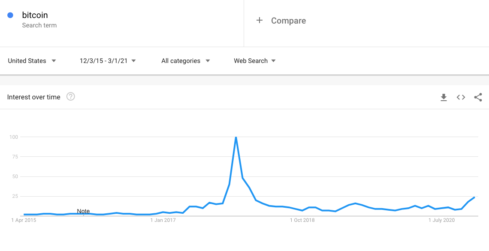
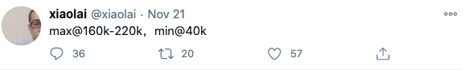
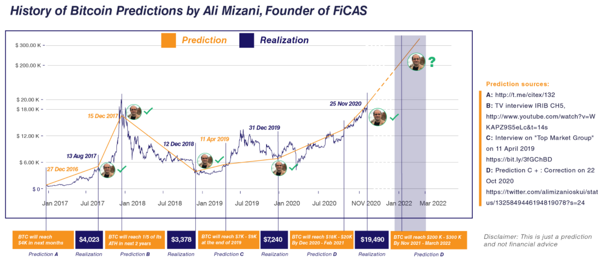
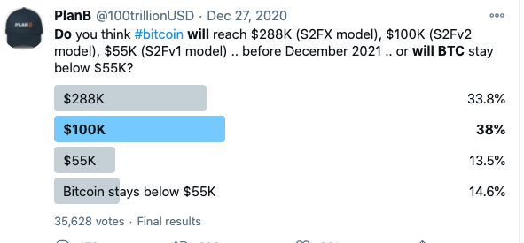
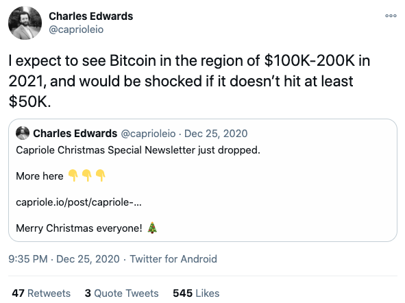

# 比特币价格预测选录

写这篇文章时，比特币价格已经站上3万美金大关。比特币花了1081天收复2017年的高点约为2万美金，然而却仅仅在不到一个月的时间里价格就超过3万美金，可谓火箭速度。很多人都在怀疑比特币是否还能继续涨，目前从推特的言论上看，除个别人 (比如黄金死多头Peter Schiff) 唱空，大部分都认为这只是个开始，牛市应该还会继续一段时间。这次牛市由一些机构入场而启动，但大部分机构和个人投资者还在观望状态，一旦大规模入场，那才是牛市见顶的迹象。

谷歌上的趋势搜索页显示目前bitcoin的搜索热度仅为2017年高峰时的25%。

很多业界大咖也给出了价格预测，本文摘录一部分供你参考。

## 中远期预测

1. Scott Minerd (Guggenheim首席投资官)，40万美金

   > "Our fundamental work shows that bitcoin should be worth about $400,000," he said. "It's based on the scarcity and relative valuation such as things like gold as a percentage of GDP."

2. Tyler and Cameron Winklevoss (文克莱沃斯兄弟)，50万美金

   > “If we are right about using a gold framework to value bitcoin, and bitcoin continues on this path, then the bull case scenario for bitcoin is that it is undervalued by a multiple of 45. Said differently, the price of bitcoin could appreciate 45x from where it is today, which means we could see a price of $500,000 U.S. dollars per bitcoin.”

3.  Joseph Stiglitz and Kenneth Rogoff (经济学家，2001年诺贝尔经济学奖得主)，2018年预测到2028年比特币为100美元

   > Both said the price of a single bitcoin could be worth $100 by 2028. Citing overregulation, Stiglitz [told Financial News in July](https://www.fnlondon.com/articles/stiglitz-roubini-and-rogoff-lead-joint-attack-on-bitcoin-20180709) that “bitcoin could easily be worth $100 in ten years.”

4. Dan Held (Kraken的业务发展主管)，100万美金

   > It certainly won't be going from $20k to $100k. It could move from $20k to $1M and then only have smaller cycles after. This may be one of the final big cycles.

5. JP Morgan 预测到2022年底为65万美元

   > Bitcoin price to grow 'ten times by end of 2022' as JP Morgan estimates value of $650,000

## 短期预测

短期预测主要指的是这一轮的牛市的高点，也可以认为是2021年最高点的预测

1. 笑来老师预测高点16万到22万之间

   

2. Ali Mizani Oskui (FiCAS创始人)，预测高点在20万到30万之间

3. PlanB (planbtc.com) 的使用三种模型提供了三个预测价格，基于S2FX模型的28.8万，S2Fv模型的10万和S2Fv1模型的5.5万 [1]

   

4. Charles Edwards (Capriole投资创始人) 预测在10万到20万之间

5. Willy Woo (线上分析师，https://willywoo.substack.com/) 预测价格在20万到30万之间。

> "A Price Target of $100k is overly conservative with expectation for 2021 is on track for $200k - $300k." - Willy Woo

看这些预测总体的感觉是比特币牛市在2021年还会持续一段时间，价格还有很大的上升空间，但是，预测终归是预测，一定是有很多不确定性的。这些预测可以作为你的参考，一定要独立思考后审慎的做出自己的投资决策。

[1] https://100trillionusd.github.io/