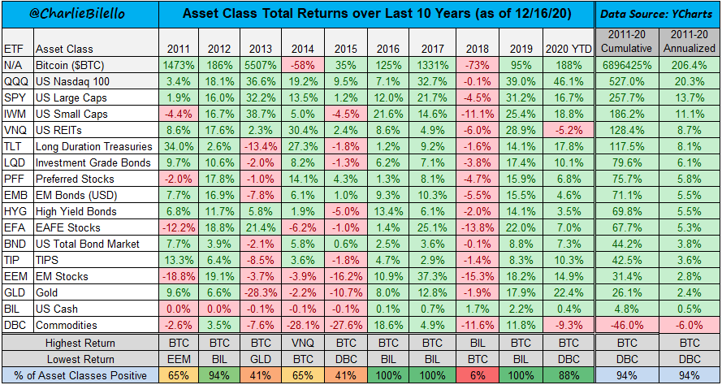

# 用夏普比率看比特币投资

衡量投资收益的一个著名的标准就是夏普比率（Sharpe ratio）。我们都知道投资光看收益是不够的，还要看承受的风险，也就是收益风险比。在投资中有一个比较常规的特点，那就是投资标的的预期收益越高，投资人所能忍受的波动风险越高；反过来说，预期收益越低，波动风险也越低，而夏普比率则是一个综合的衡量指标，相当于性价比。夏普比率可以简单的理解为你每承担一个单位的风险，能带来的超额回报有多少。所以数字越高越好。 

在比较投资产品的时候，我们会经常用到夏普比率，就是在单位波动下你能获得的收益有多少，因为这样比才有意义，但可能也会得到一些反直觉的结论。假设有A、B两只基金，A基金收益率60%，B基金只有40%，但是A基金波动大为80%，B基金波动较小为30%，大家会怎么选？直觉上会觉得A基金更好，但如果计算夏普比率，A基金为0.73，B基金1.27。通过夏普比率能看出B基金的“性价比”是优于A基金的，尽管A基金的收益率较高。 

夏普比率也可以用来衡量大的投资品类包括比特币。一般人印象中比特币的波动太大，直觉上不觉得比特币是个好的投资品种，但用夏普比率分析则会得出一个反直觉的结论。实际上比特币的夏普比率在黄金、美股、房产、债券和现金比较是最高的，而且在这七八年里一直高居榜首（[Bitcoin Risk Adjusted Returns vs Other Assets](http://charts.woobull.com/bitcoin-risk-adjusted-return/)）。这是因为虽然比特币的波动大，但其单位波动下的收益更大，所以夏普比率要高。

如果用过去十二个月里的夏普比率来比较比特币和S&P 500中的成分股票，结果更让人吃惊（[Asset vs BTC](https://www.microstrategy.com/en/hyperintelligence/asset-vs-btc)）。在500支股票中，仅有占比第六的特斯拉的夏普比率高过比特币，其他的股票包括苹果、谷歌、亚马逊和脸书这样的科技巨头夏普比率都要低于比特币。如果把时间线拉长到5年，特斯拉相比比特币还贬值了75%。

比特币不仅仅是在夏普比率上傲视几乎所有S&P500里的股票，在过去十年里看过去也可以说是投资之王。

在过去十年里，比特币在其中八年里都是收益最高的标的，十年里其复合年化收益率高达206.4%，累计收益更是接近7万倍。

