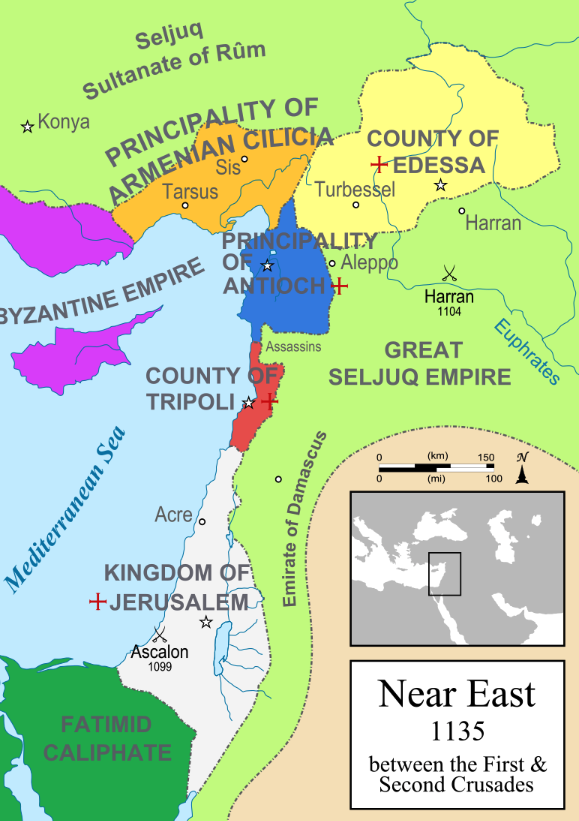

# 十字军东征 - 大事时间线1

## 教权和皇权之争

格里高利七世（Gregory Ⅶ）于1076年2月22日对亨利四世（Heinrich IV）处以绝罚

1077年，“卡诺莎（*Canossa*）悔罪”事件：亨利四世在城堡外的冰天雪地中（据传说，是赤脚）站立了三天；从1月25日到1月27日

1080年，格里高利七世认识到情况有变，立即就做出了决定：再度绝罚亨利四世并承认鲁道夫为国王。

1080年，亨利四世挥师南下，德意志的军队三度围攻罗马，格里高利七世组织教皇国的士兵们殊死抵抗直到1083年，亨利才占领了梵蒂冈城堡，并逐渐吞噬其它罗马城区。1084年，进占罗马，一部分枢机主教临阵倒戈，投靠了德意志人，亨利四世亦再度宣布废黜教宗，并任命克雷芒三世（Clement III）为教宗，在那里接受克雷芒三世加冕。

1088年，乌尔班二世（Urbanus II）成为教皇。乌尔班二世上台时，神圣罗马帝国皇帝亨利四世支持的对立教皇克莱门特三世仍然占据着罗马。乌尔班重申反对世俗王权任命神职，提出主教应由神职人员和教徒选举产生。1089年，在西西里王国诺曼军队的保护下，他初次进入罗马，召开宗教会议，再次绝罚对立教皇及其后台德皇亨利四世。乌尔班二世利用继位问题挑拨亨利四世的父子关系，使亨利之子康拉德在1093年背叛其父，在米兰自立为王与教皇结盟。直到1096年，乌尔班才最终打克雷芒三世，返回罗马。

克莱芒宗教会议。1095年9月，教皇乌尔班二世以上帝代理人的身份在法国南部的克莱蒙费朗郊外召开了宗教会议，有六七百名主教和修院院长参加。乌尔班二世首次号召十字军东征，

## 第一次十字军东征

1096年3月，在隐士彼得（Pierre l'Ermite）和沃尔特·桑萨瓦尔的率领下，这些平民迫不及待地自行组织出发了，即平民十字军。在死去过半人的情况下，平民十字军到达君士坦丁堡，又被君士坦丁堡的皇帝打发到小亚细亚迎战精锐的突厥人，几乎全军覆没。

1096年秋天，由武装贵族和骑士组成的正规十字军开始出发。1099年，十字军占领埃及法蒂玛王朝（Fatimid）穆斯林控制下的耶路撒冷，并建立了十字军国家的耶路撒冷王国（Kindom of Jerusalem）和三个附属小国：伊德萨伯国（Edessa）、的黎波里伯国（Tripoli）、安条克公国（Antioch）。这次战事中十字军屠杀了安提阿和耶路撒冷二城。

1098年十字军攻陷安条克（Antioch），建立安条克公国，诺曼人博希蒙德（Bohemond ）更自封为安条克亲王

* 博希蒙德一世，塔兰托亲王和安条克亲王（Bohemond I，Prince of Taranto and Prince of Antioch；约1054年－1111年3月3日）

耶路撒冷王国，该王国从1099年起持续了近两百年，直到1291年被马穆鲁克攻陷最后一块领土阿卡为止。它的历史被分为了两个明显不同的时期，第一王国从1099年持续到1187年被萨拉丁几乎完全侵占为止；在随后的第三次十字军东征中，该王国又于1192年在阿卡重建，并沿续到1291年该城的毁灭为止，因此第二王国有时又被称为阿克王国。

* 鲍德温一世（Baldwin I）
* 鲍德温四世（Baldwin IV of Jerusalem）。由于鲍德温四世小时候得过麻风病，一直带着面具。

## 第二次十字军东征

1144年，穆斯林开始反击，塞尔柱人摩苏尔总督赞吉攻打伊德萨伯国。耶路撒冷国王向法王路易七世和德国国王康拉德三世求援，开始了第二次十字军东征（1147年 - 1149年），结果失败，伊德萨伯国灭亡。期间因赞吉遇刺，便由其子努尔丁继承其位，积极统合穆斯林世界的力量，为日后的萨拉丁反收复耶路撒冷作准备。

路易七世是虔诚的基督徒，有些历史学家形容他是“法国版忏悔者爱德华”。1136年，他与阿基坦公爵威廉十世之女埃莉诺结婚。埃莉诺与路易七世的婚后不和，在第二次十字军东征期间遇到了还是公爵的亨利二世。1152年爱丽诺与亨利结婚，亨利与1154年加冕为英格兰国王，而艾莉诺则成为英格兰王后。

1172年，因为父母失和，小亨利、理查和杰弗瑞三兄弟站在母亲一边对父亲宣战。父子之战长达十余年，小亨利和杰弗瑞先后病逝，1189年理查则与法兰西王腓力二世结盟。战争期间双方曾试图和解，可惜亨利二世的谈判条件依然是为幼子约翰（失地王约翰）争取权益，甚至提出让约翰成为新的王储，导致双方谈判没有结果。两位王子病死后，亨利二世身体状况下滑，于是要求两方休兵；就在这个瞬间，约翰倒戈向理查与腓力二世，于是亨利二世开始绝食并拒绝医治，只求速死。两天后，亨利二世含恨而死。

## 第三次十字军东征

1187年，萨拉丁灭掉法兰克人的耶路撒冷王国，迅速占领地中海东岸的许多城市。耶路撒冷的陷落，使教宗和欧洲各国君主大为震惊。

神圣罗马帝国皇帝腓特烈一世（红胡子 Friedrich I，在意大利语中，红胡子的译音为巴巴罗萨）、英国狮心王理查一世（Richard I，父亲亨利二世，母亲埃莉诺Eleanor，金雀花王朝）和法王腓力二世（Philippe II，父亲是路易七世）发动了第三次十字军东征（1189年 - 1192年），腓特烈一世在途中坠水而死，其部队退出战争。法王腓力二世与英王理查一世及后不和，腓力以国内发生纠纷为借口，途中返回法国，最终只剩理查孤军力战萨拉丁。萨拉丁进行了顽强的抵抗，双方互有胜负，最终达成停战协议。

理查其行军作战的勇气和领导才华，却是真实无疑的，他向世人证明了，他是少数能够协调组织那兵源繁杂的十字军兵力之统帅，其军事表现，亦令他成为中世纪最杰出的军事指挥官之一。