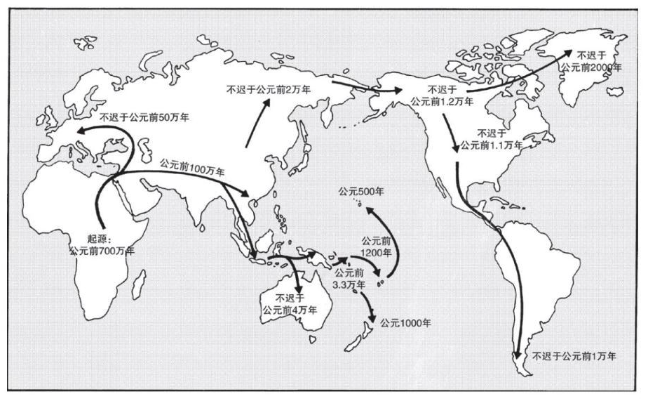

# 《枪炮、病菌与钢铁》读后

戴蒙德的《枪炮、病菌与钢铁》论证了环境对人类发展的重要影响，甚至可以说这本书一本”地理决定论“的著作 。

## 人类的迁徙

700万年前，有一支非洲猿开始演化成人类。400万年前我们的直系祖先（南方古猿）已经是直立的了，170年直立的形态已接近现代人，但脑容量不到现代人的一半。100多万年，人类的祖先开始走出欧洲，演化出尼安德特人等人种。大约10万—5万之间，智人又从非洲走出去，演化上的优势使智人逐步取代其他人种，遍布世界各地。

澳洲的巨型动物大概在4万年前左右突然灭绝。在美洲灭绝的哺乳动物中，那些留下大量化石可供精确定年的物种，灭绝的年代都在公元前11000年左右。具有狩猎技术优势的人类突然降临，许多动物来不及进化与人类共处的生存技能，于是在人类到来后大量灭绝了。

> 因此，有学者推测，澳大利亚—新几内亚的巨型动物，可能在约4万年前经历了同样的命运。相形之下，非洲和欧亚大陆上大型哺乳动物大都至今犹存，因为它们和人类的祖先共同演化了几十万年甚至几百万年，有充分的时间演化出对人类“敬而远之”的本能，毕竟我们的祖先当年的狩猎技术还不太高明，花了很长的时间才改进。而对渡渡鸟、恐鸟，或许还有澳大利亚—新几内亚的巨型动物来说，技术精良的猎人像是从天而降，根本没时间做演化准备，只好走向灭绝。

## 印加帝国皇帝被俘

1532年11月16日在秘鲁的卡哈马卡城，印加帝国末代皇帝阿塔瓦尔帕（Atahuallpa）与从西班牙来的弗朗西斯科·皮萨罗（Francisco Pizarro）会面。虽然皮萨罗只有一小撮人跟着，但结果大军簇拥着的阿塔瓦尔帕在众目睽睽之下被皮萨罗擒住。皮萨罗只带了146个人身来到印加帝国，而阿塔瓦尔帕在自己的土地上，身后有8万人的军队，竟然被皮萨罗生擒，实在是匪夷所思，背后可见他们背后所代表文明的差距。

> 阿塔瓦尔帕的被俘对欧洲人征服印加帝国有决定性的影响。虽然拥有优势武器的西班牙终将获胜，但这个俘虏事件犹如催化剂，使得整个过程易如反掌。阿塔瓦尔帕在印加帝国被尊为太阳之神，有着无上的权威，纵使被俘，也能从狱中发号施令，而臣民莫敢不从。在他成为阶下囚那几个月，皮萨罗派遣探险队肆无忌惮地在印加帝国各处探勘，同时等待来自巴拿马的援军。阿塔瓦尔帕一命呜呼后，西班牙人随即和印加帝国开战，此时的西班牙军队已势如破竹，不复早先的涣散。

印加没有文字，没有马匹，不会冶铁，对天花病菌没有免疫力，这些因素造成了两种文明之前的巨大差距。而造成这一切的原因可以归到族群的食物生产能力上面，充足的食物才能支持产生足够的脱产人群，并由他们来发展各种技术，提升族群的竞争力。

> 简言之，世界上只有少数几个地区独立发展出食物生产手段，各地区的进度差距很大。在那些核心地区的四周，有些狩猎—采集族群掌握了生产食物的技能，还有一些地区，原本的族群则被来自核心地区的农民连根拔起并取而代之，这些农民是征服者，他们征服各地的时间也很不一致。最后，有些族群虽然生活在生态条件良好的地区，但是既没有在史前时代发展出食物生产手段，也没有从外地采借过这样的手段，千百年来他们一直过着狩猎—采集的生活，直到现代世界将他们抛弃。在食物生产方面取得先机的族群，在迈向枪炮、病菌和钢铁的路途上，领先群雄。其结果就是历史上一连串“有”与“无”的冲突。

阿兹特克与印加这两个美洲帝国分别在1519—1520年和1532—1533年被征服了。在那两场征服中，欧洲人传播的疾病（可能是天花）扮演了主要角色，两位皇帝与他们的许多臣民都死于传染病。一小队西班牙骑兵展现的军事优势，加上他们使用政治技巧挑拨土著族群，加剧了两大帝国的崩溃。然后，欧洲人在16—17世纪逐步征服了中美洲和南美洲北部剩余的国家。

## 决定地区发展的远因

人类在世界各地发展如此不平衡，根本的原因是地理环境。

> 这个世界的权力和财富分配为何如此不均？追根究底，我们发现答案就是地理条件的差异。

欧洲殖民者如何征服美洲？病菌的贡献远大过枪炮

> 在欧洲殖民者进入北美洲之后，他们身上所携带的病菌给当地人造成毁灭性的打击，95%的印第安人都死于这些欧亚大陆的传染病。

> 1519年，科尔特斯率领600名西班牙随从登陆墨西哥海岸，企图征服有数百万人的阿兹特克帝国。科尔特斯到了首都特诺奇蒂特兰，不久就被逐出城外，“仅”折损了三分之二的兵力，但他又企图杀到海岸，以展现西班牙的武力优势，笑傲那些天真无知的印第安人。然而，科尔特斯再次发动攻击时，印第安人已经学乖了，在每一条巷道严阵以待，准备拼个你死我活。西班牙人凭什么本事获胜？答案就是天花。1520年，有个奴隶在古巴感染了天花后来到墨西哥。结果这场流行病杀死了半个阿兹特克帝国的人，连皇帝奎特拉瓦克也难逃一劫。这种神秘的疾病专挑印第安人而放过了所有的西班牙人，劫后余生者因而信心全无。墨西哥人口本有2 000万，到了1618年陡降至160万。

>  皮萨罗在1531年登陆秘鲁时一样走运，他只带了168个人就征服了几百万人的印加帝国。天花早他一步在1526年左右来到秘鲁，带走了不少印加帝国的子民，连皇帝卡帕克和他指定的继承人都魂归西天。正如第3章所述，在群龙无首的情况下，卡帕克的两个儿子阿塔瓦尔帕和瓦斯卡尔因而陷入内战。这反倒让皮萨罗成为得利的渔翁。

温带相比热带地区的国家经济更为发达与热带地区的疾病更多有密切的关系

>  结果可能会让你大吃一惊。在38个热带国家中，有37个比10个温带国家中的任何一个都更贫穷；只有加蓬的财富值与财富值中等的温带国家相当。在热带国家分组和温带国家分组中，沿海国家的财富值平均比内陆国家的财富值高50%。为什么地理位置对国家财富影响巨大呢？

> 热带地区有两大特征不利于经济发展。其中一个特征是居住在热带地区或去过热带地区的读者很熟悉的：在热带地区比在温带地区更容易生病，容易感染疟疾或登革热等热带传染疾病，或者感染热带寄生虫。因而热带国家的居民比温带国家的居民生病的时间更多，生病期间无法从事劳动生产。总体而言，他们的寿命也更短。这不仅对这些居民而言很悲哀，而且对他们的国家经济来说也是不幸。热带地区的另外一个经济劣势是土壤更贫瘠，植物病害和动物疫病更多，所以农业生产力更低。

交通更方便的地区和国家经济更为发达

>  关于内陆国家的劣势，也很容易理解：陆运比通过沿海港口或可通航河流水运大约贵7倍。因此，在运输及货运成本方面，内陆国家比沿海国家承担的要多。对于产品在边远地区需求量大，同时需要从边远地区进口很多产品的国家而言，这是特别重要的考虑因素——赞比亚正是如此。

要避免”铁锤人“倾向，地理并非唯一的决定因素

> 总而言之，有些国家比其他国家富裕得多，其原因众多且复杂。如果你坚持认为这个重要问题只有一个简单的原因，那么你得离开地球去其他星球生活，因为这里的现实生活实在很复杂。

可供驯化的动植物；东西轴线或者南北轴线的大陆走向；交通的便捷程度；

> 可供驯化的植物品种和动物物种在世界各地分布不均匀，可驯化的动植物大概集中在世界上的9个地区，这些地区成了独立的农业发源地。农业从发源地传播到其他地区，沿着东西轴线的传播比沿着南北大陆轴线的传播快。这一农业历史的结果是，世界各地发展国家社会复杂制度的时间长短不一。在希腊和中国，国家政府及其附属物的存在已有4 000年之久，但在新几内亚的一些地方，这些仅有大约30年的历史。

## 需求为发明之母 Vs 发明是需求之母？

有技术之后才有需求，比如在苹果的大触屏之前，手机的设计千差万别，摩托罗拉推拉手机、黑莓的键盘手机、诺基亚的砖块手机、三星的翻盖等。，但苹果的触屏成功后，手机就差不多都成类似的模样了。除了乔布斯外，大多数人并不知道自己需要的是苹果那样的触屏手机，这种手机设计确实是乔布斯发明的。但是，人们需要的是一种更方便，更高体验的手机交互方式，这个需求是乔布斯发明手机触屏的动力。需求确实是发明之母，因为任何成功的发明都是为了满足了人类的某种需求。发明又是需求之母，因为只有发明出某种可以真正满足需求的应用后，需求才会被激发出来。

> 我的两个主要结论是：第一，技术的发展是累积式的，而不是英雄凭空创造的；第二，技术发明了之后，才产生用途的问题，而不是先有需求，再有发明。

> 由于新发明的早期原型多半表现不佳，很难看出什么用途，发明家往往必须孤单地坚持很久，以改善他们的发明。最初的照相机、打字机和电视机，都与奥托那7英尺高的内燃机一样不合用。因此发明家本人难以预测自己的原型是否必然有用，而确定有用后，才可能继续投资改进。美国政府每年发出7万件专利凭证，只有少数能达到商业生产的阶段。一些重大发明找到了用途，而无数的发明根本找不到用途。此外，一些发明在一开始就做得能满足发明的目的，后来又因为发现新用途而变得更有价值。瓦特的蒸汽机原本是为了从矿坑中抽水设计的，后来却用来推动轧棉机，连火车与船都用上了

## 方法论

社会学研究无法重复做实验

>  物理学获取知识的主要方法是到实验室做实验：对想知道其影响的参数进行操纵，保持该参数不变的情况下做随机对照实验，然后保持其他参数不变，重复实验操纵和对照实验，最后得到数据。这个策略十分有用，化学、分子生物学也采用这种方法，许多人认为到实验室做实验就是科学，而实验在他们心目中成了科学方法的核心。但是，在许多历史科学中，实验并未扮演重要角色。我们不能中断银河系的生成，无法让飓风和冰期启动或停止，不可能为了做实验而挑几个国家公园里的灰熊来灭绝，也没办法重现恐龙演化的过程。在这些历史科学中，我们必须使用别的方法获得知识，例如观察、比较，以及所谓的自然实验（下面会解释）。

关注近因也要关注终极因。地理条件是人类社会发展不平衡的一个终极因。

> 历史科学研究的是近因与终极因的因果过程。终极因、目的、功能等观念在大部分物理学与化学研究中并无意义，但它们是了解生物系统或人类活动不可或缺的。举例来说，一位演化生物学家在北极发现一种兔子，它们的皮毛夏天是棕色，冬天是白色，而他不只想知道皮毛变色的机制（色素分子构造与兔子体内合成色素的机制），他认为更重要的是关于功能（欺敌的保护色？）与终极因（天择？原先兔子的皮毛只有一种颜色？）的问题。同样，研究欧洲的历史学者不会满足于将欧洲在1815年和1918年的情况都描述成“一场代价高昂的欧洲大战之后，各方达成了和平”。他们必须先分别了解那两个和平协议的因果过程，再仔细比较两者的异同，才有可能了解，为什么1918年达成和平协议后，不过20年就战端再启，而1815年的和平协议却能维持较久的和平？化学家则不必关心两种气体分子碰撞的目的或功能，更别说碰撞的终极因了。

心理、生物和历史只能描述统计学概率，个体会有很大的差异。历史的预测在大空间尺度和长时间最可靠，因为每个小尺度事件的特异性在大尺度不再突出。

> 因此物理学家和化学家能发明描述宏观层次现象的普遍定律，宇宙各处一体适用，但是生物学家和历史学者只能描述统计学趋势。我能预测，在我所服务的加利福尼亚大学医学中心接下来出生的1 000名婴儿中，男婴的人数在480到520之间，这个预测正确的可能性很高；但我事前无法知道我自己的两个孩子是男孩。同样，历史学家指出，部落社会在两种情况下更有可能发展酋邦：一是，人口密度大、数量大；二是，有能力生产大量盈余食物。但是，满足这两个条件的人群，各有各的独特之处，欧盟从墨西哥、危地马拉、秘鲁和马达加斯加的高地都出现了酋邦，而新几内亚岛、瓜达尔卡纳尔岛上就没有。
>
> 天文学、气候学、生态学、演化生物学、地质学和古生物学，每个研究领域都受到下列困难的困扰，只是程度有别：无法实行可复制的对照实验，变量众多导致系统复杂，每个系统因此都有特异之处，无法归纳出普遍定律，难以预测系统的突现性质与未来行为。历史预测和其他历史科学中的预测一样，在大空间尺度和长时间内最可靠，因为每个小尺度事件的特异性在大尺度中不再突出。

多元化思维的重要性

>  历史系统即使有终极的确定性，也仍旧是复杂、不可预测的，对此的另一种描述是：由于因果链条很长，造成最终结果的终极因，可能不在研究结果的那门学科的研究范围之内。例如，恐龙的灭绝可能是一颗陨石撞击地球的结果，而那颗陨石的轨道服从于古典力学的定律。6 700万年前，假如有一位古生物学家生活在地球上，他是不可能预测到恐龙很快将要灭绝的，因为研究小行星的科学领域与恐龙生物学相距甚远。同样，公元1300年到1500年之间的小冰期，使格陵兰岛上的诺尔斯人消失了。但是没有一位历史学者，甚至没有一位现代气候学家，能够预测到这个小冰期的到来。

社会学研究的比较与所谓的自然实验法

> 研究人类历史的学者，怎样才能从其他历史科学的研究经验中获益呢？有一套方略很管用，就是比较法与所谓的自然实验。虽然研究银河演化的天文学家与人类历史学家，都不能操纵他们研究的对象，在实验室里从事对照实验，但是他们可以利用自然实验，比较只差一个变量（有或无；作用强或弱）的系统。举个例子吧，流行病学家无法以实验研究高盐食物对人体的影响，但是他们可以比较不同的人类社群，有些社群食物的含盐量高，有些低，这样也可以判别食盐对人体的影响。对环境资源的长期影响有兴趣的文化人类学家，也不能拿人类社群做实验，所以他们研究南太平洋的波利尼西亚人，因为每个岛的资源都不一样。研究人类历史的学者能够利用更多的自然实验，比较五大洲生物资源的历史后果只是其中之一。有些相当孤立的大岛上发展出复杂的社会，例如日本岛、马达加斯加岛、美洲土著的伊斯帕尼奥拉岛、新几内亚岛、夏威夷岛以及其他许多岛屿，学者可以借此做比较研究；还有小岛上的社会，同一大洲上的区域社会，都可以做比较研究。

很多必要但非充分条件。优秀的人一定特立独行，但特立独行的人有可能是傻x；经济发达的国家一定需要良好的制度，但良好的制度并不一定能使国家变富。

> 仅用制度来解释国家贫富的另一个不足之处在于，这种观点并未谈及良好制度的渊源。为什么一些国家拥有良好制度，而另一些国家没有良好制度呢？例如，为什么荷兰最终形成了对促进国家发展更为有效的制度，而赞比亚却没有形成这样的制度呢？这难道仅仅是一件不可预测的随机事件？同等概率下，赞比亚也可能成为发展出更好的制度的国家吗？如果良好制度能在任何地方随意地冒出来，为什么将良好制度移植到那些现在尚无良好制度的国家却困难重重？为什么最贫穷的国家和最富裕的国家没能随机地分布于各个大洲，而是实际上最富裕的国家集中分布在西欧和北美，而最贫穷的国家集中分布在非洲和南美？

> 换句话说，通常的观点只强调了良好制度，而混淆了近因（因变量）和终极因（自变量）。为了把这种概念差异表达清楚，我来讲一个关于婚姻破裂的故事。

> 良好制度不会独立于地理因素从天而降，落到一些碰巧运气好的国家。良好制度有其自身的历史，部分有赖于农业及农业所带来的结果，包括国家政府和市场等复杂制度的发展。当然，复杂制度可能很好，也可能很糟糕，但如果一个地方根本没有复杂制度，就不可能发展出被经济学家称赞的良好制度。

## 统一的中国

中国维持统一中的地理因素

> 中国一直维持统一国家的面貌，使我们习以为常，认为理所当然，忘了这是多么令人惊讶的事。

> 中国的南北差异对作物的传播有所阻碍，但并没有像在美洲和非洲那样成为屏障，一来中国的南北距离较短，二来中国南北之间并无难以逾越的地理屏障，不像非洲与墨西哥北部有大漠阻绝，中美洲地峡构成南北美洲的交通瓶颈。中国横贯东西的河流，像华北的黄河、华南的长江，还让沿海地区与内陆的作物、技术的流通方便了许多。同时，中国的东西横轴绵长、东西坡度缓和，最终在两条大河之间构筑运河的计划得以实现，方便了南北向的交流。中国地区很早就完成了文化和政治的统一，所有这些地理因素都起了相当大的作用。与欧洲对照起来，这一点就更明白了。欧洲的面积与中国相当，可是地势起伏，又无河流贯通，文化、政治上的割裂至今无法弥合。

统一的优势和诅咒

> 那是肥沃新月地带从领袖群伦的高峰，跌至命运深谷的过程。那么中国呢？中国的例子起先很令人惊讶，因为中国无疑占尽了优势：几乎与肥沃新月地带同时发展出食物生产业；生态复杂，从华北到华南，从海岸到青藏高原，生物资源丰富，因此发展出许多种类的农作物、牲口、技术；幅员辽阔、生产力雄厚，供养了世界上最多的人口；环境强韧，不似肥沃新月地带那样脆弱，经过了1万年的耕作，仍能支持密集农作（虽然今日中国的环境问题越来越多，比西欧还严重）。

> 这些条件使中国先驰得点，于唐宋之间成为技术大国，领先世界。中国有一长串的“技术第一”头衔，例如铸铁、罗盘、造纸、印刷等。在政治实力、航海、海权等方面，中国也曾经是世界领袖。15世纪初期，中国的船队就数度远航，出航人员共2.8万人，船只达数百艘，每艘可达400英尺长，他们渡过印度洋，最远到达非洲东部海岸。那时哥伦布还没出生，更别提载着他“发现”美洲的3艘船有多简陋了。为什么中国船队没有绕过好望角西进，殖民欧洲，反而是葡萄牙人达伽马率领3艘小船绕过好望角东行，开启了欧洲人向东亚拓殖的时代？为什么中国船只没有东渡太平洋，登陆美洲西岸？一言以蔽之，为什么技术先进的中国会被原本落后的欧洲赶上呢？

> 中国船队的结局可以为我们提供一条线索。1405年至1433年，中国船队七下西洋。后来朝中大臣与太监斗争，大臣占了上风后，就不再维持船队，最后船坞荒废，朝廷甚至颁布禁海令。这样的事例在人类政治史上并不少见：19世纪80年代伦敦通过继续使用煤气街灯的法案，美国在两次世界大战之间的孤立主义，还有许多国家开倒车的例子，不胜枚举，全都是国内政治斗争的结果。但是中国的例子有一点不同，因为中国是个统一的国家，只要一个决定，就可以使全中国的船队停摆。那个决定造成的结果难以挽回，因为船坞荒废就不能造新船，也就无从证明先前的决定荒谬，旧的船坞荒废后，新船坞也无从兴建。

> 现在请将中国发生的事与欧洲发生的事做个对比：在那探险船队开始地理大发现的时代，政治上分裂的欧洲怎样响应时代的呼声？哥伦布出生于意大利，曾效忠于法国安茹公爵，后来又改成为葡萄牙国王服务。葡萄牙国王拒绝为他提供向西探险的船只后，哥伦布先后向梅迪纳-西多尼亚公爵、梅迪纳-塞利伯爵求助，都遭到拒绝。最后他找上了西班牙国王和王后，他们先是拒绝了哥伦布，哥伦布再次请求，他们才批准。要是欧洲也像中国一样是个统一的国家，要是统治者也像拒绝哥伦布的前几位大人物一样，欧洲人殖民美洲的事业恐怕就无从谈起。
>
> 事实上，正因为欧洲是分裂的，哥伦布才有机会在四次失败的尝试后，最终说服几百位君主中的一位来资助他出海。西班牙投身殖民美洲的大业后，其他国家眼见财富流入西班牙，立刻群起效尤，至少有六国加入了行列。大炮、电灯、印刷术、小型火器以及不计其数的其他发明，都经过同样的过程才在欧洲流传开来：刚开始，都在某个国家因为某种特殊理由而受到忽视、冷落；一旦有某个国家采纳，其他各地即争相仿效。
>
> 欧洲的分裂和中国的统一带来了截然不同的结果。中国朝廷决定搁置的不只是远洋航行：比如，14世纪时放弃发展一种精巧的水力纺织机，硬生生地从工业革命的边缘退了回来；中国的机械钟制造一度世界领先，却在15世纪晚期之后放弃了制造，不再发展机械与技术。权力集中造成发展停摆，在现代也有类似的事例。
>
> 中国的统一体制与欧洲的诸邦并立各有渊源，由来已久。现代中国生产力最高的地区在公元前221年首次实现了政治统一，此后大部分时间里都维持着统一。中国自有文字以来，就只有一种书写系统，在很长时间里只有一种主要的语言，2 000年来文化上也保持统一。欧洲则相反，从未出现过统一的局面：公元14世纪时，约有1 000个独立小国，公元1500年时则有500个，到了20世纪80年代已经兼并成25个，而我在写作本段时又增加为近40个。欧洲仍有45种语言，各有各的一套字母表，不尽相同，至于文化歧异性就更大了。欧洲内部的分歧至今难消，即使经济合作，联盟都不易达成，这反映出欧洲对分裂的执着。
>
> 因此，中国在现代史上丧失了政治与技术的优越地位，让后起之秀的欧洲超越了，追根究底必须从古代中国长期统一与欧洲长期分裂的历史下手。地图可以透露答案（见图A、图B）。欧洲的海岸极为曲折，有五大半岛，每个都接近孤立的岛屿，所以每个半岛上都发展出了独立的语言、族裔、政府：巴尔干半岛、亚平宁半岛、伊比利亚半岛、日德兰半岛、斯堪的纳维亚半岛。比较起来，中国的海岸线相对平滑了许多，海岸线附近只有朝鲜半岛可视为独立的要角。欧洲有两个岛屿（不列颠与爱尔兰）的面积足够大，能维持政治独立，保持自己的语言和族群；其中不列颠群岛面积很大，距欧洲又很近，能够发展出欧洲大国。反观中国的两座大岛：台湾岛与海南岛，每一个面积都不到爱尔兰的一半，从未成为独立的政治体。日本因地理位置而保持独立和孤立，直到近代在亚洲大陆的影响力都不大，无法与英国对欧洲大陆的影响力相比。欧洲被高山分隔成语言、族群、政治的独立单位（阿尔卑斯山、比利牛斯山、喀尔巴阡山脉、挪威边界山脉），中国在青藏高原以东并无足以隔绝交通的崇山峻岭。中国的腹地被两条东西向的大河（黄河、长江）联系在一起，两岸有冲积河谷，两河之间又有水系联络，所以东西、南北的交通都便利。结果，中国自古便有两个生产力很高的核心地区，而且两地并不疏离，最后统一成一个核心区。欧洲的两条大河（莱茵河与多瑙河）就小多了，流域也不广。与中国不一样，欧洲包括许多分散的小型核心地区，没有一个大到足以长期控制其他地区，所以每个核心区都能长保独立。