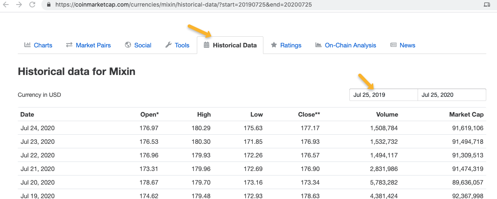
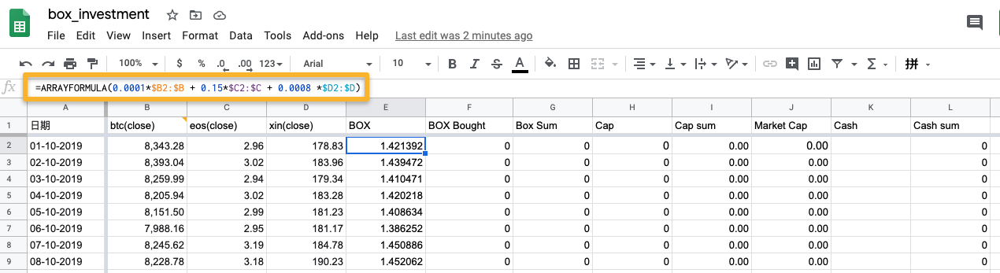
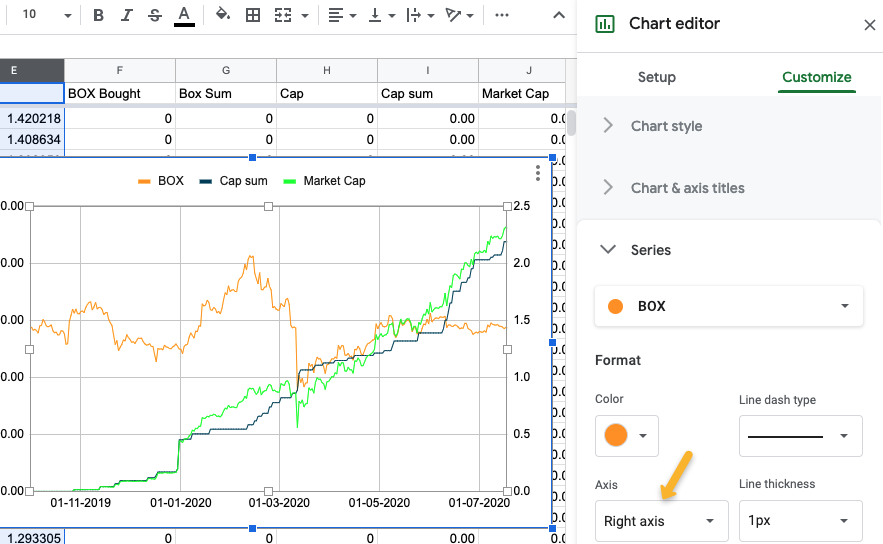

# 如何创建你的BOX定投资产走势图


BOX是什么？它是一个区块链基金，由BTC, EOS和XIN组成，取了其中的三个字母BOX，详细请参见[官网](https://b.watch/)。BOX后面有一个定投践行社群还有一本书——[定投改变命运](https://github.com/xiaolai/regular-investing-in-box)，这本书值得再三研读。如果不了解BOX和定投践行群，那后面的内容不着急看，先看书，慢慢看，仔细品，正如序中所说
> 普通人错过这本书的“踏空成本”无限大

读完这本书，或许你也会加入定投践行群并开始定投BOX，那你肯定想知道定投BOX的资产走势情况，目前mixin还没有这个功能，但我们可以自己动手做。下面就来介绍下如何做出你的BOX定投走势图。

## 1. 准备数据

首先要拿到BOX的价格数据，目前还没有找到直接提供BOX价格的数据源，但没关系，BOX是由三种资产组成，这三种资产的价格数据都有公开数据，利用这些数据加权计算就能得出BOX的价格。

```
* 1 个 BTC
* 1500 个 EOS
* 8 个 XIN
= 10,000 BOX
```

数据可以在[coinmarketcap](https://coinmarketcap.com)上查到，还不能直接下载，但可以拷贝粘贴。比如，我们在`coinmarketcap`搜索`XIN`，会转到[`XIN`的页面](https://coinmarketcap.com/currencies/mixin/)，然后去历史数据中选定日期范围，就可以看到数据。



我们需要先创建好一个数据表，这里用的是`google sheet`，`excel`应该是类似的。等数据表创建好后，在`coinmarketcap`选择并拷贝所有的显示数据，粘贴到`google sheet`。完成`XIN`的数据后，继续拷贝`BTC`和`EOS`的数据。

网站[yahoo](https://finance.yahoo.com/)也提供ETC和EOS的数据，而且可以直接下载，但目前还没有`XIN`的数据。这两个网站的数据是一致的，看你喜好从那边获取，如果是下载的`csv`数据表，就把它导入到同一个表中，每项生成一个新表单。

原始数据是由近到远的，为了计算方便，把顺序调整为由远到近，在时间那一列上右击，然后选`Sort sheet A->Z`后数据的顺序就调整过业了。最后找一个表单把时间列拷贝到一个新表单中，然后把所有表单中的`Close`列拷贝到同一个新表单中，注意数据列要与日期对齐。


## 2. 输入BOX的购买数据

在新表单中加入一列`BOX Bought`和`Cash`，分别输入自己的BOX购买量和花费的现金。这两项一般是可以直接折算的，但如果购买中使用混合了虚拟币和现金，那两列的数据就不能直接折算了，所以分开输入。

在Mixin中点开你的钱包，再点开`BOX`，你就可以看到BOX的购买情况，按对应的日期输入BOX的购买量。购买所需的现金在你使用的购买程序(比如`ExinOne`)中有纪录中，可以从中获得数据并输入。

## 3. 计算价格和市值

数据准备好之后，就可以开始计算了。在表中添加几列：

* `BOX`: `BOX`的价格
* `BOX Sum`: `BOX`的持有量
* `Cap`: 购买当日的市值
* `Cap Sum`: 购买当日的市值总计
* `Market Cap`: 当日持有`BOX`的市值
* `Cash Sum`: 所花费的现金总计

`Cap Sum`购买当日的BOX市值合计，因为其中可能有些购买混合使用了虚拟币和现金，所以用这项比较方便。如果只使用现金购买，那也可以使用`Cash Sum`那列，然后需要把`Market Cap`从美元折算成人民币，大致乘以7就可以。

现在要在表单中添加计算公式。`BOX`价格是三种虚拟币的加权值(BTC:EOS:XIN=1:8:1500)，市值是数量和当日的结束价格乘积。

* `BOX`: `=ARRAYFORMULA(0.0001*$B2:$B + 0.15*$C2:$C + 0.0008 *$D2:$D)`，只需要在第一行输入
* `BOX Sum`: `=sum($F$2:F2)`,需要手动拖拽把公式复制到这一列所有行中
* `Cap`: `=ARRAYFORMULA($F2:F*$E2:$E)`, 只需要在第一行输入
* `Cap Sum`: `=sum(H2:H$2)`,需要手动拖拽把公式复制到这一列所有行中
* `Market Cap`: `=ARRAYFORMULA($G2:$G*$E2:$E)`,只需要在第一行输入
* `Cash Sum`: `=SUM(K2:K$2)`,需要手动拖拽把公式复制到这一列所有行中



注意`ARRAYFORMULA`可以直接计算一列的数据，所以在第一行输入一次即可，使用`sum`公式时则需要复手动复制。方法是先选中第一行，把鼠标移到右下出现十字标时点击向下拖拽复制到该列的每一行中。这时所有数据已经齐备，就可以做出图表了。


## 4. 绘制图表

利用这些数据就可以做出各种图表了，比如我们可以做一个BOX价格，自己投入资本和市值的图。选中`日期`，`BOX`，`Cap Sum`和`Market Cap`这四列，选择线段图表(Line Chart)。在图表设置中，注意要把`BOX`价格设置到右边的纵轴上。

> 截屏中隐去了左纵轴的数值



`Cap Sum`是你所投入的资本，`Market Cap`是市值，`Market Cap`比`Cap Sum`高则说明浮盈，反之浮亏。以后间或更新这些数据就可以直观的掌握自己的定投资产情况了。


