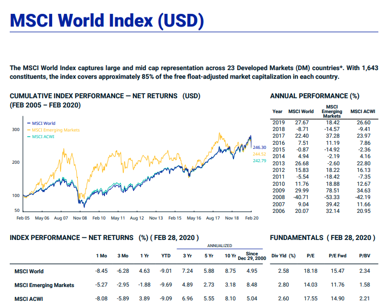
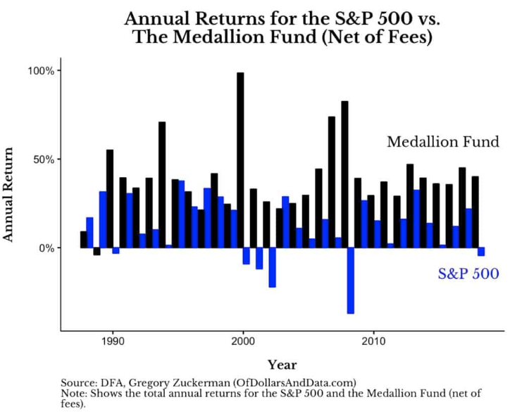

# 投资流派

投资中因采用策略不同，大致分可分为价值投资、技术趋势、组合投资和量化交易派。各派武功虽然不同，但目标是一致的，就是在市场上获利。2019年深交所发布的报告中显示2018年价值投资类投资者占比继续上升至28.6%，趋势类和短线交易类分别占比25.9%和19.0%。价值投资者的占比进一步上升，技术趋势派多是以散户为主。组合投资可以说是机构投资的主流，近些年来量化交易也发展迅猛。

## 技术趋势

技术趋势在国内的散户非常流行，主要是看k线图，他们认为基本面的变化可以反映在K线图的走势中，交易主要参考各种指标。日本蜡烛图也算是一种技术趋势分析，在一些投资者中影响还比较广。

[2019深交所发布的报告](http://www.xinhuanet.com/fortune/2019-03/16/c_1210084102.htm)中账户中资产在50万元以下的中小投资者占8成，账户平均资产量为44.5万元，可以看出市场的主要构成以散户为主，市场的趋势会被散户心理放大。

很多个人投资者就是从看K线开始投资的，可是很快会发现K线给出的指标往往不那么可靠。一些人可能会转向别的投资策略，也有人会进去了解更多的K线指标。市场中的大户可能会利用散户的这样交易习惯来人为做出漂亮的K线出来，再结合以消息进行反向操作获利。

## 组合投资

组合投资多是基金公司的玩法，比如达里奥(Ray Dalio)的全天候基金。组合投资会投资多种投资标的，形成投资组合。
 
典型代表就是约翰.博格(John C.Bogle)，指数基金之父。博格创建了先锋集团(Vanguard Group)，而先锋在1975年推出了当时革命性的投资产品——指数基金。博格主张最用低的成本，买下市场本身，他给个人投资者的建议就是购买指数基金。
 
> Wise investors won't try to outsmart the market,” he says. They'll buy index funds for the long term, and they'll diversify.
 
巴菲特又把这个建议进一步具体化，推荐投资们购买低费率的S&P500宽基指数。指数基金是典型的分散化投资工具。任何一只指数基金，都持有几十只甚至上百只不同的股票。
 
另一个组合投资的代表，是约翰邓普顿(John Templeton)，邓普顿是最早进行全球化投资大师之一。约翰博格在早期并不喜欢海外投资，他更喜欢在美国本土进行分散化投资，而邓普顿的分散化，是从全球市场寻找低估的机会。邓普顿的得意之作在五六十年代在日本股市不到10倍市盈率的时候投资日本股市。
 
目前指数基金也是逐渐进行全球资产配置，摩根有一个著名在指数MSCI(Morgan Stanley Capital International Index)追踪全球股市。各大基金也推出多款追踪MSCI指数的产品，比如iShare MSCI world ETF (NYSEARCA: URTH)，iShare MSCI ACWI ETF (NASDAQ: ACWI)， 以及Vanguard Total World Stock ETF (NYSEARC: VT)。
 
根据最MCSI的[最新图表](https://www.msci.com/documents/10199/149ed7bc-316e-4b4c-8ea4-43fcb5bd6523) 显示，全球指数从2000年12月的复合年化收益约在5%，新兴市场在8.48%

组合投资里还有一个流派是分散投资不同的资产大类。这个流派的代表是桥水基金的达里奥，桥水基金著名的全天候基金(All-Weather)同时配置股票、债券和大宗商品。组合投资的门槛很高，以机构投资者为主。组合投资不光要考虑收益率，还要保持投资组合的最大回撤(Maximum Drawdown)在一定范围内，就是在管理最大回撤的基础上，获得长期回报。最大回撤的决定性因素是大类资产的配置，所以这种投资策略主要集中在确定大类资产的配置方案上。
 
布朗( Harry Browne)在70年代就提出一个“永久组合”的方案(The Permanent Portofolio)，这个投资组合经过时间的洗礼，现在仍然被认为是经典的配置方法之一。永久组合把投资的资金分成了四等份，股票、国债、现金和黄金各占25%。股票负责整体回报，国债带来稳定的收益，现金和黄金会在极端市场下提供保护。永久组合从1973年至2017年复合年化为8.15%，最大回撤仅有12.42%。相比之下，标普500复合年化达到10%，但最大回撤为50%。永久组合长期收益的落后，换来的是过程的极大平稳。

达里奥的全天候组合中30%股票、55%的政府债券、7.5%的黄金和7.5%的大宗商品。30%的股票分配给了美国股票、其他发达国家股票和发展中国家，也就是所说的新兴市场三个部分。该组合从1973年到2013年年化回报为9.5%，最大回撤仅为14.59%。
 
组合投资派还有著名的大卫.斯文森(David F.Swensen)，他从1985年开始掌管耶鲁捐赠基金。在三十年的时间里，斯文森把基金规模从13亿做到280多亿，平均年回报达到可观的12%。斯文森组合里股票达到了50%，他还分配20%给了房地产信托基金(REITs)这个投资品种，债券占30%。从1973年到2013年这个区间，斯文森组合年化回报10.16%，最大回撤41.6%。

个人想投资这些大的组合投资基金，门槛很高。如果你想在桥水基金投资这个全天候策略，让达里奥来帮你管理资产，你需要至少有50亿美元的身家，并且至少投资1亿美元。但不幸的是，即使你达到了这个最低门槛，目前全天候策略已经不再接受新的投资者加入了。
 
个人投资者可以根据自己的投资喜好借鉴这些投资经验，比如[这篇文章](https://www.iwillteachyoutoberich.com/blog/all-weather-portfolio/)建议配置以下基金来构建一个的全天候基金。
* 30% Vanguard Total Stock Market ETF (VTI)
* 40% iShares 20+ Year Treasury ETF (TLT)
* 15% iShares 7 – 10 Year Treasury ETF (IEF)
* 7.5% SPDR Gold Shares ETF (GLD)
* 7.5% PowerShares DB Commodity Index Tracking Fund (DBC)

## 量化投资

 
量化投资可以说是技术指标投资的升级版，它通过各种数学模型来捕捉市场中的套利机会。西蒙斯(James.Simons)就是其中的代表人物，他于1982年创立了知名对冲基金公司——文艺复兴科技公司，旗下的大奖章基金(Medallion Fund)在1988年到2018年三十年的区间创造了年化收益(net of fees)39%的奇迹。
 
[下图](https://ofdollarsanddata.com/medallion-fund)是大奖章和标普500指数的年收益对比，大奖章仅在1989出现了一次负收益，在2008年标普下跌37%的情况下，大奖章的收益竟然为82%。

可惜的是，大奖章创造的奇迹仅属于极少数人。该基金在1993年就已经关闭投资，为西蒙斯本人和文艺复兴公司的员工所拥有。
 
近些年来，量化对冲基金越来越多，可是罕有收益能比肩大奖章的。比如著名的量化对冲基金D.E.Shaw Composite 从2001创建到2019，除去费用的年化收益为10.9%，比同期S&P 500的年化收益为7%要高3个点，可是相比大奖章还是差了很多。
 
量化投资对于短线投资者，尤其是对技术派是一个坏消息。量化和技术分析本质上都是从历史数据中寻找套利的模式并预测未来获利，个人能够关注的信息相当有限，而计算机则可以在海量数据中筛选出关键指标。技术分析各种套路其实反而是计算可以从数据分析出套利点，另外，计算机没有情绪，会把握转瞬即逝的机会，交易的迅捷性上完胜。
 
个人投资者也可以利用量化投资策略，各大平台都提供自动化效果程序接口，你可以开发专属你的量化模型去捕捉市场上还未注意到的机会。可随着获利增加，你的操作就有可能有会被别的量化投资者注意到，他们也会开发模型来获利，有的甚至会利用你的模型弱点来针对你。另外，成功的投资模型一旦公开后，立刻会有很多人模仿，模型就会失效。个人投资者的精力有限，量化模型有效的时间总不会太长，所以并不适合大资金量的操作。

## 价值投资

 
价值投资者会发现最有前景的行业和公司，长期持有他们的股票，培养他们长大。价值投资的代表人物是巴菲特，巴菲特的最有名一句话是：人生就像滚雪球，最重要的是发现湿雪和长长的山坡。
 
> Life is like a snowball. The important thing is finding wet snow and a really long hill. 
 
小雪球是启动资金，湿雪就是低成本的长期资金，长长的山坡，就是有长期竞争优势的优秀企业。有了这几个因素，投资就可以形成滚雪球一般的复利。
 
价值投资有三个关键，首要而且是基础就是找到可以长期持续增长的标的，其次是长期持有让复利发挥作用，最后就是可以不断投入的长期资金。巴菲特长期推荐的指数基金其实就是一个可以长期持续长涨的标的，而长期持有并且持续定投就是让复利发挥最大作用的方法。
 
价值投资只能做多不能做空，这看上去一个劣势但其实也是一个优势。下跌最多跌去100%，而上跌却是不封顶的，也就是说做多的盈利空间更大。在一个总体趋势向上的市场上，做多成功的概率要比做空大很多。这也是为什么市场上成功的投资者大多是多头，而鲜有成功的空头，长期持续成功的空头更是少之又少。
 
## 总结

对于个人投资者来说，应该坚决摈弃看K线的技术投资，其长期获利的可能性是最小的。如果风格比较保守，可以参照组合投资的方法配置资产，可以在较小回撤的基础上获得较高的收益；如果有大量的时间，可以自己做量化交易，但一定要密切关注模型和市场，及时更新策略。不过，个人认为最适合个人投资者的是价值投资。
 

首先，长期持续增长的标的就是现成的，那不就是巴菲特建议的指数基金么？得来都不用费什么功夫。个人投资者在没有足够的经验前要特别慎重去选个股，虽然巴菲特投资集中于个股，但这却不适当大多数投资者，参见这篇文章股神“言行不一”的背后。

价值投资中最重要的条件你可以不费精力的搞定，省下的精力就要用在投资场外努力赚钱，然后定投——给雪球加上湿湿的雪，最后就是耐心等待。如果长期趋势向上，那短期的回撤其实并无所谓，因为它迟早会涨上来。只要选了好标的，个人投资者大可不必关注短期回撤，当然前提是你投入的钱是长期的资金，所以价值投资中很重要的就是做好个人的心理建设和不断增加场外赚钱能力。

好的标的，坚持持有和定投，那么你将会享受到价值投资带给你的丰厚回报。

(本文观点仅供参照，不构成你的投资决策)