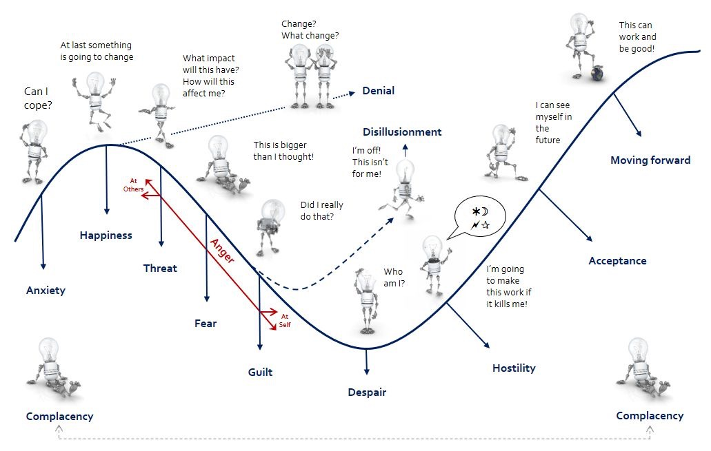
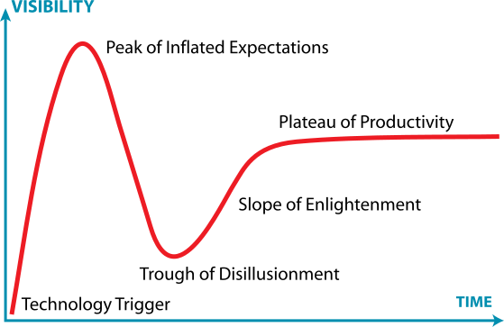
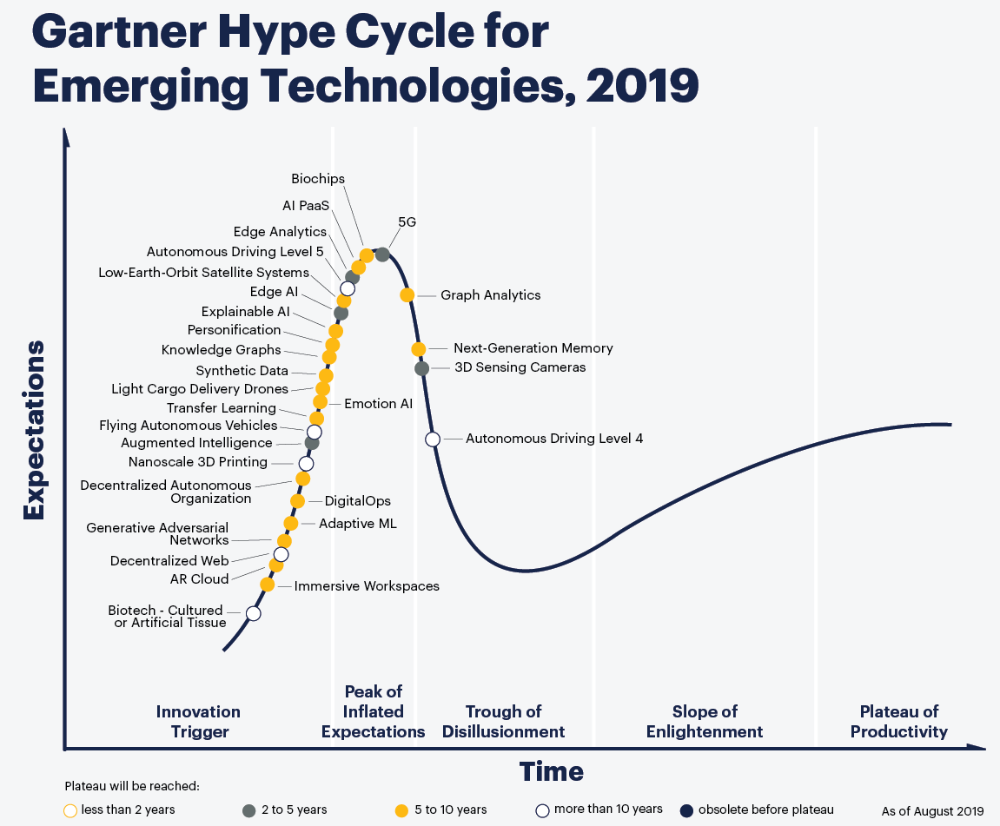
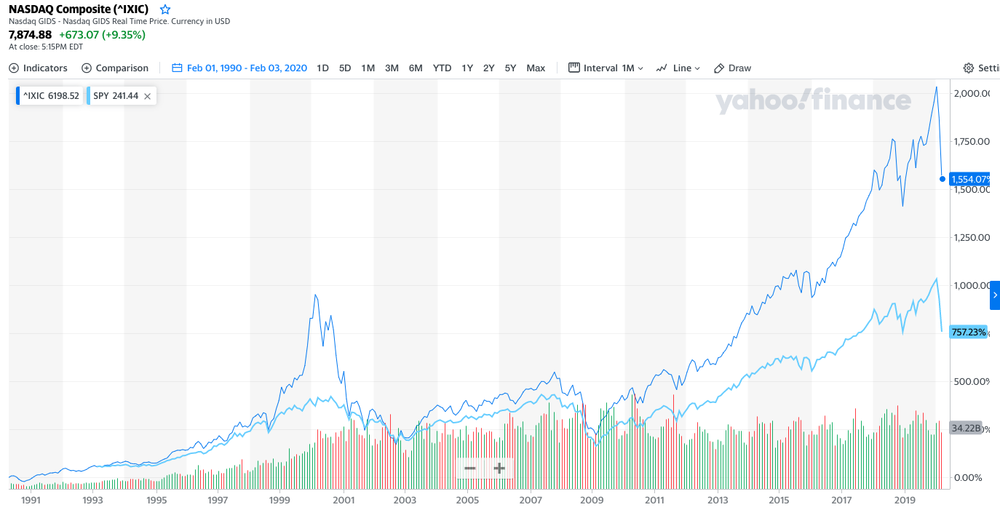
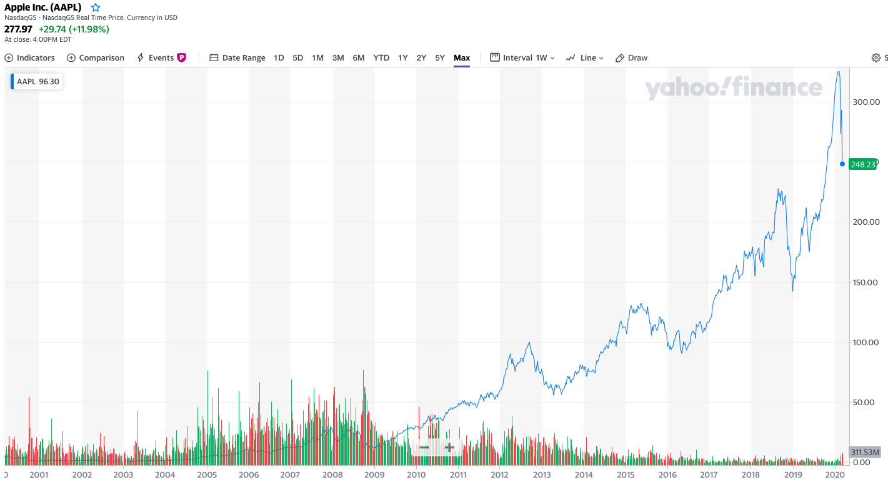
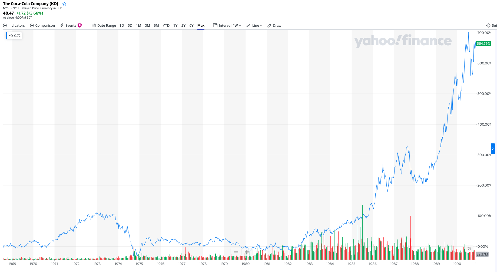

# 变化曲线与投资

人们从开始接触到接受一个新事物心理上会有一个变化过程，约翰·费舍给出一个变化曲线来描述这个过程。大众心理上的这个变化过程也反映在一个新技术发展趋势上，技术成熟度曲线与心理过渡曲线高度相似。这个变化过程在一定程度上解释了新技术发展中的泡沫产生和破灭，也可以从一个新维度上指导我们的投资。

## 心理过渡曲线

临床心理学家约翰·费舍 (John M. Fisher) 基于[变革曲线](https://www.ucd.ie/t4cms/Transition%20Curve%20Cranfield%20Article.pdf) 提出了一个[心理变化曲线](https://peopledevelopmentmagazine.com/2016/10/06/12-emotional-states-change/)。

人们在面对变化时，首先是焦虑，然后很快会进入一个亢奋状态，因为觉得“这一次能改变点什么了！”。 然而紧随其后是很长的充满负面情绪的过程。有些人心比天高，却很快遭遇更大的挫败；有些人会质疑自己的行为，甚至害怕产生抑郁感；有些人互相指责，产生怨恨，这些负面情绪最终有可能导致完全放弃。而与此同时，有另外一部分人会逐步接受现实，开始拥抱这个变化，经过很长时间完全适应。

公众在面对新技术也有一个接受过程，群体的心理变化也会反映在新技术的发展过程中。 

## 高纳德技术成熟度曲线 (Gartner Hyper Curve)

世界知名的 IT 咨询公司高德纳（Gartner），有一个"技术热门度曲线"模型-[Gartner Hype Cycle](https://en.wikipedia.org/wiki/Hype_cycle)。

高德纳技术成熟曲线说明一项新技术从出生到变成一个高峰，再到到低谷，最后开始真正实用化的过程。横坐标是时间，纵坐标是人们对这项技术的期望，也可以说是这个技术在媒体上的曝光度。最开始无人问津，刚有了点苗头之后媒体兴奋大肆宣传，很快曲线到达顶点，关注者极多。没过多久很多人发现实际发展远不及期望便失望而去，这时曲线到达谷底。可这个技术仍然在不断迭代，后来终于实用化，持续产生价值，曲线开始稳步攀升。

技术曲线有[五个阶段](http://www.ruanyifeng.com/blog/2017/03/gartner-hype-cycle.html)

1. 启动期（Innovation Trigger）
该技术刚刚诞生，还只是一个概念，不具有可用性，无法评估商业潜力。媒体有所报道，引起了外界的兴趣。

2. 泡沫期（Peak of Inflated Expectations）
该技术逐步成型，出现了个别成功的案例，一些激进的公司开始跟进。媒体开始大肆报导，伴有各种非理性的渲染，产品的知名度达到高峰。

3. 低谷期（Trough of Disillusionment）
该技术的局限和缺点逐步暴露，对它的兴趣开始减弱。基于它的产品，大部分被市场淘汰或者失败，只有那些找到早期用户的公司艰难地活了下来。媒体对它的报道逐步冷却，前景不明。

4. 爬升期（Slope of Enlightenment）
该技术的优缺点越来越明显，细节逐渐清晰，越来越多的人开始理解它。基于它的第二代和第三代产品出现，更多的企业开始尝试，可复制的成功使用模式出现。媒体重新认识它，业界这一次给予了高度的理性的关注。

5. 高原期（Plateau of Productivity）
经过不断发展，该技术慢慢成为了主流。技术标准得到了清晰定义，使用起来越发方便好用，市场占有率越来越高，进入稳定应用阶段。配合它的工具和最佳实践，经过数代的演进，也变得非常成熟了。业界对它有了公认的一致的评价。

高德纳公司每年都会公布当年的热门技术图，下图是[2019年新兴技术的成熟度曲线](https://blogs.gartner.com/smarterwithgartner/files/2019/08/CTMKT_741609_CTMKT_for_Emerging_Tech_Hype_Cycle_LargerText-1.png)
 

## 互联网的成熟度曲线

互联网的发展就是一个明显的成熟度曲线。和其他许多大趋势一样，在早期至少会经历一次泡沫。互联网在1999年到2000年里出现明显的泡沫，随后迅速破裂，在之后的二十年里，一直在持续增长，一直在创造价值，现在看回去，原先的泡沫顶早已比半山腰还要低。

 
多年以后的大趋势，在最初的时候就是需要大众经历一个心理变化过程，从最初的焦虑到亢奋产生泡沫，然后又失落导致泡沫破裂，最后经历了很多年才开始逐步接受。大多数人亢奋的时候就会产生泡沫，反之当大多数失望沮丧的时候泡沫就会破裂。

有泡沫的地方也意味着机会，如果那个产生泡沫的事物有长期可持续的价值增长，那就是机会，否则可能就真的是泡沫。技术成熟度曲线只是一个模型，实际中随着一个大趋势演进，新的小变化不断出现，过程中还可能产生若干次泡沫。

## 买的早不如买的好

股神巴菲特是选股高手，如果从技术演进曲线的角度去观察，巴菲特买股票多是在第四阶段，也就是爬升期中段。

巴菲特从2016年开始购入苹果股票，到2019年末已经拥有苹果股票的5.7%，其市值占伯克希尔哈撒维公司所持有股票的30%。

苹果在2007年发布首款iPhone，股价显爆发式增长，随后遇到2008年的金融危机，但是之后一直稳步上升，苹果的各种产品也与人们的生活结合的越来越紧密。要知道苹果上市是在1980年，这离巴菲特开始买入苹果的还有36年，iPhone上市后又过了十年巴菲特才开始购入苹果股票。

同样的，巴菲特开始买入可口可乐也是经过了漫长的观察期，他的首次购买是在1988年。上世纪70年代，可口可乐的股票也呈现出一些泡沫的样子，随后又进入稳步增长期，1987年著名的黑色星期一股市暴跌，随后巴菲特才开始买入可口可乐的股票。

巴菲特持有个股异常激进，他掌管的伯克希尔哈撒维公司经常是前三支持仓股占总仓位的50%以上，前十支占到80%以上。伯克希尔哈撒维可是市值5000亿美金的公司，这个持股份量是非常大的。可我们也看到，巴菲特做出买入的决定也异常保守，经常要观察几十年才会做出决定，巴菲特从不去追新趋势，只买成长到“壮年”股票，一旦购买就长期持有。