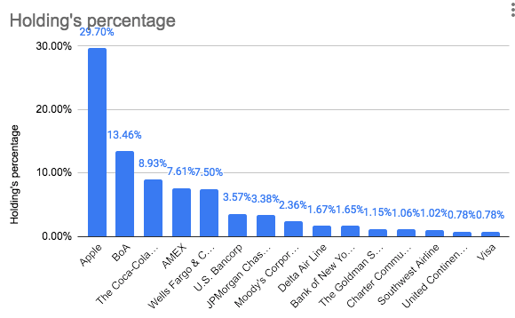
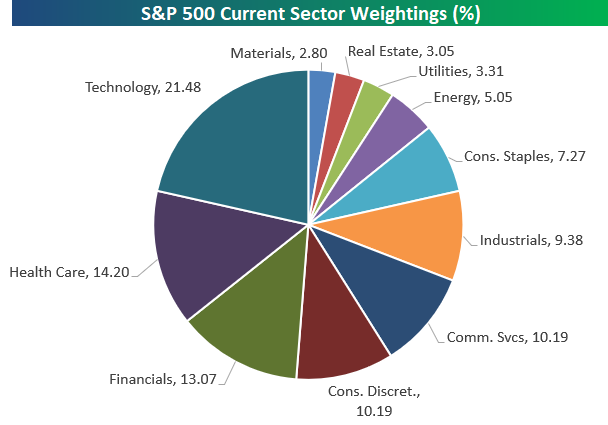
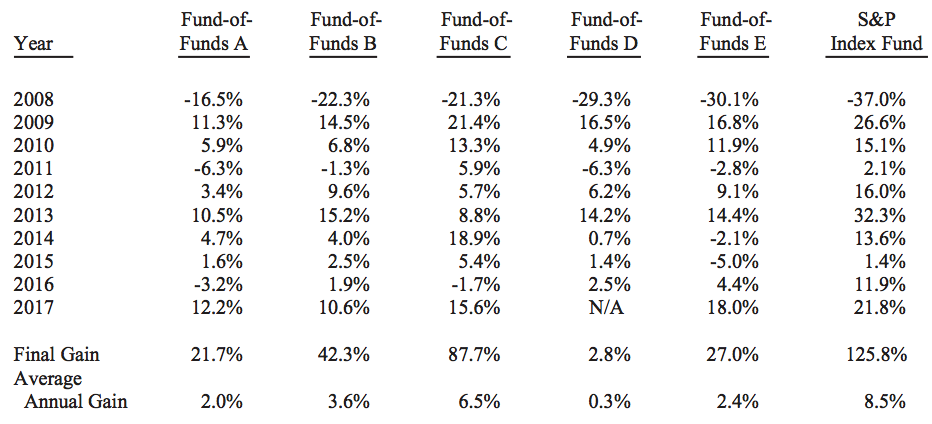

# 股神“言行不一”的背后

巴菲特是投资界一位标志性人物，公认的长期价值投资大师，也被称为奥马哈的先知（Oracle of Omaha）。他从1964年开始担任伯克希尔-哈撒韦（Berkshire Hathway: BRK）公司董事长兼CEO至今，在55年里时间里投资复合年化收益（CAGR）为20.3%，同期S&P的CAGR为10.0%，在55年里跑赢市场10%以上也就巴菲特一人。

巴菲特是投资大师，也乐于分享，几十年里坚持给股东们写信分享自己的投资心得。巴菲特最推荐也是最经常分享给广大投资者的一条建议就是购买低费率的标普（S&P500）指数基金。
 
## 巴菲特与指数基金
 
巴菲特在历年股东大会及致股东的信中，推荐普通投资者购买指数基金已经不下十次了。早在1993年，巴菲特就第一次推荐指数基金称“通过定期投资指数基金，一个什么都不懂的业余投资者竟然往往能够战胜大部分专业投资者。”

2002年，巴菲特推荐宽基指数，而且还指明了Vanguard的低费率指数基金。

> If I were going to put money into an index fund in relatively equal amounts over a 20 or 30-year period, I would pick a fund -- and I know Vanguard has very low costs.

2007年，在接受CNBC电视采访时，巴菲特也强调：对于绝大多数没有时间研究上市公司基本面的中小投资者来说，成本低廉的指数基金是他们投资股市的最佳选择。
 
2013年又表示，家族基金的90%会放入Vanguard的低费率S&P500指数基金中（这里指的应该是NYSEMKT:VOO)，10%放入短期政府债券，并且坚信这种投资组合长期会跑赢大部分投资者。

> My advice to the trustee could not be more simple: Put 10% of the cash in short-term government bonds and 90% in a very low-cost S&P 500 index fund. (I suggest Vanguard's.) I believe the trust's long-term results from this policy will be superior to those attained by most investors – whether pension funds, institutions or individuals – who employ high-fee managers.

2016年的信中表示看到美国经验和股市，并且又推荐普通投资者投资低费率的指数基金

> A low-cost S&P 500 index fund will achieve this goal.

巴菲特也特别强调了低费率，因为一点点费率不同在几十年的时间里往往意味着巨大的差异，这也是复利的威力

> But I would be very careful about the costs involved because all they're doing for you is buying that index. I think that the people who buy those index funds, on average, will get better results than the people that buy funds that have higher costs attached to them because it's just a matter of math.

投资指数基金就是投资一个行业、地区或者国家。S&P500包含了在美国上市市值前500家公司，采用市值加权。S&P500指标直接对标美国经济，其中有大量的跨国企业，所以该指数也可以说是一个世界经济的晴雨表。
 
## 伯克希尔的投资组合
 
巴菲特几十年来不遗余力的给公众推荐低费率的宽基指数基金，然而巴菲特又以自己的行动证明，他自己并没有遵照自己推荐的投资策略，他所说与所做可以说是截然相反。下图是伯克希尔2019年的持仓情况，除去没有说明具体公司名称的其他一档占15%，我们可以看到巴菲特的投资实际上是重仓个股，仅苹果就部投资的30%；前三支股票的持仓就占总持仓的一半；前十大持仓股票，占总持仓的80%。

 
纵观巴菲特近些年来的持仓，虽然个股会有变化，但大体风格都是这样。前三支股票持仓会占到总仓位的一半左右，而前十支股票则会占到80%以上。相比之下，S&P500中占比最大的科技行业总比重也才21.48%。

巴菲特既没有投资自己大力推荐的S&P500指数基金，而且也违背了指数基金的分散化大原则，伯克希尔实际投资高度集中于个股，为什么会这样？巴菲特是个言行不一的人吗？如果是这样，巴菲特怎么可能在长达60年的时间里持续受到市场和投资者的尊重呢？我们有充分的理由相信，巴菲特是在真诚的分享自己的投资心得，我们先来看看一个著名的赌局。

 
## 巴菲特的十年赌局

 
巴菲特在2007年设立了一个著名的[赌局](http://longbets.org/362/)，期限十年，赌注100万美金，赌在十年的里主动选股的对冲对冲基金无法跑赢市场，即S&P500指数。主动管理基金在当时非常流行，他们收取高昂的手续费，拿着各种数学模型，宣称自己可以创造很高的alpha，即相对市场的收益，beta是市场的基准收益，最终的收益为alpha + beta。就好像你在火车上向前走，火车的速度是beta，而你相对火车的速度是alpha，那你的总速度就是alpha + beta。

购买S&P500相当于是锁定beta，而大部分人并不愿意只获得市场基准收益，加之主动管理基金宣称可以获得高alpha，所以当时的投资者对于这种基金趋之若鹜，当时的主动基金如日中天。巴菲特设置这个赌局，实际上赌对冲基金的alpha为负。如果巴菲特赢得赌局，也就是在变相告诉人们去投资被动管理的指数基金。巴菲特不光在信中几十年如一日的分享这个投资心得，而且通过一个赌局来证实自己的所言，用心可谓良苦。 

门徒合伙人（Protege Partners）公司合伙人之一泰德.赛德斯（Ted Seides）最终应赌，他从自己的基金中选了五支基金的基金（Funds of Funds），这五支基金背后有200多支对冲基金。这就相当于挑选了五个基金经理，他们后面又有上百位高薪基金经理，可以说这种组合可以公允的反映对冲基金的整体情况。可是到了2016年年中，因为大势已定，赛德斯就提前公布自己输了。

巴菲特在2017年的信中公布了结果，对冲基金的成绩可谓惨不忍睹，最好的alpha为-2.0%，最差竟然达到了-8.2%。投资指数基金轻松拿到复合年化收益8.5%，可以费很大力气投资的主动管理对冲基金却跑出了相对市场的负收益。
 
十年里基金经理赚的盆满钵满，可以投资者的收益相比购买指数却差了很多。为什么大多数投资者无法跑赢市场呢？回答其实也很简单，这其实是个简单的数学概率问题。

 
## 跑赢市场为什么这么难
 
大部分的回报低于市场平均，这实际上用简单的数学就可以解释。数学家约翰.保罗士在他的书《一个数学家玩转股票市场》（A Mathematician Plays The Stock Market）中举了一道数学题。我们知道新股刚上市的时候，股价波动往往会比较大。现在咱们假设在上市后的第一周内，股价上升50%或者下跌40%，可能性各占一半，这样收益的数学期望是5%。如果我设定一个投资策略，周一买入，周五再卖出，每周能赚5%的话，一年下来利滚利，就是12.6倍——如果投入一万元，那到年底我就会有12.6万元。

然而事情可没有那么简单，这12.6万元是市场的平均收益，但却不是你最有可能拿到的收益。如果你每次都把手里的钱全部投入，到年底你最可能手里还能剩下646，亏掉了93.5%。

这是因为你最有可能面对的就是一半时间下跌40%，一半时间上涨50%，就是平均每两次有一次下跌和上涨，这样每两次的收益是0.9。你的资金乘以0.9的26次方，就是你一年后手里还能剩下的钱。

那么前面说的12.6万元又是那来的呢？这实际上是假设很多投资者按相同的策略操作，其中有一些人比较幸运，遇到更多周期都是上涨的情况，有一些人比较不幸，在很多周期里都是下跌。最幸运的那个人，如果在一年内都是上涨，那他的收入是1.5的52次方，这是14个多亿，而最不幸的那个，最多也只是把手中的钱亏光。最后把所人有的收入一平均，就得到了平均收入12.6万。

市场少数特别幸运的人，会获得巨额的收入，他们强烈的拉高平均值。而特别不幸运的人和中等幸运的人表现其实差不多——最多也就是帐户清零，他们并不会强烈的拉低平均数。这样小数很高收益会拉高平均值，而大多数人的收益会处在平均值之下的。

我们再考虑一个更简单的情况，假设有四个投资者，总共玩了两周。从概率上讲，其中一个人会在两周都遇到增长，那他的1万元就会变成22500。有一个人第一周涨，第二周跌，还会有一个人第一周跌，第二周涨，这两个人是最可能的情况，他们手里还剩下9000元。最后一个人会遇到两周都是下跌，手里只剩下3600元。

| 第一周        | 第二周         | All in  |
|:------------- |:------------- |:----- |
| 50% | 50% | 22500 |
| 50% | -40% | 9000 |
| -40% | 50% | 9000 |
| -40% | -40% | 3600 |

这四位投资者手中剩下的钱一平均是11025元，平均收益是(1+0.05)^2=1.1025，大家平均还赚了10%以上，可实际上这里面大部分人是亏的，只有一个钱赚到的比较多，拉高了平均值。

参与者中75%实际亏损却给人的印象是平均收益为正，根据邓宁格效应（Dunning–Kruger effect），人们又倾向于高估自己的实际水平，大家都觉得自己会是跑赢市场的那一小部分，所以又踊跃参与市场，而实际结果就是大部分人亏损，小数幸运者拉高了平均值给了人们错觉。

范哈弗贝克（Frederik Vanhaverbeke）曾在他在书中《超额回报：向全球顶尖大师学习如何打败大盘》"Excess Returns: A comparative study of the methods of the world’s greatest investors"给出一张著名的图，图中列举了能在十年以上的时间里跑赢市场的投资者。巴菲特在图的最右边，55年里跑赢市场10%上（即alpha大于10%）仅巴菲特一人。图中总共列出不到三十人，可是参与市场的投资者数以亿计，成为幸运儿的概率也就千万分之几，可以说是凤毛麟角。追求成为这样的人，不是不可能，但失败的概率实在是太高了。
 
跑赢市场很难，但拿到市场基准收益却很简单，就是巴菲特推荐的投资指数基金。S&P500中有500只股票，广撒网其中一定会网罗到少数幸运的股票，这些幸运的股票使指数偏高。

巴菲特重仓个股，不光是因为他拥有独到的选股能力，而且非常幸运。巴菲特并没有给广大投资者吹捧他的不可复制成功之路，而是基于深思熟虑推荐指数基金，这是一种非常负责的态度。

值得注意的是，伯克希尔在最近一次季度披露中（2019 Q4 13F Fillings）开始购入少量指数基金SPY（SPDR S&P 500 ETF）和VOO（ Vanguard S&P 500 ETF ），总价值约为2500万美金。

## 总结

巴菲特的“言行不一”背后是有深刻原因的，他推荐给投资者是一条投资大道，市场给你的基准收益已经是高于大多投资者了，而且这是风险最小的投资。

投资中我们强调“独立思考”，但没有足够经历背书的“独立思考”可能会是灾难。与很多技能的学习不同，投资越早犯的错误因为负复利的原因越往后代价就越大，甚至有可能会让你失去进一步投资的资本。但是我们也不能因噎废食，不去投资，所以在积累足够经验之前，最好就是全盘接受巴菲特的建议，安全的去投资被动管理低费率的宽基指数基金，同时多观察积累经验。

定投是最好的实施方式，它不仅能保证了锁定市场基准收益，而且给你以足够的时间去积累经验和成长，这就让你有可能成为具有独立思考能力的投资者，最终有资格去追求高于市场的收益。