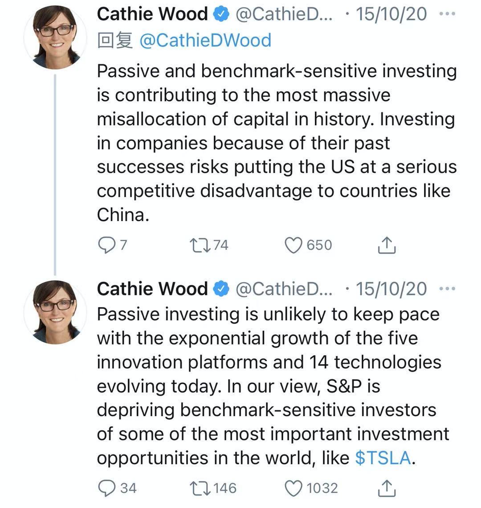

# “巴菲特”们的指数投资之争

（本文不构成投资建议。股市有风险，投资需谨慎，请自行独立思考后做出你的投资决定） 

凯瑟琳·伍德是ARK（方舟）投资公司的创始人和CEO，方舟旗下的基金投资破坏性创新科技公司，自成立以来的高年化回报获得广泛关注。伍德在业界有“科技股女股神”的外号，又被誉为女版“巴菲特”。然而女“巴菲特”与真巴菲特在很多观点截然不同，甚至可以说是尖锐对立，这自然会造成很多疑惑，可也是窥见大佬们思考底层的一个好机会。

巴菲特给普通人最著名的建议就是长期投资被动型S&P500指数基金，近些年来给投资者的来信中都会提到这一点。在巴老的谆谆教导下，投资被动指数基金的观念已经深入人心。2019年的CNBC的一项报道中，近半的美股股票资产投资者被动指数基金上，从十年前的25%增加到现在的45%。 

> Passive management now accounts for 45 percent of all assets for U.S. stock-based funds. That's up from just around 25 percent a decade ago

科技女神女“巴菲特”在投资指数基金上面与老巴菲特可以说是针锋相对。伍德最近连连发推炮轰投资被动指数基金，认为这是一种资金的误配，不光会影响国家层面的竞争力，还会给投资者造成很高的机会成本，会让投资者错过其他高增长的机会，还特别注明比如Tesla。

伍德虽然是在Twitter发表这个观点，但这可不是她的一时兴起随手而发，她在之前的多个访谈中已经反复提及这一点，这次发推有点正式檄文的意思，背后有一份ARK公司正式发布的报告来支撑。这份报告名为“坏主意报告——可能被创新颠覆的行业”

> “Bad Ideas Report" - The instrustries that could be disrupted by innovation. October 14，2020

这份报告中列举了五个有可能在未来几年里被技术创新颠覆的行业：

1. 实体银行分支（Physical Bank Branches）
2. 实体店内零售（Brick and     Mortar Retail）
3. 线性电视（Linear TV）
4. 铁路货运（Freight Rail）
5. 传统运输（Traditional     Transportation）

全球数字化在今年陡然加速的情况下，前面三个行业受冲击非常明显，后面两个行业主要跟电动车和自动驾驶兴起有关，有兴趣的同学可以去ARK网站上下载这份报告。伍德之所以认为投资被动指数基金是个坏主意是因为上面几个行业在指数中的比例很大，投资指数就连带投资了很多未来可能被颠覆的“垃圾”标的。

> 金融和保险业占美国GDP的8%，在S&P500占10%，实体银行受互联网金融的影响已经显现
>
> 接近两万亿的实体零售已经受到了线上销售的强烈冲击
>
> 4420亿的线性电视订阅和广告市场可能很快会被OTT（Over-the-top）取代
>
> 铁路货运在S&P500中占比达12.5%，会面临自动驾驶卡车车队的竞争
>
> 自动驾驶出租车出现后，现有的接近8万亿的规模的汽车相关市场（销售、车险、能源以及出租车）可能会被重新洗牌

站在这份报告的角度得出伍德的结论并不奇怪，如果指数成分里有这么多未来很大可能会被颠覆的标的，那为什么现在还要去投资呢？要么把指数中前景不太好的标的剔除掉让投资更为集中，要么就直接去投资未来的颠覆者了。伍德和ARK的做法主要是后者，投资颠覆性的技术创新（Disruptive Innovation）企业。

巴菲特推荐投资S&P500指数其实有一个预设就是里面的标的“东边不亮西边亮”，“三十年河东三十年河西，风水轮流转”，从而有一个稳定的收益。而伍德认为这是一个革命性技术大变局时代，很多标的根本没有轮动的可能，而是会被扫地出局，投资这些“垃圾”标的就是浪费时间，浪费资金。可是巴菲特一定错了吗？也不见得。颠覆本身就有很大风险，况且预想的颠覆可能要等很多年后才会发生，2000年很多关于互联网的美好设想近几年才真正发生，另外被颠覆者也会依赖已有优势自我演化，最后一点就是指数会淘汰和更新标的。

从一个更长的时间尺度看过去，那些颠覆者们迟早会进入指数，比如伍德最为青睐的Tesla刚刚被加入S&P500。投资指数基金的投资者们会分享未来Telsa的收益，可是Telsa在进入指数钱的疯狂暴涨就与他们无缘，而且在被Tesla挤出指数的标的上的投资算是失败了。一家公司成长到壮年才有可能进入指数，而指数里又不可避免的有一些垂垂老矣的标的，凡事总难两全。指数中“壮年”和“老朽”的比例其实是一个关键。在成长期，中壮年会占比高；在变局时代，新的技术会颠覆很多既有行业，那“老朽”比例就会比较高。我们现在处在一个什么时代呢？这很多年后回头看我们才会比较清楚，但很明显，巴菲特和伍德给出了不同的判断。

巴菲特虽然推荐普通人投资分散化的指数基金，可他掌管的伯克希尔哈撒持仓却高度集中，其第一重仓股苹果的占比是44%，前三重仓股占到60%，前五只股票占到了接近80%。巴菲特一向重仓个股，但他却推荐普通人投资指数基金，这背后应该有一个更深层次的考虑。因为巴菲特先知一般地位，他的言行影响实在太广了，投资指数基金对普通人来说确实是最稳健的一种投资，代价就是收益上的损失。而伍德是挑战者，她的粉丝多是一些投资发烧友，所以她自然倾向于一些颠覆性的观点，因为追随她的粉丝人数毕竟还是少数，不会造成资金流向根本性的变化，她也很可能是对的。 

分析完两位大佬的观点，个人认为两位大佬都没有错，他们的建议适用不同投资者和不同的投资时期。如果你是一个风险厌恶者，平日也没有时间去关注太多前沿技术，那还是投资类似S&P500被动宽基指数；如果你能承担一定的风险，又对技术趋势有自己的理解，那不妨多听听伍德的建议和了解一下ARK旗下的基金，不一定非要买ARK基金，但伍德的观点很有启发性，会助益你构建自己的投资组合。