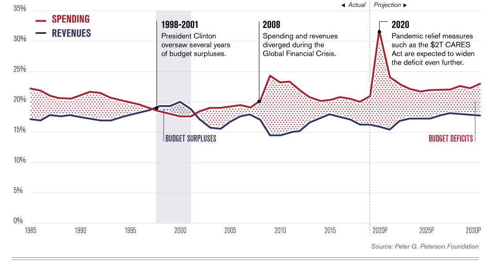
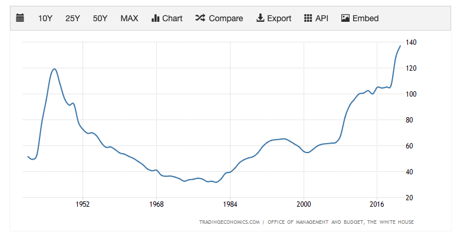
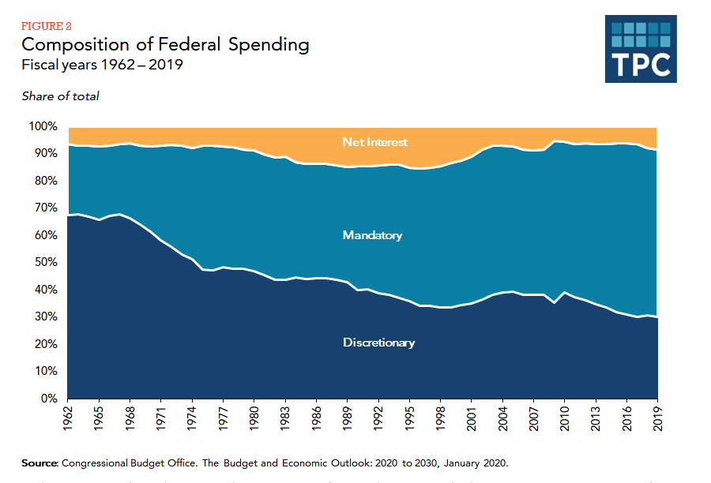
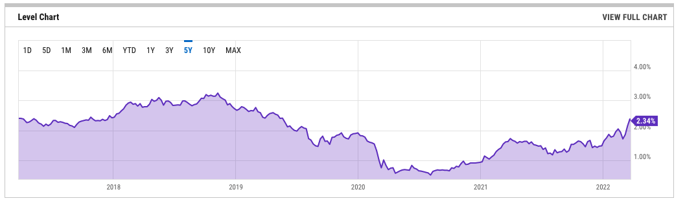

# 关于美国国债

美国国债是一个当代经济生活中非常重要的话题，对此我总是有些似是而非的理解。这篇文章是通过写作和总结的方式解答自己的疑惑。

## 为什么会有国债

政府和个人一样，有收入有花销，花销超过收入就会产生负债。那么美国政府的收入来源都有哪些呢？美国实行联邦、州、地方政府三级分税财政体系，不同级的政府有不同的税源。 联邦政府以个人所得税和社会保险税为主要收入来源，州政府以个人所得税以及销售和总收入税为主要收入来源，地方政府以房产税为主要收入来源。需要说明的是美国国债指的是联邦政府的负债，以下简称美债。

联邦政府的税收收入超过一半来自于个人所得税（Individual income tax），大概30%左右来自于社会福利税（Social Security Tax），5%-9%来自于公司税（Corporate income tax）。2021财年，联邦政府的收入达到了4.05万亿，美国的GDP为22.39万亿，联邦政府的收入占到了GDP的18%。可是同期联邦政府的花销达到了6.82万亿，产生2万多亿的财政赤字，这么大个窟窿就要靠借债来补了。政府又总是倾向于多花，花的多提升福利让选民开心，政府有钱可以显得大有作为，何乐而不为呢？从历史上看，90%以上的时间里联邦政府总是产生赤字而不是盈余，而且赤字的幅度又比盈余大的多。下图联邦政府的收入开销占GDP的百分比[^1]

政府总是花的比挣得多，结果也就显而易见了，那就债务越滚越多。下图是美债占GDP的比率[^2], 2021年已经达到了137%，超过了二战时的债务水平，债务总额达到了惊人的30万亿美元（同期美国的GDP为26万亿）。

你可能又要问，美国政府借这么多钱花那去了呢？美国政府花钱的地方可多了。我们看下面这张图[^2]，60%以上花在医疗、福利和各种补助上面，将近10%要去还以前的债务利息，也就是大约70%是必需性支出。剩下的30%由国会审批后政府的自主花销，这里面大部分又给了国防、教育和交通等大项上。

美国联邦政府以福利为主的必需开支占比逐年增大，已经成为负债不断增加的最主要原因。为什么现在美国会有这么多国债？原因其实也很简单，给国内人民的福利太多了呗。

## 美国国债的债主

想借钱最重要的是找到债主。美国借了这么多钱，那债主都有谁呢？最大的有两头，第一是外国政府，第二是美联储。外国政府大量购入美债的最直接原因是美元的世界结算货币地位。想和别的国家做生意就得用美元结算，那手里总得有点美元储备吧。为了应对国内的政治和经济波动，还的多储备一些以应对不时之需。手里拿着美元没有利息，投资其它的标的风险和流动性都是问题，找来找去，就找到了美债。美债有美国政府保底，流动性也好，还有利息。虽然利息很低，可因为基数大，利息收入也是很大的一笔钱，再加上其安全性和流动性，美债成为不二选择。外国政府2021年九月的持有数达到了7.55万亿[^4]，为总债务的四分之一。日本和中国是前两大债主，各持有超过一万亿的美债。

美联储是美元的印钞机，发钱就像大风刮来一样，在自己的账户里填个数字就行了。美联储虽然表面上说是独立的，可其实也是和政府穿一条裤子，而且很多花钱的决定是国会的决议，美联储能不管吗？债主不够，美联储来凑就是了。美联储通过一系列操作，比如量化宽松（Quantitative Easing ）不断在账户上加数字买入美债。2021年的第四季度美联储持有的美债达到了6万亿[^5]。外国政府和美联储加起来就持有了将近一半的美债。

因为美债的安全性和流动性，美国各州和地方政府，各种退休共同基金，也大量配置美债，截止2021年9月分别持有5.4万亿和3.4万亿的美债。剩余的美债被其他基金和机构持有。

## 美国国债收益率

美国国债因为其安全性和流动性，被视为最安全的投资标的，其收益水平一直是市场上其他标的收益率的基准，其中十年期国债收益率（10 Year Treasure Rate）又是其中最重要的基准。遵循高风险高收益的原则，其他标的会比照国债风险的高低提升收率率以吸引投资者。

如果买入国债的投资者减少，国债价格下跌，收益率就会上升。比如票面100元，现在按98元卖出，相当于收益率提高了2%，这就是债券收益率上升。债券收益率上升意味着市场资金收紧，市场上流通的钱的总量变少。 一种可能性是其他投资标的抽走了资金，比如股市高涨。2018年到2019年的利率上升就是由于美股上涨推动的。也有可能是市场上的钱都变少了，比如遇到了加息。2022年3月的利率上升主要是由于加息。

当大量的资金买入美债，债券价格就会上涨，收益率下降，通常意味着资金倾向于避险。在过去五年里[^6]，十年期国债收益率在2020年3月到6月之间达到最低，期间正是Covid-19在美国造成恐慌的时间段，股市多次熔断，资金大量买入美债避险。

## 总结

近几十年来，美国国债不断攀升主要原因是美国政府对国内的大撒币提高福利造成的。美国总统是选民选出来的，提高福利后选民开心，总统连任和同一党派继续执政的概率就更高。美国选民中不同族裔大量增加，原来清教徒的节俭和投资理念的影响力也越来越弱，所以不断提升福利讨选民开心几乎成为政府的必然选择。也就是说，在可以预见到的将来，美国国债必然继续攀升，有可能速度还会加快。

美国能如此借钱大撒币，但还没有造成不可控的通胀，主要是因为美元国际结算货币的地位。其他国家愿意甚至可以说不得不借钱给美国花。可我们也看到美联储持有的美债也在不断增加，凭空印出来的这些钱会造成美元贬值，贬值会损害美元国际结算货币的地位，进而使美债的吸引力变弱，最后就只能靠美联储不断印钱来支撑美债了，结果就是进入一个恶性循环。最坏的结果是美元的国际结算货币地位被其他货币所取代，美债崩盘，但这只是长期后的一个可能的结果。

美债尤其是十年期国债是市场收利率的最重要基准，收利率上升意味着市场对美债的需求减少，要么资金涌入其他标的，要么就是市场上的资金总量减少。收益率下降则意味着大量资金买入美债避险，一般是其他投资标的的波动造成的。

[^1]: https://www.visualcapitalist.com/americas-debt-27-trillion-and-counting/
[^2]: https://tradingeconomics.com/united-states/government-debt-to-gdp
[^3]: https://www.taxpolicycenter.org/briefing-book/how-does-federal-government-spend-its-money
[^4]: https://www.thebalance.com/who-owns-the-u-s-national-debt-3306124
[^5]: https://fred.stlouisfed.org/series/FDHBFRBN
[^6]: https://ycharts.com/indicators/10_year_treasury_rate

