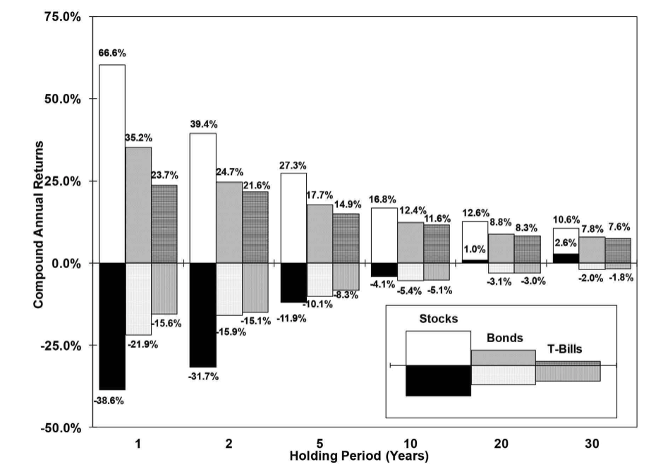

# 关于风险的一点思考

很多人眼中的风险就是资产的波动大小。现金没有波动，无风险；货币基金波动很少，低风险；股票基金波动有点大，高风险。金融科班中还有一个衡量单位波动下能获得的收益多少的指标，就是夏普比率（Sharp Ratio）。资产的波动影响夏普比率的分母，而收益率影响比率的分子。夏普指数越高，表明每单位风险的报酬越高。在夏普比率里，资产的波动就是风险度量。在各种理性和感性因素的作用之下，很多人的潜意识里风险和波动就划上了等号，波动大风险大，波动小风险小。

投资中的风险其实就是最终亏损的可能性。价格的波动和最终是否亏损肯定不是一回事，但也不能说完全没有关系。价格波动过大会给投资者心理带来很大的压力，往往会导致在不恰当的时机买入卖出，造成实际亏损。另一方面，价格波动也可能因为个人投资者占比过大或者公司的经营情况不稳定的反映。可以说波动是造成亏损的一个可能的原因，那它是风险的全部吗？肯定不是，因为投资收益还跟投资的时长有关。

我们就拿目前普通人严重的高风险投资物比特币来说，2017年年底将近两万美元，2020年3月跌倒了5000美元，现在又稳定在四万美元的水平，这个波动算够大了吧。如果我的钱只能投资两三年，在2017年的高点买入也就意味着极大的风险，最差会缩水四分之三。可是如果我能投资五年呢？那收益率就是两倍了。有一点我们可能肯定，最终收益率是和所能投资时长密切相关的。

沃顿商学院西格尔教授（Jeremy Siegel）在著作《股市长线法宝》展示一种不同标的在不同投资年限下的波动情况。持有时间越短波动越大，持有时间越长波动就越小。更为重要的是，对于多元化的股指类资产，持有时长达到20年以上基本上相当于无风险。

 

投资中的风险与波动和时长相关，而从一个宏观尺度上看，时长又决定了波动，那是不是说时长决定了风险呢？是，也不全是。投资的时长确实和风险密切相关，但这是有前提条件的，你需要持有一个长期看大概率会上涨的标的，你相信长期持有会减少风险，你要在短期的波动中识别出那些是真正的风险，而那些只是噪声，发现真正的风险后及时止损。而这一切的背后都指向一个核心，就是你的思考和认知能力。

我非常认可巴菲特说的这句话：“减小风险的最好办法是深入思考”。

> *“The best way to minimize risk is to think” Warren Buffett*

巴菲特投资的股票都是他长期观察、深入思考后决定的。而且买入之前就做好了长期持有的准备，大部分标的都会持有很长时间。虽然这样，巴菲特的手中一直保有大量的现金，给自己留好足够的安全边际。

风险和价格的波动相关，投资的时长在很大程度上决定了风险的大小。这一切的背后有一个核心点就是你的思考能力，因为思考能力会决定你的投资时长，会让你的短期波动钱镇定自若，思考能力才是真正的风险。

