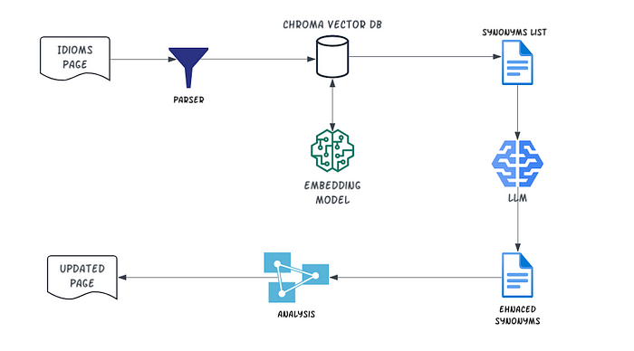

# [A RAG Application to Find Synonyms](https://medium.com/@yuxiaojian/a-rag-application-to-find-synonyms-005e3afae6f8)


<p align="center">
  
</p>

GPT (Generative Pre-trained Transformer) is revolutionizing the world and transforming the way we learn English. I wish I had a “GPT” coach back in middle school when I first started learning English. It’s always available, highly skilled, and almost cost-free.

I was impressed by a project from  [XIAOLAI](https://medium.com/u/5e691a39ecba?source=post_page-----005e3afae6f8--------------------------------), the  [most-common-american-idioms](https://github.com/xiaolai/most-common-american-idioms)  book, which involved creating a book on the most common American idioms, primarily using the OpenAI API. While I enjoyed the learning experience, I felt it would be even more beneficial to have synonyms listed alongside the idioms. As I learned more idioms, I found myself craving this feature. Why not consolidate similar idioms together?

The best editor for a GPT-generated book is probably GPT itself. So, I decided to take on this challenge. After some attempts, I achieved a sound result using the popular Retrieval-Augmented Generation (RAG) architecture. The synonyms found through this approach are incredibly helpful, making the book much more enjoyable to use.

I achieved this in two steps:

1.  Create a vector DB to find the initial synonyms. This serves as the retriever
2.  Send the Initial Synonyms to GPT for Refinement and Enhancement. This constitutes the augmented generation part.

Of course, there are parsers to extract information from the book’s HTML and update it with synonyms. I won’t go into detail here, but you can find the code in the repository:  [most-common-american-idioms-with-synonyms](https://github.com/yuxiaojian/most-common-american-idioms-with-synonyms)

# Using the Vector Database

In natural language processing (NLP), words and sentences are transformed into high-dimensional vectors, also known as embeddings. A vector database stores and manages these vectors along with correlated unstructured information like text and metadata.

Similar words and sentences are close to each other in the “vector space” based on mathematical distance metrics. When we query the vector database with a sentence, it is first converted into a vector (embedding). The database then searches the vector space, finds the closest vectors, and returns the correlated data.

In theory, a vector database is a perfect tool for finding synonyms. In practice, a few tweaks are needed for better results. Instead of using the idioms directly and the default embedding model to generate the vectors, I found it more effective to use the idioms’ interpretations and example sentences, along with a large embedding model.

Take the idiom “Pull your chain” as an example. Initially, I created a vector database using only the idioms:
```
documents= ['9-to-5',  
 ...,  
'Pull up stakes',  
...  
'Zip it'  
]  
...  
idiomsonly_collection_instructor.upsert(documents=documents, metadatas=metadata, ids=idiom_ids)  
...
```
When querying “Pull your chain” from the database, I got these synonyms. ‘Pull strings’ seemed similar, but not ‘Pull yourself together’, ‘Pull rank’, or ‘Pull up stakes’.
```
query='pull your chain'  
result = idiomsonly_collection_instructor.query(query_texts=[query], n_results=5, include=["documents", 'metadatas','distances',])  
result  
...  
{...  
 'metadatas': [[{'id': '952', 'phrase': 'Pull your chain'},  
   {'id': '948', 'phrase': 'Pull strings'},  
   {'id': '953', 'phrase': 'Pull yourself together'},  
   {'id': '946', 'phrase': 'Pull rank'},  
   {'id': '951', 'phrase': 'Pull up stakes'}]],  
...  
}
```

Next, I created a new vector with the idiom’s interpretation and examples. Since there are more words, I used a large embedding model “hkunlp/instructor-large” with 768 vectors by default for each sentence.
```
import chromadb.utils.embedding_functions as embedding_functions  
instructor_ef = embedding_functions.InstructorEmbeddingFunction(model_name="hkunlp/instructor-large", device="cpu")  
```
The document now includes the idiom, its interpretation, and examples, like this:
```
documents = [...,  
"Pull your chain. This phrase originates from early locomotives, where chains were used to operate brake systems and workers would sometimes tease each other by manipulating these chains. Nowadays, it is used to describe someone making a joke or teasing someone. For examples. Don’t take him seriously; he’s just pulling your chain. They were just pulling your chain about the surprise party. I can’t believe you fell for that! He was just pulling your chain.",  
...  
] 
```

I also used the same document in the query. The results were much better this time. ‘Pull someone’s leg’ is interchangeable with “pull your chain”. “Pull strings” and “string someone along” are similar in certain contexts.
```
query='Pull your chain. This phrase originates from early locomotives, where chains were used to operate brake systems and workers would sometimes tease each other by manipulating these chains. Nowadays, it is used to describe someone making a joke or teasing someone. For examples. Don’t take him seriously; he’s just pulling your chain. They were just pulling your chain about the surprise party. I can’t believe you fell for that! He was just pulling your chain.'  
result = idioms_collection_instructor.query(query_texts=[query], n_results=5, include=["documents", 'metadatas','distances',])  
result  
  
{...,  
 'metadatas': [[{'id': '952', 'phrase': 'Pull your chain'},  
   {'id': '947', 'phrase': 'Pull someone’s leg'},  
   {'id': '956', 'phrase': 'Pulling my leg'},  
   {'id': '948', 'phrase': 'Pull strings'},  
   {'id': '1090', 'phrase': 'String someone along'}]],  
  ...   
}
```
With the vector database set up, the next step was to leverage the powerful GPT to refine and enhance the results.

# Refining and Enhancing Results with GPT

Using the vector database mentioned above, I retrieved two levels of synonyms. For ‘Pull your chain’, I first got the synonyms from the database, then used these synonyms to query again and get more synonyms. The result for “Pull your chain” looked like this:
```
{  
 "Pull your chain" : ['String someone along',  
 'Pull someone’s leg',  
 'Pulling my leg',  
 'Top dog',  
 'Pull the wool over your eyes',  
 'Play second fiddle',  
 'Twist someone’s arm',  
 'Pull strings',  
 'Break a leg',  
 'Pull your chain',  
 'Talk through one’s hat',  
 'Tongue-in-cheek',  
 'See through someone/something',  
 'Blowing smoke',  
 'Pull it off',  
 'Pull his/her own weight',  
 'Pulled the rug out from under me',  
 'Joshing me',  
 'Shake a leg',  
 'Pull rank',  
 'Chew someone out',  
 'To be tied up with something or someone']  
}
```
I then fed GPT (‘gpt-4o-mini’ in this case) with all these synonyms and asked it to refine the results and add more appropriate synonyms. Here is my prompt:
```
PROMPT_TEMPLATE="""\  
Analyze the phrases and synonyms, and return the top 3 to 6 synonyms most similar to '{phrase}' in meanings from \n '{phrase_synonyms}' \n   
Then, you can add 1 to 3 extra synonyms that are more similar. Organise the list from most similar to least similar.  
Provide a $JSON_BLOB, as shown between three backticks:  
\```   
{{"synonyms":["synonyms-1",...,"synonyms-n"]}}  
\```   
Begin! Reminder to ALWAYS respond with a valid json blob. \  
"""
```

The final result for “pull your chain” is
```
"Pull your chain": [  
        "Pull someone’s leg",  
        "Joshing me",  
        "String someone along",  
        "Blowing smoke",  
        "Talk through one’s hat",  
        "Tongue-in-cheek",  
        "Tease",  
        "Make fun of"  
    ]
```
GPT picked up “Joshing me”, “Blowing smoke”, “Talk through one’s hat”, and “Tongue-in-cheek” from the list. It also added “tease” and “make fun of” to the list. The final result looks great.

# Putting It All Together

This is the structure of this RAG application. The Chroma Vector DB and embedding model form the core of the retriever. We obtain two levels of synonyms from the retriever and then feed them to GPT for augmented generation.

<p align="center">
  
</p>

You can find all the code in the GitHub repository  [most-common-american-idioms-with-synonyms](https://github.com/yuxiaojian/most-common-american-idioms-with-synonyms). Enjoy your learning!