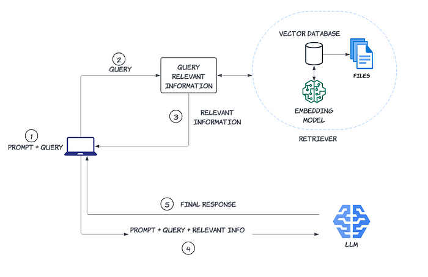
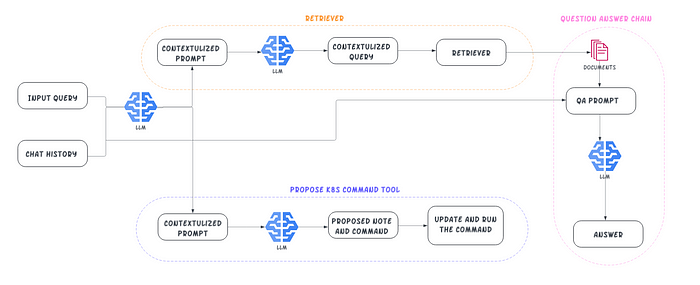

# [A RAG-based CKS AI Agent](https://medium.com/@yuxiaojian/a-rag-based-cks-ai-agent-b36a377b3457)
I recently passed the  [Certified Kubernetes Security Specialist (CKS)](https://www.cncf.io/training/certification/cks/)  certification test. *Hooray!*.  [Kim Wuestkamp](https://medium.com/u/7ad6cde74bf7?source=post_page-----b36a377b3457--------------------------------)’s  [cks-course](https://github.com/killer-sh/cks-course-environment)  is great. It’s the primary material I used to get ready for the test. You can find many excellent repositories sharing test experiences by searching “CKS tips” on GitHub. Here are three additional tips I have to offer:

1.  **Search for Coupons Before Purchasing the Test**: The test is not cheap, but a coupon can save you a lot $$.
2.  **Updated Certification Requirements**: Previously, the CKS required a non-expiring  [CKA](https://www.cncf.io/training/certification/cka/)  certification. Now, you can take the CKS as long as you have passed the CKA. I earned my CKA certification back in 2019 (which expired in 2022), and I was able to take the CKS last month.
3.  **Incorporate AI in Your Study**: It’s probably time to use some AI elements in your study. Stay tuned; I’ll introduce the CKS AI Agent soon.

# What is RAG?

Retrieval-Augmented Generation (RAG) is an approach designed to enhance the output of a large language model (LLM) like the Generative Pre-trained Transformer (GPT). While GPT is a powerful brain 🧠 capable of reasoning about a wide range of topics, its knowledge is limited to the public data available up to the point in time it was trained. If you use GPT to answer queries related to the latest information or your private data, it’s akin to asking an expert without providing the necessary context. To ensure GPT responds with more accurate answers, there are two ways to improve:

1.  Fine-tuning the Model: This involves feeding the model with your data and retraining it. While this can yield more tailored results, it is time-consuming and costly. Additionally, it exposes your private data to the public model, which is a big deal in security.
2.  RAG: RAG retrieves relevant data and provides GPT with the necessary context. Given the limited context window, a vector database is used to find the most pertinent information.

The agent enhances GPT’s capabilities by supplying more context through the vector database, resulting in more accurate and relevant answers.

<p align="center">
  
</p>

# What is an AI Agent?

An artificial intelligence (AI) agent is a system capable of autonomously performing tasks to meet predetermined goals. Unlike a simple Q&A bot backed by a large language model (LLM), an AI agent is a more sophisticated system. If you consider the LLM as the “brain,” then an AI agent is a system that equips this brain with various tools. This enables the system not only to “think” but also to perform actions and interact with other systems.

# Putting It Together for CKS

For the CKS AI Agent, I selected the cutting-edge GPT-4o as the agent’s brain. The CKS test allows candidates to check documents from CKS-approved resources. Although the cut-off date for GPT-4o’s training data is April 2024, there are still updates beyond that date. Additionally, GPT-4o may not be specialized enough in CKS-specific areas. We can enhance its performance by providing more relevant context to generate more accurate answers.

For the CKS AI Agent, I selected the cutting-edge GPT-4o as the agent’s brain. The CKS test allows candidates to check documents from  [CKS-allowed resources](https://docs.linuxfoundation.org/tc-docs/certification/certification-resources-allowed#certified-kubernetes-security-specialist-cks). Although the cut-off date for GPT-4o’s training data is April 2024, there are still updates beyond that date. Additionally, GPT-4o may not be specialized enough in CKS-specific areas. We can enhance its performance by providing more relevant context to generate more accurate answers.

Candidates need to practice extensively and be very hands-on before sitting in front of the CKS certification test. Mastery of various  _kubectl_  commands is essential to pass the test. The AI agent is equipped with a tool that proposes  _kubectl_  commands when necessary. You can review these commands and run them in your terminal, providing practical, hands-on experience.

The GPT-4o brain is critical in deciding which tool to use. It generates queries for the vector database, proposes  _kubectl_  commands, and formulates the final answers.

The GPT brain is critical. It decides which tool to use and generates the query to the vector database, the  _kubectl_  command and the final answer. While the entire process may seem complex, the  [LangChain](https://www.langchain.com/)  framework simplifies it significantly. LangChain helps in managing the interactions between the various components, making the system more efficient and user-friendly.

<p align="center">
  
</p>

# Create the Vector Database

The vector database is created offline by downloading web content from  [CKS-allowed resources](https://docs.linuxfoundation.org/tc-docs/certification/certification-resources-allowed#certified-kubernetes-security-specialist-cks)  available on GitHub. Most of these files are in markdown format.

Using a script called “ingest-batch.py” in the  [cksAI](https://github.com/yuxiaojian/cksAI)  repository, the text is loaded and split into smaller chunks with overlaps to ensure context is maintained.
```
...  
text_splitter = RecursiveCharacterTextSplitter(chunk_size=1000, chunk_overlap=200)  
...

I use Chroma as the vector database. The data is ingested incrementally in smaller batches. This process took approximately 5 to 6 hours on my laptop. To monitor the progress, I added a progress bar.

for batch in tqdm(batches, desc="Processing batches"):  
            db = Chroma.from_documents(  
                batch,   
                embeddings,  
                persist_directory=PERSIST_DIRECTORY,  
                client_settings=CHROMA_SETTINGS,  
            )
```
The text chunks need to be transformed into vectors. For this, I use the embedding model “hkunlp/instructor-large,” which converts each chunk of text into a 768-dimensional vector by default. The vector data is stored persistently as files. Once the data is ingested, it can be loaded and used as needed.

# Orchestrate the Tools

I use LangChain to define the orchestrate the tools. The retriever tool is to query my vector database for relevant information from the  [CKS-allowed resources](https://docs.linuxfoundation.org/tc-docs/certification/certification-resources-allowed#certified-kubernetes-security-specialist-cks).

To orchestrate the various tools, I use LangChain. This framework helps in defining and managing the interactions between different components of the system. There are two tools:

1. **Retriever Tool**: This tool is designed to query the vector database for relevant information from CKS-approved resources. By leveraging the retriever tool, the system can efficiently fetch the most relevant data to enhance the AI agent’s responses.
```
retriever_tool = create_retriever_tool(  
        retriever,  
        "cks_allowed_docs_search",  
        "Search for information from allowed documentation in CKS test, including K8s, falco, trivy, etcd and apparmor.",  
    )
```
2. **The ProposeK8sCommand Tool**. This tool suggests appropriate  _kubectl_  commands based on the given context.
```
ProposeK8sCommandTool = StructuredTool.from_function(  
        func=k8s_command_run,  
        name="ProposeK8sCommand",  
  
        description = "ONLY Propose a kubectl command in the terminal. \  
            The user can either directly execute the command or modify and then run the command.\  
            execute the command directly. They will be able to edit it before executing.\  
            The command should be properly formatted and can include placeholders for the user to fill in. \  
            if it answer's the user's question or solves their errors. If the user's question is more general, you should use the `k8s_search` \  
            tool instead or answer the question directly.",  
        args_schema=ProposeK8sCommandSchema,  
        return_direct=True,  
        # coroutine= ... <- you can specify an async method if desired as well  
    )
```
It is essential to write clear and specific descriptions, as these provide the necessary context for the GPT brain to determine when and how to use this tool effectively.

After setting up the vector database, the next step is to create the AI agent and integrate the necessary tools. The “prompt_custom” is tailored from the “hwchase17/structured-chat-agent” to ensure it aligns closely with the CKS context.
```
agent = create_structured_chat_agent(llm, tools, prompt_custom)
```

# Run the Agent

To run the agent, you will need an OpenAI API key. Once the agent is started, it will prompt you for input.

-   Example Use Case: Scanning Pod Images

If you want to scan pod images and delete any that are vulnerable, you may need to list the pod names and their associated images. To find a suitable command, simply type: “list pod name and image in all namespaces”.

Upon entering this request, the agent will send a query to the OpenAI API. In response, it will utilize the “ProposeK8sCommand” tool to generate the appropriate  _kubectl_  command. The agent will display the proposed command in the terminal for your review. You can then assess the command and execute it as needed.
```
2024-08-07 10:07:07,565 - INFO - _client.py:1026 - HTTP Request: POST https://api.openai.com/v1/chat/completions "HTTP/1.1 200 OK"  
  🔨 Calling Tool: `ProposeK8sCommand` with input `{'notes': 'List pod names and their images in all namespaces', 'query': 'kubectl get pods --all-namespaces -o jsonpath=\'{range                                                          
  .items[*]}{.metadata.name}{"\\t"}{.spec.containers[*].image}{"\\n"}{end}\''}`                                                                                                                                                             
---  
Thought: I need to propose a kubectl command that lists the pod names and their images in all namespaces.  
  
Action:  
"""  
{  
  "action": "ProposeK8sCommand",  
  "action_input": {  
    "notes": "List pod names and their images in all namespaces",  
    "query": "kubectl get pods --all-namespaces -o jsonpath='{range .items[*]}{.metadata.name}{\"\\t\"}{.spec.containers[*].image}{\"\\n\"}{end}'"  
  }  
}  
"""
```

-   Example Use Case: Ask a Question

If you type “What is a runtime class?”, the agent will follow a structured process to provide you with an accurate answer.

Upon receiving your query, the agent gets an instruction from the GPT to use the `cks_allowed_docs_search` tool, which is the vector database retriever.  
The retriever tool queries the vector database for relevant information from CKS-approved resources.

The context retrieved from the vector database, along with your original question, is sent back to the GPT. The GPT then processes this information to generate a final, comprehensive answer.
```
2024-08-07 10:37:51,694 - INFO - _client.py:1026 - HTTP Request: POST https://api.openai.com/v1/chat/completions "HTTP/1.1 200 OK"  
  🔨 Calling Tool: `cks_allowed_docs_search` with input `{'query': 'runtime class in Kubernetes'}`                                                                                                                         
---  
{  
  "action": "cks_allowed_docs_search",  
  "action_input": {  
    "query": "runtime class in Kubernetes"  
  }  
}How do users know which runtimes are available, and select the runtime for their workloads?  
  
How do we ensure pods are scheduled to the nodes that support the desired runtime?  
  
Which runtimes support which features, and how can we surface incompatibilities to the user?  
  
How do we account for the varying resource overheads of the runtimes?  
  
RuntimeClass aims to solve these issues.  
  
RuntimeClass in Kubernetes 1.12  
  
RuntimeClass was recently introduced as an alpha feature in Kubernetes 1.12. The initial implementation focuses on providing a runtime selection API, and paves the way to address the other open problems.  
  
To learn about the Kubernetes API in general, visit:  
  
Kubernetes API overview  
  
To learn about objects in Kubernetes in more depth, read other pages in this section:2024-08-07 10:37:54,046 - INFO - _client.py:1026 - HTTP Request: POST https://api.openai.com/v1/chat/completions "HTTP/1.1 200 OK"  
Action:  
"""
{  
  "action": "Final Answer",  
  "action_input": "RuntimeClass in Kubernetes is a feature that allows you to select different container runtimes for your pods. It was introduced as an alpha feature in Kubernetes 1.12. The RuntimeClass API provides a way to specify which runtime to use for a particular pod, helping to address issues such as runtime availability, scheduling pods to nodes that support the desired runtime, and managing resource overheads of different runtimes."  
}  
"""
  
> Finished chain.  
cksagent:  
 ``` 
RuntimeClass in Kubernetes is a feature that allows you to select different container runtimes for your pods. It was introduced as an alpha feature in Kubernetes 1.12. The RuntimeClass API provides a way to specify     
which runtime to use for a particular pod, helping to address issues such as runtime availability, scheduling pods to nodes that support the desired runtime, and managing resource overheads of different runtimes.

The agent is designed to be aware of the chat context, allowing it to provide relevant and specific responses based on the ongoing conversation.

If you type “Show me a sample”, the agent will understand the context and return with a YAML snippet demonstrating how to specify a runtime class in a pod.
```
 apiVersion: v1                                                                                                                                                                                                            
 kind: Pod                                                                                                                                                                                                                 
 metadata:                                                                                                                                                                                                                 
   name: my-pod                                                                                                                                                                                                            
 spec:                                                                                                                                                                                                                     
   runtimeClassName: my-runtime-class                                                                                                                                                                                      
   containers:                                                                                                                                                                                                             
   - name: my-container                                                                                                                                                                                                    
     image: my-image 
```
Creating the vector database and orchestrating the tools are the two key components of the agent. You can find the code in the repository  [cksAI](https://github.com/yuxiaojian/cksAI)  and try it out on your laptop.

Disclaimer: I did not have this tool when I was preparing for the CKS test. The idea came to me after I passed the exam, and I decided to create this prototype.

# Final Thought

It has been an enjoyable experience to integrate AI with Kubernetes, and through this project, I have come to appreciate the power of AI even more.

By experimenting with this prototype, you can see firsthand how AI can enhance Kubernetes management and potentially inspire further innovations in this space.