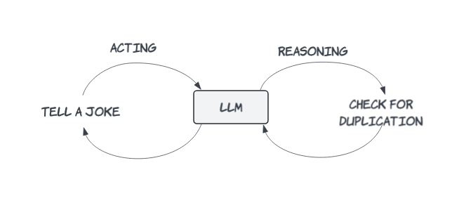

# [A ReAct Gen AI Joke Agent — Background and Design](https://medium.com/@yuxiaojian/a-react-gen-ai-joke-agent-background-and-design-b46618ba8c5c)

Kids love jokes. When we first bought a Chromecast, the most common request was, “Tell me a joke.” However, the Chromecast’s limited joke pool quickly became repetitive. With advancements in Large Language Models (LLMs), things have improved significantly. With just over a hundred lines of code, you can implement an “[OpenAI Voice & Chat Bot](https://medium.com/@yuxiaojian/an-openai-voice-chat-bot-b4cbe553f3ca)” or “[Build a Voice & Chat bot with Llama](https://medium.com/@yuxiaojian/build-a-voice-chat-bot-with-llama-aa0abf8437f5)”. However, there are still a few areas for improvement:

1. Lack of Persistent Memory: The bot tends to start over from the beginning each time it restarts, as it doesn’t have persistent memory.  
2. Recycling Jokes: The bot occasionally recycles jokes, even when asked for a new one. For instance, after telling five jokes, it might repeat the first joke when asked for a sixth.

To address these issues, I have been exploring various tech stacks. The ReAct architecture, LangGraph, and Streamlit seem to be a perfect fit.

# Why ReAct?

[React](https://react-lm.github.io/)  stands for Reasoning and Acting. It integrates reasoning and action into a cohesive and iterative process. Through this iteration, the ReAct agent can adapt to new information and handle complex tasks. A key problem to solve with ReAct is avoiding duplicated jokes. The reasoning part checks if a joke is a duplication, and the acting part generates a new joke. This process iterates until a genuinely new joke is produced.

  

# LangGraph Agent

AI agents are  [Compound AI Systems](https://bair.berkeley.edu/blog/2024/02/18/compound-ai-systems/)  that are rapidly progressing. Think of them as powerful brains equipped with various tools.

> **State-of-the-art AI results are increasingly obtained by compound systems with multiple components, not just monolithic models**.

At the time of writing,  [LangGraph](https://langchain-ai.github.io/langgraph/)  appears to be the most advanced open-source framework for building AI agents. It offers a high degree of control and supports features like cycles and branching, streaming, human-in-the-loop, and integrations with  [LangChain](https://github.com/langchain-ai/langchain/)  and  [LangSmith](https://docs.smith.langchain.com/). Other notable projects in this space include  [DSPy](https://github.com/stanfordnlp/dspy),  [Llama agents](https://github.com/run-llama/llama-agents), and  [LlamaIndex](https://www.llamaindex.ai/). For this Joke Agent, LangGraph is more than sufficient.

# Streamlit

[Streamlit](https://streamlit.io/)  transforms AI models into engaging web apps, making it an excellent choice for quick proof-of-concepts. My last two projects,  [OpenAI Voice & Chat Bot](https://medium.com/@yuxiaojian/an-openai-voice-chat-bot-b4cbe553f3ca)  and  [Build a Voice & Chat bot with Llama](https://medium.com/@yuxiaojian/build-a-voice-chat-bot-with-llama-aa0abf8437f5), were based on Streamlit. I’ll use a similar codebase for the UI console in this project.

# The ReAct Agent

The agent includes a  _joke_teller_  ReAct component. To avoid duplications, I created a  [Chroma](https://www.trychroma.com/)  vector store to keep track of old jokes. When the agent creates a new joke, a similarity search is performed in the store to find similar jokes using embedding query technology. The similar jokes and the new joke are then sent to the LLM to determine if it’s a duplication. If it is, the agent will be asked for a new joke, along with the last told joke and similar jokes for context. This iteration continues until the LLM produces a new joke.

  

The agent node at the entry point acts as a handler to determine if the user wants a joke. It handles other queries or asks the  _joke_teller_  node to tell a joke. For example, if the user asks, “Why are there so many gum trees in Australia?” the agent will generate the answer itself.

# Putting It All Together

I created the ReAct agent using LangGraph and a Streamlit application for user interaction. The Streamlit app handles user input and output, including text input, Speech to Text (STT), and Text to Speech (TTS). The STT and TTS functionalities are powered by OpenAI models, although you can use other free models as described in “[Build a Voice & Chat bot with Llama](https://medium.com/@yuxiaojian/build-a-voice-chat-bot-with-llama-aa0abf8437f5)”, I find that the OpenAI model provides faster transformation and a more natural voice.

  

We will delve into the code in the next story — “[A ReAct Gen AI Joke Agent — The Code](https://medium.com/@yuxiaojian/a-react-gen-ai-joke-agent-the-code-fc48a27db16a)”. Stay tuned and enjoy some jokes created by this agent:

> What did one raindrop say to the other? Two’s company, three’s a puddle!
> 
> Why do salads always know the best gossip? Because they come with plenty of dressing to spice things up!
> 
> Why don’t eggs tell each other secrets? Because they might crack up!
> 
> What did one butter say to the other at the party? ‘I can’t believe we’re spreading ourselves so thin!’
> 
> Why did the skeleton go to the party alone? Because he had no body to go with him!
> 
> Why did the computer keep freezing? Because it left its Windows open during winter!
> 
> Why did the student bring a ladder to school? Because he wanted to go to high school!
> 
> Why did the computer go broke? Because it lost its cache!
> 
> What do you call a bee that can’t make up its mind? A maybee!