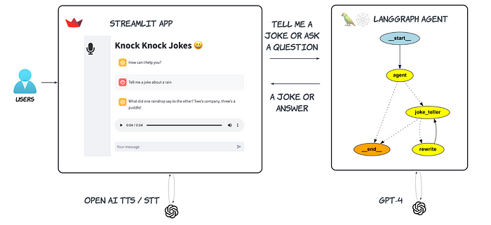
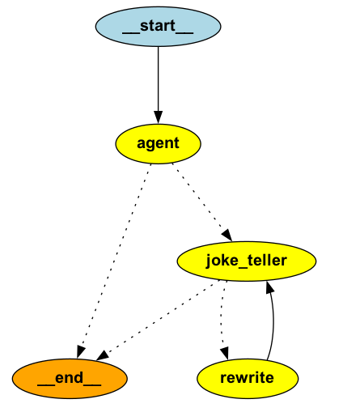

# [A ReAct Gen AI Joke Agent — The Code](https://medium.com/@yuxiaojian/a-react-gen-ai-joke-agent-the-code-fc48a27db16a)

This article is a continuation of my previous story,  [A ReAct Gen AI Joke Agent — Background and Design](https://medium.com/@yuxiaojian/a-react-gen-ai-joke-agent-background-and-design-b46618ba8c5c).

<p align="center">
  
</p>

In the last story, we introduced the design; now, let’s dive into the code.

The GitHub repository is  [knockknock_jokes](https://github.com/yuxiaojian/knockknock_jokes). There are three key files in the root directory:

1.  *config.py*: This file contains the global configuration settings. You can update the model and logging configurations here.
2.  *app.py*: This is the Streamlit app, which includes the Speech to Text (STT) and Text to Speech (TTS) functionalities.
3.  *agent_graph.py*: This file contains the LangGraph agent logic.

The Streamlit app is based on the frameworks used in  [OpenAI Voice & Chat Bot](https://medium.com/@yuxiaojian/an-openai-voice-chat-bot-b4cbe553f3ca)  and  [Build a Voice & Chat bot with Llama](https://medium.com/@yuxiaojian/build-a-voice-chat-bot-with-llama-aa0abf8437f5). For details on how the app integrates chat history with Streamlit session state, TTS, and STT, you can refer to those stories. Here, we will focus on the code in  _agent_graph.py_.

## Initialize Chroma Vector Store

The agent uses a Chroma vector store to keep track of old jokes. When the agent produces a “new” joke, a semantic search is performed to retrieve similar jokes from the store. These similar jokes, along with the “new” joke, are then sent to the LLM to determine if it’s genuinely new. If it is, the joke is added to the vector store. The vector store uses  _PersistentClient_  to keep old jokes on disk. If you want to start fresh, you can delete the persistent files in the “chroma” folder.
```
def __init_vector_store(self):  
  embeddings = HuggingFaceEmbeddings(model_name=EMBEDDING_MODEL_NAME)  
  chroma_client = chromadb.PersistentClient(settings=CHROMA_SETTINGS, path="chroma")  
  vector_store = Chroma(client=chroma_client, collection_name="jokes", embedding_function=embeddings)  
  logging.info("There are %d docs in the collection" % vector_store._collection.count())  
    
  if len(vector_store.get(limit=1).get("documents", [])) == 0:  
      logging.warning("The vector database is empty.")  
    
  return chroma_client, vector_store
```
## State, Node, and Edge

To proceed, we need to understand these  [LangGraph concepts](https://langchain-ai.github.io/langgraph/concepts/low_level/)

> `[State](https://langchain-ai.github.io/langgraph/concepts/low_level/#state)`: A shared data structure that represents the current snapshot of your application. It can be any Python type, but is typically a  `TypedDict`  or Pydantic  `BaseModel`.
> 
> `[Nodes](https://langchain-ai.github.io/langgraph/concepts/low_level/#nodes)`: Python functions that encode the logic of your agents. They receive the current  `State`  as input, perform some computation or side-effect, and return an updated  `State`.
> 
> `[Edges](https://langchain-ai.github.io/langgraph/concepts/low_level/#edges)`: Python functions that determine which  `Node`  to execute next based on the current  `State`. They can be conditional branches or fixed transitions.

## Graph State

Define the State of the graph. The State will be the input schema for all Nodes and Edges in the graph. A  _BaseMessage_  can be a  _HumanMessage_,  _AIMessage_, or  _ToolsMessage_.
```
class AgentState(TypedDict):  
  # The add_messages function defines how an update should be processed  
  # Default is to replace. add_messages says "append"  
  messages: Annotated[Sequence[BaseMessage], add_messages]  
  
workflow = StateGraph(AgentState)
```
## The Agent Node

The agent node is the entry point that decides if the user wants a joke or something else. If the user wants a joke, it passes the user query and generates an initial joke to the joke_teller node. Otherwise, it addresses the user query directly. As the LLM tends to repeat the same joke initially, the starter joke is used as  _{old_jokes}_  input for the joke_teller node.

This node already knows the next step, but we use an edge to route to the next node. The agent uses  _HumanMessage_  or  _AIMessage_  for different paths so that the edge can determine which node to route to next.
```
 # initial agent node  
def __agent(self, state):  
    """  
    Determines whether if user wants a joke or else  
  
    Args:  
        state (messages): The current state  
  
    Returns:  
        str: A decision for whether the documents are relevant or not  
    """  
  
    logging.info("---CALL AGENT---")  
      
    class Joke_Or_Answer(TypedDict):  
        """A joke or an answer."""  
      
        binary_score: Annotated[str, ..., "If the user needs a joke 'yes', or 'no'"]  
        starter_joke: Annotated[str, ..., "Generate a starter joke"]  
        answer: Annotated[str, ..., "If the user didn't ask a joke, provide the answer to the input"]  
  
    messages = state["messages"]  
    # LLM  
    model = ChatOpenAI(temperature=0, streaming=True).with_structured_output(Joke_Or_Answer)  
  
    # Prompt  
    prompt = PromptTemplate(  
        template="""   
        Here are the user query: \n\n {query} \n\n  
        Set 'binary_score' to 'yes' if the user wants a joke or set it to 'no' \  
        Create a starter joke to 'starter_joke' if 'binary_score' is 'yes' \  
        Answer the user query to 'answer' if 'binary_score' is not 'yes'  
        """,  
        input_variables=["query"],  
    )  
  
    chain = (  
        {"query": RunnablePassthrough()}  
        | prompt   
        | model )  
  
    response = chain.invoke(messages[0].content)  
      
    score = response['binary_score']  
    if score == "yes":  
        logging.info("---DECISION: NEED A JOKE ---")  
        msg = [  
            HumanMessage(  
                content=f"{response['starter_joke']}",  
            )  
        ]  
        return {"messages": msg}  
  
    else:  
        logging.info("---DECISION: ANSWER FROM AGENT ---")  
        return {"messages": [ AIMessage(content=f"{response['answer']}") ]}
```
## The “need_a_joke” Edge

The agent node already knows the next step and carries the information in the type of message. This edge simply checks the message type and routes to the appropriate node. If the user doesn’t want a joke, the agent node handles the query itself, and the graph goes to the END.
```
# Edge to decide whether need a joke or not  
def __need_a_joke(self, state) -> Literal["joke_teller",END]:  
  
    messages = state["messages"]  
    last_message = messages[-1]  
    if last_message.type == "human":  
        logging.info("---DECISION: JOKE TELLER ---")  
        return "joke_teller"  
    else:  
        logging.info("---DECISION: END ---")  
        return END
```
## The joke_teller node

The joke_teller node is responsible for producing a joke. It takes the  _{old_jokes}_  input either from the agent node or the rewrite node, providing more context for generating a new joke.
```
# Joke Teller node  
def __joke_teller(self, state):  
    """  
    Invokes the Joke Teller to tell a knock knock joke  
  
    Args:  
        state (messages): The current state  
  
    Returns:  
        dict: The updated state with the agent response appended to messages  
    """  
    logging.info("---CALL JOKE TELLER---")  
    messages = state["messages"]  
  
    system = """You are a hilarious comedian. Your specialty is telling jokes. \  
    Return a joke that has the setup  and the final punchline.  
      
    Here are some examples of jokes:  
      
    example_user: Tell me a joke about planes  
    example_assistant: {{"setup": "Why don't planes ever get tired?", "punchline": "Because they have rest wings!", "rating": 2}}  
  
    example_user: Tell me another joke about cargo  
    example_assistant: {{"setup": "Cargo", "punchline": "Cargo 'vroom vroom', but planes go 'zoom zoom'!", "rating": 10}}  
  
    example_user: Now about caterpillars  
    example_assistant: {{"setup": "Caterpillar", "punchline": "Caterpillar really slow, but watch me turn into a butterfly and steal the show!", "rating": 5}}  
  
      
    DO NOT repeat old jokes:\n  
    {old_jokes}  
    """  
  
    # Create a prompt that asks the user for a joke. temperature=0.5 to bring in some randomness  
    model = ChatOpenAI(temperature=0.9, streaming=True, model=OPENAI_MODEL).with_structured_output(Joke)  
    prompt = ChatPromptTemplate.from_messages([("system", system), ("human", "{user_input}")])  
  
    chain =  prompt | model  
    response = chain.invoke({"old_jokes": messages[-1].content, "user_input": messages[0].content})  
    # Add the response to the messages  
  
    joke = f"{response['setup']} {response['punchline']}"  
    logging.info(f"---JOKE TELLER RESPONSE: {joke}---")  
    return {"messages": [ AIMessage(content=joke) ]}
```
## The grade_jokes Edge

After the joke_teller node produces a “new” joke, the “grade_jokes” edge checks if it’s genuinely new. It searches for similar jokes in the vector store and gives them all to the LLM to decide if it’s a real new joke. If it is, the vector store is updated, and the graph ends. Otherwise, it goes to the rewrite node.
```
# Edge to decide whether a repetitive  
def __grade_jokes(self, state)-> Literal["rewrite", END]:  
    """  
    Determines whether the generated jokes are a repetition.  
  
    Args:  
        state (messages): The current state  
  
    Returns:  
        str: A decision for whether the documents are relevant or not  
    """  
  
    logging.info("---CHECK DUPLICATION---")  
  
    # Data model  
    class grade(BaseModel):  
        """Binary score for relevance check."""  
        binary_score: str = Field(description="Relevance score 'yes' or 'no'")  
  
    # LLM  
    model = ChatOpenAI(temperature=0, streaming=True)  
  
    # LLM with tool and validation  
    llm = model.with_structured_output(grade)  
  
    # Prompt  
    prompt = PromptTemplate(  
        template="""You are an audience assessing if the new joke is a repetition or duplication of old jokes. \n   
        Here are the old jokes: \n\n {old_jokes} \n\n  
        Here is the new joke: {new_joke} \n  
        Give a binary score 'yes' or 'no' score to indicate whether the new joke is a repetition of the old jokes.""",  
        input_variables=["old_jokes", "new_joke"],  
    )  
  
    messages = state["messages"]  
    new_joke = messages[-1].content  
  
    # retriever chain  
    chain = (  
        {"old_jokes": self.__retriever | format_docs, "new_joke": RunnablePassthrough()}  
        | prompt   
        | llm )  
  
    scored_result = chain.invoke(new_joke)  
  
    score = scored_result.binary_score  
    #score = "yes"  
  
    if score == "yes":  
        logging.info("---DECISION: A DUPLICATE JOKE ---")  
        return "rewrite"  
  
    else:  
        logging.info("---DECISION: A NEW JOKE ---")  
        # add the new joke to the vector store  
        self.__vector_store.add_documents(documents=[Document(page_content=new_joke)], ids=[str(uuid4())])  
        logging.info("There are %d docs in the collection" % self.__vector_store._collection.count())  
        logging.info("---UPDATED VECTOR STORE WITH THE NEW JOKE ---")  
        logging.info(f"NEW JOKE: {new_joke}")  
        return END
```
## The rewrite Node

The rewrite node retrieves all similar jokes from the vector store and returns to the joke_teller for a new joke.
```
def __rewrite(self, state):  
  """  
  Return old jokes to produce a better joke.  
  
  Args:  
      state (messages): The current state  
  
  Returns:  
      dict: The updated state with old jokes  
  """  
  
  logging.info("---REWRITE THE JOKE---")  
  messages = state["messages"]  
  new_joke = messages[-1].content  
  logging.info(f"NEW JOKE:\n{new_joke}")  
  
  old_jokes = format_docs(self.__retriever.invoke(new_joke))  
  logging.info(f"OLD JOKES:\n{old_jokes}")  
  # question = messages[0].content  
    
  msg = [  
      HumanMessage(  
          content=f"""{old_jokes}""",  
      )  
  ]  
  
  return {"messages": msg }
```
## Build the Graph

Build the graph by creating the nodes and connecting them with edges.
```
# Add the nodes  
  workflow.add_node("agent", self.__agent)  
  workflow.add_node("joke_teller", self.__joke_teller)  
  workflow.add_node("rewrite", self.__rewrite)  
  
  # Add the edges  
  workflow.add_edge(START, "agent")  
  workflow.add_conditional_edges(  
      "agent",  
      # Assess agent decision  
      self.__need_a_joke,  
  )  
  
  workflow.add_conditional_edges(  
      "joke_teller",  
      # Assess the newly produced joke  
      self.__grade_jokes,  
  )  
  
  workflow.add_edge("rewrite", "joke_teller")  
  
  graph = workflow.compile()
```
Create the graph
```
#%%capture --no-stderr  
#%pip install pygraphviz  
  
display(Image(graph.get_graph(xray=True).draw_png()))
```

<p align="center">
  
</p>

That’s it! This is the ReAct Gen AI Joke Agent. It can keep your kids and yourself entertained. I hope you enjoyed it. Happy learning!