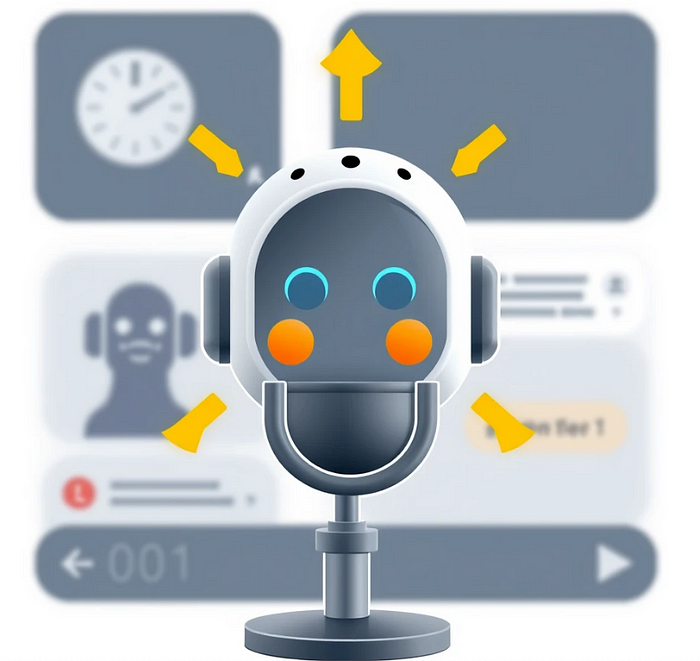
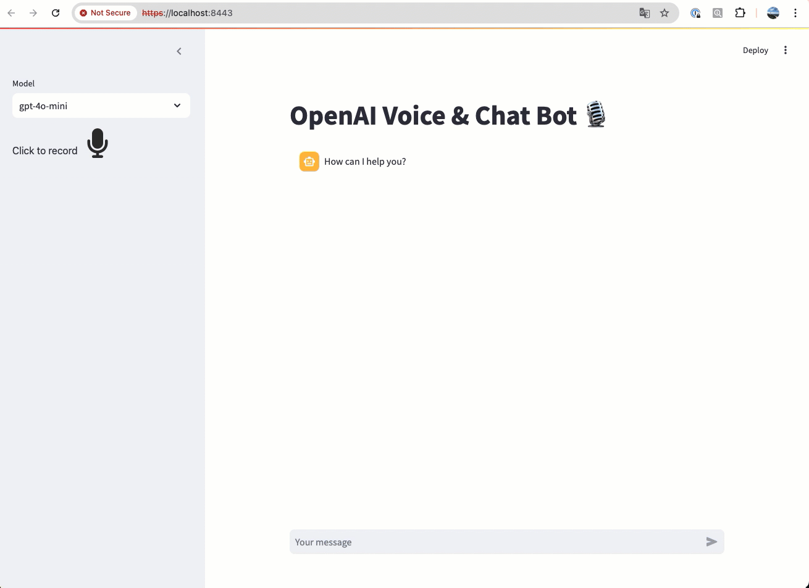

# [An OpenAI Voice & Chat Bot](https://medium.com/@yuxiaojian/an-openai-voice-chat-bot-b4cbe553f3ca)


<p align="center">
  
</p>

We have three Chromecasts in my home. My kids used to talk a lot with the Chromecasts. It was fun, initially, but we soon grew tired of the repetitive content and the unnatural voice.

With the rapid progress of AI and large language models (LLMs), things have changed significantly. With just a little over a hundred lines of code, I can now implement a better voice and chatbot than Chromecast. This solution not only runs on my laptop but can also operate on other devices connected to the same Wi-Fi network in my home. *Wow!*

Thanks to the foundations laid by many people. The voice and chatbot functionalities are powered by OpenAI, LangChain framework, and Streamlit. The Speech to Text (STT), Text to Speech (TTS), and LLM capabilities are all backed by the OpenAI API. LangChain manages the interactions with the LLM, while Streamlit provides the user interface and server.

Without further ado, let’s get to the code and show you how I created this bot.

# Chat History

To manage chat message history, I use  _StreamlitChatMessageHistory_. This utility stores messages in the Streamlit session state, eliminating the need for manual management.
```
from langchain_community.chat_message_histories import StreamlitChatMessageHistory  
...  
msgs = StreamlitChatMessageHistory(key="langchain_messages")  
if len(msgs.messages) == 0:  
    msgs.add_ai_message("How can I help you?")
```
With the code above, “_msgs.messages”_  is equivalent to “_st.session_state.langchain_messages_”.

Each access to a Streamlit app in a browser tab constitutes a session. For every browser tab that connects to the Streamlit server, a new session is created. Streamlit reruns your script from top to bottom every time you interact with your app. Each rerun occurs in a blank slate, meaning no variables are shared between runs.

Session State is Streamlit’s mechanism for tracking variables within a session.  _StreamlitChatMessageHistory_  leverages this feature to store chat history in the Streamlit session state, ensuring that the chat history persists across interactions within the same session.

# Chat Chain

To interact with the LLM, we use a typical chain structure. The  _RunnableWithMessageHistory_  class wraps another runnable (chain) and manages the chat message history for it. This class is responsible for both reading and updating the chat message history.
```
prompt = ChatPromptTemplate.from_messages(  
    [  
        ("system", "You are an AI chatbot having a conversation with a human."),  
        MessagesPlaceholder(variable_name="history"),  
        ("human", "{question}"),  
    ]  
)  
  
chain = prompt | ChatOpenAI(api_key=openai_api_key, model=llm_selector())  
chain_with_history = RunnableWithMessageHistory(  
    chain,  
    lambda session_id: msgs,  
    input_messages_key="question",  
    history_messages_key="history",  
)
```

# STT & TTS

Both Speech to Text (STT) and Text to Speech (TTS) functionalities are implemented using the OpenAI API.
```
client = OpenAI(api_key=openai_api_key)  
  
# Speech to text  
def speech_to_text(audio_data):  
    transcript = ''  
    with open(audio_data, "rb") as audio_file:  
        transcript = client.audio.transcriptions.create(  
            model="whisper-1",  
            response_format="text",  
            file=audio_file  
        )  
    return transcript  

# Text to speech  

def text_to_speech(input_text):  
    speech_file_path = f"temp_audio_play.mp3"  
    with client.audio.speech.with_streaming_response.create(  
        model="tts-1",  
        voice="alloy",  
        input=input_text,  
    ) as response:  
        response.stream_to_file(speech_file_path)  
  
    return speech_file_path
```
Temporary files serve as intermediaries between the audio recordings and the STT process, as well as between the TTS output and audio playback. These temporary files are removed after usage.

The audio record to STT
```
# from audio_recorder_streamlit import audio_recorder  
audio_bytes = audio_recorder(pause_threshold=1.0, sample_rate=16_000)  
...  
file_path = f"temp_audio.mp3"  
with open(file_path, "wb") as f:  
    f.write(audio_bytes)  
  
# STT  
transcript = speech_to_text(file_path)
```
TTS to the audio auto-play
```
audio_file = text_to_speech(response.content)  
autoplay_audio(audio_file)
```

# Audio Auto-play

The Streamlit component  _st.audio_  supports auto-play functionality. However, please note that auto-play is restricted on mobile devices, requiring manual playback.

To ensure compatibility with mobile devices, use the format  _audio/mpeg_  instead of  _audio/mp3_.
```
st.audio(audio_bytes, format="audio/mpeg", autoplay=True)
```

# Putting it together

You can find the full code from  _openai_voice_chat_bot.py_  file in the  [voice_chat_bot](https://github.com/yuxiaojian/voice_chat_bot/)  repository. This implementation supports both voice and text chat and allows for interactions in multiple languages.

<p align="center">
  
</p>

You may notice a “Not secure” warning in the browser when running the application in HTTPS mode with a self-signed certificate. Despite this, the application can still be accessed using an IP address like  https://192.168.1.232:8443  from any device on the same network. An easy way to keep kids entertained.

I hope you enjoyed reading this and feel inspired to create your own voice chatbot. With the rapid advancements in AI, the possibilities are endless. Happy coding!