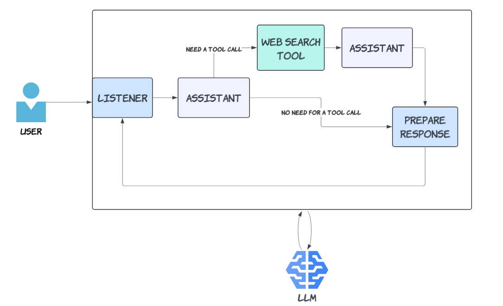
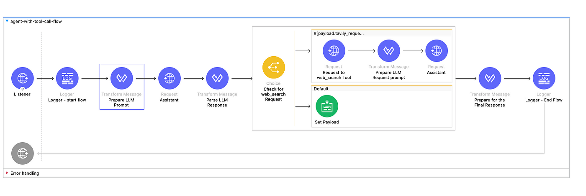
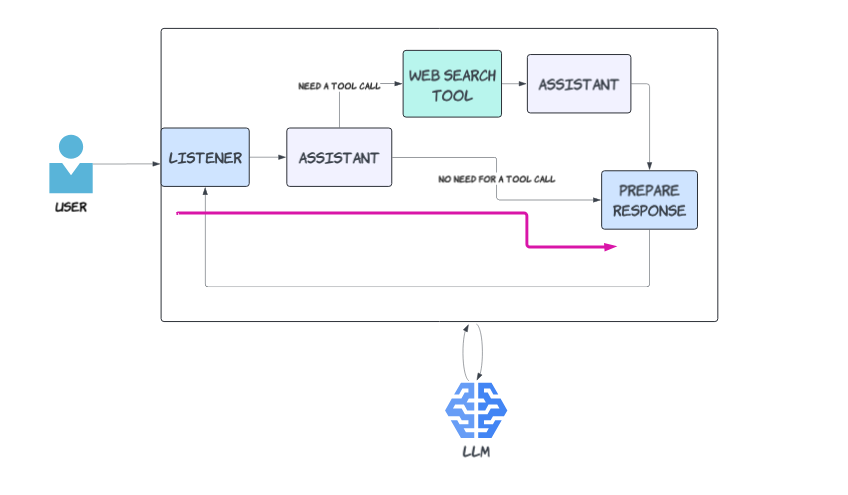
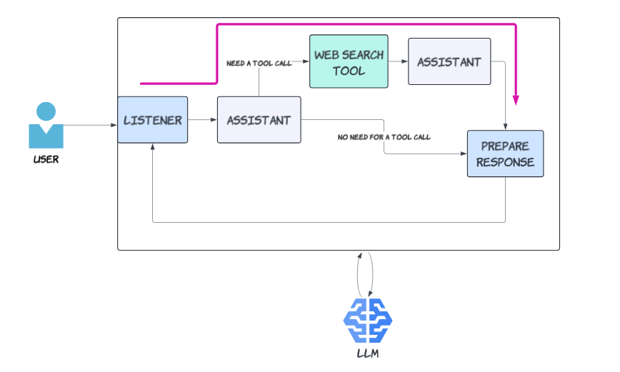

# [Build Production-Ready AI Agents with Anypoint Platform](https://medium.com/@yuxiaojian/build-production-ready-ai-agents-with-anypoint-platform-36fbb150cdf7)


AI agents are a collection of APIs (See the other story  [Demystify Agent Tool-Calling with the Llama 3 Model](https://medium.com/@yuxiaojian/demystify-agent-tool-calling-with-the-llama-3-model-b79b2db1655f)). These APIs connect to LLMs (Large Language Models) as the “brain” and to various tools like web search or data retrieval as the “legs” and “arms.” The Mulesoft Anypoint Platform is designed for building and running APIs. Both are about APIs …

You might be wondering: Can we build AI agents with the Anypoint Platform?

The answer is yes. In this story, we’ll walk through building an AI agent using the Anypoint Platform. Our agent will leverage  `chatgpt-4o`  as the backend LLM and a web search tool. The agent will use the web search tool for questions about current events or information that needs verification.


<p align="center">
  
</p>

An AI Agent build in Anypoint Platform

When a user asks a question, the assistant will attempt to answer it. If the assistant needs to make a tool call, it will respond with a  `tool_call`  request and query parameters. The agent will then make the tool call as requested and return the response. This response, along with the context, will be sent back to the assistant, which will then provide the final answer. Below is the agent in Anypoint Studio.

<p align="center">
  
</p>

The AI agent in Anypoint Studio

Let’s get started!

# Build the Agent in Anypoint Studio

In the story  [Demystify Agent Tool-Calling with the Llama 3 Model](https://medium.com/@yuxiaojian/demystify-agent-tool-calling-with-the-llama-3-model-b79b2db1655f), you can see the API call structure. Ollama stimulates the same API call structure as OpenAI so we can use the same API calls. Essentially, we need to send the same calls in the Anypoint studio.

## The Initial Assistant Call

The assistant first makes an LLM call to determine if a tool call is needed or if it can provide a final answer. The prompt includes a tools section.
```
%dw 2.0  
output application/json  
---  
{  
    "model": p('openai.model'),  
    "messages": [  
         {  
            "role": "system",  
            "content": "You are a helpful assistant. For questions about current events or information you are not sure about, use the web_search tool to get up-to-date information from the web."  
        },  
        {  
            "role": "user",  
            "content": payload["message"]  
        }  
    ],  
    "stream": false,  
    "temperature": 0,  
    "tools": [  
        {  
            "type": "function",  
            "function": {  
                "name": "web_search",  
                "description": "Search the web for current information",  
                "parameters": {  
                    "type": "object",  
                    "properties": {  
                        "query": {  
                            "type": "string",  
                            "description": "The search query"  
                        }  
                    },  
                    "required": [  
                        "query"  
                    ]  
                }  
            }  
        }  
    ]  
}
```
Send the call with an HTTP Requestor.
```
 <http:request-config name="OpenAI_API_Request_config" doc:name="HTTP Request configuration" doc:id="7dd33073-60cf-4da3-a82a-6b00f74f24be" >  
  <http:request-connection host="api.openai.com" protocol="HTTPS"/>  
 </http:request-config>    
  
<http:request method="POST" doc:name="Assistant" doc:id="d6500880-e57f-48c7-9ff4-541252267378" config-ref="OpenAI_API_Request_config" path="/v1/chat/completions">  
   <http:body ><![CDATA[#[vars.first_call]]]></http:body>  
   <http:headers ><![CDATA[#[output application/java  
---  
{  
 "Authorization" : "Bearer " ++ p('openai.api.key') default ""   
}]]]></http:headers>  
  </http:request>
```
## Check If a Tool Call is Needed

When the agent receives the response from the initial LLM call, it parses the response. If a tool call is required, it initializes a Tavily request body. The web search is conducted through the  [Tavily](https://docs.tavily.com/)  API. If not, it simply passes the LLM response content to the payload.
```
%dw 2.0  
output application/json  
var openAIResponse = payload  
var toolCall = openAIResponse.choices[0].message.tool_calls[0]  
---  
if (openAIResponse.choices[0].finish_reason == "tool_calls" and   
    toolCall.function.name == "web_search")  
{  
    tavily_request: {  
        method: "POST",  
        path: "/search",  
        headers: {  
            "Content-Type": "application/json"  
        },  
        body: {  
         "api_key": p('tavily.api.key'),  
            "query": read(toolCall.function.arguments, "application/json").query,  
            "include_answer": true,  
            "max_results": 5,  
            "search_depth": "basic",  
            "include_answer": false,  
            "include_images": true,  
            "include_raw_content": false,  
            "include_domains": [],  
            "exclude_domains": []  
        }  
    }  
} else {  
    message: openAIResponse.choices[0].message.content  
}
```
## Send the web_search Tool Call

We use a choice to send the Tavily call only if the  `payload.tavily_request`  exists.
```
<when expression="#[payload.tavily_request?]">  
        <http:request method="POST"   
                      doc:name="Request to web_search Tool" config-ref="Tavily_API_Request_config" path="#[payload.tavily_request.path]">  
     <http:body ><![CDATA[#[payload.tavily_request.body]]]></http:body>  
     <http:headers ><![CDATA[#[payload.tavily_request.headers]]]></http:headers>  
        </http:request>  
        <ee:transform doc:name="Prepare LLM Request prompt">  
...  
</when>
```
## Send the Second LLM Call

Once we get the tool call response, we will send the second LLM with all the context as well as the tool call response. The initial LLM call prompt is stored in  `vars.first_call`  and the response in  `vars.first_response`  . Tavily response is in the  `payload`
```
%dw 2.0  
output application/json  
var firstCall = vars.first_call  
var firstResponse = vars.first_response  
var tavilyResponse = payload  
---  
{  
    "model": p('openai.model'),  
    "messages": [  
        {  
            "role": "system",  
            "content": firstCall.messages[0].content,  
            "images": []  
        },  
        {  
            "role": "user",  
            "content": firstCall.messages[1].content,  
            "images": []  
        },  
        {  
            "role": "assistant",  
            "content": "",  
            "images": [],  
            "tool_calls": firstResponse.choices[0].message.tool_calls  
        },  
        {  
            "role": "tool",  
            "content": write(tavilyResponse, "application/json"),  
            "images": [],  
            "tool_call_id": firstResponse.choices[0].message.tool_calls[0].id  
        }  
    ],  
    "tools": firstCall.tools,  
    "stream": firstCall.stream,  
    "temperature": firstCall.temerature  
}  
```
Send the second LLM call.
```
// The requestor  
<http:request method="POST" doc:name="Assistant" config-ref="OpenAI_API_Request_config" path="/v1/chat/completions">  
    <http:headers><![CDATA[#[output application/java  
---  
{  
 "Authorization" : "Bearer " ++ p('openai.api.key'),  
 "Content-Type" : "application/json"  
}]]]></http:headers>  
</http:request>
```
## Prepare the Response

Prepare for the final response to the client.
```
%dw 2.0  
output application/json  
---  
{  
 "question" : vars.first_call.messages[1].content,  
 "answer" : payload.choices[0].message.content  
}
```
## Test It Locally

1.  Send a request without needing the tool call.
```
curl -X POST http://localhost:8081/api/agent -d '{"message" : "what is RAG"}' -H 'Content-Type: application/json'  
{  
  "question": "what is RAG",  
  "answer": "RAG stands for Retrieval-Augmented Generation. It is a technique used in natural language processing (NLP) and machine learning to improve the performance of language models by combining retrieval-based methods with generative models. Here’s a brief overview of the components:\n\n1. **Retrieval**: This component involves searching a large corpus of documents or data to find relevant information that can help answer a query or provide context. The retrieval system identifies and extracts relevant pieces of information from the database.\n\n2. **Augmentation**: The retrieved information is then used to augment the input to the generative model. This means that the generative model receives not only the original query but also the additional context or information retrieved from the database.\n\n3. **Generation**: The generative model, typically a transformer-based model like GPT-3, uses the augmented input to generate a more accurate and contextually relevant response.\n\nBy combining these two approaches, RAG models can leverage the vast amount of information available in external databases while still generating coherent and contextually appropriate responses. This makes them particularly useful for tasks that require access to up-to-date or specialized information, such as question answering, summarization, and conversational agents."  
}
```
The request flow is as below:

<p align="center">
  
</p>

2. Send a request requiring the tool call
```
curl -X POST http://localhost:8081/api/agent -d '{"message" : "current weather in Sydney"}' -H 'Content-Type: application/json'  
{  
  "question": "current weather in Sydney",  
  "answer": "The current weather in Sydney is sunny with a temperature of 30.4°C (86.7°F). The wind is blowing from the west at 29.9 kph (18.6 mph), and there is no precipitation. The humidity is at 19%, and visibility is around 10 kilometers (6 miles).\n\nFor more detailed and updated information, you can always check a reliable weather website."  
}
```
This time, the request flow goes through another branch, utilizing the web search tool to fetch the current weather information.

<p align="center">
  
</p>

# Next Steps

We mentioned “production-ready” in the title. Once you build your app, the Anypoint Platform provides additional features to get your solution ready for deployment:

-   **Deploy to the Cloud or On-Premise**: Use CloudHub or Runtime Fabric to deploy your application, leveraging established secure environments and connectivity.
-   **Protect the Agent API**: Secure your API with Anypoint policies and safeguard your keys using Anypoint secure properties.
-   **Expand the Toolset**: A great agent is not only about a powerful “brain” but also needs handy tools. The Anypoint Platform is an ecosystem with a large number of connectors, allowing you to enrich the agent’s toolset.
-   **Flexibility with LLMs**: You can replace OpenAI with different LLMs, such as Llama 3.1. For more details, see “[Power Your AI Agent with Anypoint Platform Secured Llama 3.1 API](https://medium.com/@yuxiaojian/power-your-ai-agent-with-anypoint-platform-secured-llama-3-1-api-ca659712f9ee)”

Have fun building and deploying your AI agents!

# Conclusion

We have built an AI agent with tools in the Anypoint Platform. This agent leverages the powerful LLM and utilizes a web search tool for real-time information retrieval. You can create a robust AI agent capable of handling various queries in the Anypoint Platform.

The Anypoint Platform gives you full control of all the features available through the API and also offers a secure and scalable environment for deploying your AI agents. You can also create more tools within the Anypoint platform ecosystem to empower your AI agents.