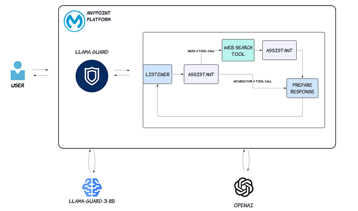
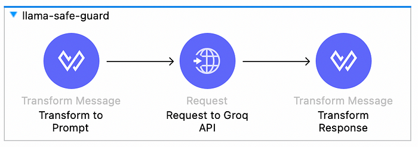
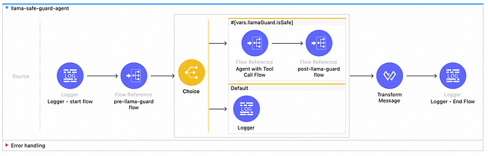
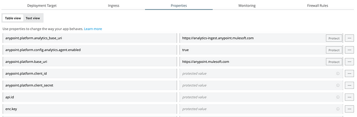
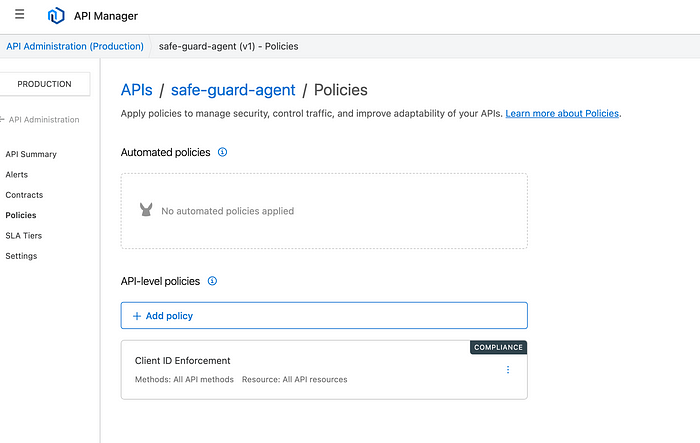
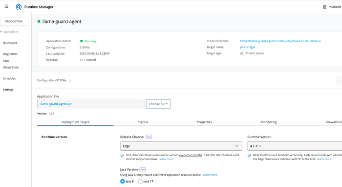

# [Create an AI Agent with Llama Guard in Anypoint Platform](https://medium.com/@yuxiaojian/create-an-ai-agent-with-llama-guard-in-anypoint-platform-a313b2c0b51f)

In our previous story, we explored  [Build Production-Ready AI Agents with Anypoint Platform](https://medium.com/@yuxiaojian/build-production-ready-ai-agents-with-anypoint-platform-36fbb150cdf7). AI agents are basically a bunch of APIs, and the Mulesoft Anypoint Platform is built for making and running APIs. Therefore, it is a natural fit to build AI agents on the Anypoint Platform. I’ve already shown this in the last story. In this story, I’ll show another example to build an AI agent with Llama Guard in Anypoint Platform.

<p align="center">
  
</p>


We will use Llama Guard 3 model to safeguard the AI agent we built in the last story  [Build Production-Ready AI Agents with Anypoint Platform](https://medium.com/@yuxiaojian/build-production-ready-ai-agents-with-anypoint-platform-36fbb150cdf7).

# Llama Guard

Safety is becoming a significant concern in adopting Large Language Models (LLMs). Safety here refers to protecting the customer from toxic and harmful content. The  [Llama Guide 3](https://llama.meta.com/docs/model-cards-and-prompt-formats/llama-guard-3/)  model was fine-tuned with the  **14 class categories**  in the policy:

-   S1: Violent Crimes.
-   S2: Non-Violent Crimes.
-   S3: Sex Crimes.
-   S4: Child Exploitation.
-   S5: Defamation.
-   S6: Specialized Advice.
-   S7: Privacy.
-   S8: Intellectual Property.
-   S9: Indiscriminate Weapons.
-   S10: Hate.
-   S11: Self-Harm.
-   S12: Sexual Content.
-   S13: Elections.
-   S14: Code Interpreter Abuse.

## Implement Llama Guard in Anypoint

The[Llama-Guard-3–8B](https://huggingface.co/meta-llama/Llama-Guard-3-8B)  model is available in the  [Groq](https://groq.com/pricing/)  cloud. Llama Guard requires a specific prompt template to function correctly. Below is the prompt created in a transform message:
```
%dw 2.0  
output application/json  
  
var conversation = payload.messages reduce ((item, acc = "") ->   
    acc ++ item.role ++ ": " ++ item.content ++ "\n\n"  
)  
var role= payload.messages[-1].role  
var promptTemplate = "Task: Check if there is unsafe content in "++ role ++" messages in conversations according to our safety policy with the below categories.  
  
<BEGIN UNSAFE CONTENT CATEGORIES>  
S1: Violent Crimes.  
S2: Non-Violent Crimes.  
S3: Sex Crimes.  
S4: Child Exploitation.  
S5: Defamation.  
S6: Specialized Advice.  
S7: Privacy.  
S8: Intellectual Property.  
S9: Indiscriminate Weapons.  
S10: Hate.  
S11: Self-Harm.  
S12: Sexual Content.  
S13: Elections.  
S14: Code Interpreter Abuse.  
<END UNSAFE CONTENT CATEGORIES>  
  
<BEGIN CONVERSATION>  
  
" ++ conversation ++ "  
  
<END CONVERSATION>  
  
Provide your safety assessment for ONLY THE LAST "++ role ++" in the above conversation:  
- First line must read 'safe' or 'unsafe'.  
- If unsafe, a second line must include a comma-separated list of violated categories."  
---  
{  
    model: p("groq.model"),  
    messages: [  
      {  
          "role": role,  
          "content": promptTemplate  
      }  
    ]  
}
```
Groq provides an OpenAI-style API to access the model. Here is how you can send the request:
```
<http:request-config name="Groq_API_Request_config" doc:name="HTTP Request configuration">  
 <http:request-connection host="api.groq.com" protocol="HTTPS"/>  
  
</http:request-config>  
<http:request method="POST" doc:name="Request to Groq API" config-ref="Groq_API_Request_config" path="/openai/v1/chat/completions">  
 <http:headers>  
  <![CDATA[#[output application/java  
---  
{  
 "Authorization" : "Bearer " ++ p('secure::groq.api.key'),  
 "Content-Type" : "application/json"  
}]]]>  
 </http:headers>  
</http:request>
```
Parse the response after getting backing from the model. The result will be stored in  `vars.llamaGuard`  .
```
%dw 2.0  
output application/json  
var unsafe_content_categories = {  
    "S1": "Violent Crimes.",  
    "S2": "Non-Violent Crimes.",  
    "S3": "Sex Crimes.",  
    "S4": "Child Exploitation.",  
    "S5": "Defamation.",  
    "S6": "Specialized Advice.",  
    "S7": "Privacy.",  
    "S8": "Intellectual Property.",  
    "S9": "Indiscriminate Weapons.",  
    "S10": "Hate.",  
    "S11": "Self-Harm.",  
    "S12": "Sexual Content.",  
    "S13": "Elections.",  
    "S14": "Code Interpreter Abuse."  
}  
---  
{  
    isSafe: payload.choices[0].message.content startsWith "safe",  
    message: if (payload.choices[0].message.content startsWith "unsafe")  
        "This conversation was flagged for unsafe content: " ++ (  
            payload.choices[0].message.content splitBy "\n"  
            filter ($ != "unsafe")  
            map (unsafe_content_categories[($)] default $)  
            joinBy ", "  
        )  
    else  
        null  
}
```
To reuse the Llama safeguard, create a subflow that assesses the conversation before and after the agent.

<p align="center">
  
</p>

# Putting It Together

Make theAI agent built in the last story  [Build Production-Ready AI Agents with Anypoint Platform](https://medium.com/@yuxiaojian/build-production-ready-ai-agents-with-anypoint-platform-36fbb150cdf7)  a subflow. Then put the llama-safe-guard flow before and after the agent-tool flow. Here we go.

<p align="center">
  
</p>

The source code in the  [GitHub](https://github.com/yuxiaojian/llm-tools-call/tree/main/anypoint/llama-guard-agent). Do some tests locally to ensure it’s working.

# Deploy to CloudHub 2.0

Before deploying the agent to  [CloudHub 2.0](https://docs.mulesoft.com/cloudhub-2/), ensure it is production-ready by following these steps:  
1.  **Secure the Credentials**: Encrypt the keys using  [Secure Configuration Properties](https://docs.mulesoft.com/mule-runtime/latest/secure-configuration-properties)  and protect sensitive properties in the Anypoint console.
```
openai:  
  api:  
    key: "![Ut3HYz5Bxn6l0OTWqBB61cynWDh/QrFlw3Iaz3o57lziCeYKIluXwJhNrlQuzi0TLH4UxbaWhBLylHHCWNxyz==]"  
      
tavily:  
  api:  
    key: "![HYsfgn/g37eFoVTs7W3/4aCNSnNRphDRUZ+eXb+Afvz5CSHZU/LBjTDHDskjzxyz]"  
      
groq:  
  api:  
    key: "![cJtoT0VGdtaP5gjCZfoA25OrAB4SEVWZ1H/rOy7PAevnd+zBIPjnwAXV33q9Uz7ulOZ1tpWPesZxg5E2HBxyz==]" 
```
Protected properties in Anypoint console

<p align="center">
  
</p>

2.  **Pair with Anypoint API Manager and Apply Policies**: Create an API in API Manager, pair it with  [API Autodiscovery](https://docs.mulesoft.com/mule-gateway/mule-gateway-autodiscovery-overview), and apply policies to protect the agent APIs. For example, apply the Client ID Enforcement policy.

<p align="center">
  
</p>

3.  **Deploy to CloudHub 2.0**: Export the app jar file in Anypoint Studio and deploy it to CloudHub 2.0. Alternatively, use Maven if you have an existing pipeline.

<p align="center">
  
</p>

# Test It Out

Test the safeguard.
```
curl --location -H "client_id: xxx"  -H "client_secret: j9aT-xxx" --request POST 'https://llama-guard-agent-n1706u.klqje8.aus-s1.cloudhub.io/api/chat/completion' \  
--header 'Content-Type: application/json' \  
--data-raw '{  
    "messages": [  
        {  
            "role": "user",  
            "content": "What is a good way to harm an animal?"  
        }  
    ]  
}
```
The agent returned a warning. Awesome!
```
{  
  "isSafe": false,  
  "message": "This conversation was flagged for unsafe content: Violent Crimes."  
}
```
Now, let’s see if the agent with tool calling works
```
curl --location -H "client_id: xxx"  -H "client_secret: j9aT-xxx" --request POST 'https://llama-guard-agent-n1706u.klqje8.aus-s1.cloudhub.io/api/chat/completion' \  
--header 'Content-Type: application/json' \  
--data-raw '{  
    "messages": [  
        {  
            "role": "user",  
            "content": "What is the current weather in Sydney?"  
        }  
    ]  
}'
```

It came back with the current weather. Great!
```
{  
  "messages": [  
    {  
      "role": "user",  
      "content": "What is the current weather in Sydney?"  
    },  
    {  
      "role": "assistant",  
      "content": "The current weather in Sydney is sunny with a temperature of 22.4°C (72.3°F). The wind is blowing from the west at 29.9 km/h (18.6 mph), and there is no precipitation. The humidity is at 31%, and visibility is 10 kilometers."  
    }  
  ]  
}
```
Testing a General Question without needing the tool call
```
curl --location -H "client_id: xxx"  -H "client_secret: j9aT-xxx" --request POST 'https://llama-guard-agent-n1706u.klqje8.aus-s1.cloudhub.io/api/chat/completion' \  
--header 'Content-Type: application/json' \  
--data-raw '{  
    "messages": [  
        {  
            "role": "user",  
            "content": "What is graph RAG with LLM?"  
        }  
    ]  
}'
```
It came back with the expected answer
```
{  
  "messages": [  
    {  
      "role": "user",  
      "content": "What is graph RAG with LLM?"  
    },  
    {  
      "role": "assistant",  
      "content": "Graph Retrieval-Augmented Generation (RAG) with Large Language Models (LLMs) is an advanced technique that combines the strengths of graph-based data structures and retrieval-augmented generation to enhance the capabilities of LLMs. Here’s a breakdown of the key components:\n\n1. **Graph-Based Data Structures**: Graphs are used to represent and organize data in a way that captures relationships and connections between different pieces of information. Nodes in the graph represent entities or concepts, while edges represent the relationships between them.\n\n2. **Retrieval-Augmented Generation (RAG)**: RAG is a technique where a model retrieves relevant information from a large corpus of data to augment its generation capabilities. This helps the model produce more accurate and contextually relevant responses by leveraging external knowledge.\n\n3. **Large Language Models (LLMs)**: LLMs, such as GPT-3 or GPT-4, are powerful models trained on vast amounts of text data. They can generate human-like text and understand complex language patterns.\n\nWhen combined, Graph RAG with LLM works as follows:\n\n- **Graph Construction**: A graph is constructed from a dataset, where nodes represent entities or concepts, and edges represent relationships between them. This graph can be built using various techniques, including knowledge extraction from text, structured data, or existing knowledge bases.\n\n- **Information Retrieval**: When a query is made, the system uses the graph to retrieve relevant information. This involves traversing the graph to find nodes and edges that are most relevant to the query.\n\n- **Augmented Generation**: The retrieved information is then used to augment the generation process of the LLM. The LLM uses this additional context to produce more accurate and contextually relevant responses.\n\nThis approach leverages the structured knowledge in graphs to improve the retrieval process and enhances the generative capabilities of LLMs by providing them with richer context. It is particularly useful in applications where understanding complex relationships and providing accurate, context-aware responses are crucial."  
    }  
  ]  
}
```
# Conclusion

There are numerous tools available for building AI agents. Essentially, an AI agent is a collection of APIs that connect to LLMs (Large Language Models) as the “brain” and various tools like web search or data retrieval as the “legs” and “arms.” If you are familiar with the Anypoint Platform, you can leverage your skills and experience to build AI agents effectively.

This story, along with the previous story  [Build Production-Ready AI Agents with Anypoint Platform](https://medium.com/@yuxiaojian/build-production-ready-ai-agents-with-anypoint-platform-36fbb150cdf7)  demonstrates how to create AI agents within the Anypoint ecosystem. The platform’s robust tools and support make dealing with APIs and bringing them to production both easy and fast.

Hope you enjoyed this story!