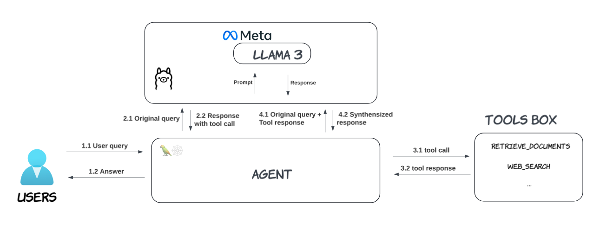

# [Demystify Agent Tool-Calling with the Llama 3 Model](https://medium.com/@yuxiaojian/demystify-agent-tool-calling-with-the-llama-3-model-b79b2db1655f)
Aug 24, 2024

AI agents are rapidly evolving, increasingly mimicking human problem-solving rather than merely functioning as intelligent chatbots. At the core of an AI agent lies the Large Language Model (LLM). Retrieval-Augmented Generation (RAG) expands the LLM’s knowledge beyond its training data while planning abilities allow agents to decompose complex problems into manageable tasks. ReAct agents can reflect on their actions and improve over time. Additionally, we also equip LLM with various tools to enhance their capabilities.

AI agents utilize external tools or services to accomplish tasks they cannot perform independently. This often involves APIs or other software interfaces to extend the agent’s functionality. Understanding how agent tool-calling works is crucial for optimizing your AI tools.

A question that often arises is: “How does an LLM decide on tool-calling?” In this story, I’ll walk you through the agent tool-calling process in detail, using the  [Llama-3-Groq-8B-Tool-Use](https://wow.groq.com/introducing-llama-3-groq-tool-use-models/)  model as an example. This model is a fine-tuned version of Llama 3 specifically designed for tool use. While the flow and API work similarly to Llama 3.1, the 8B model is more convenient for local testing. However, for applications that combine conversation and tool calling, Meta recommends using Llama 70B-Instruct or Llama 405B-Instruct, as the 8B model cannot reliably maintain a conversation alongside tool-calling definitions.

# Overview

The model is hosted by Ollama and we use LangGraph to build the  [Local Tool Calling Agent](https://github.com/langchain-ai/langgraph/blob/main/examples/tutorials/tool-calling-agent-local.ipynb). The diagram below illustrates the flow of an agent tool call. We will use the step notation in the introduction.


<p align="center">
  
</p>

## LangGraph Agent

The agent has two tools  `retrieve_documents`  and  `web_search`. You can check the full code  [here](https%3A%2F%2Fgithub.com%2Flangchain-ai%2Flanggraph%2Fblob%2Fmain%2Fexamples%2Ftutorials%2Ftool-calling-agent-local.ipynb). The  `bind_tools`  call registers the tools to LangGraph so it can carry the tool information in the LLM API call. We will see it shortly.

```python
# Define a tool, which we will connect to our agent  
def retrieve_documents(query: str) -> list:  
    """Retrieve documents from the vector store based on the query."""  
    return retriever.invoke(query)  
  
  
...  
  
  
def web_search(query: str) -> str:  
    """Run web search on the question."""  
    web_results = web_search_tool.invoke({"query": query})  
    return [  
        Document(page_content=d["content"], metadata={"url": d["url"]})  
        for d in web_results  
    ]  

  
# Tool list  
tools = [retrieve_documents, web_search]  
...  
  
llm.bind_tools(tools)
```

The chat template defines the system message and leaves a placeholder for user input

```python
primary_assistant_prompt = ChatPromptTemplate.from_messages(  
    [  
        (  
            "system",  
            "You are a helpful assistant tasked with answering user questions. "  
            "You have access to two tools: retrieve_documents and web_search. "  
            "For any user questions about LLM agents, use the retrieve_documents tool to get information for a vectorstore. "  
            "For any other questions, such as questions about current events, use the web_search tool to get information from the web. ",  
        ),  
        ("placeholder", "{messages}"),  
    ]  
)
```
# Call Flow

## User query — Step 1.1

The flow starts from the user sends a message  `Get me information about the current weather in SF.`
```python
import uuid  
  
  
def predict_react_agent_answer(example: dict):  
    """Use this for answer evaluation"""  
  
    config = {"configurable": {"thread_id": str(uuid.uuid4())}}  
    messages = react_graph.invoke({"messages": ("user", example["input"])}, config)  
    return {"response": messages["messages"][-1].content, "messages": messages}  
  
example = {"input": "Get me information about the current weather in SF."}  
response = predict_react_agent_answer(example)  
  
# HumanMessage(content='Get me information about the the types of LLM agent memory?'
```

## LangGraph Sends an API Call to Ollama — Step 2.1

LangGraph agent sends an API call to Ollama with the payload below. It not only carries the user input and system message but also the registered tool information, including the tool name, description and parameter requirements.

```python
{  
    "model": "llama3-groq-tool-use",  
    "messages": [  
        {  
            "role": "system",  
            "content": "You are a helpful assistant tasked with answering user questions. You have access to two tools: retrieve_documents and web_search. For any user questions about LLM agents, use the retrieve_documents tool to get information for a vectorstore. For any other questions, such as questions about current events, use the web_search tool to get information from the web. ",  
            "images": []  
        },  
        {  
            "role": "user",  
            "content": "Get me information about the current weather in SF.",  
            "images": []  
        }  
    ],  
    "tools": [  
        {  
            "type": "function",  
            "function": {  
                "name": "retrieve_documents",  
                "description": "Retrieve documents from the vector store based on the query.",  
                "parameters": {  
                    "type": "object",  
                    "properties": {  
                        "query": {  
                            "type": "string"  
                        }  
                    },  
                    "required": [  
                        "query"  
                    ]  
                }  
            }  
        },  
        {  
            "type": "function",  
            "function": {  
                "name": "web_search",  
                "description": "Run web search on the question.",  
                "parameters": {  
                    "type": "object",  
                    "properties": {  
                        "query": {  
                            "type": "string"  
                        }  
                    },  
                    "required": [  
                        "query"  
                    ]  
                }  
            }  
        }  
    ],  
    "stream": false,  
    "format": "",  
    ...  
}
```

## Prompt to the Model

Ollama rendered the API payload to the prompt before feeding it to the model. The prompt follows the training data format. In addition to all the information from the API payload, it has the required tokens and also some extra requirements (blacked text) for the tool call format.

```bash
<|start_header_id|>system<|end_header_id|>  
  
You are a helpful assistant tasked with answering user questions. You have access to two tools: retrieve_documents and web_search. For any user questions about LLM agents, use the retrieve_documents tool to get information for a vectorstore. For any other questions, such as questions about current events, use the web_search tool to get information from the web.    
**_You are provided with function signatures within <tools></tools> XML tags. You may call one or more functions to assist with the user query. Don't make assumptions about what values to plug into functions. For each function call return a json object with function name and arguments within <tool_call></tool_call> XML tags as follows:  
<tool_call>  
{"name": <function-name>,"arguments": <args-dict>}  
</tool_call>_**  

Here are the available tools:  <tools>  
{"name":"retrieve_documents","description":"Retrieve documents from the vector store based on the query.","parameters":{"type":"object","required":["query"],"properties":{"query":{"type":"string","description":""}}}}  
{"name":"web_search","description":"Run web search on the question.","parameters":{"type":"object","required":["query"],"properties":{"query":{"type":"string","description":""}}}}  
</tools>  
<|eot_id|>  
<|start_header_id|>user<|end_header_id|>  
  
Get me information about the current weather in SF.  
<|eot_id|>  
<|start_header_id|>assistant<|end_header_id|>
```
The tool description is crucial for the model to make the correct tool call. Ensure that your tool descriptions are concise and specific.

## The Model Returns a Tool Call — Step 2.2

The model decides on a tool call response and returns the tool call function and arguments, which LangGraph uses to send the tool call.
```
{  
    "model": "llama3-groq-tool-use",  
    "created_at": "2024-08-23T18:59:31.644728Z",  
    "message": {  
        "role": "assistant",  
        "content": "",  
        "tool_calls": [  
            {  
                "function": {  
                    "name": "web_search",  
                    "arguments": {  
                        "query": "current weather in SF"  
                    }  
                }  
            }  
        ]  
    },  
    "done_reason": "stop",  
    "done": true,  
    "total_duration": 5228904939,  
    "load_duration": 34775586,  
    "prompt_eval_count": 263,  
    "prompt_eval_duration": 665193000,  
    "eval_count": 29,  
    "eval_duration": 4525706000  
}
```
## LangGraph Agent Sends Another API Call to Ollama — Step 4.1

After LangGraph makes the tool call and receives the response, it sends another API call to Ollama. This payload includes all the information from the first call plus the tool response for the model to synthesize a final answer.
```
{  
  "model": "llama3-groq-tool-use",  
  "messages": [  
    {  
      "role": "system",  
      "content": "You are a helpful assistant tasked with answering user questions. You have access to two tools: retrieve_documents and web_search. For any user questions about LLM agents, use the retrieve_documents tool to get information for a vectorstore. For any other questions, such as questions about current events, use the web_search tool to get information from the web. ",  
      "images": []  
    },  
    {  
      "role": "user",  
      "content": "Get me information about the current weather in SF.",  
      "images": []  
    },  
    {  
      "role": "assistant",  
      "content": "",  
      "images": [],  
      "tool_calls": [  
        {  
          "type": "function",  
          "id": "acb74c42-8b6e-47e7-83eb-b640ae113038",  
          "function": {  
            "name": "web_search",  
            "arguments": {  
              "query": "current weather in SF"  
            }  
          }  
        }  
      ]  
    },  
    {  
      "role": "tool",  
      "content": "[Document(metadata={'url': 'https://www.weatherapi.com/'}, page_content=\"{'location': {'name': 'San Francisco', 'region': 'California', 'country': 'United States of America', 'lat': 37.78, 'lon': -122.42, 'tz_id': 'America/Los_Angeles', 'localtime_epoch': 1724443070, 'localtime': '2024-08-23 12:57'}, 'current': {'last_updated_epoch': 1724442300, 'last_updated': '2024-08-23 12:45', 'temp_c': 20.6, 'temp_f': 69.1, 'is_day': 1, 'condition': {'text': 'Overcast', 'icon': '//cdn.weatherapi.com/weather/64x64/day/122.png', 'code': 1009}, 'wind_mph': 4.3, 'wind_kph': 6.8, 'wind_degree': 190, 'wind_dir': 'S', 'pressure_mb': 1018.0, 'pressure_in': 30.05, 'precip_mm': 0.0, 'precip_in': 0.0, 'humidity': 59, 'cloud': 100, 'feelslike_c': 20.6, 'feelslike_f': 69.1, 'windchill_c': 17.1, 'windchill_f': 62.7, 'heatindex_c': 17.1, 'heatindex_f': 62.7, 'dewpoint_c': 11.9, 'dewpoint_f': 53.3, 'vis_km': 16.0, 'vis_miles': 9.0, 'uv': 5.0, 'gust_mph': 10.7, 'gust_kph': 17.3}}\"), Document(metadata={'url': 'https://www.timeanddate.com/weather/@z-us-94128/hourly'}, page_content='Hour-by-Hour Forecast for San Francisco, USA. Currently: 58 °F. Mostly cloudy. (Weather station: San Francisco International Airport, USA). See more current weather.'), Document(metadata={'url': 'https://www.weather-atlas.com/en/california-usa/san-francisco-weather-august'}, page_content='August weather for San Francisco, California: In San Francisco, during August, the rain falls for 2.7 days and regularly aggregates up to 0.08\" (2mm) of precipitation. San Francisco, California, experiences an average high-temperature of a still agreeable 72.5°F (22.5°C) in August, subtly different from July\\'s 72.1°F (22.3°C).'), Document(metadata={'url': 'https://weatherspark.com/h/y/557/2024/Historical-Weather-during-2024-in-San-Francisco-California-United-States'}, page_content='San Francisco Temperature History 2024\\nHourly Temperature in 2024 in San Francisco\\nCompare San Francisco to another city:\\nCloud Cover in 2024 in San Francisco\\nDaily Precipitation in 2024 in San Francisco\\nObserved Weather in 2024 in San Francisco\\nHours of Daylight and Twilight in 2024 in San Francisco\\nSunrise & Sunset with Twilight and Daylight Saving Time in 2024 in San Francisco\\nSolar Elevation and Azimuth in 2024 in San Francisco\\nMoon Rise, Set & Phases in 2024 in San Francisco\\nHumidity Comfort Levels in 2024 in San Francisco\\nWind Speed in 2024 in San Francisco\\nHourly Wind Speed in 2024 in San Francisco\\nHourly Wind Direction in 2024 in San Francisco\\nAtmospheric Pressure in 2024 in San Francisco\\nData Sources\\n See all nearby weather stations\\nLatest Report — 3:56 PM\\nWed, Jan 24, 2024\\xa0\\xa0\\xa0\\xa013 min ago\\xa0\\xa0\\xa0\\xa0UTC 23:56\\nCall Sign KSFO\\nTemp.\\n60.1°F\\nPrecipitation\\nNo Report\\nWind\\n6.9 mph\\nCloud Cover\\nMostly Cloudy\\n1,800 ft\\nRaw: KSFO 242356Z 18006G19KT 10SM FEW015 BKN018 BKN039 16/12 A3004 RMK AO2 SLP171 T01560122 10156 20122 55001\\n While having the tremendous advantages of temporal and spatial completeness, these reconstructions: (1) are based on computer models that may have model-based errors, (2) are coarsely sampled on a 50 km grid and are therefore unable to reconstruct the local variations of many microclimates, and (3) have particular difficulty with the weather in some coastal areas, especially small islands.\\n We further caution that our travel scores are only as good as the data that underpin them, that weather conditions at any given location and time are unpredictable and variable, and that the definition of the scores reflects a particular set of preferences that may not agree with those of any particular reader.\\n 2024 Weather History in San Francisco California, United States\\nThe data for this report comes from the San Francisco International Airport.'), Document(metadata={'url': 'https://world-weather.info/forecast/usa/san_francisco/august-2024/'}, page_content='Extended weather forecast in San Francisco. Hourly Week 10 days 14 days 30 days Year. Detailed ⚡ San Francisco Weather Forecast for August 2024 - day/night 🌡️ temperatures, precipitations - World-Weather.info.')]",  
      "images": [],  
      "tool_call_id": "acb74c42-8b6e-47e7-83eb-b640ae113038"  
    }  
  ],  
  "tools": [  
    {  
      "type": "function",  
      "function": {  
        "name": "retrieve_documents",  
        "description": "Retrieve documents from the vector store based on the query.",  
        "parameters": {  
          "type": "object",  
          "properties": {  
            "query": {  
              "type": "string"  
            }  
          },  
          "required": [  
            "query"  
          ]  
        }  
      }  
    },  
    {  
      "type": "function",  
      "function": {  
        "name": "web_search",  
        "description": "Run web search on the question.",  
        "parameters": {  
          "type": "object",  
          "properties": {  
            "query": {  
              "type": "string"  
            }  
          },  
          "required": [  
            "query"  
          ]  
        }  
      }  
    }  
  ],  
  "stream": false,  
  "format": "",  
...  
}
```

## The Prompt to the Model

Ollama renders another prompt to the model using the same template.
```
<|start_header_id|>system<|end_header_id|>  
  
You are a helpful assistant tasked with answering user questions. You have access to two tools: retrieve_documents and web_search. For any user questions about LLM agents, use the retrieve_documents tool to get information for a vectorstore. For any other questions, such as questions about current events, use the web_search tool to get information from the web.  You are provided with function signatures within <tools></tools> XML tags. You may call one or more functions to assist with the user query. Don't make assumptions about what values to plug into functions. For each function call return a json object with function name and arguments within <tool_call></tool_call> XML tags as follows:  
<tool_call>  
{"name": <function-name>,"arguments": <args-dict>}  
</tool_call>  
  
Here are the available tools:  
<tools> {"name":"retrieve_documents","description":"Retrieve documents from the vector store based on the query.","parameters":{"type":"object","required":["query"],"properties":{"query":{"type":"string","description":""}}}} {"name":"web_search","description":"Run web search on the question.","parameters":{"type":"object","required":["query"],"properties":{"query":{"type":"string","description":""}}}} </tools><|eot_id|><|start_header_id|>user<|end_header_id|>  
  
Get me information about the current weather in SF.<|eot_id|><|start_header_id|>assistant<|end_header_id|>  
  
<tool_call>  
{"name": "web_search", "arguments": {"query":"current weather in SF"}}  
</tool_call><|eot_id|>  
  
<tool_response>  
{"result": [Document(metadata={'url': 'https://www.weatherapi.com/'}, page_content="{'location': {'name': 'San Francisco', 'region': 'California', 'country': 'United States of America', 'lat': 37.78, 'lon': -122.42, 'tz_id': 'America/Los_Angeles', 'localtime_epoch': 1724443070, 'localtime': '2024-08-23 12:57'}, 'current': {'last_updated_epoch': 1724442300, 'last_updated': '2024-08-23 12:45', 'temp_c': 20.6, 'temp_f': 69.1, 'is_day': 1, 'condition': {'text': 'Overcast', 'icon': '//cdn.weatherapi.com/weather/64x64/day/122.png', 'code': 1009}, 'wind_mph': 4.3, 'wind_kph': 6.8, 'wind_degree': 190, 'wind_dir': 'S', 'pressure_mb': 1018.0, 'pressure_in': 30.05, 'precip_mm': 0.0, 'precip_in': 0.0, 'humidity': 59, 'cloud': 100, 'feelslike_c': 20.6, 'feelslike_f': 69.1, 'windchill_c': 17.1, 'windchill_f': 62.7, 'heatindex_c': 17.1, 'heatindex_f': 62.7, 'dewpoint_c': 11.9, 'dewpoint_f': 53.3, 'vis_km': 16.0, 'vis_miles': 9.0, 'uv': 5.0, 'gust_mph': 10.7, 'gust_kph': 17.3}}"), Document(metadata={'url': 'https://www.timeanddate.com/weather/@z-us-94128/hourly'}, page_content='Hour-by-Hour Forecast for San Francisco, USA. Currently: 58 °F. Mostly cloudy. (Weather station: San Francisco International Airport, USA). See more current weather.'), Document(metadata={'url': 'https://www.weather-atlas.com/en/california-usa/san-francisco-weather-august'}, page_content='August weather for San Francisco, California: In San Francisco, during August, the rain falls for 2.7 days and regularly aggregates up to 0.08" (2mm) of precipitation. San Francisco, California, experiences an average high-temperature of a still agreeable 72.5°F (22.5°C) in August, subtly different from July\'s 72.1°F (22.3°C).'), Document(metadata={'url': 'https://weatherspark.com/h/y/557/2024/Historical-Weather-during-2024-in-San-Francisco-California-United-States'}, page_content='San Francisco Temperature History 2024  
Hourly Temperature in 2024 in San Francisco  
Compare San Francisco to another city:  
Cloud Cover in 2024 in San Francisco  
Daily Precipitation in 2024 in San Francisco  
Observed Weather in 2024 in San Francisco  
Hours of Daylight and Twilight in 2024 in San Francisco  
Sunrise & Sunset with Twilight and Daylight Saving Time in 2024 in San Francisco  
Solar Elevation and Azimuth in 2024 in San Francisco  
Moon Rise, Set & Phases in 2024 in San Francisco  
Humidity Comfort Levels in 2024 in San Francisco  
Wind Speed in 2024 in San Francisco  
Hourly Wind Speed in 2024 in San Francisco  
Hourly Wind Direction in 2024 in San Francisco  
Atmospheric Pressure in 2024 in San Francisco  
Data Sources  
 See all nearby weather stations  
Latest Report — 3:56 PM  
Wed, Jan 24, 2024 13 min ago UTC 23:56  
Call Sign KSFO  
Temp.  
60.1°F  
Precipitation  
No Report  
Wind  
6.9 mph  
Cloud Cover  
Mostly Cloudy  
1,800 ft  
Raw: KSFO 242356Z 18006G19KT 10SM FEW015 BKN018 BKN039 16/12 A3004 RMK AO2 SLP171 T01560122 10156 20122 55001  
 While having the tremendous advantages of temporal and spatial completeness, these reconstructions: (1) are based on computer models that may have model-based errors, (2) are coarsely sampled on a 50 km grid and are therefore unable to reconstruct the local variations of many microclimates, and (3) have particular difficulty with the weather in some coastal areas, especially small islands.  
 We further caution that our travel scores are only as good as the data that underpin them, that weather conditions at any given location and time are unpredictable and variable, and that the definition of the scores reflects a particular set of preferences that may not agree with those of any particular reader.  
 2024 Weather History in San Francisco California, United States  
The data for this report comes from the San Francisco International Airport.'), Document(metadata={'url': 'https://world-weather.info/forecast/usa/san_francisco/august-2024/'}, page_content='Extended weather forecast in San Francisco. Hourly Week 10 days 14 days 30 days Year. Detailed ⚡ San Francisco Weather Forecast for August 2024 - day/night 🌡️ temperatures, precipitations - World-Weather.info.')]}  
</tool_response><|start_header_id|>assistant<|end_header_id|>
```

## The Synthesized Response — Step 4.2

The model returns a synthesized answer, which is then sent back to the user (Step 1.2)

```  
{  
    "model": "llama3-groq-tool-use",  
    "created_at": "2024-08-23T19:01:02.402167Z",  
    "message": {  
        "role": "assistant",  
        "content": "The current weather in SF is overcast with a temperature of 20.6°C (69.1°F). The wind speed is 4.3 mph (6.8 kph) from the south. There's no precipitation expected."  
    },  
    "done_reason": "stop",  
    "done": true,  
    "total_duration": 85668739924,  
    "load_duration": 31249527,  
    "prompt_eval_count": 1510,  
    "prompt_eval_duration": 77401397000,  
    "eval_count": 50,  
    "eval_duration": 8219735000  
}
```

The tool-calling process is completed by informing the model about the available tools and their capabilities through clear and specific descriptions. The model then decides on a tool call and its parameters, retrieves the response, and synthesizes a final answer.

## How Does LLM Decide on Tool-Calling?

The magic lies in the prompt. As seen from the Ollama-rendered prompt, it’s not just about the user input and system message. The registered tool description must be clear and specific. The LLM then decides on a tool call, although it may occasionally make errors or fail to call a tool when necessary.

Understanding this process allows you to sharpen your AI tools effectively, making your AI agents more capable and reliable.