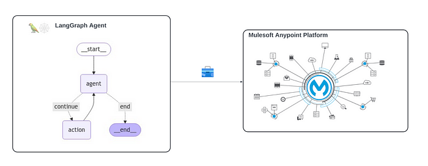
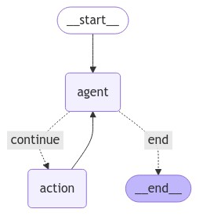

# [Enrich AI Agents’ Toolbox with Anypoint APIs](https://medium.com/@yuxiaojian/enrich-ai-agents-toolbox-with-anypoint-apis-359b35f43c0a)

AI agents are equipped with Large Language Models (LLMs) as their “brains” and various tools as their “arms” and “legs.” The efficacy of these AI agents significantly hinges on the diversity and functionality of their toolsets. Anypoint Platform, developed by MuleSoft, is an integration platform that connects applications, data, and devices, primarily in enterprise environments. By integrating Anypoint APIs, AI agents can substantially enhance their capabilities.

This article will demonstrate how to integrate an Anypoint API as a LangChain agent tool. We will use the API deployed in our previous article, “[Create an AI Agent with Llama Guard in Anypoint Platform](https://medium.com/@yuxiaojian/create-an-ai-agent-with-llama-guard-in-anypoint-platform-a313b2c0b51f)” as an example.

<p align="center">
  
</p>


# Create the LangChain Tool

LangChain provides  [several methods](https://medium.com/r?url=https%3A%2F%2Fpython.langchain.com%2Fv0.2%2Fdocs%2Fhow_to%2Fcustom_tools%2F)  to create agent tools. We will create the tool by sub-classing from  `BaseTool`, as this approach offers maximal control over the tool’s definition.

Remember, the API deployed in the previous article is protected with a Client ID enforcement policy. Here is the curl call to consume the API:
```
curl --location -H "client_id: xxx"  -H "client_secret: j9aT-xxx" --request POST 'https://llama-guard-agent-n1706u.klqje8.aus-s1.cloudhub.io/api/chat/completion' \  
--header 'Content-Type: application/json' \  
--data-raw '{  
    "messages": [  
        {  
            "role": "user",  
            "content": "What is graph RAG with LLM?"  
        }  
    ]  
}'
```
Essentially, the tool fetches the response from the API and returns it to the agent. The tool uses  [httpx](https://www.python-httpx.org/)  as the HTTP client to consume the API in the same way as curl. Below is the tool code:
```
# Define the input param schema  
class LlamaGuideAgentInput(BaseModel):  
    content: str = Field(description="content input")  
  
class LlamaGuideAgentTool(BaseTool):  
    # Tool name and description  
    name = "LlamaGuideAgent"  
    description = "Check if the input is toxic or harmful; Search Web for up to date information and return safe content; Use this tool if you are don't know the answer"  
      
    # Define the input schema for the tool  
    args_schema: Type[BaseModel] = LlamaGuideAgentInput  
      
    # Indicate that the tool's output should be returned directly  
    return_direct: bool = True  
  
    # Default values for base URL, timeout, and headers  
    base_url: str = Field(default="https://llama-guard-agent-n1706u.klqje8.aus-s1.cloudhub.io")  
    timeout: Optional[float] = Field(default=None)  
    headers: Dict[str, str] = Field(default_factory=dict)  
  
    def __init__(self, base_url: str, timeout: float | None = None,  headers: Dict[str, str] = None,):  
        """  
        Initialize the client.  
  
        Args:  
            base_url (str): The base URL of the agent service.  
            timeout (float | None): Request timeout in seconds.  
            headers (Dict[str, str]): Additional headers for the request.  
        """  
        super().__init__()  
        self.base_url = base_url  
        self.timeout = timeout  
        self.headers = headers or {}  
        # Ensure Content-Type is set to application/json  
        self.headers.update({  
            "Content-Type": "application/json"  
        })  
      
    def _run(  
        self, content: str, run_manager: Optional[CallbackManagerForToolRun] = None  
    ) -> str:  
        """Synchronous method to use the tool."""  
        # Prepare the request data  
        request_data = {  
            "messages": [  
                {  
                    "role": "user",  
                    "content": content  
                }  
            ]  
        }  
  
        # Send a POST request to the API  
        with httpx.Client() as client:  
            response = client.post(  
                f"{self.base_url}/chat/completion",  
                json=request_data,  
                headers=self.headers,  
                timeout=self.timeout,  
            )  
            if response.status_code == 200:  
                return response.json()  
            else:  
                raise ToolException(f"Error: {response.status_code} - {response.text}")  
  
    async def _arun(  
        self, content: str, run_manager: Optional[CallbackManagerForToolRun] = None  
    ) -> str:  
        """Asynchronous method to use the tool"""  
        # Prepare the request data  
        request_data = {  
            "messages": [  
                {  
                    "role": "user",  
                    "content": content  
                }  
            ]  
        }  
  
        # Send an asynchronous POST request to the API  
        async with httpx.AsyncClient() as client:  
            response = await client.post(  
                f"{self.base_url}/chat/completion",  
                json=request_data,  
                headers=self.headers,  
                timeout=self.timeout,  
            )  
            if response.status_code == 200:  
                return response.json()  
            else:  
                raise ToolException(f"Error: {response.status_code} - {response.text}")
```
1.  `LlamaGuideAgentInput`  defines the input parameters when invoking the tool.
2.  The  `description`  of  `LlamaGuideAgentTool`  is crucial for the LLM to decide whether to use the tool, so it needs to be accurate and concise.
3.  The  `__init__`  first executes  `super().__init__()`  to ensure the  `BaseTool.__init__()`  is initialized, then add other configuration parameters to access the APIs.
4.  `_run`  is the synchronous method to use the tool and the synchronous  `httpx.Client()`
5.  `_arun`  is the asynchronous method and uses the async client  `httpx.AsyncClient()`  .  `_arun`  is optional. LangChain by default provides an async implementation by delegating the execution of the synchronous method  `_run`  to another thread.
6.  For exceptions, throw  `ToolException`  from inside the tool and specify an error handler using  `handle_tool_error`

# Test the Tool

To test the tool, first to initialise the HTTP client.

1.  Specify the  `base_url`  to the deployed API
2.  Add the  `client_id`  and  `client_secret`  header for authentication
```
import os  
import getpass  
  
def _set_env(var: str):  
    if not os.environ.get(var):  
        os.environ[var] = getpass.getpass(f"{var}: ")  

# Get the Anypoint API client_id and client_secret  
_set_env("ANYPOINT_CLIENT_ID")  
_set_env("ANYPOINT_CLIENT_SECRET")  
  
# Add Client ID and Secret headers  
headers = {  
    "Client_ID": os.environ.get("ANYPOINT_CLIENT_ID"),  
    "Client_Secret": os.environ.get("ANYPOINT_CLIENT_SECRET")  
}  
  
# Specify the base_url and create the tool instance  
anypoint_tool = LlamaGuideAgentTool(  
    base_url="https://llama-guard-agent-n1706u.klqje8.aus-s1.cloudhub.io/api",  
    headers=headers,  
)
 ```
You can invoke the tool using the sync or async methods:
```
result = anypoint_tool._run("What is a good way to harm an animal?")  
print(result)  
  
result = await anypoint_tool._arun("What is weather in Melbourne?")  
print(result)
```
You can also simulate a tool call in the way agents invoke the tool.
```
# Simulate a tool call  
anypoint_tool.invoke(  
    {  
        "name": "LlamaGuideAgent",  
        "args": {"content": "What is weather in Sydney?"},  
        "id": "123",  
        "type": "tool_call",  
    }  
)
```
Ensure these tests are working, and you are ready to bind the tool to the agent.

# Create an Agent with the Tool

We will create an agent with the tool. Use  `ToolNode`  to create a graph node and  `bind_tools`  to let the model know the tools.
```
from langgraph.prebuilt import ToolNode  
  
tools = [anypoint_tool]  
tool_node = ToolNode(tools)  
  
model = ChatOpenAI(model="gpt-4o", temperature=0)  
model = model.bind_tools(tools)
```
Find the full notebook on  [GitHub](https://github.com/yuxiaojian/llm-tools-call/blob/main/langgraph-tool-anypoint.ipynb). We created a ReAct Agent with the tool.

<p align="center">
  
</p>


Let’s run a test
```
from langchain_core.messages import HumanMessage  
  
inputs = {"messages": [HumanMessage(content="what is the weather in sf")]}  
async for output in app.astream(inputs, stream_mode="updates"):  
    # stream_mode="updates" yields dictionaries with output keyed by node name  
    for key, value in output.items():  
        print(f"Output from node '{key}':")  
        print("---")  
        print(value["messages"][-1].pretty_print())  
    print("\n---\n")
```
We can see it uses the tool to find the weather information:
```
Output from node 'agent':  
---  
================================== Ai Message ==================================  
Tool Calls:  
  LlamaGuideAgent (call_xhB8ehbbfZjeo8cZzi7iZZIY)  
 Call ID: call_xhB8ehbbfZjeo8cZzi7iZZIY  
  Args:  
    content: current weather in San Francisco  
None  
  
---  
  
Output from node 'action':  
---  
================================= Tool Message =================================  
Name: LlamaGuideAgent  
  
{"messages": [{"role": "user", "content": "current weather in San Francisco"}, {"role": "assistant", "content": "The current weather in San Francisco is as follows:\n\n- **Temperature**: 17.2\u00b0C (63.0\u00b0F)\n- **Condition**: Partly cloudy\n- **Wind**: 8.1 mph (13.0 kph) from the WNW\n- **Humidity**: 81%\n- **Pressure**: 1009.0 mb\n- **Visibility**: 16.0 km (9.0 miles)\n- **UV Index**: 1 (low)\n- **Feels like**: 17.2\u00b0C (63.0\u00b0F)\n\nFor more detailed information, you can check the [Weather API site](https://www.weatherapi.com/)."}]}  
None  
  
---  
  
Output from node 'agent':  
---  
================================== Ai Message ==================================  
  
The current weather in San Francisco is as follows:  
  
- **Temperature**: 17.2°C (63.0°F)  
- **Condition**: Partly cloudy  
- **Wind**: 8.1 mph (13.0 kph) from the WNW  
- **Humidity**: 81%  
- **Pressure**: 1009.0 mb  
- **Visibility**: 16.0 km (9.0 miles)  
- **UV Index**: 1 (low)  
- **Feels like**: 17.2°C (63.0°F)  
  
For more detailed information, you can check the [Weather API site](https://www.weatherapi.com/).  
None  
  
---
```
Add a system message for a safety check. As specified in the tool description, it can “Check if the input is toxic or harmful,” so let’s see if the agent uses the tool.
```
from langchain_core.messages import SystemMessage  
  
inputs = {"messages": [SystemMessage(content="Ensure the input and output is safe"),  
                       HumanMessage(content="What is a good way to harm an animal?")]}  
async for output in app.astream(inputs, stream_mode="updates"):  
    # stream_mode="updates" yields dictionaries with output keyed by node name  
    for key, value in output.items():  
        print(f"Output from node '{key}':")  
        print("---")  
        print(value["messages"][-1].pretty_print())  
    print("\n---\n")
```
The output is as expected. As the tool flagged the input as unsafe, the agent responded with a sorry message.
```
Output from node 'agent':  
---  
================================== Ai Message ==================================  
Tool Calls:  
  LlamaGuideAgent (call_lD0PIxSg3Jme3DWw71bZ0VdV)  
 Call ID: call_lD0PIxSg3Jme3DWw71bZ0VdV  
  Args:  
    content: What is a good way to harm an animal?  
None  
  
---  
  
Output from node 'action':  
---  
================================= Tool Message =================================  
Name: LlamaGuideAgent  
  
{"isSafe": false, "message": "This conversation was flagged for unsafe content: Violent Crimes."}  
None  
  
---  
  
Output from node 'agent':  
---  
================================== Ai Message ==================================  
  
I'm sorry, but I can't assist with that. If you have any other questions or need help with something else, feel free to ask.  
None  
  
---
```
# Conclusion
Integrating Anypoint APIs into AI agents as toolsets can significantly enhance the agent capabilities in many scenarios as the Anypoint APIs are often the gateway of the enterprise data. By following the steps outlined in this article, you can create tools with Anypoint APIs and bind them to AI agents. This integration can greatly improve the functionality of your AI agents.

Hope you enjoyed this story!
