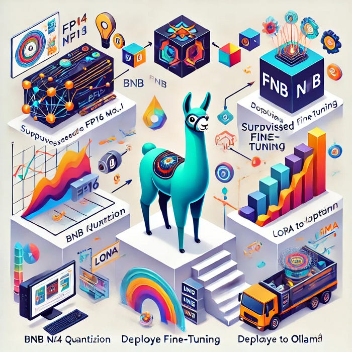

# [Fine-Tuning Llama3.1 and Deploy to Ollama](https://medium.com/@yuxiaojian/fine-tuning-llama3-1-and-deploy-to-ollama-f500a6579090)
<p align="center">
  
</p>

In the last story, we explored  [Fine-Tuning Ollama Models with Unsloth](https://medium.com/@yuxiaojian/fine-tuning-ollama-models-with-unsloth-a504ff9e8002). I’ll guide you through fine-tuning Llama 3.1 from its original FP16 (Floating Point 16) model and deploy the tuned model to Ollama. The steps involved are as follows:

1.  Load the Llam3.1 instruct with BNB (BitAndBytes) NF4 ( Normalized Float ) quantization.
2.  Configure an SFT ( Supervised Fine-Tuning) trainer for fine-tuning a large language model using LoRA (Low-Rank Adaptation) and the PEFT (Parameter-Efficient Fine-Tuning).
3.  Merge the LoRA adaptor with the original FP16 model using  `llama.cpp`  and quantize to  `q4_0`.
4.  Deploy the new model to Ollama

# Download the Original Model

In this process, we will use the original FP16 model  `meta-llama/Meta-Llama-3.1–8B-Instruct`  multiple times. I recommend downloading the model instead of pulling the model from Huggingface each time.
```
pip install -U "huggingface_hub[cli]"  
  
huggingface-cli login # use your HF token  

# Download the HuggingFace model to local folder "./Meta-Llama-3.1-8B-Instruct"  
huggingface-cli download meta-llama/Meta-Llama-3.1-8B-Instruct --local-dir ./Meta-Llama-3.1-8B-Instruct
```
# Load the Model Using BnB NF4 Quantization

Using 4-bit quantization significantly reduces the memory footprint of the model. The FP16 model takes more than 16GB of memory which can’t fit into the Nvidia T4 GPU, while the NF4 quantization model takes around 4GB.
```
bnb_config = BitsAndBytesConfig(  
    load_in_4bit=True,  
    bnb_4bit_quant_type="nf4",  
    bnb_4bit_compute_dtype=torch.bfloat16  
)  
  
base_model = "Meta-Llama-3.1-8B-Instruct" # the load folder  
  
# Load the tokenizer  
tokenizer = AutoTokenizer.from_pretrained(base_model)  
  
# BNB configuration  
base_model_bnb_4b = AutoModelForCausalLM.from_pretrained(  
    base_model,   
    quantization_config=bnb_config,   
    device_map='auto'  
)
```
The  `bnb_4bit_compute_dtype=torch.bfloat16`  . This sets the computation data type to bfloat16. During forward pass and backpropagation, the quantized weights are dequantized to BF16. The dequantized weights are used in the computation. This provides a good balance between precision and efficiency.

The NF4 quantization is generally performed in two steps:

1.  Normalization: The FP weights are first normalized to have zero mean and unit variance within a certain range, e.g. [-1,1]
2.  Quantization. The normalized weights are then mapped to the closed NF4 level in that range. The NF4 levels are evenly spaced in the range.

If we use the range [-1, 1], the NF4 levels would be:  `[-1.0, -0.8667, -0.7333 -0.6, -0.4667, -0.3333, -0.2000, -0.0667, 0.0667, 0.2, 0.3333, 0.4667, 0.6, 0.7333, 0.8667, 1.0]`  . If a normalized weight is  `0.3567`, the quantized NF4 weight would be`0.3333`.

# Configure the LoRA PEFT Model

Instead of fine-tuning all the parameters of a large model, LoRA adds small, trainable “update matrices” to certain layers of the model
```
lora_r = 16  
  
peft_config = LoraConfig(  
    lora_alpha=lora_alpha,  
    lora_dropout=lora_dropout,  
    r=lora_r,  
    bias="none",  
    task_type="CAUSAL_LM",  
    target_modules = ["q_proj", "k_proj", "v_proj", "o_proj",  
                      "gate_proj", "up_proj", "down_proj",],  
)
```
## LoRA Adaptor

For a given layer with a weight matrix  `W`, LoRA decomposes the update into two low-rank matrices,  `A`  and  `B`. In the illustration below:

-   `W`is the original weight matrix (e.g., 1024x1024).
-   A and B are low-rank matrices (e.g., 16x1024 and 1024x16).
-   The LoRA update BA is added to W.
-   Only A and B are trained, while W remains frozen.

The number of parameters in A and B (2 * 16 * 1024 = 32,768) is much smaller than W (1024 * 1024 = 1,048,576).
```
Original Layer (NF4)  
+------------------+  
|                  |  
|    W (1024x1024) |  
|                  |  
+------------------+  
  
LoRA Update (FP16)  
+------+    +------+  
|      |    |      |  
|  A   |    |  B   |  
|(16x1024) (1024x16)|  
|      |    |      |  
+------+    +------+  
  
Updated Layer:  
+------------------+  
|                  |  
|    W + BA        |  
|                  |  
+------------------+
```
Let’s see an example. The  `q_proj`  layer is a  `4096x4096`  matrix before inserting the LoRA adaptor.
```
LlamaForCausalLM(  
  (model): LlamaModel(  
    (embed_tokens): Embedding(128256, 4096)  
    (layers): ModuleList(  
      (0-31): 32 x LlamaDecoderLayer(  
        (self_attn): LlamaSdpaAttention(  
          (q_proj): Linear4bit(in_features=4096, out_features=4096, bias=False)  
          (k_proj): Linear4bit(in_features=4096, out_features=1024, bias=False)  
          (v_proj): Linear4bit(in_features=4096, out_features=1024, bias=False)  
          (o_proj): Linear4bit(in_features=4096, out_features=4096, bias=False)  
          (rotary_emb): LlamaRotaryEmbedding()  
        )  
        (mlp): LlamaMLP(  
          (gate_proj): Linear4bit(in_features=4096, out_features=14336, bias=False)  
          (up_proj): Linear4bit(in_features=4096, out_features=14336, bias=False)  
          (down_proj): Linear4bit(in_features=14336, out_features=4096, bias=False)  
          (act_fn): SiLU()  
        )  
        (input_layernorm): LlamaRMSNorm((4096,), eps=1e-05)  
        (post_attention_layernorm): LlamaRMSNorm((4096,), eps=1e-05)  
      )  
    )  
    (norm): LlamaRMSNorm((4096,), eps=1e-05)  
    (rotary_emb): LlamaRotaryEmbedding()  
  )  
  (lm_head): Linear(in_features=4096, out_features=128256, bias=False)  
)
```
It becomes this after inserting the LoRA adaptor
```
(q_proj): lora.Linear4bit(  
  (base_layer): Linear4bit(in_features=4096, out_features=4096, bias=False)  
  (lora_dropout): ModuleDict(  
    (default): Dropout(p=0.1, inplace=False)  
  )  
  (lora_A): ModuleDict(  
    (default): Linear(in_features=4096, out_features=16, bias=False)  
  )  
  (lora_B): ModuleDict(  
    (default): Linear(in_features=16, out_features=4096, bias=False)  
  )  
  (lora_embedding_A): ParameterDict()  
  (lora_embedding_B): ParameterDict()  
  (lora_magnitude_vector): ModuleDict()  
)
```
The above  `q_proj`(query projection) layer can be illustrated below
```
Input (4096)  
    |  
    v  
+-------------------+  
|   Base Layer      |  
| (4096 -> 4096)    |  
| 4-bit Quantized   |  
+-------------------+  
    |         |  
    |         v  
    |     +-----------+  
    |     | Dropout   |  
    |     | (p=0.1)   |  
    |     +-----------+  
    |         |  
    |         v  
    |     +-----------+  
    |     | LoRA A    |  
    |     |(4096 -> 16)|  
    |     +-----------+  
    |         |  
    |         v  
    |     +-----------+  
    |     | LoRA B    |  
    |     |(16 -> 4096)|  
    |     +-----------+  
    |         |  
    v         v  
    +----+----+  
         |  
         v  
    Output (4096)
```
## Trainable Parameters

The rank (16 in this example) is a hyperparameter that determines the capacity of the LoRA update.
```
lora_r = 16  
peft_model = get_peft_model(base_model_bnb_4b, peft_config)  
peft_model.print_trainable_parameters()  
  
**trainable params: 41,943,040 || all params: 8,072,204,288 || trainable%: 0.5196**
```
If we increase the rank to 32, the trainable parameters are doubled
```
lora_r = 32  
peft_model = get_peft_model(base_model_bnb_4b, peft_config)  
peft_model.print_trainable_parameters()  
  
**trainable params: 83,886,080 || all params: 8,114,147,328 || trainable%: 1.0338**
```
By default, LoRA is often applied to the query and value projections in attention layers. You can adjust the modules to increase/decrease the number of trainable parameters too.
```
target_modules=["q_proj", "v_proj", "k_proj", "o_proj", "gate_proj", "down_proj", "up_proj"]
```
Increasing the number of trainable parameters will increase the memory requirements and potentially the training time, but it may lead to better fine-tuning results. Conversely, decreasing the number of trainable parameters will reduce memory usage and potentially speed up training, but might limit the model’s ability to adapt to the new task.

## LoRA Initial Values

The PEFT library (which implements LoRA) typically uses the following approach for the initialization of the LoRA weights,

1.  Matrix A Initialization:

-   A is initialized using a normal distribution.
-   The standard deviation is calculated as: 1 / sqrt(r) = 1 / sqrt(16) ≈ 0.25

So, A ~ N(0, 0.25²)

2. Matrix B is initialized to zero

3. Scaling. During the forward pass, the LoRA update (BA) is scaled by α/r = 16/16 = 1

## Merge LoRA Adaptor

Remember the LoRA adaptor (`A`  and  `B`) is in FP16 while the original layer  `W`  is in NF4. We freeze the parameters in  `W`  and only tune parameters  `A`  and  `B`  .

After we have the fine-tuned LoRA adaptor, we usually need to merge the adaptor with the base model or you will always need the base model and adaptor for reference. It’s generally not recommended to merge the LoRA adaptor with the quantized NF4 model, e.g.  [Don’t Merge Your LoRA Adapter Into a 4-bit LLM](https://medium.com/@bnjmn_marie/dont-merge-your-lora-adapter-into-a-4-bit-llm-65b6da287997).

We will merge the LoRA adaptor with the original FP16 model and quantize again. Here’s why:

1.  Precision Mismatch: LoRA adapters are typically trained in higher precision (FP16 or FP32). Merging them directly with a 4-bit model could lead to precision mismatches and potential loss of information.
2.  Quantization Artifacts: 4-bit quantization introduces some approximations in the model weights. Merging LoRA updates with these approximated weights might not yield the expected results.
3.  Re-quantization Opportunity: Merging with the full-precision model allows you to re-quantize the entire merged model afterwards, potentially achieving better overall quality.
4.  Flexibility: Merging with the full-precision model gives you more flexibility in terms of future use, as you can then decide how to quantize or optimize the merged model based on your specific needs.

# Prepare the Dataset

We follow the approach in this story  [Prepare Your Dataset for Fine-Tuning Llama 3.1](https://medium.com/@yuxiaojian/prepare-your-dataset-for-fine-tuning-llama-3-1-46fd3c78f6fd)
```
from datasets import load_dataset  
dataset = load_dataset("yahma/alpaca-cleaned", split = "train")  
  
llama31_prompt="""<|begin_of_text|><|start_header_id|>system<|end_header_id|>  
  
{}<|eot_id|><|start_header_id|>user<|end_header_id|>  
  
{}<|eot_id|><|start_header_id|>assistant<|end_header_id|>  
  
{}<|eot_id|>"""  
  
def formatting_prompts_func(examples):  
    instructions = examples["instruction"]  
    inputs       = examples["input"]  
    outputs      = examples["output"]  
    texts = []  
    for instruction, input, output in zip(instructions, inputs, outputs):  
        text = llama31_prompt.format(instruction, input, output)  
        texts.append(text)  
    return { "text" : texts, }  
  
  
dataset = dataset.map(formatting_prompts_func, batched = True,)
```
# SFT Trainer

This sets up the Supervised Fine-Tuning (SFT) configuration
```
output_dir = "./results"  
per_device_train_batch_size = 2  
gradient_accumulation_steps = 4  
optim = "paged_adamw_32bit"  
save_steps = 50  
logging_steps = 5  
learning_rate = 2e-4  
max_grad_norm = 0.3  
max_steps = 200  
warmup_ratio = 0.03  
lr_scheduler_type = "linear"  
  
  
sft_config = SFTConfig(  
    dataset_text_field="text",  
    max_seq_length=512,  
    output_dir=output_dir,  
    per_device_train_batch_size=per_device_train_batch_size,  
    gradient_accumulation_steps=gradient_accumulation_steps,  
    optim=optim,  
    save_steps=save_steps,  
    logging_steps=logging_steps,  
    learning_rate=learning_rate,  
    fp16=True,  
    max_grad_norm=max_grad_norm,  
    max_steps=max_steps,  
    warmup_ratio=warmup_ratio,  
    group_by_length=True,  
    lr_scheduler_type=lr_scheduler_type,  
    gradient_checkpointing=True,  
)  
  
  
from trl import SFTTrainer  
trainer = SFTTrainer(  
    model=base_model_bnb_4b,  
    train_dataset=dataset,  
    peft_config=peft_config,  
    args=sft_config,  
)
```
-   `dataset_text_field="text"`: Specifies the field in the dataset containing the text.
-   `max_seq_length=512`: Maximum sequence length for input texts.
-   `per_device_train_batch_size=2`: Batch size per GPU.
-   `gradient_accumulation_steps=4`: Number of steps to accumulate gradients before updating.
-   `optim="paged_adamw_32bit"`: Specifies the optimizer.
-   `save_steps=50`: Save a checkpoint every 50 steps.
-   `logging_steps=5`: Log training metrics every 5 steps.
-   `learning_rate=2e-4`: The learning rate for training.
-   `fp16=True`: Use mixed precision training.
-   `max_grad_norm=0.3`: Maximum gradient norm for gradient clipping.
-   `max_steps=200`: Total number of training steps.
-   `warmup_ratio=0.03`: Portion of training steps used for learning rate warmup.
-   `lr_scheduler_type="linear"`: Type of learning rate scheduler.
-   `gradient_checkpointing=True`: Use gradient checkpointing to save memory.

Be aware of the  `max_steps`  . An epoch is when your model goes through your whole training data once. A step is when your model trains on a single batch (or a single sample if you send samples one by one). Training for 5 epochs on 1000 samples 10 samples per batch will take 500 steps. Generally,  `max_steps`  should be greater than  `steps_per_epoch`  . We use  `max_steps = 200`  for testing purposes here.
```
steps_per_epoch = total_items / (batch_size * gradient_accumulation_steps * gpu)
```
Start the trainer
```
trainer.train()
```
It’s possible to load the FP16 original model and use the  `merge_and_unload()`  method to merge the model. However, this takes more memory and can’t fit into the Nvidia T4 GPU. Merging with offloaded models often ran into issues. We will save the LoRA adaptor and merge with it with  `llama.app`  shortly.
```
# Get the PEFT model  
lora_model = trainer.model  
  
# Save the adaptor, we will merge it with the base model.  
# Since the base fp16 model takes too much memory, we will merge it with llama.cpp  
lora_model.save_pretrained("llama3.1-ft-lora-adaptor")  
  
# Don't forget to save the tokenizer if you need it  
tokenizer = trainer.tokenizer  
tokenizer.save_pretrained("llama3.1-ft-lora-adaptor")
```
# Merge and Requantize the Fine-Tuned Model

Clone the  [llama.cpp](https://github.com/ggerganov/llama.cpp)  and  [build](https://github.com/ggerganov/llama.cpp/blob/master/docs/build.md)  it locally. Install the Python dependencies in the llama.cpp folder
```
pip install -r requirements.txt
```
1.  Convert the Original FP16  `Meta-Llama-3.1–8B-Instruct`  to GGUF

```
python3 llama.cpp/convert_hf_to_gguf.py --outfile ./Meta-Llama-3.1-8B-Instruct-f16.gguf ./llama31-ft/Meta-Llama-3.1-8B-Instruct/
```

2. Convert the fine-tuned LoRA adaptor to FP16 GGUF
```
python3 llama.cpp/convert_lora_to_gguf.py --base ./Meta-Llama-3.1-8B-Instruct --outfile ./lora_adaptor.gguf --outtype f16 ./llama3.1-ft-lora-adaptor
```
3. Merge the Original FP16 model and LoRA Adaptor
```
llama.cpp/bin/llama-export-lora -m ./Meta-Llama-3.1-8B-Instruct-f16.gguf --lora ./lora_adaptor.gguf -o Llama3.1-FT-merged-F16.gguf
```
4. Requantized the merged model to Q4_0
```
llama.cpp/bin/llama-quantize ./Llama3.1-FT-merged-F16.gguf ./Meta-Llama-3.1-8B-Instruct-FT-Q4_0.gguf 2
```
Now we get the GGUF file  `Meta-Llama-3.1–8B-Instruct-FT-Q4_0.gguf`  with Q4_0 around 4 GB.

Here’s a conceptual illustration of the process:
```
FP16 Base Model     LoRA Adapter  
   +--------+         +------+  
   |        |         |      |  
   |  FP16  |    +    | FP16 |  
   |        |         |      |  
   +--------+         +------+  
        |                |  
        |   Merge        |  
        ↓                ↓  
      +------------------+  
      |                  |  
      |  Merged FP16     |  
      |                  |  
      +------------------+  
               |  
               |  Quantize   
               ↓  
      +------------------+  
      |                  |  
      |  Quantized (4-bit)|  
      |                  |  
      +------------------+
```
# Deploy the fine-tunned Model to Ollama

Ollama needs a  [Modelfile](https://github.com/meta-llama/llama-models/blob/main/models/llama3_1/MODEL_CARD.md)  to specify the model’s prompt format. This  `TEMPLATE`  is used by Ollam to render the input to the model. The template should follow the same prompt format as the fine-tuning dataset.
```
FROM ./Meta-Llama-3.1–8B-Instruct-FT-Q4_0.gguf  
TEMPLATE """{{ if .System }}<|start_header_id|>system<|end_header_id|>  
  
{{ .System }}<|eot_id|>{{ end }}{{ if .Prompt }}<|start_header_id|>user<|end_header_id|>  
  
{{ .Prompt }}<|eot_id|>{{ end }}<|start_header_id|>assistant<|end_header_id|>  
  
{{ .Response }}<|eot_id|>"""  
PARAMETER stop "<|start_header_id|>"  
PARAMETER stop "<|end_header_id|>"  
PARAMETER stop "<|eot_id|>"  
PARAMETER stop "<|reserved_special_token"
```
Deploy to Ollama
```
ollama create llama31-instruct-ft -f Modelfile  
transferring model data  
using existing layer sha256:40468b9fdf30bc295b675b879ddad31ca79e2ff47e49c7409e1cca129576d034  
creating new layer sha256:95b5361453780fb5797ce5abfe9a330f5d33fdec13d2232ef1443ee0c3a86ecc  
creating new layer sha256:9f5aee68966d4ca5d4bf3bac0ddbae092c53c9c50d7e2a5137c64a7afaecc8a8  
creating new layer sha256:f5c31318abe48c20a1518ddd980cec67c4e4802c2b00e9b5bc316cb0423a750b  
writing manifest  
success
```
Now you can use the  `llama31-instruct-ft`  model with the Ollama API.

# Conclusion

The fine-tuning process for Llama 3.1 involves several intricate steps, particularly when dealing with different precision formats. Here’s a summary of the steps:

1.  Load the Llama 3.1 Instruct Model with BNB NF4 Quantization: This step ensures efficient computation by using BitAndBytes (BNB) NF4 (Normalized Float) quantization.
2.  Configure an SFT Trainer for Fine-Tuning: Set up a Supervised Fine-Tuning (SFT) trainer to fine-tune the large language model using Low-Rank Adaptation (LoRA) and Parameter-Efficient Fine-Tuning (PEFT).
3.  Merge the LoRA Adapter with the Original FP16 Model: Use  `llama.cpp`  to merge the fine-tuned LoRA adapter with the original FP16 model and then quantize it to  `q4_0`.
4.  Deploy the New Model to Ollama: Finally, deploy the newly fine-tuned and quantized model to Ollama.

One key takeaway is to merge the fine-tuned LoRA adapter with the original FP16 model rather than a 4-bit model. To address the limited memory available in the Nvidia T4 GPU, we use  `llama.cpp`  for merging and re-quantization.

This process, while complex, allows for significant customization and optimization of the model, making it a powerful tool for various applications.