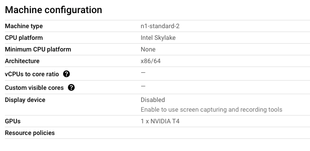
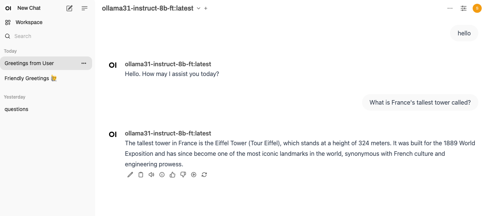

# [Fine-Tuning Ollama Models with Unsloth](https://medium.com/@yuxiaojian/fine-tuning-ollama-models-with-unsloth-a504ff9e8002)


<p align="center">
  
</p>


In the previous two articles, we explored  [Host Your Own Ollama Service in a Cloud Kubernetes (K8s) Cluster](https://medium.com/@yuxiaojian/host-your-own-ollama-service-in-a-cloud-kubernetes-k8s-cluster-c818ca84a055)  and  [Run Your Own OLLAMA in Kubernetes with Nvidia GPU](https://medium.com/@yuxiaojian/run-your-own-ollama-in-kubernetes-with-nvidia-gpu-8974d0c1a9df). By now, you should have a decent LLM service hosted by yourself. In this article, we will delve into the fine-tuning process of Ollama models using  [Unsloth](https://github.com/unslothai/unsloth), using Llama3.1 as an example. The same process applies to other models.

# Why Fine-Tuning?

Fine-tuning is a process in LLM where a pre-trained model is further trained on a specific dataset to adapt it to a particular task or domain. It’s akin to taking a chef who knows general cooking techniques and training them specifically to cook Italian cuisine.

Fine-tuning enables you to customize a Large Language Model’s (LLM) responses to fit your preferred tone or adapt it to follow domain-specific instructions. This allows the model to leverage the general knowledge it has already acquired while becoming more specialized in the new domain.

# Fine-Tuning Versus RAG

RAG (Retrieval-Augmented Generation) is a technique that combines the capabilities of large language models with information retrieval systems. It retrieves relevant documents or data from an external database and uses them to generate more accurate and contextually appropriate responses. It’s like a student who, before answering a question, looks up the most relevant books and articles to provide a well-informed answer.

While RAG can solve some problems, there are still reasons why fine-tuning LLMs is important even when RAG is available:

1.  **Enhances performance for specific tasks or domains**. Fine-tuning can significantly improve performance on specific tasks or domains that the base model wasn’t explicitly trained for.
2.  **Ensures a consistent style or tone**. Fine-tuning allows the model to learn a consistent style or tone that matches your specific use case.
3.  **Internalizes implicit knowledge and reasoning.**  Fine-tuning can help the model internalize implicit knowledge and reasoning patterns that might not be explicitly stated in retrievable documents. A fine-tuned model can better understand context and nuances.
4.  **Incorporates proprietary knowledge securely.**  Fine-tuning allows the incorporation of proprietary knowledge directly into the model, which can be more secure than storing this information in an external knowledge base for RAG.
5.  **Reduction of hallucinations**. Fine-tuning can help the model learn to handle noisy or sparse data better by exposing it to such data during the training process.

That being said, RAG and fine-tuning are not mutually exclusive. In many cases, a combination of both techniques can yield the best results. Fine-tuning can improve the model’s base capabilities and understanding of a domain, while RAG can supplement this with up-to-date or highly specific information.

# Setup the Environment

The fine-tuning environment has many dependencies and can be complex to install from scratch. I use a container image to maintain a consistent runtime. I use a VM with an NVIDIA T4 GPU from Google Cloud.

<p align="center">
  
</p>

## 1. Install GPU Driver

For information on installing the driver using a package manager, refer to the  [NVIDIA Driver Installation Quickstart Guide](https://docs.nvidia.com/cuda/cuda-installation-guide-linux/). Alternatively, if the OS is  `Ubuntu`, you can use  `ubuntu-drivers`  for auto-detection and installation.
```
apt install ubuntu-drivers-common  
ubuntu-drivers devices  
ubuntu-drivers autoinstall  
reboot
```
Reboot the VM and run  `nvidia-smi`  , it should show the GPU information.
```
nvidia-smi  
Wed Aug 21 00:54:26 2024  
+---------------------------------------------------------------------------------------+  
| NVIDIA-SMI 535.183.01             Driver Version: 535.183.01   CUDA Version: 12.2     |  
|-----------------------------------------+----------------------+----------------------+  
| GPU  Name                 Persistence-M | Bus-Id        Disp.A | Volatile Uncorr. ECC |  
| Fan  Temp   Perf          Pwr:Usage/Cap |         Memory-Usage | GPU-Util  Compute M. |  
|                                         |                      |               MIG M. |  
|=========================================+======================+======================|  
|   0  Tesla T4                       Off | 00000000:00:04.0 Off |                    0 |  
| N/A   69C    P8              12W /  70W |     70MiB / 15360MiB |      0%      Default |  
|                                         |                      |                  N/A |  
+-----------------------------------------+----------------------+----------------------+  
+---------------------------------------------------------------------------------------+  
| Processes:                                                                            |  
|  GPU   GI   CI        PID   Type   Process name                            GPU Memory |  
|        ID   ID                                                             Usage      |  
|=======================================================================================|  
|    0   N/A  N/A      1695      G   /usr/lib/xorg/Xorg                           59MiB |  
|    0   N/A  N/A      1884      G   /usr/bin/gnome-shell                          7MiB |  
+---------------------------------------------------------------------------------------+
```
## 2. Install the NVIDIA Container Toolkit

Install the  [NVIDIA Container Toolkit](https://docs.nvidia.com/datacenter/cloud-native/container-toolkit/latest/install-guide.html).
```
# Configure the production repository:  
curl -fsSL https://nvidia.github.io/libnvidia-container/gpgkey | sudo gpg --dearmor -o /usr/share/keyrings/nvidia-container-toolkit-keyring.gpg \  
  && curl -s -L https://nvidia.github.io/libnvidia-container/stable/deb/nvidia-container-toolkit.list | \  
    sed 's#deb https://#deb [signed-by=/usr/share/keyrings/nvidia-container-toolkit-keyring.gpg] https://#g' | \  
    sudo tee /etc/apt/sources.list.d/nvidia-container-toolkit.list  
  
#Update the packages list from the repository:  
sudo apt-get update  
  
#Install the NVIDIA Container Toolkit packages:  
sudo apt-get install -y nvidia-container-toolkit

Configure the Docker runtime to use it.

nvidia-ctk runtime configure --runtime=docker  
systemctl restart docker
```
## 3. Create a Container Image

The image is built from  `nvidia/cuda`to have GPU support. It sets up a Python 3.11 environment. The requirements.txt includes all Python dependencies.

The image is built from  `nvidia/cuda`  to have the GPU support. It sets up a  `Python 3.11`  environment.
```
# Start with the NVIDIA CUDA base image  
FROM nvidia/cuda:12.6.0-base-ubuntu22.04  
  
# Set environment variables  
ENV DEBIAN_FRONTEND=noninteractive  
  
# Update, install necessary packages, and clean up in a single RUN command  
RUN apt-get update && apt-get install -y --no-install-recommends \  
    software-properties-common \  
    curl \  
    build-essential \  
    git \  
    && add-apt-repository ppa:deadsnakes/ppa \  
    && apt-get update \  
    && apt-get install -y --no-install-recommends \  
    python3.11 \  
    python3.11-dev \  
    python3.11-distutils \  
    && curl -sS https://bootstrap.pypa.io/get-pip.py | python3.11 \  
    && update-alternatives --install /usr/bin/python python /usr/bin/python3.11 1 \  
    && update-alternatives --install /usr/bin/python3 python3 /usr/bin/python3.11 1 \  
    && apt-get purge -y --auto-remove software-properties-common \  
    && apt-get clean \  
    && rm -rf /var/lib/apt/lists/*  
  
# Verify Python installation  
RUN python --version && pip --version  
  
# Set the working directory in the container  
WORKDIR /app  
COPY . /app  
  
RUN pip install --no-cache-dir -r requirements.txt  
  
ENV NVIDIA_DRIVER_CAPABILITIES=compute,utility  
ENV NVIDIA_VISIBLE_DEVICES=all  
  
# Command to run when the container starts  
CMD ["/bin/bash"]
```
The  `requirements.txt`  includes all Python dependencies.
```
accelerate==0.33.0  
bitsandbytes==0.43.3  
peft==0.12.0  
trl==0.8.6  
unsloth==2024.8  
xformers==0.0.26.post1  
sentencepiece
```
Create a new folder and put the  `Dockerfile`  and  `requirements.txt`  in the folder, then build the image
```
docker build -t cuda-py311-tuner .
```
After installing the Unsloth framework, the image grows up to 7GB. The fine-tuning job also requires a lot of disk space. I recommend a 100GB disk.

Now, run the container. The host path  `/opt/fine-tuning`  is mounted to the container  `/app`  as the working directory.
```
docker run --rm  --gpus=all -v /opt/fine-tuning:/app -it cuda-py311-tuner
```
# Fine-Tuning

The original tuning script is from Unsloth  [Llama 3.1 (8B)](https://colab.research.google.com/drive/1Ys44kVvmeZtnICzWz0xgpRnrIOjZAuxp?usp=sharing). The dataset is from  [Hugging Face](https://huggingface.co/datasets/yahma/alpaca-cleaned). You can use your own dataset either from Hugging Face or  [load](https://huggingface.co/docs/datasets/en/loading)  it locally.
```
"""  
Original file is located at https://colab.research.google.com/drive/1NuloNJhx1hkQoM5LqNBAiLwUxQCkl7T0  
  
"""  
  
from unsloth import FastLanguageModel  
import torch  
max_seq_length = 2048 # Choose any! We auto support RoPE Scaling internally!  
dtype = None # None for auto detection. Float16 for Tesla T4, V100, Bfloat16 for Ampere+  
load_in_4bit = True # Use 4bit quantization to reduce memory usage. Can be False.  
  
  
model, tokenizer = FastLanguageModel.from_pretrained(  
    model_name = "unsloth/Meta-Llama-3.1-8B-Instruct-bnb-4bit",  
    max_seq_length = max_seq_length,  
    dtype = dtype,  
    load_in_4bit = load_in_4bit,  
    # token = "hf_...", # use one if using gated models like meta-llama/Llama-2-7b-hf  
)  
  
  
"""We now add LoRA adapters so we only need to update 1 to 10% of all parameters!"""  
  
model = FastLanguageModel.get_peft_model(  
    model,  
    r = 16, # Choose any number > 0 ! Suggested 8, 16, 32, 64, 128  
    target_modules = ["q_proj", "k_proj", "v_proj", "o_proj",  
                      "gate_proj", "up_proj", "down_proj",],  
    lora_alpha = 16,  
    lora_dropout = 0, # Supports any, but = 0 is optimized  
    bias = "none",    # Supports any, but = "none" is optimized  
    # [NEW] "unsloth" uses 30% less VRAM, fits 2x larger batch sizes!  
    use_gradient_checkpointing = "unsloth", # True or "unsloth" for very long context  
    random_state = 3407,  
    use_rslora = False,  # We support rank stabilized LoRA  
    loftq_config = None, # And LoftQ  
)  
  
# Prepare data  
llama31_prompt="""<|begin_of_text|><|start_header_id|>system<|end_header_id|>  
  
{}<|eot_id|><|start_header_id|>user<|end_header_id|>  
  
{}<|eot_id|><|start_header_id|>assistant<|end_header_id|>  
  
{}<|eot_id|>"""  
from datasets import load_dataset  
dataset = load_dataset("yahma/alpaca-cleaned", split = "train")  
  
def formatting_prompts_func(examples):  
    instructions = examples["instruction"]  
    inputs       = examples["input"]  
    outputs      = examples["output"]  
    texts = []  
    for instruction, input, output in zip(instructions, inputs, outputs):  
        text = llama31_prompt.format(instruction, input, output)  
        texts.append(text)  
    return { "text" : texts, }  
pass  
dataset = dataset.map(formatting_prompts_func, batched = True,)  
  
  
  
from trl import SFTTrainer  
from transformers import TrainingArguments  
from unsloth import is_bfloat16_supported  
  
trainer = SFTTrainer(  
    model = model,  
    tokenizer = tokenizer,  
    train_dataset = dataset,  
    dataset_text_field = "text",  
    max_seq_length = max_seq_length,  
    dataset_num_proc = 2,  
    packing = False, # Can make training 5x faster for short sequences.  
    args = TrainingArguments(  
        per_device_train_batch_size = 2,  
        gradient_accumulation_steps = 4,  
        warmup_steps = 5,  
        # num_train_epochs = 1, # Set this for 1 full training run.  
        max_steps = 60,  
        learning_rate = 2e-4,  
        fp16 = not is_bfloat16_supported(),  
        bf16 = is_bfloat16_supported(),  
        logging_steps = 1,  
        optim = "adamw_8bit",  
        weight_decay = 0.01,  
        lr_scheduler_type = "linear",  
        seed = 3407,  
        output_dir = "outputs",  
    ),  
)  
  
  
# Start Fine-tuning job  
trainer_stats = trainer.train()  
  
# Save the model  
"""<a name="Save"></a>  
### Saving, loading finetuned models  
To save the final model as LoRA adapters, either use Huggingface's `push_to_hub` for an online save or `save_pretrained` for a local save.  
"""  
model.save_pretrained("lora_model") # Local saving  
tokenizer.save_pretrained("lora_model")  
  
# Save to 8bit Q8_0  
if True: model.save_pretrained_gguf("model", tokenizer, quantization_method = [ "q8_0"])  
```
This script demonstrates how to fine-tune a large language model using the Unsloth library and Hugging Face’s Transformers ecosystem. Here’s a breakdown of what the code does:

1.  Imports and initial setup:  
    - Imports necessary libraries (`Unsloth`,  `torch`,  `datasets`,  `trl`,  `transformers`).  
    - Sets up parameters for model loading (max sequence length, data type, quantization).
2.  Model loading:  
    - Loads a pre-trained model (`Meta-Llama-3.1–8B-Instruct`) using Unsloth’s FastLanguageModel.  
    - Adds LoRA (Low-Rank Adaptation) adapters to the model for efficient fine-tuning.
3.  Data preparation:  
    - Loads the  `yahma/alpaca-cleaned`  dataset and formats it using the defined prompt.
4.  Training setup:  
    - Configures the  `SFTTrainer`  (Supervised Fine-Tuning Trainer) with various hyperparameters.  
    - Starts the fine-tuning process.
5.  Model saving :  
    - Convert model to GGUF format  
    - Shows how to save the fine-tuned LoRA adapters locally

Run the above script with Python inside the container. It will start the tuning and save a GGUF file  `./model/unsloth.Q8_0.gguf`  at the end. The whole process takes around 30 minutes.
```
docker run --rm  --gpus=all -v /opt/fine-tuning:/app -it cuda-py311-tuner  
  
root@e536b44b6a67:/app# ls  
unsloth-fine-tuning-llama31.py  
  
root@e536b44b6a67:/app# python unsloth-fine-tuning-llama31.py  
🦥 Unsloth: Will patch your computer to enable 2x faster free finetuning.  
==((====))==  Unsloth 2024.8: Fast Llama patching. Transformers = 4.44.1.  
   \\   /|    GPU: Tesla T4. Max memory: 14.581 GB. Platform = Linux.  
O^O/ \_/ \    Pytorch: 2.3.0+cu121. CUDA = 7.5. CUDA Toolkit = 12.1.  
\        /    Bfloat16 = FALSE. FA [Xformers = 0.0.26.post1. FA2 = False]  
 "-____-"     Free Apache license: http://github.com/unslothai/unsloth  
...  
  
INFO:hf-to-gguf:Set model quantization version  
INFO:gguf.gguf_writer:Writing the following files:  
INFO:gguf.gguf_writer:model/unsloth.Q8_0.gguf: n_tensors = 292, total_size = 8.5G  
Writing: 100%|██████████| 8.53G/8.53G [03:05<00:00, 46.0Mbyte/s]  
INFO:hf-to-gguf:Model successfully exported to model/unsloth.Q8_0.gguf  
Unsloth: Conversion completed! Output location: ./model/unsloth.Q8_0.gguf  
...
```
The model is stored in  `lora_model`  . You can load it and convert it to other formats.
```
from unsloth import FastLanguageModel  
  
max_seq_length = 2048 # Choose any! We auto support RoPE Scaling internally!  
dtype = None # None for auto detection. Float16 for Tesla T4, V100, Bfloat16 for Ampere+  
load_in_4bit = True # Use 4bit quantization to reduce memory usage. Can be False.  
  
model, tokenizer = FastLanguageModel.from_pretrained(  
    model_name = "lora_model", # YOUR MODEL YOU USED FOR TRAINING  
    max_seq_length = max_seq_length,  
    dtype = dtype,  
    load_in_4bit = load_in_4bit,  
)  
  
model.save_pretrained_gguf("model", tokenizer, quantization_method = [ "f16", "q4_k_m"])
```
## LoRA

Low-Rank Adaptation (LoRA) adapters are a technique used in LLM to fine-tune large models by injecting low-rank matrices into their layers. This approach selectively fine-tune a limited number of additional model parameters while keeping the majority of pre-trained LLM parameters frozen. This tuner updates 1 to 10% of all parameters.

## Format Dataset

Refer to the story  [Prepare Your Dataset for Fine-Tuning Llama 3.1](https://medium.com/@yuxiaojian/prepare-your-dataset-for-fine-tuning-llama-3-1-46fd3c78f6fd)

# Load the Model to Ollama

Ollama needs a  [Modelfile](https://github.com/meta-llama/llama-models/blob/main/models/llama3_1/MODEL_CARD.md)  to specify the model’s prompt format. The TEMPLATE is used by Ollam to render the input to the model. For detailed explanations, you can refer to  [Prepare Your Dataset for Fine-Tuning Llama 3.1](https://medium.com/@yuxiaojian/prepare-your-dataset-for-fine-tuning-llama-3-1-46fd3c78f6fd).
```
FROM ./unsloth.Q8_0.gguf  
TEMPLATE """{{ if .System }}<|start_header_id|>system<|end_header_id|>  
  
{{ .System }}<|eot_id|>{{ end }}{{ if .Prompt }}<|start_header_id|>user<|end_header_id|>  
  
{{ .Prompt }}<|eot_id|>{{ end }}<|start_header_id|>assistant<|end_header_id|>  
  
{{ .Response }}<|eot_id|>"""  
PARAMETER stop "<|start_header_id|>"  
PARAMETER stop "<|end_header_id|>"  
PARAMETER stop "<|eot_id|>"  
PARAMETER stop "<|reserved_special_token"
```
Import the model to Ollama
```
ollama create ollama31-instruct-8b-ft -f Modelfile  
transferring model data  
using existing layer sha256:40468b9fdf30bc295b675b879ddad31ca79e2ff47e49c7409e1cca129576d034  
creating new layer sha256:95b5361453780fb5797ce5abfe9a330f5d33fdec13d2232ef1443ee0c3a86ecc  
creating new layer sha256:9f5aee68966d4ca5d4bf3bac0ddbae092c53c9c50d7e2a5137c64a7afaecc8a8  
creating new layer sha256:f5c31318abe48c20a1518ddd980cec67c4e4802c2b00e9b5bc316cb0423a750b  
writing manifest  
success
```
You can test it with API
```
curl http://localhos:11434/api/chat -d '{ "model": "ollama31-instruct-8b-ft", "messages": [ { "role": "user", "content": "Continue the Fibonacci sequence: 1, 1, 2, 3, 5, 8," } ] }'
```
Alternatively, if you have a cluster set up as  [Host Your Own Ollama Service in a Cloud Kubernetes (K8s) Cluster](https://medium.com/@yuxiaojian/host-your-own-ollama-service-in-a-cloud-kubernetes-k8s-cluster-c818ca84a055), you can start a chat in Webui.

<p align="center">
  
</p>

# Conclusion

Just today, I received an email that OpenAI is offering free fine-tuning.

> Great news! Fine-tuning is now available for GPT-4o and GPT-4o mini to developers on all paid usage tiers to help you get higher performance at a lower cost for specific use cases.

Fine-tuning is an essential step in optimizing the LLM but it used to be costly and time-consuming. With OpenAI’s free fine-tuning and Unsloth, fine-tuning for LLM seems to be a must to sharpen your AI tools.