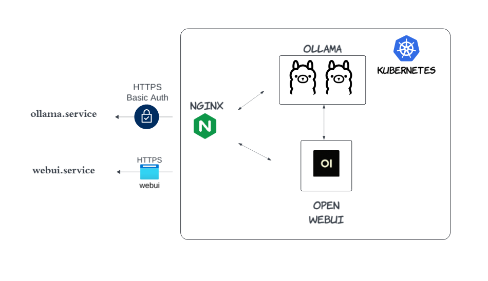
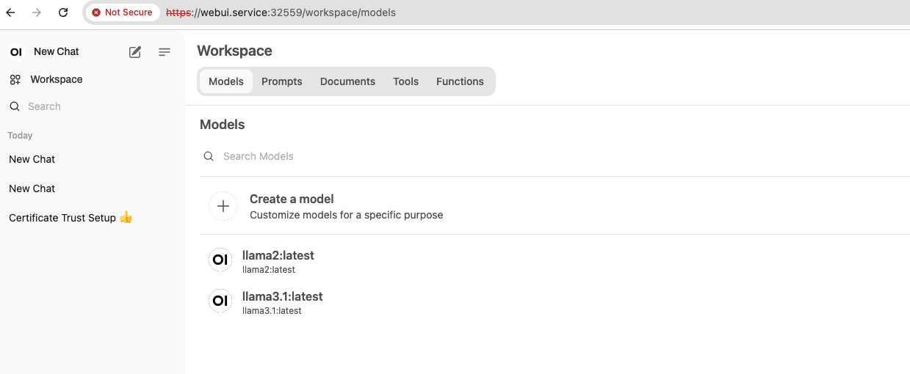

# [Host Your Own Ollama Service in a Cloud Kubernetes (K8s) Cluster](https://medium.com/@yuxiaojian/host-your-own-ollama-service-in-a-cloud-kubernetes-k8s-cluster-c818ca84a055)


The  [Ollama](https://github.com/ollama/ollama)  project enables us to run LLM locally with or without GPU support with high performance. While I can run a Llama3.1 model on my laptop and chat with it (see  [Build a Voice & Chat bot with Llama](https://medium.com/@yuxiaojian/build-a-voice-chat-bot-with-llama-aa0abf8437f5)), there are some lags. Hosting an Ollama service in the cloud can leverage greater computing power for improved performance. Here, I will guide you through setting up your own Ollama service in a Kubernetes (K8s) cluster.

<p align="center">
  
</p>

Additionally, I have integrated  [Open WebUI](https://github.com/open-webui/open-webui)  into the cluster. WebUI is an excellent tool for interacting with your Ollama service, and communicating directly within the cluster. Using Nginx ingress, the cluster exposes the WebUI console and Ollama API via HTTPS for enhanced security. The Ollama API is also protected with HTTP basic authentication.

Before starting, ensure you have a K8s cluster. Any variety will work. I created a K8s cluster with 3 VMs (1 Master + 2 workers) in Google Cloud following the  [cks-course-environment](https://github.com/killer-sh/cks-course-environment).

# Part 1: Prepare the Services

## Create Ollama Namespace

First, create a new namespace  `ollama`. All resources will be created in this namespace.
```
kubectl create ns ollama
```

## Set Up Ollama

The following YAML file defines the Ollama deployment and service. Ollama will pull models into the  `ollama-storage`  volume, using a fixed folder for storing model files on each worker. To speed up model pulling, you can add models to the environment variable  `PRELOAD_MODELS`, separated by spaces (e.g., “mistral llama3.1”). The  `postStart`  command will pull the  `PRELOAD_MODELS`  immediately after the container is created. The environment variable  `OLLAMA_KEEP_ALIVE`  defines how long Ollama keeps the model in memory to avoid frequent loading from disk.

Save this YAML file and create it with  `kubectl`. The Ollama pod will preload the llama3.1 model and run it in your cluster, exposed on the service endpoint on port 80.
```
apiVersion: apps/v1  
kind: Deployment  
metadata:  
  name: ollama  
  namespace: ollama  
spec:  
  replicas: 2  
  selector:  
    matchLabels:  
      name: ollama  
  template:  
    metadata:  
      labels:  
        name: ollama  
    spec:  
      containers:  
      - name: ollama  
        image: ollama/ollama:0.3.5  
        volumeMounts:  
          - mountPath: /root/.ollama  
            name: ollama-storage  
        ports:  
        - name: http  
          containerPort: 11434  
          protocol: TCP  
        env:  
        - name: PRELOAD_MODELS  
          value: "llama3.1"  
        - name: OLLAMA_KEEP_ALIVE  
          value: "12h"  
        lifecycle:  
          postStart:  
            exec:  
              command: ["/bin/sh", "-c", "for model in $PRELOAD_MODELS; do ollama run $model \"\"; done"]  
      volumes:  
      - hostPath:  
          path: /opt/ollama  
          type: DirectoryOrCreate  
        name: ollama-storage  
---  
apiVersion: v1  
kind: Service  
metadata:  
  name: ollama  
  namespace: ollama  
spec:  
  type: ClusterIP  
  selector:  
    name: ollama  
  ports:  
  - port: 80  
    name: http  
    targetPort: http  
    protocol: TCP
```
## Set Up WebUI

Next, create the deployment and service endpoint for WebUI using the YAML file below. The data storage  `/app/backend/data`  is mounted to a host folder. The WebUI pod is fixed to a node by  `nodeName: ollama-worker-1`  to keep the data stored, as it contains the login data. It connects to Ollama through the service endpoint  ``[http://ollama](http://ollama`/)``within the cluster.
```
apiVersion: apps/v1  
kind: Deployment  
metadata:  
  name: webui  
  namespace: ollama  
spec:  
  replicas: 1  
  selector:  
    matchLabels:  
      name: webui  
  template:  
    metadata:  
      labels:  
        name: webui  
    spec:  
      volumes:  
      - hostPath:  
          path: /opt/webui  
          type: DirectoryOrCreate  
        name: webui-storage  
      nodeName: ollama-worker-1  
      containers:  
        - name: webui  
          image: ghcr.io/open-webui/open-webui:main  
          volumeMounts:  
          - mountPath: /app/backend/data  
            name: webui-storage  
          env:  
            - name: OLLAMA_BASE_URLS  
              value: "http://ollama"  
          ports:  
            - name: http  
              containerPort: 8080  
              protocol: TCP  
---  
apiVersion: v1  
kind: Service  
metadata:  
  name: webui  
  namespace: ollama  
spec:  
  type: ClusterIP  
  selector:  
    name: webui  
  ports:  
  - port: 80  
    name: http  
    targetPort: http  
    protocol: TCP
```
# Part 2: Configure the Ingress

We will expose the Ollama API and WebUI via Nginx ingress using HTTPS for security. The WebUI has its own login, so we will enable HTTP basic authentication for the Ollama API.

## Nginx Ingress Controller

Install the  [Nginx Controller](https://github.com/kubernetes/ingress-nginx)  in your cluster. Follow the instructions for your specific cluster variety.

## Create a Certificate and Secret

If you have a certificate issued by a well-known CA, you can skip this step. Otherwise, create a self-signed certificate for testing purposes. The command below generates a certificate with two Subject Alternative Names (SAN):  `ollama.service`  and  `webui.service`.
```
openssl req -newkey rsa:2048 -new -nodes -x509 -days 365 -subj "/CN=example.com" -addext "subjectAltName = DNS:ollama.service,DNS:webui.service" -keyout ollama.key -out ollama.crt
```
Create the secret
```
kubectl create secret tls ollama -n ollama --cert ollama.crt --key ollama.key
```
## The Ollama Ingress

As we need to enable HTTP Basic Authentication, follow  [Basic Authentic](https://kubernetes.github.io/ingress-nginx/examples/auth/basic/)  to create a secret  `basic-auth`  with the username and password.
```
# install htpasswd if it doesn't exist  
#apt install -y apache2-utils  
  
$ htpasswd -c auth ollama  
New password:  
Re-type new password:  
Adding password for user ollama  
  
$ kubectl create secret generic basic-auth --from-file=auth -n ollama
```
Then create the Ollama ingress with the YAML file below
```
apiVersion: networking.k8s.io/v1  
kind: Ingress  
metadata:  
  name: ollama-ingress  
  namespace: ollama  
  annotations:  
    nginx.ingress.kubernetes.io/rewrite-target: /$2  
    nginx.ingress.kubernetes.io/auth-type: basic  
    nginx.ingress.kubernetes.io/auth-secret: basic-auth  
    nginx.ingress.kubernetes.io/auth-realm: "Authentication Required"  
    nginx.ingress.kubernetes.io/proxy-connect-timeout: "90"  
    nginx.ingress.kubernetes.io/proxy-send-timeout: "300"  
    nginx.ingress.kubernetes.io/proxy-read-timeout: "300"  
    nginx.ingress.kubernetes.io/upstream-keepalive-timeout: "300"  
spec:  
  ingressClassName: nginx  
  tls:  
  - hosts:  
      - ollama.service  
    secretName: ollama  
  rules:  
  - host: ollama.service  
    http:  
      paths:  
      - path: /()(.*)  
        pathType: Prefix  
        backend:  
          service:  
            name: ollama  
            port:  
              number: 80
```
## The WebUI Ingress

Similar settings for WebUI ingress, but without basic authentication.
```
apiVersion: networking.k8s.io/v1  
kind: Ingress  
metadata:  
  name: webui-ingress  
  namespace: ollama  
  annotations:  
    nginx.ingress.kubernetes.io/rewrite-target: /$2  
    nginx.ingress.kubernetes.io/proxy-connect-timeout: "90"  
    nginx.ingress.kubernetes.io/proxy-send-timeout: "300"  
    nginx.ingress.kubernetes.io/proxy-read-timeout: "300"  
    nginx.ingress.kubernetes.io/upstream-keepalive-timeout: "300"  
spec:  
  ingressClassName: nginx  
  tls:  
  - hosts:  
      - webui.service  
    secretName: ollama  
  rules:  
  - host: webui.service  
    http:  
      paths:  
      - path: /()(.*)  
        pathType: Prefix  
        backend:  
          service:  
            name: webui  
            port:  
              number: 80
```
Apply the ingress and expose it via the Nginx controller. If you have a Load Balancer, you can expose the endpoints via port 443. My ingress controller is exposed on the master node via port  `32559`. I will use this port in the following tests.
```
$ kubelctl get svc -n ingress-nginx  
NAME                                 TYPE        CLUSTER-IP      EXTERNAL-IP   PORT(S)                      AGE  
ingress-nginx-controller             NodePort    10.107.134.98   <none>        80:32659/TCP,443:32559/TCP   23h
```
## Part 3: Configurations on Your Host

If you have a registered domain and certificates issued by a well-known Certificate Authority (CA), you can skip the following steps and proceed directly to Part 4. For those using a self-signed certificate, you’ll need to update your host file and add the certificate to your trust store.

## Update Your Host File

On a macOS laptop, you need to add two entries to the `/etc/hosts` file. Replace  `<IP of the Master Node>`  with the actual IP address of your master node or Load Balance IP.
```
sudo vim /etc/hosts  
...  
<IP of the Master Node>    ollama.service  
<IP of the Master Node>    webui.service
```
## Update Your Trust Store

Since we are using a self-signed certificate, the certificate verification will fail by default. While you can skip verification with options like  `curl -k`, this may not always be available in SDKs and API calls. It’s better to add the certificate to the trust store of the tools you are using.

Since we use a self-signed certificate, the certificate verification will fail. We can skip the verification with some options, like  `curl -k`, but not always available in SDK and API calls. Better to add the certificate to the Truststore of whatever tools you are using.

For example, if you are using Python, you can use the  `certifi`  library to manage your trust store.
```
pip install certifi
```
Find the location of the  `certifi`  certificate store. You can do this by running the following Python code:
```
import certifi  
print(certifi.where())
```
This will print the path to the  `cacert.pem`  file, which is the certificate store used by  `certifi`. Open the  `cacert.pem`  file in a text editor and append your self-signed certificate to the end of this file. Your certificate should be in PEM format and look something like this:
```
-----BEGIN CERTIFICATE-----  
MIIDXTCCAkWgAwIBAgIJALa6F+2a6H5TMA0GCSqGSIb3DQEBCwUAMEUxCzAJBgNV  
...  
-----END CERTIFICATE-----
```
Save the changes to the  `cacert.pem`  file after appending your self-signed certificate.

# Part4: Test It Out

## WebUI

Access the Ollama service via the WebUI endpoint. The first signed-up user will be the admin.

<p align="center">
  
</p>

## [LangChain](https://www.langchain.com/)

The  `langChain`  library will interact with the Ollama API. Use the username and password you created when setting up the Ollama ingress.
```
from langchain_community.llms import Ollama  
from requests.auth import HTTPBasicAuth  
  
auth=HTTPBasicAuth('myusername', 'mypassword')  
  
ollama = Ollama(  
    base_url='https://ollama.service:32559',  
    model="llama3.1",  
    auth=auth  
)  
print(ollama.invoke("why is the sky blue"))
```
## Ollama Python Library

[Ollama Python](https://github.com/ollama/ollama-python)  uses  `httpx`  client underneath. You need to generate the auth header with the  `httpx.BasicAuth`  method.
```
from ollama import Client  
import httpx  
httpx_auth = httpx.BasicAuth(username="myusername", password="mypassword")  
client = Client(host='https://ollama.service:32559', auth=httpx_auth)  
response = client.chat(model='llama3.1', messages=[  
  {  
    'role': 'user',  
    'content': 'Why is the sky blue?',  
  }])  
print(response)

Streaming is recommended.

stream = client.chat(model='llama3.1', messages=[  
  {  
    'role': 'user',  
    'content': 'Why is the sky blue?',  
  }], stream=True)  
  
for chunk in stream:  
  print(chunk['message']['content'], end='', flush=True)
```
# Conclusion

Ollama provides an excellent way to run Large Language Models (LLMs). By leveraging cloud computing power, you can run an LLM service yourself, greatly aiding in the exploration of various AI capabilities.

Next, you can also run Ollama with GPU, see my store  [Run Your Own OLLAMA in Kubernetes with Nvidia GPU](https://medium.com/@yuxiaojian/run-your-own-ollama-in-kubernetes-with-nvidia-gpu-8974d0c1a9df)