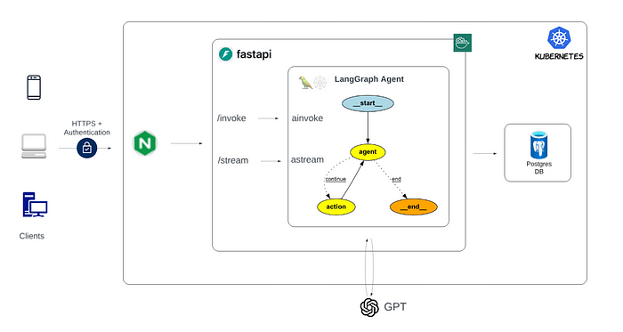
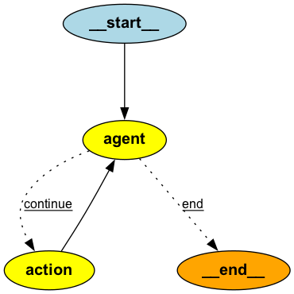
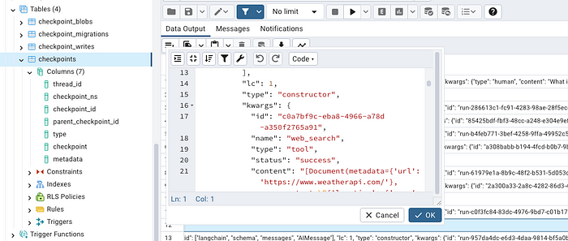

# [How to Deploy LangGraph Agents to Kubernetes](https://medium.com/@yuxiaojian/how-to-deploy-langgraph-agents-to-kubernetes-b3216d0cc961)


LangGraph is a popular tool for developing AI agents, while Kubernetes (K8s) is the leading platform for running production applications. Once you have your AI agent ready with LangGraph, deploying it to K8s can seem daunting. In this story, I’ll walk you through an example of deploying a  [ReAct agent](https://github.com/langchain-ai/langgraph/blob/main/examples/async.ipynb)  using  [asynchronous](https://docs.python.org/3/library/asyncio.html)  APIs with  [FastAPI](https://fastapi.tiangolo.com/)  to K8s.

<p align="center">
  
</p>

# Why Asynchronous APIs?

While synchronous APIs are simpler to reason about, asynchronous APIs offer better scalability and responsiveness, making them a superior choice for handling concurrent tasks. For production usage, we will opt for the asynchronous implementation.

# Solution Overview

The solution consists of several key components:

-   LangGraph Agent: Wrapped by FastAPI to provide two endpoints:
-   `/invoke`: For single, complete responses.
-   `/stream`: For streaming responses.
-   Memory Management: Uses Postgres as the backend for persisting checkpoints to share context across multiple interactions and replicas.
-   Ingress Controller: Nginx provides HTTPS termination and authentication.

Let’s break down each part and explain the code. You can find the full code on  [GitHub](https://github.com/yuxiaojian/llm-tools-call/tree/main/agent-k8s).

# The Agent

The agent is a simple ReAct agent with a tool call to search the Internet. The agent code is located in  `[agent/async_agent.py](https://github.com/yuxiaojian/llm-tools-call/blob/main/agent-k8s/agent/async_agent.py)`.

<p align="center">
  
</p>

LangChain’s  [Runnable](https://python.langchain.com/v0.1/docs/expression_language/interface/)  interface makes it easy to switch between synchronous and asynchronous interfaces. The corresponding async methods should be used with  `asyncio`  await syntax for concurrency:

-   `invoke`  ->  `ainvoke`: Call the chain on an input.
-   `stream`  ->  `astream`: Stream back chunks of the response.

# FastAPI

FastAPI exposes the agent with both streaming and non-streaming endpoints. The code framework is from  [agent-service-toolkit](https://github.com/JoshuaC215/agent-service-toolkit). It supports both token-based and message-based streaming. The code file is  [service/service.py](https://github.com/yuxiaojian/llm-tools-call/blob/main/agent-k8s/service/service.py).

Handling the stream output is a little complex. This inner async function runs the agent’s  `astream`  method, putting each update from the agent into the  `output_queue`. After the agent finishes, it puts  `None`  into the queue to signal completion. The main processing loop continuously gets items from the  `output_queue`  until it receives  `None`.
```
 async def run_agent_stream():  
        async for s in agent.astream(**kwargs, stream_mode="updates"):  
            await output_queue.put(s)  
        await output_queue.put(None)  
  
    stream_task = asyncio.create_task(run_agent_stream())  
  
    # Process the queue and yield messages over the SSE stream.  
    while s := await output_queue.get():  
    ...  
  
    await stream_task  
    yield "data: [DONE]\n\n"
```
This implementation allows for efficient, real-time streaming of both intermediate tokens and complete messages from the agent to the client, providing a responsive and interactive experience.

# Persistent Checkpoints

The AI agents need “memory” to share context across multiple interactions. In K8s deployment, multiple agent replicas need to share the memory. In LangGraph, memory is provided for any  [StateGraph](https://langchain-ai.github.io/langgraph/reference/graphs/#langgraph.graph.StateGraph)  through  [Checkpointers](https://github.com/langchain-ai/langgraph/tree/e4ca7ab69c599fd77dd4f0d47280849d715392cc/libs/checkpoint). We use a Postgres DB as the checkpoint store. LangGraph agent creates checkpoint tables to store the context and uses  `thread_id`  to search for the context.

<p align="center">
  
</p>

We use the  `@asynccontextmanager`  decorator to create an asynchronous context manager. The  `lifespan`  function is called when the FastAPI app starts up and shuts down. LangGraph agent needs to execute  `checkpointer.setup()`  at the first run so the code checks if the table exists and then decides to run or skip the setup. In the end, it assigns the checkpointer to the assistant object to store the context. The code file is  [service/service.py](https://github.com/yuxiaojian/llm-tools-call/blob/main/agent-k8s/service/service.py).

```
DB_URI = f"postgresql://{DB_USER}:{DB_PASSWORD}@{DB_HOST}:{DB_PORT}/{DB_NAME}?sslmode=disable"  
  
connection_kwargs = {  
    "autocommit": True,  
    "prepare_threshold": 0,  
}  
  
# This decorator turns the function into an asynchronous context manager.  
@asynccontextmanager  
async def lifespan(app: FastAPI):  
"""  
This function is called when the FastAPI app starts up and shuts down.  
It takes the FastAPI app instance as an argument.  
"""  
    # Create the AsyncConnectionPool  
    async with AsyncConnectionPool(  
        conninfo=DB_URI,  
        max_size=DB_MAX_CONNECTIONS,  
        kwargs=connection_kwargs,  
    ) as pool:  
        # Create the AsyncPostgresSaver. This is used to save and load the state of the agent.  
        checkpointer = AsyncPostgresSaver(pool)  
          
        # Set up the checkpointer   
        # Check if the checkpoints table exists  
        async with pool.connection() as conn:  
            async with conn.cursor() as cur:  
                try:  
                    await cur.execute("""  
                        SELECT EXISTS (  
                            SELECT FROM information_schema.tables   
                            WHERE  table_schema = 'public'  
                            AND    table_name   = 'checkpoints'  
                        );  
                    """)  
                    table_exists = (await cur.fetchone())[0]  
                      
                    if not table_exists:  
                        print("Checkpoints table does not exist. Running setup...")  
                        await checkpointer.setup()  
                    else:  
                        print("Checkpoints table already exists. Skipping setup.")  
                except psycopg.Error as e:  
                    print(f"Error checking for checkpoints table: {e}")  
                    # Optionally, you might want to raise this error  
                    # raise  
          
        # Assign the checkpointer to the assistant  
        assistant.checkpointer = checkpointer  
        app.state.agent = assistant  
        yield
```
# Create the Container Image

We use  `uvicorn`  to run the FastAPI app listening on port 8080.

```
from service import app  
  
uvicorn.run(app, host="0.0.0.0", port=8080)

Here is the  [Dockerfile](https://github.com/yuxiaojian/llm-tools-call/blob/main/agent-k8s/docker/Dockerfile.service)  to build the image:

FROM python:3.11.6-slim  
  
WORKDIR /app  
  
# Install poetry  
RUN pip install --no-cache-dir poetry  
  
# Copy only pyproject.toml and poetry.lock (if you have one) first to leverage Docker cache  
COPY pyproject.toml poetry.lock* ./  
  
# Install dependencies  
RUN poetry config virtualenvs.create false \  
    && poetry install --no-interaction --no-ansi  
  
  
COPY agent/ ./agent/  
COPY schema/ ./schema/  
COPY service/ ./service/  
COPY run_service.py .  
  
CMD ["python", "run_service.py"]
```
Build the image and push it to the GitHub registry
```
docker build -f docker/Dockerfile.service -t agent-service:latest .  
docker tag agent-service:latest ghcr.io/yuxiaojian/agent-service:latest  
docker push ghcr.io/yuxiaojian/agent-service:latest
```
You may need to log into the registry with a write permission token
```
export GITHUB_PAT="YOUR GITHUB write:package token"  
echo $GITHUB_PAT | docker login ghcr.io -u YOUR_GITHUB_USERNAME --password-stdin
```
# Deploy to K8s

Before deploying the agent, we need to set up a Postgres DB. It’s recommended to use cloud-hosted DB services like RDS. Here we use a Postgres DB pod for testing purposes.

## Create Postgres Service

Create a namespace and password secret
```
k create ns postgres  
k create secret generic postgres-secret -n postgres  --from-literal=postgres-password=xxxxx
```
Then use the YAML below to create the persistent volume and the Postgres service.
```
---  
apiVersion: v1  
kind: PersistentVolume  
metadata:  
  name: postgres-pv  
  namespace: postgres  
spec:  
  capacity:  
    storage: 5Gi  
  volumeMode: Filesystem  
  accessModes:  
    - ReadWriteOnce  
  persistentVolumeReclaimPolicy: Retain  
  storageClassName: local-storage  
  local:  
    path: /opt/postgres  
  nodeAffinity:  
    required:  
      nodeSelectorTerms:  
      - matchExpressions:  
        - key: kubernetes.io/hostname  
          operator: In  
          values:  
          - ollama-worker-gpu  
---  
apiVersion: v1  
kind: PersistentVolumeClaim  
metadata:  
  name: postgres-pvc  
  namespace: postgres  
spec:  
  storageClassName: local-storage  
  accessModes:  
    - ReadWriteOnce  
  resources:  
    requests:  
      storage: 5Gi  
---  
apiVersion: apps/v1  
kind: Deployment  
metadata:  
  name: postgres  
  namespace: postgres  
spec:  
  replicas: 1  
  selector:  
    matchLabels:  
      app: postgres  
  template:  
    metadata:  
      labels:  
        app: postgres  
    spec:  
      nodeSelector:  
        kubernetes.io/hostname: ollama-worker-gpu  
      containers:  
      - name: postgres  
        image: postgres:16  
        env:  
        - name: POSTGRES_DB  
          value: langchain  
        - name: POSTGRES_USER  
          value: langchain_user  
        - name: POSTGRES_PASSWORD  
          valueFrom:  
            secretKeyRef:  
              name: postgres-secret  
              key: postgres-password  
        ports:  
        - containerPort: 5432  
        volumeMounts:  
        - name: postgres-storage  
          mountPath: /var/lib/postgresql/data  
      volumes:  
      - name: postgres-storage  
        persistentVolumeClaim:  
          claimName: postgres-pvc  
  
---  
apiVersion: v1  
kind: Service  
metadata:  
  name: postgres  
  namespace: postgres  
spec:  
  selector:  
    app: postgres  
  ports:  
    - protocol: TCP  
      port: 5432  
      targetPort: 5432
```
## Create Agent Service

Create a new namespace and secrets for all the keys and passwords.
```
k create ns langgraph  
k create secret -n langgraph generic agent-creds --from-literal=OPENAI_API_KEY="sk-None-xxxx" --from-literal=TAVILY_API_KEY="tvly-xxxx" --from-literal=DB_PASSWORD="xxxx" 
```
Also, create a secret for pulling images from the GitHub registry
```
k create secret docker-registry github-registry   --namespace langgraph   --docker-server=ghcr.io   --docker-username=yuxiaojian   --docker-password="ghp_xxx
```
Create the agent service. The  `DB_HOST`  is pointed to  `postgres.postgres.svc.cluster.local`  which is the service endpoint of the Postgres we deployed earlier.
```
---  
apiVersion: apps/v1  
kind: Deployment  
metadata:  
  name: agent-service  
  namespace: langgraph  
spec:  
  replicas: 1  
  selector:  
    matchLabels:  
      app: agent-service  
  template:  
    metadata:  
      labels:  
        app: agent-service  
    spec:  
      imagePullSecrets:  
      - name: github-registry  
      containers:  
      - name: agent-service  
        image: ghcr.io/yuxiaojian/agent-service:latest  
        ports:  
        - containerPort: 8080  
        env:  
        - name: DB_HOST  
          value: "postgres.postgres.svc.cluster.local"  
        - name: DB_PORT  
          value: "5432"  
        - name: DB_NAME  
          value: "langchain"  
        - name: DB_USER  
          value: "langchain_user"  
        - name: DB_PASSWORD  
          valueFrom:  
            secretKeyRef:  
              name: agent-creds  
              key: DB_PASSWORD  
        - name: OPENAI_API_KEY  
          valueFrom:  
            secretKeyRef:  
              name: agent-creds  
              key: OPENAI_API_KEY  
        - name: TAVILY_API_KEY  
          valueFrom:  
            secretKeyRef:  
              name: agent-creds  
              key: TAVILY_API_KEY  
        - name: DB_MAX_CONNECTIONS  
          value: "20"  
  
---  
apiVersion: v1  
kind: Service  
metadata:  
  name: agent-service  
  namespace: langgraph  
spec:  
  selector:  
    app: agent-service  
  ports:  
    - protocol: TCP  
      port: 8080  
      targetPort: 8080
```
## Expose the Agent Service

We use Nginx as the ingress controller. Create an ingress template to expose the agent service.
```
---  
apiVersion: v1  
kind: ConfigMap  
metadata:  
  name: nginx-config  
  namespace: langgraph  
data:  
  proxy-buffer-size: "128k"  
  proxy-buffers: "4 256k"  
  proxy-busy-buffers-size: "256k"  
  proxy-read-timeout: "300"  
  
---  
apiVersion: networking.k8s.io/v1  
kind: Ingress  
metadata:  
  name: agent-service-ingress  
  namespace: langgraph  
  annotations:  
    kubernetes.io/ingress.class: nginx  
    nginx.ingress.kubernetes.io/auth-type: basic  
    nginx.ingress.kubernetes.io/auth-secret: basic-auth  
    nginx.ingress.kubernetes.io/configuration-snippet: |  
      proxy_set_header Upgrade $http_upgrade;  
      proxy_set_header Connection "upgrade";  
    nginx.ingress.kubernetes.io/proxy-read-timeout: "3600"  
    nginx.ingress.kubernetes.io/proxy-send-timeout: "3600"  
    nginx.ingress.kubernetes.io/use-regex: "true"  
    nginx.ingress.kubernetes.io/rewrite-target: /$2  
spec:  
  tls:  
  - hosts:  
      - ollama.service  
    secretName: ollama  
  rules:  
  - host: ollama.service # Replace with your domain  
    http:  
      paths:  
      - path: "/agent(/|$)(.*)"  
        pathType: Prefix  
        backend:  
          service:  
            name: agent-service  
            port:  
              number: 8080
```
These headers are crucial for WebSocket support, which is often used for streaming. They allow the connection to upgrade from HTTP to WebSocket when necessary.
```
nginx.ingress.kubernetes.io/configuration-snippet: |  
      proxy_set_header Upgrade $http_upgrade;  
      proxy_set_header Connection "upgrade";
```
The specific values (like 128k, 256k, 3600 seconds) are chosen as a balance between performance and resource usage:

-   Buffer sizes are large enough to handle most streaming scenarios efficiently but not so large as to consume excessive memory.
-   Timeouts are set very long (1 hour) to accommodate extended streaming sessions, but you may adjust these based on your specific use case and expected stream durations.

The ingress also enabled HTTP basic authentication.
```
nginx.ingress.kubernetes.io/auth-type: basic  
nginx.ingress.kubernetes.io/auth-secret: basic-auth
```
Create the username and password with  `htpasswd`
```
htpasswd -c auth admin  # This will prompt for a password  
kubectl create secret generic basic-auth --from-file=auth -n langgraph  
rm auth  # Remove the temporary file
```
# Test It Out

My ingress-controller is  `NodePort`  type service and exposed on port 32675
```
k get svc -n ingress-nginx  
NAME                                 TYPE        CLUSTER-IP      EXTERNAL-IP   PORT(S)                      AGE  
ingress-nginx-controller             NodePort    10.109.31.189   <none>        80:30917/TCP,443:32675/TCP   26d
```
Let’s test with a curl request
```
curl -u username:password -vk https://ollama.service:32675/agent/stream -H "Content-Type: application/json"  \  
  -d '{  
    "message": "What is the weather in Sydney?",  
    "model": "gpt-4o-mini",  
    "thread_id": "12345"  
  }'
```
You should see the streamed output with the tool call context:
```
data: {"type": "message", "content": {"type": "ai", "content": "", "tool_calls": [{"name": "web_search", "args": {"query": "current weather in Sydney"}, "id": "call_IjkgmeQJfktyArdJAIxwwcdv", "type": "tool_call"}], "tool_call_id": null, "run_id": "0d41bdd3-3e9e-470e-abca-d7ff3a11700e", "original": {"type": "ai", "data": {"content": "", "additional_kwargs": {"tool_calls": [{"id": "call_IjkgmeQJfktyArdJAIxwwcdv", "function": {"arguments": "{\"query\":\"current weather in Sydney\"}", "name": "web_search"}, "type": "function"}], "refusal": null}, "response_metadata": {"token_usage": {"completion_tokens": 17, "prompt_tokens": 51, "total_tokens": 68}, "model_name": "gpt-4o-2024-05-13", "system_fingerprint": "fp_25624ae3a5", "finish_reason": "tool_calls", "logprobs": null}, "type": "ai", "name": null, "id": "run-d1de7007-d31f-4484-8593-6008b0a7d093-0", "example": false, "tool_calls": [{"name": "web_search", "args": {"query": "current weather in Sydney"}, "id": "call_IjkgmeQJfktyArdJAIxwwcdv", "type": "tool_call"}], "invalid_tool_calls": [], "usage_metadata": {"input_tokens": 51, "output_tokens": 17, "total_tokens": 68}}}}}  
  
data: {"type": "message", "content": {"type": "tool", "content": "[Document(metadata={'url': 'https://www.weatherapi.com/'}, page_content=\"{'location': {'name': 'Sydney', 'region': 'New South Wales', 'country': 'Australia', 'lat': -33.88, 'lon': 151.22, 'tz_id': 'Australia/Sydney', 'localtime_epoch': 1726099545, 'localtime': '2024-09-12 10:05'}, 'current': {'last_updated_epoch': 1726099200, 'last_updated': '2024-09-12 10:00', 'temp_c': 17.1, 'temp_f': 62.8, 'is_day': 1, 'condition': {'text': 'Moderate or heavy rain shower', 'icon': '//cdn.weatherapi.com/weather/64x64/day/356.png', 'code': 1243}, 'wind_mph': 24.2, 'wind_kph': 38.9, 'wind_degree': 190, 'wind_dir': 'S', 'pressure_mb': 1021.0, 'pressure_in': 30.15, 'precip_mm': 0.8, 'precip_in': 0.03, 'humidity': 83, 'cloud': 50, 'feelslike_c': 17.1, 'feelslike_f': 62.8, 'windchill_c': 17.0, 'windchill_f': 62.5, 'heatindex_c': 17.0, 'heatindex_f': 62.5, 'dewpoint_c': 12.1, 'dewpoint_f': 53.8, 'vis_km': 10.0, 'vis_miles': 6.0, 'uv': 5.0, 'gust_mph': 32.1, 'gust_kph': 51.7}}\"), Document(metadata={'url': 'https://www.timeanddate.com/weather/australia/sydney'}, page_content='Current weather in Sydney and forecast for today, tomorrow, and next 14 days. Sign in. News. News Home; ... Sydney Airport: Current Time: Sep 9, 2024 at 5:20:30 am: Latest Report: Sep 9, 2024 at 4:30 am: Visibility: N/A: ... 12. 62 / 53 \u00b0F. 13. 66 / 51 \u00b0F. 14. 71 / 47 \u00b0F. 15. 63 / 56 \u00b0F. 16. 63 / 57 \u00b0F. 17. 64 / 57 \u00b0F. 18.'), Document(metadata={'url': 'https://www.ventusky.com/sydney'}, page_content=\"Sydney \u2600 Weather forecast for 10 days, information from meteorological stations, webcams, sunrise and sunset, wind and precipitation maps for this place ... 151\u00b012'E / Altitude: 31 m Timezone: Australia/Sydney (UTC+10) / Current time: 21:43 2024/09/09 . Current Weather ; Forecast ; Sun and Moon ; 18 \u00b0C ...\"), Document(metadata={'url': 'https://world-weather.info/forecast/australia/sydney/september-2024/'}, page_content=\"Weather Weather in Sydney Weather in Sydney in September 2024 1 +79\u00b0+59\u00b0 2 +68\u00b0+64\u00b0 3 +63\u00b0+54\u00b0 4 +68\u00b0+48\u00b0 5 +81\u00b0+55\u00b0 6 +82\u00b0+61\u00b0 7 +68\u00b0+66\u00b0 8 +73\u00b0+61\u00b0 9 +72\u00b0+57\u00b0 10 +66\u00b0+55\u00b0 11 +72\u00b0+55\u00b0 12 +68\u00b0+59\u00b0 13 +72\u00b0+55\u00b0 14 +72\u00b0+55\u00b0 15 +54\u00b0+61\u00b0 16 +54\u00b0+48\u00b0 17 +57\u00b0+54\u00b0 18 +55\u00b0+57\u00b0 19 +73\u00b0+55\u00b0 +72\u00b0+63\u00b0 +72\u00b0+63\u00b0 +73\u00b0+64\u00b0 +70\u00b0+61\u00b0 +73\u00b0+64\u00b0 +72\u00b0+61\u00b0 +70\u00b0+61\u00b0 +70\u00b0+61\u00b0 +73\u00b0+63\u00b0 +72\u00b0+61\u00b0 +72\u00b0+63\u00b0 Extended weather forecast in Sydney HourlyWeek10 days14 days30 daysYear Weather in large and nearby cities Weather in Canberra+63\u00b0 Singleton+63\u00b0 Bathurst+61\u00b0 Goulburn+63\u00b0 Muswellbrook+66\u00b0 Orange+59\u00b0 Forster+70\u00b0 Queanbeyan+63\u00b0 Nowra+68\u00b0 Wollongong+66\u00b0 Lawson+63\u00b0 Katoomba+61\u00b0 Kiama+68\u00b0 Farrer+63\u00b0 Peel+61\u00b0 world's temperature today day day\"), Document(metadata={'url': 'https://www.easeweather.com/oceania/australia/new-south-wales/sydney/september'}, page_content='Weather in Sydney in September 2024 - Detailed Forecast Weather in Sydney for September 2024 Your guide to Sydney weather in September - trends and predictions In general, the average temperature in Sydney at the beginning of September is 20.6\\xa0\u00b0C. Sydney sees moderate rainfall in September, averaging 7 rainy days. Sydney in September average weather Temperatures trend during September in Sydney Our weather forecast for Sydney in September is based on the analysis of historical data rather than real-time forecast models. | Date | Weather | Temperatures | Rain | UV | More | September Weather')]", "tool_calls": [], "tool_call_id": "call_IjkgmeQJfktyArdJAIxwwcdv", "run_id": "0d41bdd3-3e9e-470e-abca-d7ff3a11700e", "original": {"type": "tool", "data": {"content": "[Document(metadata={'url': 'https://www.weatherapi.com/'}, page_content=\"{'location': {'name': 'Sydney', 'region': 'New South Wales', 'country': 'Australia', 'lat': -33.88, 'lon': 151.22, 'tz_id': 'Australia/Sydney', 'localtime_epoch': 1726099545, 'localtime': '2024-09-12 10:05'}, 'current': {'last_updated_epoch': 1726099200, 'last_updated': '2024-09-12 10:00', 'temp_c': 17.1, 'temp_f': 62.8, 'is_day': 1, 'condition': {'text': 'Moderate or heavy rain shower', 'icon': '//cdn.weatherapi.com/weather/64x64/day/356.png', 'code': 1243}, 'wind_mph': 24.2, 'wind_kph': 38.9, 'wind_degree': 190, 'wind_dir': 'S', 'pressure_mb': 1021.0, 'pressure_in': 30.15, 'precip_mm': 0.8, 'precip_in': 0.03, 'humidity': 83, 'cloud': 50, 'feelslike_c': 17.1, 'feelslike_f': 62.8, 'windchill_c': 17.0, 'windchill_f': 62.5, 'heatindex_c': 17.0, 'heatindex_f': 62.5, 'dewpoint_c': 12.1, 'dewpoint_f': 53.8, 'vis_km': 10.0, 'vis_miles': 6.0, 'uv': 5.0, 'gust_mph': 32.1, 'gust_kph': 51.7}}\"), Document(metadata={'url': 'https://www.timeanddate.com/weather/australia/sydney'}, page_content='Current weather in Sydney and forecast for today, tomorrow, and next 14 days. Sign in. News. News Home; ... Sydney Airport: Current Time: Sep 9, 2024 at 5:20:30 am: Latest Report: Sep 9, 2024 at 4:30 am: Visibility: N/A: ... 12. 62 / 53 \u00b0F. 13. 66 / 51 \u00b0F. 14. 71 / 47 \u00b0F. 15. 63 / 56 \u00b0F. 16. 63 / 57 \u00b0F. 17. 64 / 57 \u00b0F. 18.'), Document(metadata={'url': 'https://www.ventusky.com/sydney'}, page_content=\"Sydney \u2600 Weather forecast for 10 days, information from meteorological stations, webcams, sunrise and sunset, wind and precipitation maps for this place ... 151\u00b012'E / Altitude: 31 m Timezone: Australia/Sydney (UTC+10) / Current time: 21:43 2024/09/09 . Current Weather ; Forecast ; Sun and Moon ; 18 \u00b0C ...\"), Document(metadata={'url': 'https://world-weather.info/forecast/australia/sydney/september-2024/'}, page_content=\"Weather Weather in Sydney Weather in Sydney in September 2024 1 +79\u00b0+59\u00b0 2 +68\u00b0+64\u00b0 3 +63\u00b0+54\u00b0 4 +68\u00b0+48\u00b0 5 +81\u00b0+55\u00b0 6 +82\u00b0+61\u00b0 7 +68\u00b0+66\u00b0 8 +73\u00b0+61\u00b0 9 +72\u00b0+57\u00b0 10 +66\u00b0+55\u00b0 11 +72\u00b0+55\u00b0 12 +68\u00b0+59\u00b0 13 +72\u00b0+55\u00b0 14 +72\u00b0+55\u00b0 15 +54\u00b0+61\u00b0 16 +54\u00b0+48\u00b0 17 +57\u00b0+54\u00b0 18 +55\u00b0+57\u00b0 19 +73\u00b0+55\u00b0 +72\u00b0+63\u00b0 +72\u00b0+63\u00b0 +73\u00b0+64\u00b0 +70\u00b0+61\u00b0 +73\u00b0+64\u00b0 +72\u00b0+61\u00b0 +70\u00b0+61\u00b0 +70\u00b0+61\u00b0 +73\u00b0+63\u00b0 +72\u00b0+61\u00b0 +72\u00b0+63\u00b0 Extended weather forecast in Sydney HourlyWeek10 days14 days30 daysYear Weather in large and nearby cities Weather in Canberra+63\u00b0 Singleton+63\u00b0 Bathurst+61\u00b0 Goulburn+63\u00b0 Muswellbrook+66\u00b0 Orange+59\u00b0 Forster+70\u00b0 Queanbeyan+63\u00b0 Nowra+68\u00b0 Wollongong+66\u00b0 Lawson+63\u00b0 Katoomba+61\u00b0 Kiama+68\u00b0 Farrer+63\u00b0 Peel+61\u00b0 world's temperature today day day\"), Document(metadata={'url': 'https://www.easeweather.com/oceania/australia/new-south-wales/sydney/september'}, page_content='Weather in Sydney in September 2024 - Detailed Forecast Weather in Sydney for September 2024 Your guide to Sydney weather in September - trends and predictions In general, the average temperature in Sydney at the beginning of September is 20.6\\xa0\u00b0C. Sydney sees moderate rainfall in September, averaging 7 rainy days. Sydney in September average weather Temperatures trend during September in Sydney Our weather forecast for Sydney in September is based on the analysis of historical data rather than real-time forecast models. | Date | Weather | Temperatures | Rain | UV | More | September Weather')]", "additional_kwargs": {}, "response_metadata": {}, "type": "tool", "name": "web_search", "id": "75abd0a1-9e04-48ed-a37b-12ee20343f23", "tool_call_id": "call_IjkgmeQJfktyArdJAIxwwcdv", "artifact": null, "status": "success"}}}}  
  
data: {"type": "message", "content": {"type": "ai", "content": "The current weather in Sydney is as follows:\n\n- **Temperature:** 17.1\u00b0C (62.8\u00b0F)\n- **Condition:** Moderate or heavy rain shower\n- **Wind:** 38.9 kph (24.2 mph) from the south\n- **Humidity:** 83%\n- **Visibility:** 10 km (6 miles)\n- **Pressure:** 1021.0 mb\n- **UV Index:** 5\n\n\n\nFor more details, you can check the [WeatherAPI](https://www.weatherapi.com/) website.", "tool_calls": [], "tool_call_id": null, "run_id": "0d41bdd3-3e9e-470e-abca-d7ff3a11700e", "original": {"type": "ai", "data": {"content": "The current weather in Sydney is as follows:\n\n- **Temperature:** 17.1\u00b0C (62.8\u00b0F)\n- **Condition:** Moderate or heavy rain shower\n- **Wind:** 38.9 kph (24.2 mph) from the south\n- **Humidity:** 83%\n- **Visibility:** 10 km (6 miles)\n- **Pressure:** 1021.0 mb\n- **UV Index:** 5\n\n\n\nFor more details, you can check the [WeatherAPI](https://www.weatherapi.com/) website.", "additional_kwargs": {"refusal": null}, "response_metadata": {"token_usage": {"completion_tokens": 132, "prompt_tokens": 1259, "total_tokens": 1391}, "model_name": "gpt-4o-2024-05-13", "system_fingerprint": "fp_25624ae3a5", "finish_reason": "stop", "logprobs": null}, "type": "ai", "name": null, "id": "run-17ebbf8f-cc53-4e8c-b31f-5a38c908fd24-0", "example": false, "tool_calls": [], "invalid_tool_calls": [], "usage_metadata": {"input_tokens": 1259, "output_tokens": 132, "total_tokens": 1391}}}}}  
  
data: [DONE]
```
Let’s try the invoke endpoint too:
```
 curl -u username:password -vk https://ollama.service:32675/agent/invoke -H "Content-Type: application/json"  \  
  -d '{  
    "message": "Tell me a fan fact about silk worms",  
    "model": "gpt-4o-mini",  
    "thread_id": "12345"  
  }'
```
The output comes back in one go as expected:
```
{"type":"ai","content":"Here's a fascinating fact about silkworms:\n\n**Silkworms produce silk through a process called sericulture.** The silk is produced from the salivary glands of the silkworm larvae, which spin it into a cocoon. Each cocoon can yield a single continuous thread of raw silk that can be up to 900 meters (almost 3,000 feet) long! This thread is then harvested and woven into silk fabric, which has been highly prized for thousands of years due to its softness, luster, and strength.","tool_calls":[],"tool_call_id":null,"run_id":"36cbeb68-fc5b-4157-b5ae-c1aed38d7324","original":{"type":"ai","data":{"content":"Here's a fascinating fact about silkworms:\n\n**Silkworms produce silk through a process called sericulture.** The silk is produced from the salivary glands of the silkworm larvae, which spin it into a cocoon. Each cocoon can yield a single continuous thread of raw silk that can be up to 900 meters (almost 3,000 feet) long! This thread is then harvested and woven into silk fabric, which has been highly prized for thousands of years due to its softness, luster, and strength.","additional_kwargs":{"refusal":null},"response_metadata":{"token_usage":{"completion_tokens":112,"prompt_tokens":1406,"total_tokens":1518},"model_name":"gpt-4o-2024-05-13","system_fingerprint":"fp_25624ae3a5","finish_reason":"stop","logprobs":null},"type":"ai","name":null,"id":"run-53bd801a-58f9-4619-bc67-a0dca8d2566e-0","example":false,"tool_calls":[],"invalid_tool_calls":[],"usage_metadata":{"input_tokens":1406,"output_tokens":112,"total_tokens":1518}}}}
```
Hooray, we now have our agent live in Kubernetes!

# Conclusion

In this example, we used several tactics to make it appropriate for production usage:

-   Exposed both invoke and streaming endpoints
-   Implemented asynchronous processing for concurrency
-   Established persistent checkpoints with PostgreSQL
-   Configured NGINX Ingress to support HTTPS termination, authentication, and streaming

Deploying an AI agent to Kubernetes is a complex process. However, with the approach we introduced, you can streamline the deployment much more easily and efficiently.

We hope you enjoyed this story!