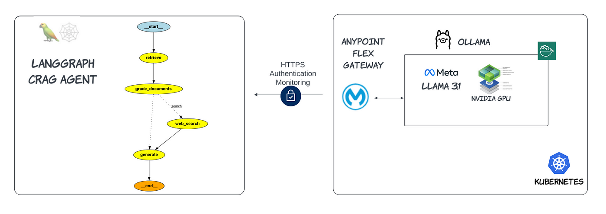
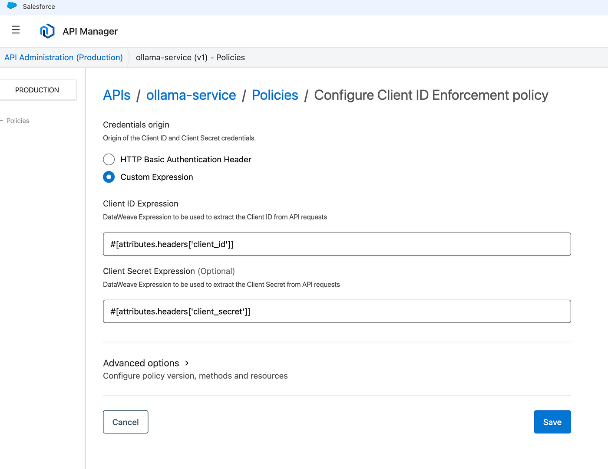
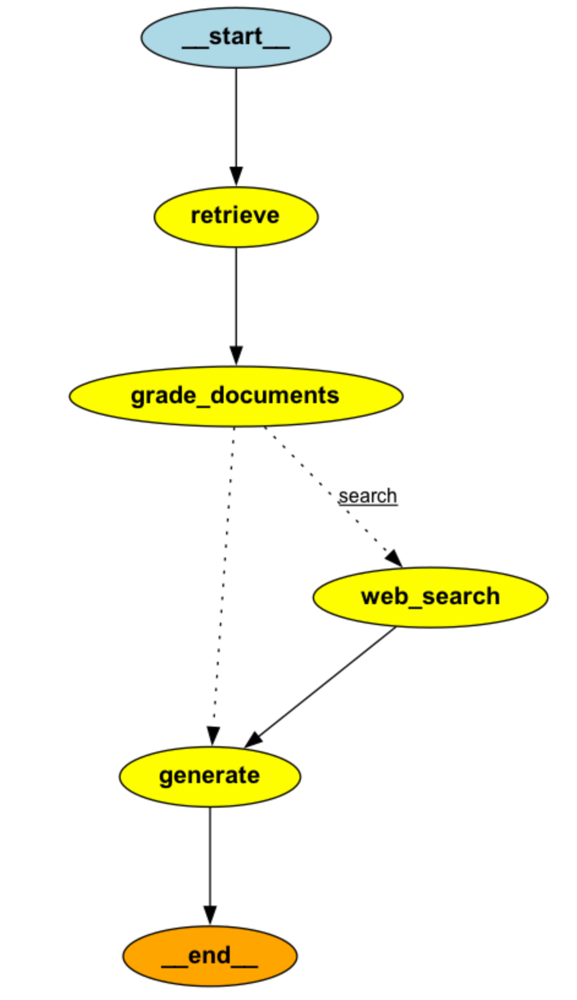

# [Power Your AI Agent with Anypoint Platform Secured Llama 3.1 API](https://medium.com/@yuxiaojian/power-your-ai-agent-with-anypoint-platform-secured-llama-3-1-api-ca659712f9ee)

Self-hosted Large Language Models (LLMs) like Llama 3.1 are getting more attention for two main reasons. Firstly, security is a concern for businesses handling sensitive information. By deploying LLMs on-premises, enterprises can ensure that their proprietary data and confidential communications never leave their secure infrastructure, eliminating the risk of data leakage to third-party LLM providers. This level of control is essential for maintaining compliance with data protection regulations and safeguarding intellectual property.

Secondly, self-hosted LLMs offer the opportunity for fine-tuning the vertical domain model. Enterprises can take a general-purpose LLM and customize it to become a specific domain model that is intimately specialized with their unique business domain, industry jargon, and specific use cases. This tailored approach results in more accurate and relevant outputs, enhancing productivity and decision-making across various business functions.

Self-hosted LLMs empower enterprises to harness the full potential of AI while maintaining complete control over their data and AI capabilities. In the last story, I demonstrated a solution to  [Secure Llama API with Anypoint Flex Gateway](https://medium.com/p/1c6b4d7a4620). We will go step further in this story and build a  [Corrective-RAG (CRAG)](https://arxiv.org/abs/2401.15884)  AI agent which is powed by the self-hosted Llama 3.1 API and the API is protected by the Anypoint Platform.

<p align="center">
  
</p>

# Enable Client ID Enforcement

With the setup in  [Secure Llama API with Anypoint Flex Gateway](https://medium.com/p/1c6b4d7a4620), we can easily apply API policies to protect our own Llama 3.1 APIs. I have enabled the  [Client ID enforcement policy](https://docs.mulesoft.com/gateway/latest/policies-included-client-id-enforcement).

<p align="center">
  
</p>

[Request access](https://docs.mulesoft.com/exchange/to-request-access)  in the Anypoint Exchange and keep the credentials safe.

# Initialize the Llama Client

We put the client ID and secret as environment variables for input from the console.
```python
import os  
import getpass  
  
def _set_env(var: str):  
    if not os.environ.get(var):  
        os.environ[var] = getpass.getpass(f"{var}: ")  
  
_set_env("ANYPOINT_CLIENT_ID")  
_set_env("ANYPOINT_CLIENT_SECRET")
```
Then initialize the llama LLM with the backend URL, client ID, and secret so that it can talk to our hosted Llama 3.1 APIs.
```python
from langchain_ollama import ChatOllama  
  
LLAMA_API_ENDPOINT="https://api.ollama.ai:30461/ollama"  
headers = {  
    "Client_ID": os.environ.get("ANYPOINT_CLIENT_ID"),  
    "Client_Secret": os.environ.get("ANYPOINT_CLIENT_SECRET")  
}  
  
llm = ChatOllama(  
    model = "llama3.1",  
    temperature = 0,  
    base_url = LLAMA_API_ENDPOINT,  
    client_kwargs={"headers": headers}  
)
```
You can confirm the connection by asking the LLM to tell a joke:)
```python
messages = [  
    ("system", "You are a helpful assistant"),  
    ("human", "tell me a joke."),  
]  
print(llm.invoke(messages).content)
```
# CRAG Agent

Corrective-RAG (CRAG) is a strategy for RAG that incorporates self-reflection / self-grading on retrieved documents. A CRAG agent involves a few steps :

-   It first gets relevant documents from the retriever
-   If  _the_  documents aregraded as relevant, it proceeds to generate the final answer
-   If  _the_  documents are graded as irrelevant, it supplements retrieval with a web search. We’ll use  [Tavily Search](https://python.langchain.com/v0.2/docs/integrations/tools/tavily_search/)  for web search.
-   It generates the final answer from the web search result.

<p align="center">
  
</p>

The agent is built with  [LangGraph](https://langchain-ai.github.io/langgraph/)  and the full code is available in the  [GitHub](https://github.com/yuxiaojian/llm-tools-call/blob/main/llama31-anypoint-api.ipynb).

# Retriever

The retriever is built upon three Blogs from blogs.mulesoft.com
```python
# /// Retriever tool ///  
import chromadb  
  
from langchain_huggingface import HuggingFaceEmbeddings  
from langchain_community.document_loaders import WebBaseLoader  
from langchain_community.vectorstores import Chroma  
from langchain_text_splitters import RecursiveCharacterTextSplitter  
  
# Embedding model name  
EMBEDDING_MODEL_NAME = "hkunlp/instructor-large"  
  
# Define the Chroma settings  
CHROMA_SETTINGS = chromadb.config.Settings(  
    anonymized_telemetry=False,  
    is_persistent=False,  
)  
  
embeddings = HuggingFaceEmbeddings(model_name=EMBEDDING_MODEL_NAME)  
chroma_client = chromadb.Client(settings=CHROMA_SETTINGS)  
  
urls = [  
    "https://blogs.mulesoft.com/digital-transformation/owasp-top-10-playbook/",  
    "https://blogs.mulesoft.com/news/einstein-for-anypoint-code-builder/",  
    "https://blogs.mulesoft.com/news/transition-from-persistent-vm-queues-to-robust-message-brokers/",  
]  
  
docs = [WebBaseLoader(url).load() for url in urls]  
docs_list = [item for sublist in docs for item in sublist]  
  
text_splitter = RecursiveCharacterTextSplitter.from_tiktoken_encoder(  
    chunk_size=250, chunk_overlap=50  
)  
doc_splits = text_splitter.split_documents(docs_list)  
  
# Add to vectorDB  
vectorstore = Chroma.from_documents(  
    client=chroma_client,  
    documents=doc_splits,  
    collection_name="rag-chroma",  
    embedding=embeddings,  
)  
retriever = vectorstore.as_retriever(k=2)
```
# Web Search

It uses  [Tavily](https://tavily.com/)  as the search tool which the agent will resort to if the retriever documents are irrelevant.
```python
# /// Search Tool  
from langchain_community.tools.tavily_search import TavilySearchResults  
from langchain.schema import Document  
web_search_tool = TavilySearchResults()
```
# Tests

Let’s test how the agent performs with the Llama 3.1 API. First, ask a relevant question
```python
def predict_custom_agent_answer(example: dict):  
    config = {"configurable": {"thread_id": str(uuid.uuid4())}}  
  
    state_dict = custom_graph.invoke(  
        {"question": example["input"], "steps": []}, config  
    )  
  
    #return {"response": state_dict["generation"], "steps": state_dict["steps"]}  
    return state_dict  
  
  
example = {"input": "What's new with the release of Einstein for Anypoint Code Builder"}  
response = predict_custom_agent_answer(example)
```
The agent used the documents from the retriever tool to generate the final answer.
```
Question: What's new with the release of Einstein for Anypoint Code Builder  
  
Answer: Einstein for Anypoint Code Builder is now available in General Availability (GA), allowing developers to use natural language processing to generate integration flows and simplify configuration processes. This release represents a significant leap forward in integration development, combining the power of AI with MuleSoft's reliability and security. Developers can get started by signing into their Anypoint Platform account or signing up for a free trial account.  
  
Search Performed: No  
  
Documents:  
  Document 1:  
    Source: https://blogs.mulesoft.com/news/einstein-for-anypoint-code-builder/  
    Title: Announcing Einstein for Anypoint Code Builder | MuleSoft Blog  
    Url: N/A  
    Content: Announcing Einstein for Anypoint Code Builder | MuleSoft Blog Skip to content...  
  
  Document 2:  
    Source: https://blogs.mulesoft.com/news/einstein-for-anypoint-code-builder/  
    Title: Announcing Einstein for Anypoint Code Builder | MuleSoft Blog  
    Url: N/A  
    Content: How to get started with Einstein for ACB Getting started with Einstein for Anypoint Code Builder is ...  
  
  Document 3:  
    Source: https://blogs.mulesoft.com/news/einstein-for-anypoint-code-builder/  
    Title: Announcing Einstein for Anypoint Code Builder | MuleSoft Blog  
    Url: N/A  
    Content: This is more than just an upgrade; it’s our first step at transforming integration development. By l...  
  
  Document 4:  
    Source: https://blogs.mulesoft.com/news/einstein-for-anypoint-code-builder/  
    Title: Announcing Einstein for Anypoint Code Builder | MuleSoft Blog  
    Url: N/A  
    Content: Share post Reading Time: 8 minutes Artificial intelligence has already begun transforming the techno...  
  
Steps:  
  retrieve_documents  
  grade_document_retrieval  
  generate_answer
```
Let’s ask an irrelevant question this time

```
example = {"input": "Who won the 2024 NBA finals?"}  
response = predict_custom_agent_answer(example)
```
The result shows the agent resorted to the web search to generate the final answer. Just as we expected.
```
Question: Who won the 2024 NBA finals?  
  
Answer: The Boston Celtics won the 2024 NBA Finals by defeating the Dallas Mavericks 4-1. They secured their league-record 18th NBA championship with a 106-88 win in Game 5. Jayson Tatum led the team to victory with a 31-point performance.  
  
Search Performed: Yes  
  
Documents:  
  Document 1:  
    Source: N/A  
    Title: N/A  
    Url: https://en.wikipedia.org/wiki/2024_NBA_Finals  
    Content: The 2024 NBA Finals was the championship series of the National Basketball Association (NBA)'s 2023-...  
  
  Document 2:  
    Source: N/A  
    Title: N/A  
    Url: https://www.nytimes.com/athletic/5571475/2024/06/17/celtics-mavericks-nba-finals-game-5-score-result/  
    Content: The Celtics beat the Dallas Mavericks 106-88 in Game 5 of the 2024 NBA Finals to win the series 4-1 ...  
  
  Document 3:  
    Source: N/A  
    Title: N/A  
    Url: https://www.cnn.com/2024/06/17/sport/nba-finals-celtics-mavericks-game-5-spt-intl/index.html  
    Content: The Celtics beat the Dallas Mavericks 106-88 in Game 5 of the NBA Finals in Boston on Monday night t...  
  
  Document 4:  
    Source: N/A  
    Title: N/A  
    Url: https://www.cbsnews.com/news/boston-celtics-beat-dallas-mavericks-2024-nba-finals/  
    Content: Updated on: June 17, 2024 / 11:30 PM EDT / CBS/AP. The Boston Celtics easily took care of the Dallas...  
  
  Document 5:  
    Source: N/A  
    Title: N/A  
    Url: https://www.espn.com/nba/story/_/id/39943302/nba-finals-2024-celtics-mavericks-news-scores-highlights  
    Content: The Boston Celtics are the 2024 NBA Champions.. Jayson Tatum put up a 31-point performance to lead t...  
  
Steps:  
  retrieve_documents  
  grade_document_retrieval  
  web_search  
  generate_answer
```
# Closing Thoughts

Self-hosted Large Language Models (LLMs) empower enterprises to harness the full potential of AI while maintaining complete control over their data and AI capabilities. This story, along with our previous discussion on [Secure Llama API with Anypoint Flex Gateway](https://medium.com/p/1c6b4d7a4620), presents a comprehensive solution for creating AI agents powered by your own LLM APIs. These APIs are protected by the Flex Gateway, leveraging the Anypoint platform API policies.

With the impressive progress of Llama 3.1 this year, self-hosting LLMs with performance comparable to OpenAI’s offerings is now very achievable. Self-hosting addresses significant concerns related to security and compliance, allowing enterprises to keep sensitive data in-house. Additionally, fine-tuning enables LLMs to become more specialized in specific domains, enhancing their utility and effectiveness.

## Combining RAG and Fine-Tuning
Retrieval-Augmented Generation (RAG) and fine-tuning are not mutually exclusive techniques. In many cases, combining both can yield the best results. Fine-tuning can enhance the model’s base capabilities and understanding of a domain, while RAG can supplement this with up-to-date or highly specific information.

## Next Steps: Fine-Tuning Llama 3.1 and Deploying to Ollama

To continue your journey, refer to our detailed guide on [Fine-Tuning Llama3.1 and Deploy to Ollama](https://medium.com/@yuxiaojian/fine-tuning-llama3-1-and-deploy-to-ollama-f500a6579090). This guide will walk you through the steps to optimize and deploy your model, ensuring it meets your specific needs.

Happy AI Agents with your own LLM APIs!