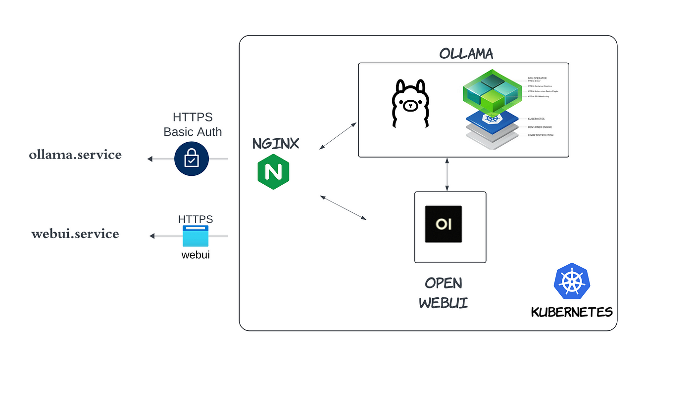

# [Run Your Own OLLAMA in Kubernetes with Nvidia GPU](https://medium.com/@yuxiaojian/run-your-own-ollama-in-kubernetes-with-nvidia-gpu-8974d0c1a9df)


In my previous story, I shared how to  [Host Your Own Ollama Service in a Cloud Kubernetes (K8s) Cluster](https://medium.com/@yuxiaojian/host-your-own-ollama-service-in-a-cloud-kubernetes-k8s-cluster-c818ca84a055). This time, let’s take it to the next level by powering your OLLAMA service with a GPU.

<p align="center">
  
</p>

I’ll use the same setup as before and highlight the changes. First, you need to add a node with a GPU to your K8s cluster. My cluster is hosted in Google Cloud, where I added a node with an NVIDIA T4 GPU.

<p align="center">
  
</p>

## Install GPU Driver

For information on installing the driver using a package manager, refer to the  [NVIDIA Driver Installation Quickstart Guide](https://docs.nvidia.com/cuda/cuda-installation-guide-linux/). Alternatively, you can install the driver by downloading a  `.run`  installer from the  [NVIDIA Official Drivers page](https://www.nvidia.com/en-us/drivers/).
```
$ nvidia-smi  
Fri Aug 16 21:54:53 2024  
+---------------------------------------------------------------------------------------+  
| NVIDIA-SMI 535.183.01             Driver Version: 535.183.01   CUDA Version: 12.2     |  
|-----------------------------------------+----------------------+----------------------+  
| GPU  Name                 Persistence-M | Bus-Id        Disp.A | Volatile Uncorr. ECC |  
| Fan  Temp   Perf          Pwr:Usage/Cap |         Memory-Usage | GPU-Util  Compute M. |  
|                                         |                      |               MIG M. |  
|=========================================+======================+======================|  
|   0  Tesla T4                       Off | 00000000:00:04.0 Off |                    0 |  
| N/A   67C    P0              29W /  70W |   6104MiB / 15360MiB |      0%      Default |  
|                                         |                      |                  N/A |  
+-----------------------------------------+----------------------+----------------------+  
  
+---------------------------------------------------------------------------------------+  
| Processes:                                                                            |  
|  GPU   GI   CI        PID   Type   Process name                            GPU Memory |  
|        ID   ID                                                             Usage      |  
|=======================================================================================|  
|    0   N/A  N/A     81441      C   ...unners/cuda_v11/ollama_llama_server     6100MiB |  
+---------------------------------------------------------------------------------------+
```
# Install the NVIDIA Container Toolkit

Install the  [NVIDIA Container Toolkit](https://docs.nvidia.com/datacenter/cloud-native/container-toolkit/latest/install-guide.html)

Check your container runtime with  `kubectl get nodes -o wide`. In my case, it's  `containerd://1.7.12`
```
$ kubeclt get nodes -o wide  
NAME                       STATUS   ROLES           AGE    VERSION   INTERNAL-IP   EXTERNAL-IP   OS-IMAGE             KERNEL-VERSION    CONTAINER-RUNTIME  
ollama-gpu   Ready    <none>          105m   v1.30.3   10.148.0.2    <none>        Ubuntu 20.04.6 LTS   5.15.0-1066-gcp   containerd://1.7.12
```
Next, Follow the instructions  [here](https://docs.nvidia.com/datacenter/cloud-native/container-toolkit/latest/install-guide.html)  to install the NVIDIA Container Toolkit.

Configure the container runtime by using the  `nvidia-ctk`  command on the GPU node
```
$ sudo nvidia-ctk runtime configure --runtime=containerd
```

The  `nvidia-ctk`  command modifies the  `/etc/containerd/config.toml`  file on the host. The file is updated so that  `containerd`  can use the NVIDIA Container Runtime.

Valid handlers are configured under the runtimes section:
```
[plugins."io.containerd.grpc.v1.cri".containerd.runtimes.${HANDLER_NAME}]
```

Check the  `config.toml`  and the handler is  `nvidia`  . We will use the handler in the Runtime class.
```
$ cat /etc/containerd/config.toml  
disabled_plugins = []  
imports = []  
oom_score = 0  
plugin_dir = ""  
required_plugins = []  
root = "/var/lib/containerd"  
state = "/run/containerd"  
version = 2  
  
[plugins]  
  
  [plugins."io.containerd.grpc.v1.cri"]  
  
    [plugins."io.containerd.grpc.v1.cri".containerd]  
  
      [plugins."io.containerd.grpc.v1.cri".containerd.runtimes]  
  
        [plugins."io.containerd.grpc.v1.cri".containerd.runtimes.nvidia]  
          base_runtime_spec = ""  
          container_annotations = []  
          pod_annotations = []  
          privileged_without_host_devices = false  
          runtime_engine = ""  
          runtime_root = ""  
          runtime_type = "io.containerd.runc.v2"  
  
          [plugins."io.containerd.grpc.v1.cri".containerd.runtimes.nvidia.options]  
            BinaryName = "/usr/bin/nvidia-container-runtime"  
            CriuImagePath = ""  
            CriuPath = ""  
            CriuWorkPath = ""  
            IoGid = 0  
            IoUid = 0  
            NoNewKeyring = false  
            NoPivotRoot = false  
            Root = ""  
            ShimCgroup = ""  
            SystemdCgroup = true  
  
...
```
## Create the Runtime Class

Apply the YAML file to create the  `nvidia`  Runtime class
```
apiVersion: node.k8s.io/v1  
kind: RuntimeClass  
metadata:  
  name: nvidia  
handler: nvidia
```
## Create OLLAMA Service

Specify the  `runtimeClassName: nvidia`  in the pod spec and assign the node to the GPU node with  `nodeName: ollama-gpu`. Here's an example YAML file:
```
apiVersion: apps/v1  
kind: Deployment  
metadata:  
  name: ollama  
  namespace: ollama  
spec:  
  replicas: 1  
  selector:  
    matchLabels:  
      name: ollama  
  template:  
    metadata:  
      labels:  
        name: ollama  
    spec:  
      runtimeClassName: nvidia  
      nodeName: ollama-gpu  
      containers:  
      - name: ollama  
        image: ollama/ollama:0.3.5  
        volumeMounts:  
          - mountPath: /root/.ollama  
            name: ollama-storage  
        ports:  
        - name: http  
          containerPort: 11434  
          protocol: TCP  
        env:  
        - name: PRELOAD_MODELS  
          value: "llama3.1"  
        - name: OLLAMA_KEEP_ALIVE  
          value: "12h"  
        lifecycle:  
          postStart:  
            exec:  
              command: ["/bin/sh", "-c", "for model in $PRELOAD_MODELS; do ollama run $model \"\"; done"]  
      volumes:  
      - hostPath:  
          path: /opt/ollama  
          type: DirectoryOrCreate  
        name: ollama-storage  
---  
apiVersion: v1  
kind: Service  
metadata:  
  name: ollama  
  namespace: ollama  
spec:  
  type: ClusterIP  
  selector:  
    name: ollama  
  ports:  
  - port: 80  
    name: http  
    targetPort: http  
    protocol: TCP
```
## Verify OLLAMA running status

Check the OLLAMA running status inside an OLLAMA pod and it should show  `100% GPU`  usage:
```
$ kubectl get po -n ollama  
NAME                      READY   STATUS    RESTARTS   AGE  
ollama-55ddc567bd-zmd9f   1/1     Running   0          177m  
  
$ kubectl  exec -it -n ollama ollama-55ddc567bd-zmd9f -- bash  
root@ollama-55ddc567bd-zmd9f:/# ollama ps  
NAME            ID           SIZE   PROCESSOR UNTIL  
llama3.1:latest 91ab477bec9d 6.7 GB 100% GPU  11 hours from now
```
That’s it! You now have a hosted OLLAMA service running in a K8s with a GPU!

You can use the WebUI or Python library to do tests and enjoy a smooth experience.