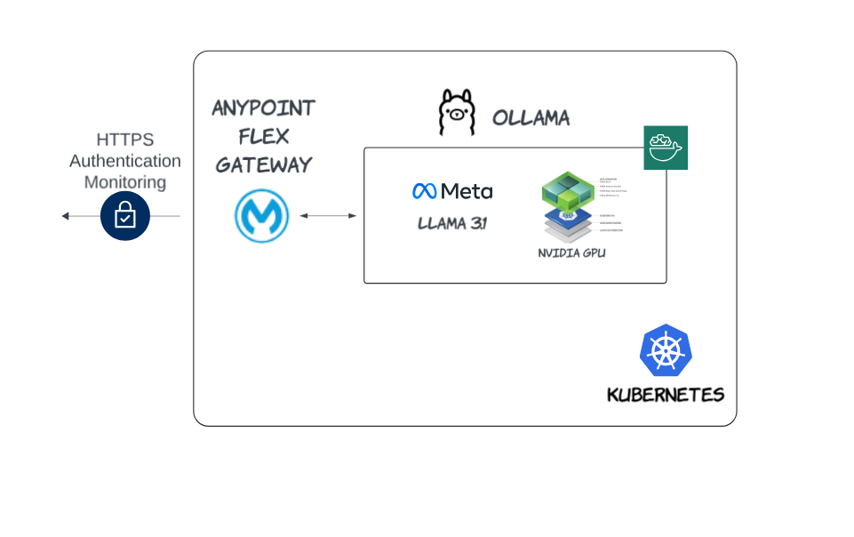
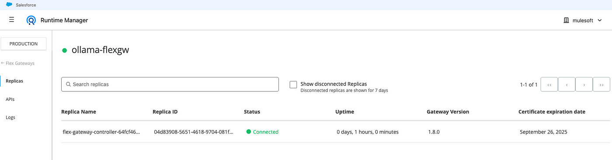
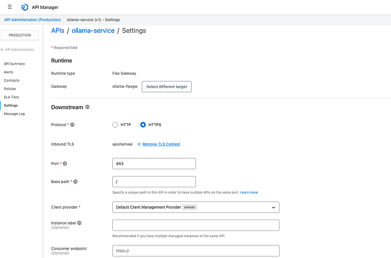
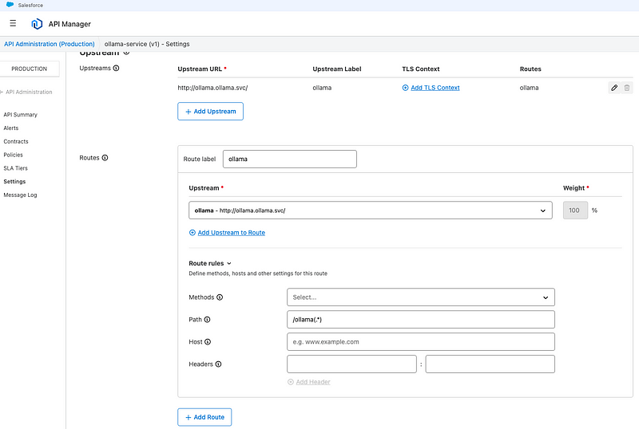
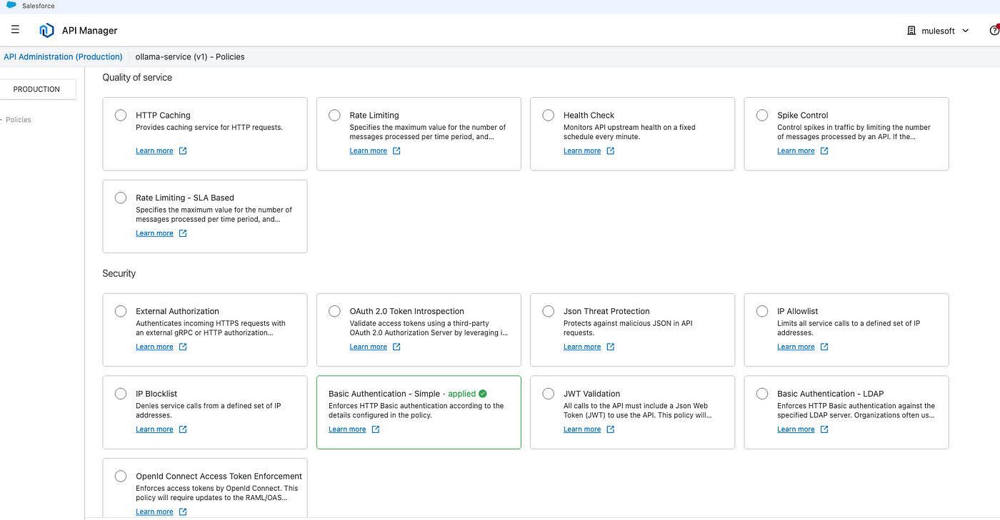

# [Secure Llama API with Anypoint Flex Gateway](https://medium.com/@yuxiaojian/secure-llama-api-with-anypoint-flex-gateway-1c6b4d7a4620)


In previous discussions, we explored  [Host Your Own Ollama Service in a Cloud Kubernetes (K8s) Cluster](https://medium.com/@yuxiaojian/host-your-own-ollama-service-in-a-cloud-kubernetes-k8s-cluster-c818ca84a055)  and  [Run Your Own OLLAMA in Kubernetes with Nvidia GPU](https://medium.com/@yuxiaojian/run-your-own-ollama-in-kubernetes-with-nvidia-gpu-8974d0c1a9df). By now, you should have a robust Llama API service hosted in your own environment. If you’re considering putting this service into production or building an enterprise-level solution, one critical aspect that must come to mind is security.

In this story, we will explore how to use the Anypoint Flex Gateway to secure your Llama API service

<p align="center">
  
</p>

# API Gateway in K8s

An API gateway is essential for Kubernetes clusters implementing microservice architectures, as it provides a single, consistent point of contact for clients to access various services. The key reasons for implementing an API gateway include:

-   Security and authentication: The gateway acts as a TLS endpoint, enforcing authentication at the ingress point and protecting the cluster from unauthorized access.
-   Routing and load balancing: It intelligently routes requests to appropriate services based on various factors and balances the load across multiple instances, ensuring high availability.
-   Advanced features: It enables request monitoring and tracing, A/B testing, API versioning, rate limiting, and request transformation, enhancing the overall functionality and management of the microservices ecosystem.

## Anypoint Flex Gateway

Anypoint Flex Gateway is an Envoy-based, ultrafast lightweight API gateway designed to manage and secure APIs running in any environment. Built to integrate with DevOps and CI/CD workflows seamlessly, it offers high performance for demanding applications and microservices, enterprise-grade security and manageability.

Key features of the flex gateway include a small footprint, multiple deployment options (including as a native Kubernetes Ingress controller), and support for both Connected and Local modes. Flex Gateway can secure both Mule and non-Mule APIs.

# Setup

We will set up a cluster with Anypoint Flex Gateway and Ollama service. The detailed instructions for setting up the Ollama service are in the two last stories  [Host Your Own Ollama Service in a Cloud Kubernetes (K8s) Cluster](https://medium.com/@yuxiaojian/host-your-own-ollama-service-in-a-cloud-kubernetes-k8s-cluster-c818ca84a055)  and  [Run Your Own OLLAMA in Kubernetes with Nvidia GPU](https://medium.com/@yuxiaojian/run-your-own-ollama-in-kubernetes-with-nvidia-gpu-8974d0c1a9df). We will focus on Anypoint Flex Gateway in this story.

## Ollama Service

The Ollama service is created with the below YAML file and runs on a GPU node with  `runtimeClassName: nvidia`
```yaml
apiVersion: apps/v1  
kind: Deployment  
metadata:  
  name: ollama  
  namespace: ollama  
spec:  
  replicas: 1  
  selector:  
    matchLabels:  
      name: ollama  
  template:  
    metadata:  
      labels:  
        name: ollama  
    spec:  
      runtimeClassName: nvidia  
      containers:  
      - name: ollama  
        image: ollama/ollama:0.3.5  
        volumeMounts:  
          - mountPath: /root/.ollama  
            name: ollama-storage  
          - mountPath: /root/models  
            name: model-storage  
        ports:  
        - name: http  
          containerPort: 11434  
          protocol: TCP  
        env:  
        - name: PRELOAD_MODELS  
          value: "llama3.1"  
        - name: OLLAMA_KEEP_ALIVE  
          value: "12h"  
        - name: OLLAMA_DEBUG  
          value: "1"  
        lifecycle:  
          postStart:  
            exec:  
              command: ["/bin/sh", "-c", "for model in $PRELOAD_MODELS; do ollama run $model \"\"; done"]  
      volumes:  
      - hostPath:  
          path: /opt/ollama  
          type: DirectoryOrCreate  
        name: ollama-storage  
      - hostPath:  
          path: /opt/fine-tuning/  
          type: DirectoryOrCreate  
        name: model-storage  
---  
apiVersion: v1  
kind: Service  
metadata:  
  name: ollama  
  namespace: ollama  
spec:  
  type: ClusterIP  
  selector:  
    name: ollama  
  ports:  
  - port: 80  
    name: http  
    targetPort: http  
    protocol: TCP
```
The service  `ollama`  maps the incoming port 80 to  `ollama`  pod port 11434. They are in the  `ollama`  namespace. We will use this shortly.
```
$kubeclt get po,svc,ep -n ollama  
NAME                          READY   STATUS    RESTARTS   AGE  
pod/ollama-5f594c98fd-tbgmz   1/1     Running   0          60m  
  
NAME             TYPE           CLUSTER-IP      EXTERNAL-IP                                   PORT(S)   AGE  
service/ollama   ClusterIP      10.103.226.52   <none>                                        80/TCP    13d                                    80/TCP    9d  
  
NAME               ENDPOINTS           AGE  
endpoints/ollama   192.168.1.6:11434   13d
```

## Install Anypoint Flex Gateway

Ensure your K8s cluster meets the  [prerequisites](https://docs.mulesoft.com/gateway/latest/flex-review-prerequisites). Let’s install the Flex Gateway following  [Getting Started with Flex Gateway in a Kubernetes Cluster](https://docs.mulesoft.com/gateway/latest/flex-gateway-k8-getting-started).

[Register](https://docs.mulesoft.com/gateway/latest/flex-gateway-k8-getting-started#register-flex)  a flex gateway in your Anypoint platform and get the  `registration.yaml`  , then we  [install with helm](https://docs.mulesoft.com/gateway/latest/flex-gateway-k8-getting-started#create-repo). The flex gateway is installed in the namespace  `flex-gateway`  with the release name  `flex-gateway-controller`
```
$ sudo helm -n flex-gateway upgrade -i --create-namespace flex-gateway-controller flex-gateway/flex-gateway --set gateway.mode=connected --set-file registration.content=registration.yaml  
Release "flex-gateway-controller" does not exist. Installing it now.  
NAME: flex-gateway-controller  
LAST DEPLOYED: Fri Aug 30 05:57:02 2024  
NAMESPACE: flex-gateway  
STATUS: deployed  
REVISION: 1  
TEST SUITE: None
```

Once installed successfully, we can see it’s connected to the Anypoint platform.


<p align="center">
  
</p>

Let’s check the pod and service in the cluster.
```
$ kubectl get po,svc,ep -n flex-gateway  
NAME                                           READY   STATUS    RESTARTS   AGE  
pod/flex-gateway-controller-64fcf467b7-rkznx   1/1     Running   0          80m  
  
NAME                              TYPE           CLUSTER-IP      EXTERNAL-IP   PORT(S)                      AGE  
service/flex-gateway-controller   LoadBalancer   10.99.232.245   <pending>     80:30740/TCP,443:30461/TCP   80m  
  
NAME                                ENDPOINTS                        AGE  
endpoints/flex-gateway-controller   192.168.1.5:443,192.168.1.5:80   80m  
```
The external Load Balancer maps port 443 to 30461 of the  `flex-gateway-controller`  endpoint. As there is no LB in this setup, we will use port 30461 and node the IP instead.

## Configure Anypoint Flex Gateway

Before we proceed, we need a TLS context  [Configuring TLS Context for Flex Gateway in Connected Mode](https://docs.mulesoft.com/gateway/latest/flex-conn-tls-config).

Next, let’s configure the API following [Publish and Deploy a Simple API to Flex Gateway](https://docs.mulesoft.com/gateway/latest/flex-gateway-k8-getting-started#create-api). The request flow is LB:443 → flex-gateway-controller_svc_endpoint:30461-> flex-gateway-controller_pod:443. The port in the API console is the flex-gateway-controller pod listening port, so we set it to 443.


<p align="center">
  
</p>

The upstream URL is  `[http://ollama.ollama.svc/](http://ollama.ollama.svc/)`. This is the K8s internal URL which points to the Ollama service endpoint in the  `ollama`  namespace where the  `ollama`  service is running.


<p align="center">
  
</p>

Let’s run a quick test. I created a self-signed certificate  `api.ollama.ai`  and use  `— resolve`  to resolve it to my node IP (34.143.123.234). As there is no LB in my cluster, it goes directly to node port 30461.

We can see that  `llama3.1`  is running and accessible via the Flex Gateway, hooray!
```
curl -sk --resolve "api.ollama.ai:30461:34.143.123.234" https://api.ollama.ai:30461/ollama/api/tags | jq  
{  
  "models": [  
    {  
      "name": "llama3.1:latest",  
      "model": "llama3.1:latest",  
      "modified_at": "2024-08-30T06:25:36.928861984Z",  
      "size": 4661230720,  
      "digest": "f66fc8dc39ea206e03ff6764fcc696b1b4dfb693f0b6ef751731dd4e6269046e",  
      "details": {  
        "parent_model": "",  
        "format": "gguf",  
        "family": "llama",  
        "families": [  
          "llama"  
        ],  
        "parameter_size": "8.0B",  
        "quantization_level": "Q4_0"  
      }  
    }  
  ]  
}
```
With the Flex Gateway in place, we can apply various policies to secure the API. I have applied an HTTP Basic Authentication policy.


<p align="center">
  
</p>

# Create a Chatbot With Your Own LLama API

Let’s have some fun with the API and create a simple chatbot.

_Note, the domain_ `_api.ollama.ai_` _is added to my_ `_/etc/hosts_` _file with the node IP. You also need to add the cert to the Python trust store since it’s a self-signed certificate. Detailed instructions in_ [_Host Your Own Ollama Service in a Cloud Kubernetes (K8s) Cluster_](https://medium.com/@yuxiaojian/host-your-own-ollama-service-in-a-cloud-kubernetes-k8s-cluster-c818ca84a055)
```python
# install the latest ollama lib  
# pip install -U ollama  
  
from ollama import Client  
import httpx  
  
# Set up authentication  
httpx_auth = httpx.BasicAuth(username="myusername", password="mypassword")  
  
# Initialize the client  
client = Client(host='https://api.ollama.ai:30461/ollama', auth=httpx_auth)  
  
# Simple chatbot loop  
while True:  
    user_input = input("You: ")  
    if user_input.lower() in ['exit', 'quit', 'bye']:  
        print("Chatbot: Goodbye!")  
        break  
      
    response = client.chat(model='llama3.1', messages=[  
        {  
            'role': 'user',  
            'content': user_input,  
        }  
    ])  
      
    print("Chatbot:", response['message']['content'])
```
Here’s a sample conversation.
```
You:  hello  
Chatbot: Hello! How can I help you today?  
You:  tell me a joke  
Chatbot: Here's one:  
  
What do you call a fake noodle?  
  
An impasta.  
You:  more  
Chatbot: It looks like you'd like to have more, but I'm not sure what "more" refers to. Could you provide some context or clarify what you're looking for? I'll do my best to help!  
  
Some possibilities:  
  
* More information on a topic?  
* More time to chat?  
* More options or suggestions?  
  
Let me know and I'll try to provide more (ha!)!  
You:  a joke about sky  
Chatbot: Here's one:  
  
Why did the sky go to therapy?  
  
Because it was feeling a little "blue"! (get it?)  
You:  quit  
Chatbot: Goodbye!

Have fun with the chatbot powered by your own API, and secured with the Anypoint API gateway.
```
# Conclusion

This story explores how to secure a Llama API service hosted in a Kubernetes cluster using Anypoint Flex Gateway. It builds upon previous stories about [Host Your Own Ollama Service in a Cloud Kubernetes (K8s) Cluster](https://medium.com/@yuxiaojian/host-your-own-ollama-service-in-a-cloud-kubernetes-k8s-cluster-c818ca84a055)  and [Run Your Own OLLAMA in Kubernetes with Nvidia GPU](https://medium.com/@yuxiaojian/run-your-own-ollama-in-kubernetes-with-nvidia-gpu-8974d0c1a9df).

The story provides a step-by-step guide on setting up the Ollama service and installing Anypoint Flex Gateway in a Kubernetes cluster. By following this guide, we can enhance the security and manageability of the Llama API service, making it suitable for production or enterprise-level deployments.