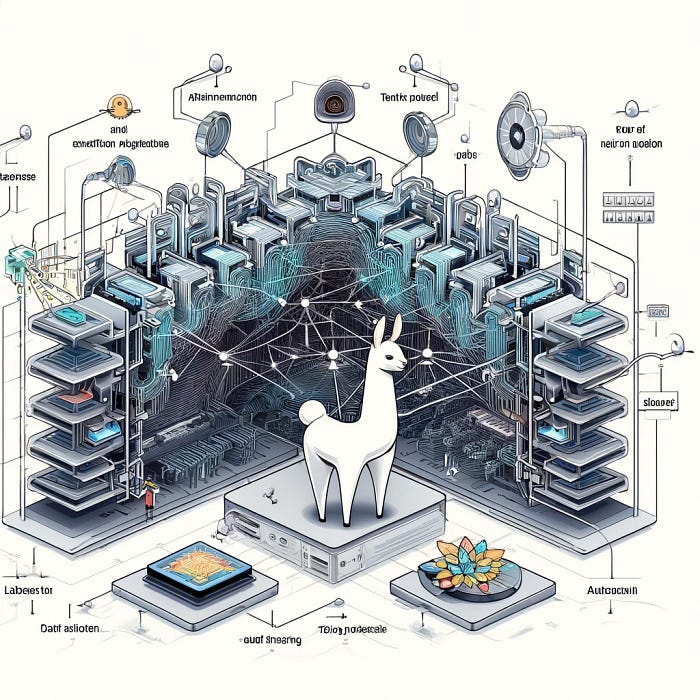
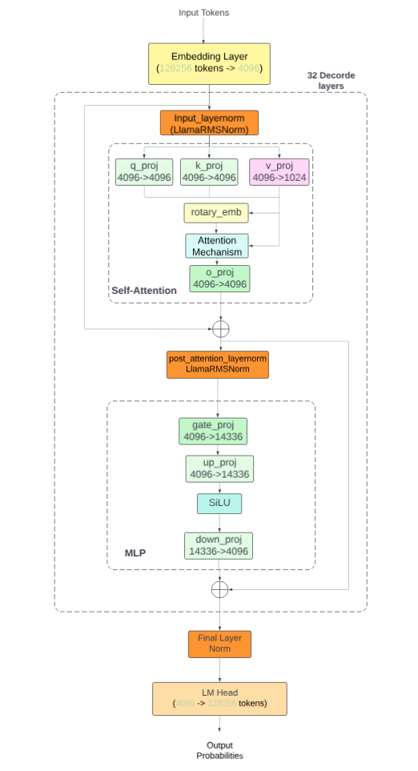

# [Understand How Llama3.1 Works — A Deep Dive Into the Model Flow](https://medium.com/@yuxiaojian/understand-how-llama3-1-works-a-deep-dive-into-the-model-flow-b149aba04bed)


<p align="center">
  
</p>

Illustrated by Chat GPT

Large Language Models like Llama 3.1 are powerful, yet understanding their inner workings can be complex, especially when theory becomes disconnected from practical application. In this deep dive, we’ll take a unique approach by exploring the model from a reversed perspective. By tracing the workflow backward, we’ll uncover the intricate processes that drive Llama 3.1, providing an in-depth, practical understanding of how this model functions.

# Model Architecture

Let’s load the llama3.1 model and have a close look at it. To reduce memory usage, we use 4-bit quantization (Linear4bit) for all linear transformations. The quantization doesn’t undermine our understanding of how the model works.
```python
import torch  
from transformers import AutoModelForCausalLM, AutoTokenizer, BitsAndBytesConfig  
base_model = "meta-llama/Meta-Llama-3.1-8B-Instruct"  
  
# load the tokenizer  
tokenizer = AutoTokenizer.from_pretrained(base_model)  
  
bnb_config = BitsAndBytesConfig(  
    load_in_4bit=True,  
    bnb_4bit_quant_type="nf4",  
    bnb_4bit_compute_dtype=torch.bfloat16  
)  
  
# load and quantize the model   
base_model_bnb_4b = AutoModelForCausalLM.from_pretrained(base_model, quantization_config=bnb_config, device_map = 'auto')  
base_model_bnb_4b
```
Print  `base_model_bnb_4b`  will use the model structure
```
LlamaForCausalLM(  
  (model): LlamaModel(  
    (embed_tokens): Embedding(128256, 4096)  
    (layers): ModuleList(  
      (0-31): 32 x LlamaDecoderLayer(  
        (self_attn): LlamaSdpaAttention(  
          (q_proj): Linear4bit(in_features=4096, out_features=4096, bias=False)  
          (k_proj): Linear4bit(in_features=4096, out_features=1024, bias=False)  
          (v_proj): Linear4bit(in_features=4096, out_features=1024, bias=False)  
          (o_proj): Linear4bit(in_features=4096, out_features=4096, bias=False)  
          (rotary_emb): LlamaRotaryEmbedding()  
        )  
        (mlp): LlamaMLP(  
          (gate_proj): Linear4bit(in_features=4096, out_features=14336, bias=False)  
          (up_proj): Linear4bit(in_features=4096, out_features=14336, bias=False)  
          (down_proj): Linear4bit(in_features=14336, out_features=4096, bias=False)  
          (act_fn): SiLU()  
        )  
        (input_layernorm): LlamaRMSNorm((4096,), eps=1e-05)  
        (post_attention_layernorm): LlamaRMSNorm((4096,), eps=1e-05)  
      )  
    )  
    (norm): LlamaRMSNorm((4096,), eps=1e-05)  
    (rotary_emb): LlamaRotaryEmbedding()  
  )  
  (lm_head): Linear(in_features=4096, out_features=128256, bias=False)  
)
```
If we visualize the model, the illustration would look like the below diagram. It shows the overall structure of the  `LlamaForCausalLM`  model:

<p align="center">
  
</p>
1.  Input tokens are first processed by the embedding layer, which converts token IDs to dense vectors of size 4096.
2.  The LlamaRotaryEmbedding is applied to the embedded tokens.
3.  The core of the model consists of 32 identical  `LlamaDecoderLayers`. Each layer includes:  
    - Input layer normalization  
    - Self-attention mechanism with separate projections for queries, keys, values, and output  
    - Post-attention layer normalization  
    - MLP block with gate and up projections, SiLU activation, and down projection
4.  After the 32 decoder layers, there’s a final layer normalization.
5.  The output of the model body goes through the LM head, which projects the 4096-dimensional vectors back to the vocabulary space (128256 dimensions).
6.  The final output represents the probability distribution over the next token in the sequence.

# Model Config

Let’s check the settings for a Llama 3.1 8B Instruct model.
```
base_model_bnb_4b.config  
  
LlamaConfig {  
  "_name_or_path": "meta-llama/Meta-Llama-3.1-8B-Instruct",  
  "architectures": [  
    "LlamaForCausalLM"  
  ],  
  "attention_bias": false,  
  "attention_dropout": 0.0,  
  "bos_token_id": 128000,  
  "eos_token_id": [  
    128001,  
    128008,  
    128009  
  ],  
  "hidden_act": "silu",  
  "hidden_size": 4096,  
  "initializer_range": 0.02,  
  "intermediate_size": 14336,  
  "max_position_embeddings": 131072,  
  "mlp_bias": false,  
  "model_type": "llama",  
  "num_attention_heads": 32,  
  "num_hidden_layers": 32,  
  "num_key_value_heads": 8,  
  "pretraining_tp": 1,  
  "quantization_config": {  
    "_load_in_4bit": true,  
    "_load_in_8bit": false,  
    "bnb_4bit_compute_dtype": "bfloat16",  
    "bnb_4bit_quant_storage": "uint8",  
    "bnb_4bit_quant_type": "nf4",  
    "bnb_4bit_use_double_quant": false,  
    "llm_int8_enable_fp32_cpu_offload": false,  
    "llm_int8_has_fp16_weight": false,  
    "llm_int8_skip_modules": null,  
    "llm_int8_threshold": 6.0,  
    "load_in_4bit": true,  
    "load_in_8bit": false,  
    "quant_method": "bitsandbytes"  
  },  
  "rms_norm_eps": 1e-05,  
  "rope_scaling": {  
    "factor": 8.0,  
    "high_freq_factor": 4.0,  
    "low_freq_factor": 1.0,  
    "original_max_position_embeddings": 8192,  
    "rope_type": "llama3"  
  },  
  "rope_theta": 500000.0,  
  "tie_word_embeddings": false,  
  "torch_dtype": "float16",  
  "transformers_version": "4.44.2",  
  "use_cache": true,  
  "vocab_size": 128256  
}
```
Let’s break down the key components:

1.  Model Architecture:  
    `"architectures": ["LlamaForCausalLM"]`: This is a causal language model based on the Llama architecture.  
    `"model_type": "llama"`: Confirms it's a Llama model.
2.  Model Size and Structure:  
    `"hidden_size": 4096`: The dimension of the hidden states.  
    `"intermediate_size": 14336`: The dimension of the feedforward layer.  
    `"num_hidden_layers": 32`: The number of transformer layers.  
    `"num_attention_heads": 32`: The number of attention heads.  
    `"num_key_value_heads": 8`: The number of key/value heads for grouped-query attention.
3.  Tokenization:  
    `"vocab_size": 128256`: The size of the vocabulary.  
    `"bos_token_id": 128000`: The ID for the beginning-of-sequence token.  
    `"eos_token_id": [128001, 128008, 128009]`: The IDs for end-of-sequence tokens.
4.  Position Embeddings:  
    `"max_position_embeddings": 131072`: The maximum sequence length the model can handle.  
    `"rope_scaling"`: Configuration for RoPE (Rotary Position Embedding) scaling, allowing for longer context lengths.
5.  Activation and Normalization:  
    `"hidden_act": "silu"`: The activation function used (SiLU, also known as Swish).  
    `"rms_norm_eps": 1e-05`: Epsilon value for RMSNorm.
6.  Quantization:  
    The model is configured for 4-bit quantization using the bitsandbytes library.  
    `"bnb_4bit_quant_type": "nf4"`: Uses NF4 (normalized float 4) quantization.  
    `"bnb_4bit_compute_dtype": "bfloat16"`: Computations are done in bfloat16 precision.
7.  Other Notable Settings:  
    `"torch_dtype": "float16"`: The model weights are stored in float16 precision.  
    `"use_cache": true`: Enables the use of past key/values for faster inference.  
    `"tie_word_embeddings": false`: Input and output embeddings are not tied.

# Tokenizer

A tokenizer serves as a dictionary between raw text and the numerical representations that the model can process. Llama 3.1 uses a tokenizer with a vocabulary of 128K tokens.
```
# Get the vocabulary size  
vocab_size = len(tokenizer.get_vocab())  
print(f"Vocabulary size: {vocab_size}")  
  
> Vocabulary size: 128256
```
A prompt fed into the model includes some special tokens indicating each section's message type, start and stop. Here is an example of a token and ID mapping.
```
def print_tokens_with_ids(txt):  
    tokens = tokenizer.tokenize(txt, add_special_tokens=False)  
    token_ids = tokenizer.encode(txt, add_special_tokens=False)  
    print(list(zip(tokens, token_ids)))  
  
prompt = """<|begin_of_text|><|start_header_id|>system<|end_header_id|>  
  
Based on the information provided, rewrite the sentence by changing its tense from past to future.<|eot_id|><|start_header_id|>user<|end_header_id|>  
  
She played the piano beautifully for hours and then stopped as it was midnight.<|eot_id|><|start_header_id|>assistant<|end_header_id|>  
  
"""  
print_tokens_with_ids(prompt)  
  
# Token and Token ID  
> [('<|begin_of_text|>', 128000), ('<|start_header_id|>', 128006), ('system', 9125), ('<|end_header_id|>', 128007), ('ĊĊ', 271), ('Based', 29815), ('Ġon', 389), ('Ġthe', 279), ('Ġinformation', 2038), ('Ġprovided', 3984), (',', 11), ('Ġrewrite', 18622), ('Ġthe', 279), ('Ġsentence', 11914), ('Ġby', 555), ('Ġchanging', 10223), ('Ġits', 1202), ('Ġtense', 43787), ('Ġfrom', 505), ('Ġpast', 3347), ('Ġto', 311), ('Ġfuture', 3938), ('.', 13), ('<|eot_id|>', 128009), ('<|start_header_id|>', 128006), ('user', 882), ('<|end_header_id|>', 128007), ('ĊĊ', 271), ('She', 8100), ('Ġplayed', 6476), ('Ġthe', 279), ('Ġpiano', 27374), ('Ġbeautifully', 32719), ('Ġfor', 369), ('Ġhours', 4207), ('Ġand', 323), ('Ġthen', 1243), ('Ġstopped', 10717), ('Ġas', 439), ('Ġit', 433), ('Ġwas', 574), ('Ġmidnight', 33433), ('.', 13), ('<|eot_id|>', 128009), ('<|start_header_id|>', 128006), ('assistant', 78191), ('<|end_header_id|>', 128007), ('ĊĊ', 271)]
```
The input to the model is just the token IDs
```
[128000, 128000, 128006,   9125, 128007,    271,  29815,    389,    279,  
           2038,   3984,     11,  18622,    279,  11914,    555,  10223,   1202,  
          43787,    505,   3347,    311,   3938,     13, 128009, 128006,    882,  
         128007,    271,   8100,   6476,    279,  27374,  32719,    369,   4207,  
            323,   1243,  10717,    439,    433,    574,  33433,     13, 128009,  
         128006,  78191, 128007,    271]  
```
Use the model  `generate`  method to “predict” output tokens
```
outputs = base_model_bnb_4b.generate(input_ids=input_ids,  
                          pad_token_id=tokenizer.eos_token_id,  
                          max_new_tokens=200,  
                          do_sample=True,  
                          top_p=0.9,  
                          temperature=0.1)
```
The output tokens are the blacked ones below. The last token  `128009`  is  `<|eot_id|>`  which indicates the end of the output.
```
[128000, 128000, 128006,   9125, 128007,    271,  29815,    389,    279,  
           2038,   3984,     11,  18622,    279,  11914,    555,  10223,   1202,  
          43787,    505,   3347,    311,   3938,     13, 128009, 128006,    882,  
         128007,    271,   8100,   6476,    279,  27374,  32719,    369,   4207,  
            323,   1243,  10717,    439,    433,    574,  33433,     13, 128009,  
         128006,  78191, 128007,    271,   **8586,    374,    279,  11914,  59624,  
            304,    279,   3938,  43787,   1473,   8100,    690,   1514,    279,  
          27374,  32719,    369,   4207,    323,   1243,   3009,    439,    433,  
            374,  33433,     13, 128009**]
```
Map these tokens back to text with the tokenizer
```
result = tokenizer.batch_decode(outputs.detach().cpu().numpy(), skip_special_tokens=False)[0]  
print(result)

The output text is

<|begin_of_text|><|begin_of_text|><|start_header_id|>system<|end_header_id|>  
  
Based on the information provided, rewrite the sentence by changing its tense from past to future.<|eot_id|><|start_header_id|>user<|end_header_id|>  
  
She played the piano beautifully for hours and then stopped as it was midnight.<|eot_id|><|start_header_id|>assistant<|end_header_id|>  
  
Here is the sentence rewritten in the future tense:  
  
She will play the piano beautifully for hours and then stop as it is midnight.<|eot_id|>
```
The text between  `<|start_header_id|>assistant<|end_header_id|>`  and  `<|eot_id|>`  is the model-generated answer.

# Token Generating Process

The LlamaForCausalLM model, like other transformer-based language models, uses a sequence of tokens as input and generates (or predicts to be more accurate) a token each time. During text generation, the model is typically used autoregressively:

1.  Start with an initial prompt (which can be multiple tokens).
2.  The model predicts the next token.
3.  Add this predicted token to the input sequence.
4.  Repeat steps 2–3 to generate more tokens until a stop token or reach the max token number.

Here’s a simplified illustration:
```
Input Sequence: [token1, token2, token3, ...]  
     |  
     v  
+----------------+  
|                |  
|  Llama Model   |  
|                |  
+----------------+  
     |  
     v  
Output: [prob_dist1, prob_dist2, prob_dist3, ...]
```
Where:

-   `token1, token2, token3, ...`  are the input tokens
-   `prob_dist1, prob_dist2, prob_dist3, ...`  are probability distributions for the next token at each position

For generation:
```
Step 1: [A, B, C] -> Model -> [_, _, _, D]  
Step 2: [A, B, C, D] -> Model -> [_, _, _, _, E]  
Step 3: [A, B, C, D, E] -> Model -> [_, _, _, _, _, F]  
...
```
Given the example we used in the tokenizer section, the steps will be
```
Step 1:  
Input:  [128000, ..., 271]  
Output: [128000, ..., 271, 8586]  
                           ^^^^  
                        New token  
  
... (continuing for each new token) ...  
  
Final Step:  
Input:  [128000, ..., 374, 33433, 13]  
Output: [128000, ..., 374, 33433, 13, 128009]
```
The context window (maximum sequence length) decides how many tokens can be used as input. The maximum sequence length the Llam3.1 model can handle is 131072`"max_position_embeddings": 131072`

# `Temperature and Top_p`

The generation parameters  `top_p`  and  `temperature`  are crucial in controlling how the model selects the next token during text generation. They influence the balance between creativity and determinism in the output. Let’s break this down:

1.  Temperature:

Temperature is a hyperparameter that controls the randomness of predictions by scaling the logits before applying softmax.

-   Formula:  `P(x_i) = exp(z_i / T) / Σ exp(z_j / T)` Where  `z_i`  are the logits,  `T`  is the temperature, and  `P(x_i)`  is the probability of a token  `i`.
-   Range: Usually between 0 and 2, with 1 being neutral.
-   Lower temperature (e.g., 0.1) makes the distribution “sharper” (more peaked). It means more deterministic output and tends to produce more repetitive and “safe” text
-   Higher temperature (e.g., 1.5) makes the distribution “flatter”. It means more random output and tends to produce more diverse and potentially creative text.

Visual representation:
```
Low Temperature (0.1)     High Temperature (1.5)  
    |                         |  
    |*                        |  
    |*                        | *  *  *  
    |*  *  *                  |*  *  *  *  
----+------------------   ----+------------------  
    A  B  C  D  E            A  B  C  D  E
```
2. Top-p (Nucleus Sampling):

Top-p, also known as nucleus sampling, sets a probability threshold and only considers the top tokens whose cumulative probability exceeds this threshold. The range is usually between 0 and 1.

-   A lower p (e.g., 0.1) considers fewer options. More focused and deterministic output
-   A higher p (e.g., 0.9) considers more options. More diverse output

3. Interaction between Temperature and Top-p:

-   Temperature is applied first, reshaping the probability distribution.
-   Then, top-p filtering is applied to this reshaped distribution.

In the example

do_sample=True,  
top_p=0.9,  
temperature=0.1

-   `do_sample=True`: Enables sampling (as opposed to always choosing the most likely token).
-   `top_p=0.9`: Considers a wide range of tokens (90% of the probability mass).
-   `temperature=0.1`: Very low temperature, making the distribution much sharper.

This combination will tend to produce output that is:

-   Fairly deterministic (due to low temperature)
-   But still with some variability (due to high top-p)
-   Likely to be coherent and “safe”, but with occasional unexpected choices

# Generate Tokens Step by Step

The model wraps up all the layers with a unified  `generate`interface. To understand the process clearly, we can break down the steps with the loaded model  `base_model_bnb_4b`  .

1.  Create the token IDs and embedding.
```python
input_ids = tokenizer(prompt, return_tensors="pt", truncation=True).input_ids.cuda()  
position_ids = torch.arange(0, input_ids.shape[1]).unsqueeze(0).cuda()  
seq_length = input_ids.shape[1]  
embeddings = base_model_bnb_4b.model.embed_tokens(input_ids)  
print("Embeddings shape:", embeddings.shape)  
  
> Embeddings shape: torch.Size([1, 49, 4096])
```
2. Iterate the 32 layers
```python
# Process through each layer of the model  
for layer_idx, layer in enumerate(base_model_bnb_4b.model.layers):  
    print(f"Processing layer {layer_idx}")  
      
    # 1. Input LayerNorm  
    normalized_hidden_states = layer.input_layernorm(hidden_states)  
      
    # 2. Self-attention mechanism  
    # 2.1 Query, Key, Value projections  
    query_states = layer.self_attn.q_proj(normalized_hidden_states)  
    key_states = layer.self_attn.k_proj(normalized_hidden_states)  
    value_states = layer.self_attn.v_proj(normalized_hidden_states)  
      
    # 2.2 Reshape and transpose Q, K, V  
    # (batch_size, seq_length, num_heads, head_dim) -> (batch_size, num_heads, seq_length, head_dim)  
    query_states = query_states.view(batch_size, seq_length, layer.self_attn.num_heads, layer.self_attn.head_dim).transpose(1, 2)  
    key_states = key_states.view(batch_size, seq_length, layer.self_attn.num_key_value_heads, layer.self_attn.head_dim).transpose(1, 2)  
    value_states = value_states.view(batch_size, seq_length, layer.self_attn.num_key_value_heads, layer.self_attn.head_dim).transpose(1, 2)  
      
    # 2.3 Apply rotary positional embeddings  
    kv_seq_len = key_states.shape[-2]  
    cos, sin = layer.self_attn.rotary_emb(value_states, position_ids)  
    query_states, key_states = apply_rotary_pos_emb(query_states, key_states, cos, sin, position_ids)  
      
    # 2.4 Handle grouped-query attention  
    # Repeat K and V for each query group  
    key_states = repeat_kv(key_states, layer.self_attn.num_key_value_groups)  
    value_states = repeat_kv(value_states, layer.self_attn.num_key_value_groups)  
      
    # 2.5 Compute attention scores  
    attn_weights = torch.matmul(query_states, key_states.transpose(2, 3)) / math.sqrt(layer.self_attn.head_dim)  
    attn_weights = F.softmax(attn_weights, dim=-1, dtype=torch.float32).to(query_states.dtype)  
      
    # 2.6 Apply attention to values  
    attn_output = torch.matmul(attn_weights, value_states)  
      
    # 2.7 Reshape attention output  
    # (batch_size, num_heads, seq_length, head_dim) -> (batch_size, seq_length, hidden_size)  
    attn_output = attn_output.transpose(1, 2).contiguous().view(batch_size, seq_length, hidden_size)  
      
    # 2.8 Output projection  
    attn_output = layer.self_attn.o_proj(attn_output)  
      
    # 2.9 Residual connection  
    hidden_states = hidden_states + attn_output  
      
    # 3. Post-attention LayerNorm  
    normalized_hidden_states = layer.post_attention_layernorm(hidden_states)  
      
    # 4. MLP (Feed-Forward Network)  
    # 4.1 Apply gate and up projections  
    gate_output = layer.mlp.gate_proj(normalized_hidden_states)  
    up_output = layer.mlp.up_proj(normalized_hidden_states)  
      
    # 4.2 Apply activation function and element-wise multiplication  
    mlp_output = up_output * layer.mlp.act_fn(gate_output)  
      
    # 4.3 Down projection  
    mlp_output = layer.mlp.down_proj(mlp_output)  
      
    # 4.4 Residual connection  
    hidden_states = hidden_states + mlp_output  
      
    print(f"  Output shape: {hidden_states.shape}")
```
The rotary positional embedding requires these helper functions

```python
import torch  
import torch.nn.functional as F  
import math  
  
# Helper functions for Rotary Position Embedding (RoPE) and grouped-query attention  
  
def apply_rotary_pos_emb(q, k, cos, sin, position_ids):  
    """  
    Apply rotary positional embeddings to query and key tensors.  
      
    Args:  
    q, k: Query and key tensors  
    cos, sin: Cosine and sine components of rotary embeddings  
    position_ids: Tensor of position IDs  
      
    Returns:  
    q_embed, k_embed: Query and key tensors with rotary embeddings applied  
    """  
    # Reshape cosine and sine tensors  
    cos = cos.squeeze(1).squeeze(0)  # [seq_len, dim]  
    sin = sin.squeeze(1).squeeze(0)  # [seq_len, dim]  
      
    # Select relevant positional embeddings  
    cos = cos[position_ids].unsqueeze(1)  # [bs, 1, seq_len, dim]  
    sin = sin[position_ids].unsqueeze(1)  # [bs, 1, seq_len, dim]  
      
    # Apply rotary embeddings  
    q_embed = (q * cos) + (rotate_half(q) * sin)  
    k_embed = (k * cos) + (rotate_half(k) * sin)  
      
    return q_embed, k_embed  
  
def rotate_half(x):  
    """  
    Rotate half of the hidden dimensions of the input tensor.  
      
    This operation is part of the rotary position embedding technique.  
      
    Args:  
    x: Input tensor  
      
    Returns:  
    Tensor with half of its last dimension rotated  
    """  
    x1 = x[..., :x.shape[-1] // 2]  # First half of hidden dims  
    x2 = x[..., x.shape[-1] // 2:]  # Second half of hidden dims  
    return torch.cat((-x2, x1), dim=-1)  # Concatenate rotated halves  
  
def repeat_kv(hidden_states: torch.Tensor, n_rep: int) -> torch.Tensor:  
    """  
    Repeat key and value states for grouped-query attention.  
      
    This function expands the key and value states to match the number of query heads  
    in grouped-query attention mechanisms.  
      
    Args:  
    hidden_states: Input tensor of shape (batch, num_key_value_heads, seqlen, head_dim)  
    n_rep: Number of repetitions (usually num_query_heads // num_key_value_heads)  
      
    Returns:  
    Tensor of shape (batch, num_attention_heads, seqlen, head_dim)  
    """  
    batch, num_key_value_heads, slen, head_dim = hidden_states.shape  
    if n_rep == 1:  
        return hidden_states  # No need to repeat if n_rep is 1  
      
    # Expand and reshape to repeat the key/value states  
    hidden_states = hidden_states[:, :, None, :, :].expand(batch, num_key_value_heads, n_rep, slen, head_dim)  
    return hidden_states.reshape(batch, num_key_value_heads * n_rep, slen, head_dim)
```
Then the output will go through the final process
```python
# Final LayerNorm  
# Normalize the hidden states from the last layer  
hidden_states = base_model_bnb_4b.model.norm(hidden_states)  
  
# Language Model Head  
# Project the normalized hidden states to the vocabulary space  
lm_logits = base_model_bnb_4b.lm_head(hidden_states)  
  
# Get the logits for the last token  
# We're only interested in predicting the next token, so we take the last position  
last_token_logits = lm_logits[:, -1, :]  
  
# Note: The following line is commented out as we're using a more sophisticated sampling method  
# next_token = torch.argmax(last_token_logits, dim=-1)  
  
# Step 7: Apply temperature  
# Temperature adjusts the randomness of predictions. Lower values make the model more confident.  
temperature = 0.1  
scaled_logits = last_token_logits / temperature  
  
# Step 8: Apply top-p (nucleus) sampling  
# This method truncates the least likely tokens whose cumulative probability exceeds (1 - top_p)  
top_p = 0.9  
# Sort logits in descending order  
sorted_logits, sorted_indices = torch.sort(scaled_logits, descending=True)  
# Calculate cumulative probabilities  
cumulative_probs = torch.cumsum(torch.softmax(sorted_logits, dim=-1), dim=-1)  
# Remove tokens with cumulative probability above the threshold  
sorted_indices_to_remove = cumulative_probs > top_p  
# Shift the indices to keep also the first token above the threshold  
sorted_indices_to_remove[..., 1:] = sorted_indices_to_remove[..., :-1].clone()  
sorted_indices_to_remove[..., 0] = 0  
# Scatter sorted tensors to original indexing  
indices_to_remove = sorted_indices_to_remove.scatter(1, sorted_indices, sorted_indices_to_remove)  
# Set logits of removed indices to negative infinity  
scaled_logits[indices_to_remove] = float('-inf')  
  
# Step 9: Sample from the filtered distribution  
# Convert logits to probabilities  
probs = torch.softmax(scaled_logits, dim=-1)  
# Randomly sample a token based on the calculated probabilities  
next_token = torch.multinomial(probs, num_samples=1)  
  
# Print the input tokens and the predicted next token  
print(f"\nInput tokens: {input_ids}")  
print(f"Most likely next token ID: {next_token.item()}")
```
You can continue until a stop token
```python
# Append the new token to input_ids  
input_ids = torch.cat([input_ids, next_token], dim=-1)  
  
# Check if we've generated an end-of-sequence token  
if next_token.item() == tokenizer.eos_token_id:  
    break
```
The output would be
```
Input tokens: tensor([[128000, 128000, 128006,   9125, 128007,    271,  29815,    389,    279,  
           2038,   3984,     11,  18622,    279,  11914,    555,  10223,   1202,  
          43787,    505,   3347,    311,   3938,     13, 128009, 128006,    882,  
         128007,    271,   8100,   6476,    279,  27374,  32719,    369,   4207,  
            323,   1243,  10717,    439,    433,    574,  33433,     13, 128009,  
         128006,  78191, 128007,    271]], device='cuda:0')  
Most likely next token ID: 8586  
  
Input tokens: tensor([[128000, 128000, 128006,   9125, 128007,    271,  29815,    389,    279,  
           2038,   3984,     11,  18622,    279,  11914,    555,  10223,   1202,  
          43787,    505,   3347,    311,   3938,     13, 128009, 128006,    882,  
         128007,    271,   8100,   6476,    279,  27374,  32719,    369,   4207,  
            323,   1243,  10717,    439,    433,    574,  33433,     13, 128009,  
         128006,  78191, 128007,    271,   8586]], device='cuda:0')  
Most likely next token ID: 374  
  
...  
  
Input tokens: tensor([[128000, 128000, 128006,   9125, 128007,    271,  29815,    389,    279,  
           2038,   3984,     11,  18622,    279,  11914,    555,  10223,   1202,  
          43787,    505,   3347,    311,   3938,     13, 128009, 128006,    882,  
         128007,    271,   8100,   6476,    279,  27374,  32719,    369,   4207,  
            323,   1243,  10717,    439,    433,    574,  33433,     13, 128009,  
         128006,  78191, 128007,    271,   8586,    374,    279,  11914,    449,  
            279,  43787,   5614,    311,   3938,   1473,   8100,    690,   1514,  
            279,  27374,  32719,    369,   4207,    323,   1243,   3009,    439,  
            433,    690,    387,  33433,     13]], device='cuda:0')  
Most likely next token ID: 128009
```
You can find the Jupyter Notebook in the GitHub  [repo](https://github.com/yuxiaojian/llm-fine-tuning/blob/main/llama31/expore-llama31-instruct-8b.ipynb).

# Conclusion

We used to rely heavily on mathematical concepts to grasp how models work, but this often led to a disconnect from the actual code. This deep dive takes a practical approach, exploring the model’s workflow from a reversed perspective. It offers an in-depth understanding of how the model operates in real-world scenarios.