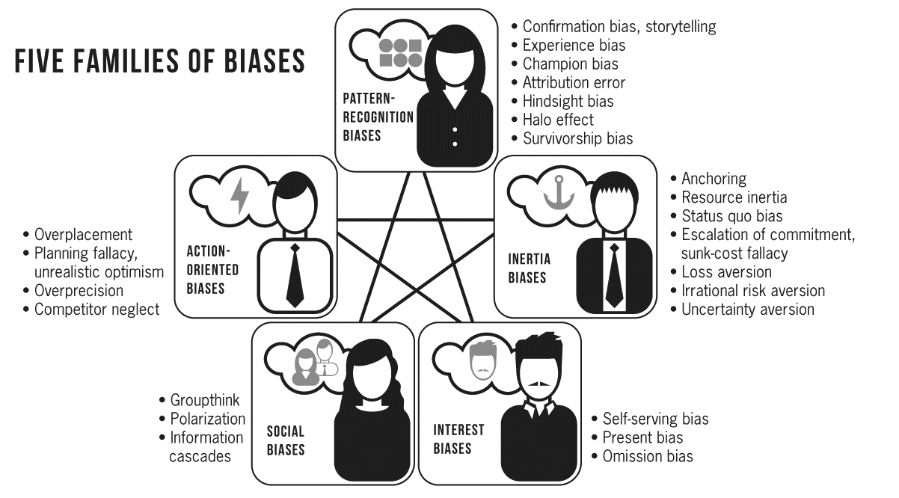

# You're About to Make a Terrible Mistake

模式识别偏误会让我们用熟悉的情况来套用当前的情况，过度乐观导致忽视风险行动，而过度悲观导致惯性和不行动，在决策过程中我们有受到集体思考从众，以及个体和眼前利益偏见的影响。心理偏误无所不在，但是寄希望于完全消除偏误也是危险和徒劳的。这些偏误是进化过程中形成的优选捷径，失去了这些快捷方式我们将举步维艰。我们可以看到别人的偏误，然而对自己的盲点却无能为力。解决的办法就是通过集体讨论和引入决策流程以及检查表，在集体讨论时最为重要是集思广益以增加选项，更大的选项往往意味着更多的决策质量。

> All these biases work in a similar way: they use patterns we’ve previously experienced to shape our understanding of a complex reality. The pattern we think we recognize may be a hypothesis we confirm, the arc of an unfolding story, the personality of a key character, or something else. But the effect of recognizing a pattern is the same: it makes reality seem simpler, more coherent, and easier to deal with than it actually is.
>
> Because pattern-recognition biases are the source of our assumptions and hypotheses, they underlie all our reasoning. To take but one example, the dominant bias in Procter & Gamble’s disastrous offensive against Clorox was certainly a form of overconfidence. But it is easy to imagine that the P&G managers who proposed this plan had thought of, and perhaps used, analogies from successful past product launch campaigns. Through the lens of pattern recognition, the bleach market would have seemed similar enough to these past cases. This campaign’s distinctive feature—the presence of a large, dominant, highly skilled competitor called Clorox—could easily be overlooked. Without these misleading analogies, perhaps P&G could have avoided the error.
>
> The next two bias families—on either side of the diagram in figure 1—act as opposing forces. The first consists of *action-oriented biases* , which include the various forms of overconfidence. In general, action-oriented biases encourage us to do things we shouldn’t do and take risks we shouldn’t take. The opposite family contains *inertia biases:* these biases, on the contrary, dissuade us from acting when we should and lead us to spurn risks we should take. Anchoring, resource inertia, and status quo bias, among others, are inertia biases.

> Despite this opposition, action biases and inertia biases sometimes coexist in a single syndrome. We saw this in [chapter 6](#calibre_link-7) , with the paradox of “**timid choices and bold forecasts**.” There are other examples. Companies like Blockbuster and Polaroid, which equivocated instead of responding to a deadly threat, were certainly giving in to inertia biases. But they also showed excessive optimism: their leaders were too easily convinced by plans to revitalize their traditional core businesses. And some pattern-recognition biases probably played a role, too. If you put yourself, for instance, in the shoes of John Antioco, the CEO of Blockbuster, it is very likely that, upon meeting Netflix, you called to mind many other small competitors you had easily defeated (or sensibly ignored). In these examples, it seems that combinations of biases are at work—which makes them all the more difficult to overcome.
>
> The last two families, *social biases* and *interest biases* , appear at the bottom of figure 1. They, too, have a role in all large mistakes. When discussing the story of the Frenchmen who fell for the tale of the “oil-sniffing airplanes,” for instance, we emphasized the importance of storytelling. But it is clear that the decision makers were powerfully motivated by the hope of discovering a new and highly profitable technology, and that the secrecy of their deliberations increased the risk of groupthink. The false beliefs that leaders adopt are likely to be beliefs they *want* to believe in; and when they act upon them, it’s often because a group has collectively adopted them, too.

## 模式识别列偏误

1. Confirmation bias; storytelling——确认偏误

We pay more attention to facts that support our hypotheses and neglect those that would disconfirm them, particularly when our hypotheses are organized in a coherent narrative

2. Experience bias——经验偏向

We reason by analogy with situations from our own experience that easily come to mind

3. Champion bias——冠军偏向

We give too much weight to the reputation of the messenger vs. the value of the information he bears

4. Attribution error——归因错误

We attribute success or failure to the role of individuals and underestimate the role of circumstances and chance

5. Hindsight bias——后见之明偏误

We judge past decisions based on information that was not available at the time they were made, especially about their outcomes

5. Halo effect——晕轮效应

We form a general impression (of a person, company, etc.) based on a few salient features and let that impression (halo) influence our assessment of unrelated features

6. Survivorship bias——幸存者偏见

We draw conclusions from samples that include successes but exclude failures

## 导致冲动行动偏误

1. Overplacement——过度置换

We overestimate our relative abilities, i.e., how much better than others we are

2. Planning fallacy; unrealistic optimism——计划偏误，不切实际的乐观主义

We do not sufficiently consider things (and combinations of things) that could derail our plans, resulting in an optimistic bias in estimates of time and cost to completion

3. Overprecision——过度精确

We overestimate the degree of confidence we can have in our estimates and forecasts

4. Competitor neglect——忽视竞争对手

We develop plans that overlook competitors’ likely response to our actions

## 导致错失机会的偏误

1. Anchoring——锚定效应

When making estimates, we are influenced by available numbers, even if they are irrelevant

2. Resource inertia——资源惯性

We are timid in reallocating resources to reflect our stated priorities, especially when these priorities change suddenly

3. Status quo bias——维持现状偏见

We tend to avoid making a decision and to maintain the status quo by default

4. Escalation of commitment, sunk-cost fallacy——沉没成本

We double down on a failing course of action, notably because we do not treat the resources previously invested as sunk costs

5. Loss aversion——损失厌恶

We feel a loss more keenly than a gain of the same amount

6. Irrational risk aversion——非理性的风险厌恶

We refuse to take reasonable risks, fearing that, in case of failure, our choices will seem foolish in hindsight and we will be unjustly blamed

7. Uncertainty aversion——不确定性厌恶

We prefer a quantified risk, even if it’s high, over an unknown risk (“uncertainty” or “ambiguity”)

## 集体偏见

1. Groupthink——团体思维

In a group, we silence our doubts and side with the prevailing opinion instead of dissenting

2. Polarization——极化

Groups tend to reach a conclusion that is more extreme than the average viewpoint of their members—and to be more confident in it

3. Information cascades——信息传递和放大

In a group, the sequence of speakers affects the outcome of the discussion, as private information is withheld and shared information emphasized

## 利益偏向

1. Self-serving bias——自身利益的偏见

We genuinely believe in viewpoints that happen to coincide with our interests, financial or otherwise (including emotional attachments)

2. Present bias——现在偏差

We use inconsistent discount rates when making present-future trade-offs, leading us to overweight the present (managerial myopia)

3. Omission bias——不作为偏见

We are more indulgent with errors of omission than errors of commission, and find it morally acceptable to benefit from them

## 精彩观点和句子

尽管知道了我们身上存在很多偏误，但分析问题的时候也要避免铁锤人倾向，把一切都归为某一个偏误。偏误虽多却是有限的，把事情搞砸的原因可是无限的。

> *First misconception: seeing biases everywhere* ... In short, the number of biases is large, but the number of ways things can go wrong is infinite.
>
> *Second misconception: attributing an undesirable result, in hindsight, to a bias* 
>
> *Third misconception: looking for “the” bias* ... To sum up, not all mistakes can be attributed to cognitive biases. When mistakes seem to be the result of biases, we should be careful not to draw conclusions until we have sufficient evidence, which a single case cannot provide. And we should make sure that we identify all the contributing biases, not just the most obvious one.

行为经济学就是一门利用人性偏误的学问

> Sure, as mentioned in the introduction to this book, it is tempting, and often quite profitable, to exploit the biases of others: that is the aim of behavioral marketing, behavioral finance, or—with different motives—of “nudges.” But improving *our own* decisions by addressing *our own* biases is a very different matter. It is what the remainder of this book will cover.

我们也对无视自我的局限

> As Kahneman observes, “We can be blind to the obvious, and we are also blind to our blindness.”

警惕只有两个选项，要根据最新的事实改变自己的想法，只要有可能就要验证自己的想法，坚决避免匆忙下结论

> It avoided making a rushed decision. It forced itself to reject a binary choice and to generate and consider several alternatives. It encouraged the expression of diverse and contradictory viewpoints on these options and their possible combinations. It accepted that its members could change their minds. It searched for information to evaluate the reactions each option would elicit and the consequences it would produce.

更好的决策需要合作和流程

> • Unlike individuals, **organizations can improve their decisions by changing their decision-making practices.**
>
> ► *“Changing the environment” instead of “changing the decision maker.”*
>
> • **Two conditions** exist to do this: **collaboration,** so some individuals can correct the biases of others; and **process,** so the group does not devolve into groupthink.
>
> ► *The decision-making process was the difference between the successful management of the Cuban missile crisis and the disastrous decision in favor of the Bay of Pigs invasion.*

手术中看似乏味的流程非常重要

> Gawande headed the development of a universal surgical safety checklist for the World Health Organization. Checklists serve the same purpose in the high-risk environment of an operating room as they do in an aircraft: they impose process and force a degree of collaboration. The surgical safety checklist asks medical teams, for instance, to verify the patient’s identity, to confirm that they are performing the right procedure, and to make sure that all members of the medical team have introduced themselves by name and role. These simple checks have a significant effect: they reduce complications by one-third and postoperative mortality by half. As Gawande points out, if a medication could guarantee such results, it would instantly become a blockbuster drug.

不能错误的地方都有严格的流程和检查单

> In general, organizations enforce “collaboration plus process” whenever **failure is not an option...**
>
> ► *Astronauts are trained to apply the rules, not follow their instinct.*
>
> ► *Airline pilots are encouraged to rely on the crew and on procedures.*
>
> ► *Surgeons can reduce the incidence of complications by using checklists.*
>
> • . . . or for **lower-level decision-making...**
>
> ► *Formalized procedures for buying office supplies, not for buying companies*
>
> • . . . but usually **not for strategic decisions.**
>
> ► *Good governance is not enough.*
>
> ► *Why don’t we demand “total quality” in the “decision factory”?*

不能只从结果来判断决策的质量

> It is often said that in business the quality of implementation matters more than the decisions themselves; and although this is an overstatement (just think of some of the strategic decisions described in [part 1](#calibre_link-8) ), it has a core of truth.
>
> In sum, when we consider the outcome of a decision, what we see is not a pure result of the quality of the initial decision. It is also the result of good or bad luck, an appropriate or inappropriate level of risk-taking, and good or bad execution. Except for extreme cases of success or failure (like some of those related in this book), it is therefore risky to attribute good or bad results solely to a good or bad initial decision. Jacob Bernoulli, one of the founders of probability theory, made the point succinctly in 1681: “One must not decide about the value of human actions from their outcomes.”

少分析多讨论。如果你只有一个小时的时间，不要花更多的世界去分析和收集信息，而是应该去讨论

>  But the key takeaway from this study of investment decisions is a simple one: if you have an hour to spare before you need to make a big decision, don’t spend it doing more analysis, looking for additional information, or running the financial model one more time. Instead, invest this time in quality discussion. Analyze less, discuss more!

对话和多样性

> The first pillar is *dialogue* , an authentic exchange of viewpoints among people who sincerely want to listen to each other and not just convince each other—a prerequisite for effective collaboration. Next comes *divergence* , which provides relevant, fact-based, and original content for this dialogue so that it doesn’t end up a mere conflict of preconceived ideas. Finally, decision-making *dynamics* in the organization must promote dialogue and divergence—which many organizations tend to suppress.

领袖是决定如何做出决定，而不是自己做出所有决定

> A key task of a leader is, therefore, to be a **decision architect who “decides how to decide,”** introducing collaboration and process in the organization’s decision practices.

> It was just the reverse of Tolstoy’s famous observation about families in *Anna Karenina:* as scholars of strategic differentiation have long theorized, every successful strategy is successful in its own way. But all strategic failures are alike.

好的决定不是在一团和气中做出来的

> But however extreme, the example holds a lesson: it takes some conflict, some discomfort, to reach good decisions. Yet many companies, because they fear discomfort, avoid conflict.

  更多选项是高质量决策的前提

> It’s easy to see how one might think that having more options makes a decision more difficult—which explains why many leaders try to simplify things by narrowing down the range of options. Yet the opposite is true. The simple fact of having multiple options improves the quality of decisions. 

有更多信息时需要更新自己的观点——贝叶斯

> John Maynard Keynes was frequently criticized for changing his opinion. In one such instance, he is said to have replied: “When the facts change, I change my mind. What do you do, sir?”
>
>  One of several distinguishing characteristics of superforecasters is their willingness to update their beliefs in response to new information—and their ability to do so in Bayesian fashion, avoiding both overreaction and under-reaction.

心理偏差会引入类似的错误倾向，不是随机错误。我们作为个体不可能完全消除偏误，而集体合作和流程是有可能消除偏误做出更佳的决策，但并非集体就一定能消除偏误。

> *First idea: our biases lead us astray, but not in random directions* . 
>
> *Second idea: the way to deal with our biases is* not *to try to overcome them* ... *Collaboration* is needed because many people are more likely to detect biases than a lonely decision maker is. Good *process* is required to act on their insights.
>
> *Third idea: while organizations can overcome individual biases, this does not just happen by chance* .

人们喜欢听故事，也会编织故事。遇到很多事情时，人们的第一反应是寻找连贯的叙事逻辑，通常情况下我们不会认为事情是碰巧发生的。很多阴谋论其实是一个个听上去精彩的，却又是杜撰的故事。

> Your definition of the problem was shaped by Wayne’s initial story. Instead of searching for data that could *disprove* that story, you instinctively went looking for information that would *confirm* it.
>
> When someone tells us a good story, our natural tendency is to search first and foremost for elements that corroborate it—and, of course, to find them. We think we’re doing rigorous *fact-checking* . Checking the facts is essential, of course: Wayne’s information, for instance, could have been factually incorrect. But one can draw a false conclusion from accurate facts. Fact-checking is not the same as story-checking.
>
> Our first impulse is to see them as elements of a coherent narrative. The idea that they could be a mere coincidence does not occur to us spontaneously.

社交媒体的信息茧房作用

> By design, social media overexposes its members to their friends’ posts, which tend to match and therefore bolster each user’s existing opinions. This is the now-familiar “echo chamber” or “filter bubble” phenomenon. 

你说出的话有多大的影响力，不在于你说的是否真理，而是你是个什么样的人。说话的人比话本身更为重要。

> When the reputation of the messenger outweighs the value of the information he bears, when the project champion is more important than the project, we fall for *champion bias* .

光环效应

> However, in our quest for models, we too often commit three mistakes. First, we attribute all of a company’s success to a single person. Then, we see all the aspects of this person’s behavior as reasons for his or her success. Finally, we’re too quick to think we should imitate the model.

我们喜欢听英雄的故事，然后把所有的原因都归因这个英雄身上，光环效应。在中国，人们喜欢听帝王将相的故事，然后把历史的发展归因他们个人品行上。

> Because the story we desperately want to hear is the story of a hero. The best stories are stories of archetypal characters. Then we attribute all the results to these archetypes. We underestimate the role of other players on the team; the effects of the environment and the competitors; and, of course, the impact of plain old luck, whether good or bad.

归因错误，苹果实体店的成功更多的是iPhone而不是Johnson的设计和营销。

>  You probably thought that it was foolish of Johnson to try to replicate at J. C. Penney his success with the Apple Stores. But did you think, *It’s not even clear that this success had much to do with him* ?
>
> If this thought didn’t pop into your head, you’re not alone. The media, the stock market, and certainly the J. C. Penney board of directors didn’t seem to doubt that Johnson had played a decisive role. Invariably, and so naturally that we don’t even notice it, our first impulse is to attribute success (or failure) to individuals, to their choices, to their personality, but not to the circumstances. This is our first mistake: the *attribution error* .

每个人的境地不同，教条的模仿模范死路一条。

> Models can be useful. Idol worship, less so. Sometimes we need to leave best practices to those who invented them.

我们看到的都是幸存者，但只从幸存者中归因是十分危险的

> The models whose success we admire are, by definition, those who have succeeded. But out of all the people who were “crazy enough to think they can change the world,” the vast majority *did not* manage to do it. For this very reason, we’ve never heard of them. We forget this when we focus only on the winners. We look only at the survivors, not at all those who took the same risks, adopted the same behaviors, and failed. This logical error is *survivorship bias* . We shouldn’t draw any conclusions from a sample that is composed only of survivors. Yet we do, because they are the only ones we see.

能够多次练习而且得到了及时反馈的领域才有可能培养出”直觉“。直觉就是一种多次练习反馈后形成的神经网络。消防员，飞行员和象棋选手可以有非常精确的直觉，但交易员，法官和精神病专家很难产生这种直觉。越是战略层面和长期的决策越不要依赖直觉，一是次数很少，其后反馈周期很长。

> *When* , then, can we trust our intuition? Whenever, Kahneman and Klein agreed, two conditions are met. First, we must find ourselves in an environment of “high validity,” in which the same causes generally tend to produce the same effects. Second, we must have had “adequate opportunities for learning the environment” through “prolonged practice and feedback that is both rapid and unequivocal.” In other words, since our intuition is nothing but the recognition of situations that we have experienced before, we should trust it when such situations can truly be recognized, and when we have truly learned the right responses to them.
>
> Experienced executives tend to believe that their intuition is precious, and they’re often right. But only the wisest among them are able to recognize when to listen to it—and when not to.
>
> Strategic decisions take place in a low-validity environment, in which the decision makers have had limited practice, with delayed, unclear feedback. If we searched for a textbook example of conditions in which expert intuition *cannot* develop, we couldn’t find a better one.
>
>  Kahneman and Klein worked together to resolve their disagreement and identified the **two necessary conditions** for the development of real expertise: **a high-validity (predictable) environment; and prolonged practice with quick, clear feedback.**
>
> ► *Expert intuition can thus be developed by firefighters, pilots, or chess players . . .*
>
> ► *. . . but not by psychiatrists, judges, or traders.*
>
>  Generally, **the more strategic a decision is, the less helpful intuition will be:** strategic decisions are rare, their environment is low-validity, and feedback is ambiguous.

心理偏差实际上对我们的生存有利

> Why are we subject to cognitive biases? Why do we make systematic errors in our reasoning, like those caused by excessive confidence and optimism? Specifically, how did evolution select for these biases? If the systematic mistakes produced by cognitive biases were detrimental to our adaptation and survival, natural selection would have eliminated the biased individuals, making biases rarer. Yet biases are universal. This suggests that for our distant ancestors, these biases, or rather the heuristics of which they are the occasional flip side, weren’t handicaps but assets. It is not hard to imagine how natural selection favors the optimistic, the enterprising, and the risk takers over the timid, the conservative, and the prudent.

对自己能力边界内的事情乐观，对自己能力边界外的悲观

> This question has no easy answer, but one guiding principle can help. To borrow a simple but essential distinction from Phil Rosenzweig, we must distinguish between the aspects of the future we can influence and those that we cannot. In one case, we are creating the future; in the other, we are merely predicting it. For the former, optimism is indispensable. For the latter, it may be deadly.
>
> It is the age-old mistake of dictators who end up toppled because they believed their own propaganda.

过度自信的种种变种

Overconfidence takes many forms:

• We **overestimate ourselves** (relative to others or in the absolute).

► *Eighty-eight percent of drivers think they’re in the top 50 percent.*

• We are too optimistic about our projects (**planning fallacy** ).

► *Eighty-six percent of megaprojects have delays and cost overruns.*

► *Misaligned incentives are not the only cause: we are overoptimistic about our own private, individual projects.*

• We are too confident in the accuracy of our predictions (**overprecision** ).

► *When we are “90 percent sure,” we are at least 50 percent wrong.*

• We underestimate our competitors . . .

► *Netflix said of Blockbuster: “They just about laughed us out of their office.”*

• . . . and even sometimes totally forget to anticipate their reactions.

► *Procter & Gamble did not anticipate Clorox’s predictable response.*

• Companies, like evolution, favor optimists, because **optimism is essential to success:** leaders are optimists who have succeeded.

• Optimism is useful until we start to **believe our own propaganda:** it’s healthy to be optimistic about what we can control, not about what we can’t.

一个组织的惯性很难改变。高举什么，标榜什么，就最需要什么。

> Polaroid’s shipwreck didn’t happen because the captain didn’t see the iceberg. It happened because the ship was just too hard to turn.
>
> After spending weeks every year in marathon budget meetings, most companies end up allocating their resources almost exactly as they did the previous year, regardless of the changes in their environment.
>
> This objection is somewhat paradoxical. The corporations that so consistently fail to reallocate their resources are the same whose leaders note, in their letters to shareholders, how volatile and uncertain their business environment has become, and how crucial it is for them to be quick in seizing new opportunities (the trendy word is “agile”). 
>
> Not surprisingly, the “high reallocators” outperformed the “low reallocators.” Over a fifteen-year period, companies in the former group had 30 percent higher total return to shareholders. They were also less likely to go bankrupt or to be acquired. Low reallocators, it turns out, are not keeping a steady hand on the helm. They are asleep at the wheel.

削减预算很难

> Another form of social pressure exacerbates the importance of historical anchors. Executives’ personal credibility is a function of their ability to defend their unit or department by maintaining and increasing its financial resources. Their prestige in the eyes of their peers and subordinates depends on it. These peers and subordinates, too, treat last year’s number as the reference point.
>
> But the “rich” managers who head the cash-rich business units do not see matters in this light. They have no wish to see their budgets cut to subsidize the “poor”; indeed, they usually have plenty of ideas for spending the money allocated to them. Better yet, they can easily explain how difficult it would be for their units, if they were forced to make do with less, to generate the cash flow the corporation is counting on. In this negotiation game, yesterday’s winners have the advantage.

就算你看到了未来，也需要把握时机

> The future was certainly in streaming, not DVD rentals . . . but the future wasn’t here yet.

> It’s not easy to know how long to support a profitable business, even when you know that it’s doomed. Some, like Hastings, may start too soon. But if there’s a guiding principle, it’s that Blockbuster’s inertia is the rule, and Netflix’s rush is the exception. 

我们都倾向与保持现状，不决定比决定要容易的多，默认状态很重要

>  We’re all subject to *status quo bias:* it’s easier for us not to decide than to decide.
> We find the preference for the status quo in countless situations where there is a “default choice.”

安全感和真正的安全

> Don’t play for safety—it’s the most dangerous thing in the world.
>
> —Hugh Walpole

我们不喜欢损失，不管大的还是小的

> Oddly enough, however, the managers’ answers hardly change at all when the amount of the investment is divided by ten. It’s not the sum itself that turns off these decision makers. It’s the possibility of loss, whatever the amount.

过分的损失厌恶和过度乐观一样有危害

>  This poses a real problem: exaggerated risk aversion can be just as harmful as unreasonable optimism.

对从下而上的创新要宽松，对从上而下的则要严格，但实际中却恰恰相反

> Innovative and risky initiatives, CEOs say, probably get killed or self-censored at lower levels of the organization, because they never reach the top.

销售技巧之一就是让顾客避免一个损失比获得一个收益更有效，比如这本书的书名“terrible mistake” 

> For instance, it underpins sales techniques we are all familiar with. Instead of offering the consumer a benefit, it is often more effective to talk about avoiding a loss: “don’t miss out on this unique opportunity”; “tomorrow, it will be too late.” Perhaps you have noticed that the title of this book applies the same principle: promising to help you avoid a “terrible mistake” (a loss) is more persuasive than offering you a benefit. (Would you have picked up this book if it were titled *How to Make Better Decisions* ?)

利益受损的少数通常会有更为激烈的反应。少数人往往能推翻大多数人支持的计划。

>  And the fact that change is so difficult to achieve can be seen as a consequence of loss aversion, too: When a change makes winners and losers, the losers feel the losses much more acutely than the winners feel the gains. That helps explain why a minority so often takes action to block a plan that a majority supports.

事后看起来的显而易见的原因在当时有可能都没有被注意到

>  But historians who make logical connections between causes and effects choose them carefully from the potentially infinite set of facts at their disposal. The “causes” often go completely unnoticed in the moment.

公司的决定倾向于保守，很多公司做出了冒险的决定只是他们没有觉察到背后的风险

> Loss aversion, uncertainty aversion, and hindsight bias conspire to produce an exaggerated aversion to risk. This helps explain why companies take fewer risks than they could, fewer than they rationally should, and fewer than their leaders themselves say they’d like to. 
>
> The paradox is easily resolved. Even if you are risk averse, you can still make risky decisions *if you don’t realize they’re risky* . This is how corporations place big bets: most often, they are not aware of how risky they are.

犯小错，杜绝不可避免的大损失，在小错中提升反脆弱性

>  Conversely, smaller-scale projects championed by more junior employees must surmount numerous hierarchical obstacles and survive many layers of scrutiny before being approved. Remember the CEOs who were astonished that no one ever proposes risky projects to them? They should probably blame the rigorous, effective application of their company’s policies and procedures. By demanding a level of confidence in a project that is difficult to demonstrate, they effectively dissuade employees from entrepreneurial initiatives.

> It would be more rational to do the exact opposite. A single large high-risk project, even if it has a big upside, puts the company in danger. Risk-taking in smaller projects, on the other hand, should be tolerated, even encouraged: a diversified portfolio of high-risk, high-return projects would be an extremely rational choice. Unfortunately, optimism more easily carries the day when the project is big, while risk aversion takes over when it’s small. The conjunction of timid choices and bold forecasts thus explains how the same company can sit on piles of cash for want of exciting opportunities and still occasionally make wild gambles.
>
> Companies **overcome their risk aversion by denying the existence of risk** . Risky ideas are presented as sure things, which can be approved without the impression of taking a risk: **“Timid choices and bold forecasts.”**
>
> • This combination leads companies to **reject small risks while approving very large ones:** the exact opposite of what should happen!
>
> ► *Very few companies develop a portfolio of small high-risk, high-return projects, as venture capitalists do.*
>
> ► *Instead, they justify taking on large projects (for example, acquisitions, major transformations) by underestimating their difficulties.*
>
> A fourth way of being agile consists in making gradual commitments instead of big gambles.

当前对我们更有价值

> We’re completely capable of being patient . . . as long as we don’t have to do it right away!
>
> Add the fact that when making trade-offs between the present and the future, the present speaks much louder. 

第一个发言的人往往非引导讨论的方向

> Information cascades give the first speakers disproportionate importance. 

宁可剥夺自己的经济利益也要惩罚对方

> By doing this, they do not hesitate to deprive themselves of financial gain in order to “punish” the proposer who overplayed his hand. These results have been replicated many times over, notably in low-income countries, where the sums of money involved could represent three months’ income for the participants.

经济激励是潜移默化的，有时我们甚至意识不可它的存在

>  They believe that we are often *unable* to resist the influence of financial incentives, *even if* we sincerely intend to do so.

多一些时间去最终决定

> • **Finally, decide: in a partnership; with a small committee; or alone, after sleeping on it.**