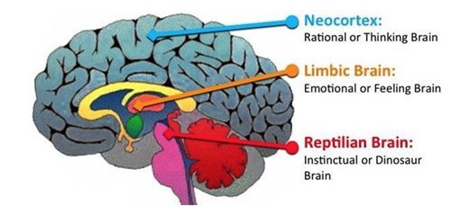
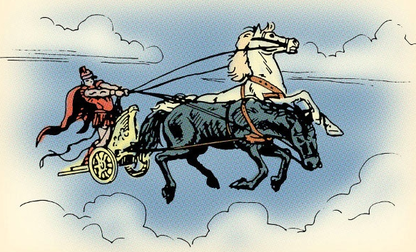

# 我的原则——认识自己

每个人都觉得自己是自己的主人，可自己真的是自己以为的那个自己吗？

有一部动画电影《头脑特工队》（Inside Out）。主角莱莉（Riley）脑中有五种情绪帮她做决定。莱利其实不是一个人，而是很多人，那种情绪的声音最大，莱利就会表现出相应情绪支配的行为。

有时候我们可能科也说不清楚自己为什么会有那种情绪和行为，其实这个背后是有深刻的生理基础的。

## 三脑模型（Triune Brain）

进化心理学家提出过一个三重脑的人脑模型。人脑是由和其他生物类似的神经系统一步步进化而成的，按进化的先后顺序，从内到外，大致可以分为三个部分：和爬行动物类似的鳄鱼脑、和哺乳动物类似的边缘脑（猴子脑）和大脑皮层。

鳄鱼脑控制我们的基础生理功能，比如呼吸、心跳、呼吸和平衡等等。鳄鱼脑可以保证基础的生存功能，饿了去觅食，受到威胁逃跑或者争斗，遇到异性会去繁衍后代，但鳄鱼脑不会产生情绪，就像鳄鱼没有情绪一样。猴子脑在鳄鱼脑的基础上进化产生情绪反应，哺乳动物都会与人类似的情绪反应，比如恐惧、愤怒、高兴甚至爱。这也是为什么人类的宠物大多数都是哺乳动物，因为他们可以与人类有情感的交流。再进一步进化后就产生了大脑皮质，人类的大脑最为发达，这也是我们理智思考的地方。大脑皮质占比虽然大，但它的处理速度低，而且在耗能大，所以我们大部分时间里都处在鳄鱼脑和猴子脑主导的自动驾驶模式。

无独有偶，两千多年前柏拉图在对话就使用《战车寓言》来解释他对人类灵魂的看法。

> 首先，人类灵魂的战车驾驶一匹马，其次，其中一匹马是贵族和高贵的马，但是另一匹马在品种和性格上却相反。因此，在我们的情况下，驾驶必然是困难而麻烦的。”

> 战车代表了智慧，理性或灵魂的一部分，必须引导灵魂走向真理。一匹马代表理性或道德冲动或热情自然的积极部分（例如义愤填;）;另一个代表灵魂的非理性激情，食欲或自以为是的天性。战车指挥整个战车/灵魂，试图阻止马走不同的道路，并朝着启蒙前进。

马车模型和三重脑模型可以完美的结合起来。车夫就是大脑皮质，白马是猴子脑，黑马则是鳄鱼脑。你以为车夫总是掌握着战车，那其实只是在车夫精力充沛并且白马黑马没有狂躁的时候，其他大部分时间里战车是由白马和黑马主导的。认识到这一点对认识我们自己非常关键，你并不是你理智中认为的那个你，你也不是车夫想改变就可以改变的。

你要想让你的战车和谐持续的前进，你不光要说服你的车夫，还要去驯化你的白马和黑马，这样当车夫休息的时候，你的白马和黑马也不会让你的战车偏离轨道，更为重要的是，你的白马和黑马不会在狂躁时把马车拉下悬崖。驯化白马和黑马是一个长期和需要很多重复的过程，你要耐心，和自己的白马黑马做朋友，一点点的驯化。车夫、白马和黑马的和谐共处和齐心协力是你最想要的。

理解了大脑的作用机理后，我想你一定对这句话有更为深刻的理解——我们无法避免情绪（白马黑马），但我们可以避免在情绪强烈（白马和黑马狂躁）的时候做出决定。

## 面对压力

一个人的成就与他处理压力能力直接相关。人们在压力会有各种本能的痛苦反应，担心、焦虑、失眠等等，而我们的本能是要避免痛苦，于是我们也会本能的抵制和逃避压力。要取得成就自然会有压力，不光靠智力，也是需要长时间的积累，而且后者其实更为重要因为长时间积累比短时间的冲刺的效果要好的多的多。所以说能够长时间的在压力下工作是取得成就的一个必要条件。 

承受压力并不是说要用意志力去忍受，光靠忍受并不能持久，就算有毅力可以坚持，可身体上时间长了也会出现各种问题。面对压力不光要承受，还要释放和转化压力，不光有痛苦更要有快乐，这才能让我长时间的去面对压力，持续的努力实现目标。

压力会让杏仁核（Amygdala）替代大脑处于主导地位，会表现出抵触、消极、僵化和具有侵略性，这往往会让我们做出非理智决定。一旦我们感知到威胁，杏仁核马上会被激活，给下丘脑（hypothalamus）和脑垂体（pituitary gland）发出信号，这会激发肾上腺（adrenal gland）的肾上腺激素分泌。肾上腺激素会让身体有爆发力，反应加速，但过多的肾上腺激素也会让大脑失去支配地位。如果压力持续的时间比较长，肾上腺就会分泌皮质醇（cortisol），皮质醇会提高血压、血糖水平和降低免疫力，有研究表明皮质醇还会破坏海马体（hippocampus）的记忆细胞。

如果压力出现的时间比较短又会有比较长的恢复时间，这会激发我们的潜能，也是对我们有利的。平时柔弱的母亲一旦看到孩子处于危险中可以激发起惊人的力量，如果孩子被压在车轮下甚至可以举起汽车。慢性的长期的压力对我们是有害的，因为这种压力会导致身体内的激素水平长期居高不下，不光损害记忆降低认知水平，还会带来高血压糖尿病等各种慢性疾病。

更好的应对压力，首先要找到适合自己的释放方式，运动、音乐、冥想等都可以很好释放压力，另外也是更重要的一方面，就是你要改变对压力的看法。看法并不只是脑中的想法，它会影响你的激素分泌改善你的身体状况。一念一世界，压力不光会让我们痛苦，换个角度看，压力也促使你进步。坊间有句俗话：“井无压力不出油，人无压力轻飘飘”。人在压力下会激发出极大的潜能，完成很多原来看似不可能的任务。与其面对压力焦虑，不如就直面它，克服压力你又可以升级了。这种对压力更为积极的看法也会改善你体内的激素分泌，让你的身体更加健康。

## 总结

理解大脑后你更能深刻的理解自己了。自己并不只是理智清醒时候的自己，自己都不知道自己为什么有那么愚蠢的表现其实只是正常的情绪反应。理智不能理解情绪其是很多痛苦的根源。进化赋予我们根深蒂固的情绪，也给了我们可以自我进化的大脑。情绪是可以被理智驯服的，就像是车夫驯服白马和黑马。耐心对自己，和自己做朋友。

进化中形成的情绪反应很多已经不适应于现代社会。我们总是喜欢吃很多而懒得运动，那是因为人类进化史上大部分时间里食物欠缺，多摄取养分和减少不必要的活动才更有利于生存，而现在这种倾向却成了很多疾病的根源；人类见到危险总是要尽快做出反应，因为这最有利于生存，现在我们在投资中也会有类似的情绪反应，涨了嫌赚的不够，跌了怕亏的更多，追涨杀跌是股市中不变的主旋律。因此我们要尽量避免情绪反应的决定，而是让自己的理智主导。任何情绪强烈的时候都要提醒自己，缓一缓再说。

现代社会离不开压力，成功的路上也不可能没有压力，但压力会激发我们的情绪反应，最关键的是要改变对压力的看法，找到最适合自己释放压力的方式。你要知道，看法不光只是头脑的想法，它还会影响身体内的激素分泌，持久的享受压力下的工作是成功的关键。

[1]: https://www.interaction-design.org/literature/article/the-concept-of-the-triune-brain

